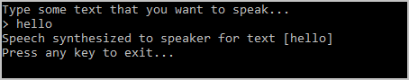

# Quickstart: Synthesize speech with the Speech SDK for .NET Core

Quickstarts are also available for [speech-recognition](quickstart-csharp-dotnetcore-windows.md) and [speech-translation](quickstart-translate-speech-dotnetcore-windows.md).

In this article, you create a C# console application for .NET Core on Windows by using the Cognitive Services [Speech SDK](speech-sdk.md). You synthesize speech from text in real time to your PC's speaker. The application is built with the [Speech SDK NuGet package](https://aka.ms/csspeech/nuget) and Microsoft Visual Studio 2017 (any edition).

> [!NOTE]
> .NET Core is an open-source, cross-platform .NET platform that implements the [.NET Standard](https://docs.microsoft.com/dotnet/standard/net-standard) specification.

You need a Speech Services subscription key to complete this Quickstart. You can get one for free. See [Try the Speech Services for free](get-started.md) for details.

## Prerequisites

This quickstart requires:

* [.NET Core SDK](https://dotnet.microsoft.com/download)
* [Visual Studio 2017](https://visualstudio.microsoft.com/downloads/)
* An Azure subscription key for the Speech Service. [Get one for free](get-started.md).

## Create a Visual Studio project

[!INCLUDE ]

## Add sample code

1. Open `Program.cs`, and replace all the code in it with the following.

    [!code-csharp[Quickstart Code](~/samples-cognitive-services-speech-sdk/quickstart/text-to-speech/csharp-dotnetcore/helloworld/Program.cs#code)]

1. In the same file, replace the string `YourSubscriptionKey` with your subscription key.

1. Also replace the string `YourServiceRegion` with the [region](regions.md) associated with your subscription (for example, `westus` for the free trial subscription).

1. Save changes to the project.

## Build and run the app

1. Build the application. From the menu bar, choose **Build** > **Build Solution**. The code should compile without errors.

    

1. Start the application. From the menu bar, choose **Debug** > **Start Debugging**, or press **F5**.

    

1. A console window appears, prompting you to type some text. Type a few words or a sentence. The text that you typed is transmitted to the Speech Services and synthesized to speech, which plays on your speaker.

    

## Next steps

Additional samples, such as how to synthesize speech to an audio file, are available on GitHub.

> [!div class="nextstepaction"]
> [Explore C# samples on GitHub](https://aka.ms/csspeech/samples)

## See also

- [Customize voice fonts](how-to-customize-voice-font.md)
- [Record voice samples](record-custom-voice-samples.md)
