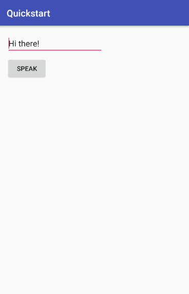
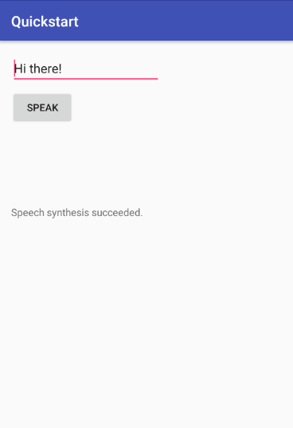

# Quickstart: Synthesize speech in Java on Android by using the Speech SDK

Quickstarts are also available for [speech recognition](quickstart-java-android.md) and [voice-first virtual assistant](quickstart-virtual-assistant-java-android.md).

In this article, you'll learn how to develop a Java application for Android using the Cognitive Services Speech SDK to synthesize speech from text.
The application is based on the Speech SDK Maven Package, version 1.7.0, and Android Studio 3.3.
The Speech SDK is currently compatible with Android devices having 32/64-bit ARM and Intel x86/x64 compatible processors.

> [!NOTE]
> For the Speech Devices SDK and the Roobo device, see [Speech Devices SDK](speech-devices-sdk.md).

## Prerequisites

You need a Speech Services subscription key to complete this Quickstart. You can get one for free. See [Try the Speech Services for free](get-started.md) for details.

## Create and configure a project

[!INCLUDE ]

## Create user interface

We will create a basic user interface for the application. Edit the layout for your main activity, `activity_main.xml`. Initially, the layout includes a title bar with your application's name, and a TextView containing the text "Hello World!".

1. Click the TextView element. Change its ID attribute in the upper-right corner to `outputMessage`, and drag it to the lower screen. Delete its text.

1. From the Palette in the upper left of the `activity_main.xml` window, drag a button into the empty space above the text.

1. In the button's attributes on the right, in the value for the `onClick` attribute, enter `onSpeechButtonClicked`. We'll write a method with this name to handle the button event.  Change its ID attribute in the upper-right corner to `button`.

1. Drag a Plain Text into the space above the button; change its ID attribute to `speakText`, and change the text attribute to `Hi there!`.

1. Use the magic wand icon at the top of the designer to infer layout constraints.

    

The text and graphical representation of your UI should now look like this:

[!code-xml]

## Add sample code

1. Open the source file `MainActivity.java`. Replace all the code in this file with the following.

   [!code-java]

   * The method `onSpeechButtonClicked` is, as noted earlier, the button click handler. A button press triggers speech synthesis.

1. In the same file, replace the string `YourSubscriptionKey` with your subscription key.

1. Also replace the string `YourServiceRegion` with the [region](regions.md) associated with your subscription (for example, `westus` for the free trial subscription).

## Build and run the app

1. Connect your Android device to your development PC. Make sure you have enabled [development mode and USB debugging](https://developer.android.com/studio/debug/dev-options) on the device. Alternatively, create an [Android emulator](https://developer.android.com/studio/run/emulator).

1. To build the application, press Ctrl+F9, or choose **Build** > **Make Project** from the menu bar.

1. To launch the application, press Shift+F10, or choose **Run** > **Run 'app'**.

1. In the deployment target window that appears, choose your Android device or emulator.

   

Enter a text and press the button in the application to begin a speech synthesis section. You will hear the synthesized audio from the default speaker and see the `speech synthesis succeeded` info on the screen.

## Next steps

> [!div class="nextstepaction"]
> [Explore Java samples on GitHub](https://aka.ms/csspeech/samples)

## See also

- [Customize voice fonts](how-to-customize-voice-font.md)
- [Record voice samples](record-custom-voice-samples.md)
