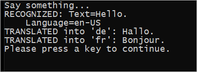

# Quickstart: Translate speech with the Speech SDK for C++

Quickstarts are also available for [speech-recognition](quickstart-cpp-windows.md) and [text-to-speech](quickstart-text-to-speech-cpp-windows.md).

In this quickstart, you'll create a simple C++ application that captures user speech from your computer's microphone, translates the speech, and transcribes the translated text to the command line in real time. This application is designed to run on 64-bit Windows, and is built with the [Speech SDK NuGet package](https://aka.ms/csspeech/nuget) and Microsoft Visual Studio 2017.

For a complete list of languages available for speech translation, see [language support](language-support.md).

## Prerequisites

This quickstart requires:

* [Visual Studio 2017](https://visualstudio.microsoft.com/downloads/)
* An Azure subscription key for the Speech Service. [Get one for free](get-started.md).

## Create a Visual Studio project

[!INCLUDE [Quickstart C++ project](../../../includes/cognitive-services-speech-service-quickstart-cpp-create-proj.md)]

## Add sample code

1. Open the source file *helloworld.cpp*. Replace all the code below the initial include statement (`#include "stdafx.h"` or `#include "pch.h"`) with the following:

    [!code-cpp[Quickstart Code](~/samples-cognitive-services-speech-sdk/quickstart/speech-translation/cpp-windows/helloworld/helloworld.cpp#code)]

1. In the same file, replace the string `YourSubscriptionKey` with your subscription key.

1. Replace the string `YourServiceRegion` with the [region](regions.md) associated with your subscription (for example, `westus` for the free trial subscription).

1. Save changes to the project.

## Build and run the app

1. Build the application. From the menu bar, choose **Build** > **Build Solution**. The code should compile without errors.

   

1. Start the application. From the menu bar, choose **Debug** > **Start Debugging**, or press **F5**.

   

1. A console window appears, prompting you to say something. Speak an English phrase or sentence. Your speech is transmitted to the Speech service, translated and transcribed to text, which appears in the same window.

   

## Next steps

Additional samples, such as how to read speech from an audio file, and output translated text as synthesized speech, are available on GitHub.

> [!div class="nextstepaction"]
> [Explore C++ samples on GitHub](https://aka.ms/csspeech/samples)

## See also

- [Customize acoustic models](how-to-customize-acoustic-models.md)
- [Customize language models](how-to-customize-language-model.md)
