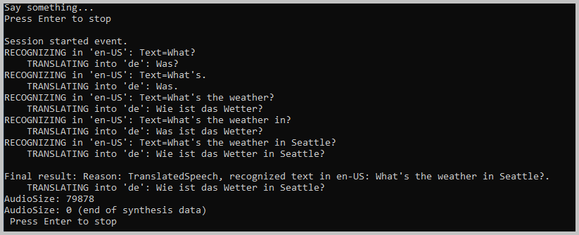

# Quickstart: Translate speech with the Speech SDK for .NET Framework (Windows)

Quickstarts are also available for [speech recognition](quickstart-csharp-dotnet-windows.md) and [speech synthesis](quickstart-text-to-speech-dotnet-windows.md).

In this quickstart, you'll create a .NET Framework application that captures user speech from your computer's microphone, translates the speech, and transcribes the translated text to the command line in real time. This application can run on 32-bit or 64-bit Windows, and it's built with the [Speech SDK NuGet package](https://aka.ms/csspeech/nuget) and Microsoft Visual Studio 2019.

For a complete list of languages available for speech translation, see [language support](language-support.md).

## Prerequisites

This quickstart requires:

* [Visual Studio 2019](https://visualstudio.microsoft.com/downloads/).
* An Azure subscription key for the Speech Service. [Get one for free](get-started.md).

## Create a Visual Studio project

[!INCLUDE [Create project](../../../includes/cognitive-services-speech-service-create-speech-project-vs-csharp.md)]

## Add sample code

1. Open **Program.cs**, and replace all the code in it with the following.

   [!code-csharp[Quickstart Code](~/samples-cognitive-services-speech-sdk/quickstart/speech-translation/csharp-dotnet-windows/helloworld/Program.cs#code)]

1. Find the string `YourSubscriptionKey`, and replace it with your subscription key.

1. Find the string `YourServiceRegion`, and replace it with the [region](regions.md) associated with your subscription. For example, if you're using the free trial subscription, the region is `westus`.

1. From the menu bar, choose **File** > **Save All**.

## Build and run the application

1. From the menu bar, choose **Build** > **Build Solution** to build the application. The code should compile without errors now.

1. Choose **Debug** > **Start Debugging** (or select **F5**) to start the **helloworld** application.

1. Speak an English phrase or sentence into your device's microphone. The application transmits your speech to the Speech service, which translates the speech into text in another language (in this case, German). The Speech service sends the translated text back to the application, which displays the translation in the window.

   

## Next steps

Additional samples, such as how to read speech from an audio file, and output translated text as synthesized speech, are available on GitHub.

> [!div class="nextstepaction"]
> [Explore C# samples on GitHub](https://aka.ms/csspeech/samples)

## See also

- [Train a model for Custom Speech](how-to-custom-speech-train-model.md)
