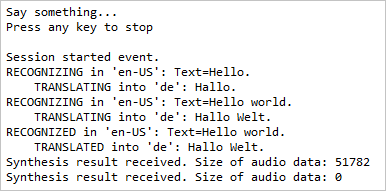

# Quickstart: Translate speech with the Speech SDK for Java

Quickstarts are also available for [speech-to-text](quickstart-java-jre.md) and [voice-first virtual assistant](quickstart-virtual-assistant-java-jre.md).

In this quickstart, you'll create a simple Java application that captures user speech from your computer's microphone, translates the speech, and transcribes the translated text to the command line in real time. This application is designed to run on 64-bit Windows or 64-bit Linux (Ubuntu 16.04, Ubuntu 18.04, Debian 9), or on macOS 10.13 or later. It is built with the Speech SDK Maven package and the Eclipse Java IDE.

For a complete list of languages available for speech translation, see [language support](language-support.md).

## Prerequisites

This quickstart requires:

* Operating System: 64-bit Windows, 64-bit Linux (Ubuntu 16.04, Ubuntu 18.04, Debian 9), or macOS 10.13 or later
* [Eclipse Java IDE](https://www.eclipse.org/downloads/)
* [Java 8](https://www.oracle.com/technetwork/java/javase/downloads/jre8-downloads-2133155.html) or [JDK 8](https://www.oracle.com/technetwork/java/javase/downloads/index.html)
* An Azure subscription key for the Speech Service. [Get one for free](get-started.md).

If you're running Linux, make sure these dependencies are installed before starting Eclipse.

 * On Ubuntu:

   ```sh
   sudo apt-get update
   sudo apt-get install libssl1.0.0 libasound2
   ```

 * On Debian 9:

   ```sh
   sudo apt-get update
   sudo apt-get install libssl1.0.2 libasound2
   ```

> [!NOTE]
> For the Speech Devices SDK and the Roobo device, see [Speech Devices SDK](speech-devices-sdk.md).

## Create and configure project

[!INCLUDE [](../../../includes/cognitive-services-speech-service-quickstart-java-create-proj.md)]

## Add sample code

1. To add a new empty class to your Java project, select **File** > **New** > **Class**.

1. In the **New Java Class** window, enter **speechsdk.quickstart** into the **Package** field, and **Main** into the **Name** field.

   

1. Replace all code in `Main.java` with the following snippet:

   [!code-java[Quickstart Code](~/samples-cognitive-services-speech-sdk/quickstart/speech-translation/java-jre/src/speechsdk/quickstart/Main.java#code)]

1. Replace the string `YourSubscriptionKey` with your subscription key.

1. Replace the string `YourServiceRegion` with the [region](regions.md) associated with your subscription (for example, `westus` for the free trial subscription).

1. Save changes to the project.

## Build and run the app

Press F11, or select **Run** > **Debug**.

The speech input from your microphone will be transcribed into German and logged in the console window. Press "Enter" to stop capturing speech.



## Next steps

Additional samples, such as how to read speech from an audio file, and output translated text as synthesized speech, are available on GitHub.

> [!div class="nextstepaction"]
> [Explore Java samples on GitHub](https://aka.ms/csspeech/samples)

## See also

- [Quickstart: Recognize speech, Java (Windows, Linux)](quickstart-java-jre.md)
- [Customize acoustic models](how-to-customize-acoustic-models.md)
- [Customize language models](how-to-customize-language-model.md)
