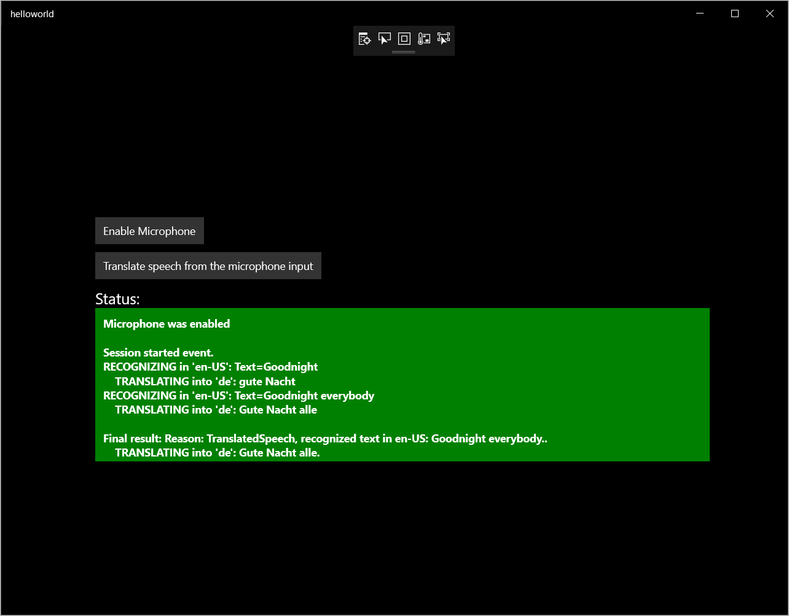

# Quickstart: Translate speech with the Speech SDK for C# (UWP)

Quickstarts are also available for [speech-to-text](quickstart-csharp-uwp.md), [text-to-speech](quickstart-text-to-speech-csharp-uwp.md) and [voice-first virtual assistant](quickstart-virtual-assistant-csharp-uwp.md).

In this quickstart, you'll create a simple Universal Windows Platform (UWP) application that captures user speech from your computer's microphone, translates the speech, and transcribes the translated text to the command line in real time. This application is designed to run on 64-bit Windows, and is built with the [Speech SDK NuGet package](https://aka.ms/csspeech/nuget) and Microsoft Visual Studio 2017.

For a complete list of languages available for speech translation, see [language support](language-support.md).

> [!NOTE]
> UWP lets you develop apps that run on any device that supports Windows 10, including PCs, Xbox, Surface Hub, and other devices.

## Prerequisites

This quickstart requires:

* [Visual Studio 2017](https://visualstudio.microsoft.com/downloads/)
* An Azure subscription key for the Speech Service. [Get one for free](get-started.md).

## Create a Visual Studio project

[!INCLUDE ]

## Add sample code

1. The application's user interface is defined by using XAML. Open `MainPage.xaml` in Solution Explorer. In the designer's XAML view, insert the following XAML snippet between `<Grid>` and `</Grid>`.

    [!code-xml[UI elements](~/samples-cognitive-services-speech-sdk/quickstart/speech-translation/csharp-uwp/helloworld/MainPage.xaml#StackPanel)]

1. Open the code-behind source file `MainPage.xaml.cs` (find it grouped under `MainPage.xaml`). Replace all the code in it with the following.

    [!code-csharp[Quickstart Code](~/samples-cognitive-services-speech-sdk/quickstart/speech-translation/csharp-uwp/helloworld/MainPage.xaml.cs#code)]

1. In the `SpeechTranslationFromMicrophone_ButtonClicked` handler in this file, replace the string `YourSubscriptionKey` with your subscription key.

1. In the `SpeechTranslationFromMicrophone_ButtonClicked` handler, replace the string `YourServiceRegion` with the [region](regions.md) associated with your subscription (for example, `westus` for the free trial subscription).

1. Save all changes to the project.

## Build and run the app

1. Build the application. From the menu bar, select **Build** > **Build Solution**. The code should compile without errors now.

    

1. Start the application. From the menu bar, select **Debug** > **Start Debugging**, or press **F5**.

    

1. A window pops up. Select **Enable Microphone**, and acknowledge the permission request that pops up.

    

1. Select **Speech recognition with microphone input**, and speak an English phrase or sentence into your device's microphone. Your speech is transmitted to the Speech service and transcribed to text, which appears in the window.

    

## Next steps

> [!div class="nextstepaction"]
> [Explore C# samples on GitHub](https://aka.ms/csspeech/samples)

## See also

- [Customize acoustic models](how-to-customize-acoustic-models.md)
- [Customize language models](how-to-customize-language-model.md)
