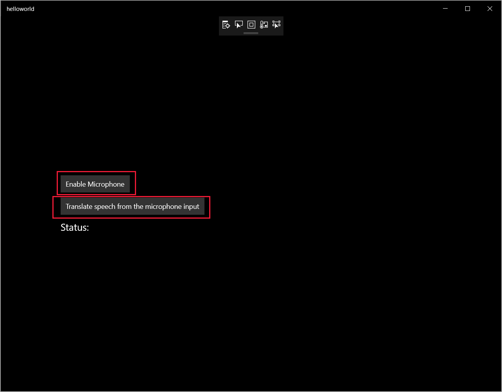

# Quickstart: Translate speech with the Speech SDK for C# (UWP)

Quickstarts are also available for [speech recognition](quickstart-csharp-uwp.md), [speech synthesis](quickstart-text-to-speech-csharp-uwp.md), and [voice-first virtual assistant](quickstart-virtual-assistant-csharp-uwp.md).

In this quickstart, you'll create a Universal Windows Platform (UWP) application that captures user speech from your computer's microphone, translates the speech, and transcribes the translated text to the command line in real time. This application is designed to run on 64-bit Windows, and it's built with the [Speech SDK NuGet package](https://aka.ms/csspeech/nuget) and Microsoft Visual Studio 2019.

For a complete list of languages available for speech translation, see [language support](language-support.md).

> [!NOTE]
> UWP lets you develop apps that run on any device that supports Windows 10, including PCs, Xbox, Surface Hub, and other devices.

## Prerequisites

This quickstart requires:

* [Visual Studio 2019](https://visualstudio.microsoft.com/downloads/).
* An Azure subscription key for the Speech Service. [Get one for free](get-started.md).

## Create a Visual Studio project

[!INCLUDE ]

## Add sample code

Now add the XAML code that defines the user interface of the application, and add the C# code-behind implementation.

1. In **Solution Explorer**, open `MainPage.xaml`.

1. In the designer's XAML view, insert the following XAML snippet into the **Grid** tag (between `<Grid>` and `</Grid>`):

   [!code-xml[UI elements](~/samples-cognitive-services-speech-sdk/quickstart/speech-translation/csharp-uwp/helloworld/MainPage.xaml#StackPanel)]

1. In **Solution Explorer**, open the code-behind source file `MainPage.xaml.cs`. (It's grouped under `MainPage.xaml`.)

1. Replace all the code in it with the following snippet:

   [!code-csharp[Quickstart Code](~/samples-cognitive-services-speech-sdk/quickstart/speech-translation/csharp-uwp/helloworld/MainPage.xaml.cs#code)]

1. In the `SpeechTranslationFromMicrophone_ButtonClicked` handler in this file, find the string `YourSubscriptionKey`, and replace it with your subscription key.

1. In the `SpeechTranslationFromMicrophone_ButtonClicked` handler, find the string `YourServiceRegion`, and replace it with the [region](regions.md) associated with your subscription. (For example, use `westus` for the free trial subscription.)

1. From the menu bar, choose **File** > **Save All** to save your changes.

## Build and run the application

Now you are ready to build and test your application.

1. From the menu bar, select **Build** > **Build Solution** to build the application. The code should compile without errors now.

1. Choose **Debug** > **Start Debugging** (or press **F5**) to start the application. The **helloworld** window appears.

   

1. Select **Enable Microphone**, and when the access permission request pops up, select **Yes**.

   

1. Select **Translate speech from the microphone input**, and speak an English phrase or sentence into your device's microphone. The application transmits your speech to the Speech service, which translates the speech into text in another language (in this case, German). The Speech service sends the translated text back to the application, which displays the translation in the window.

   

## Next steps

> [!div class="nextstepaction"]
> [Explore C# samples on GitHub](https://aka.ms/csspeech/samples)

## See also

- [Train a model for Custom Speech](how-to-custom-speech-train-model.md)
