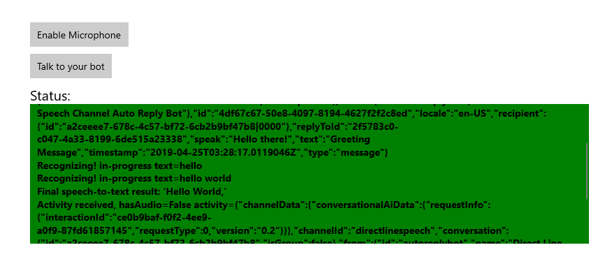

# Quickstart: Create a voice-first virtual assistant with the Speech SDK, UWP

In this article, you'll develop a C# Universal Windows Platform (UWP) application by using the [Speech SDK](speech-sdk.md). The program will connect to a previously authored and configured bot to enable a voice-first virtual assistant experience from the client application. The application is built with the [Speech SDK NuGet Package](https://aka.ms/csspeech/nuget) and Microsoft Visual Studio 2017 (any edition).

> [!NOTE]
> The Universal Windows Platform lets you develop apps that run on any device that supports Windows 10, including PCs, Xbox, Surface Hub, and other devices.

## Prerequisites

This quickstart requires:

* [Visual Studio 2017](https://visualstudio.microsoft.com/downloads/)
* An Azure subscription key for the Speech Service. [Get one for free](get-started.md).
* A previously created bot configured with the [Direct Line Speech channel](https://docs.microsoft.com/azure/bot-service/bot-service-channel-connect-directlinespeech.md)

    > [!NOTE]
    > In preview, the Direct Line Speech channel currently supports only the **westus2** region.

    > [!NOTE]
    > The 30-day trial for the standard pricing tier described in [Try Speech Services for free](get-started.md) is restricted to **westus** (not **westus2**) and is thus not compatible with Direct Line Speech. Free and standard tier **westus2** subscriptions are compatible.

## Optional: Get started fast

This quickstart will describe, step by step, how to make a simple client application to connect to your speech-enabled bot. If you prefer to dive right in, the complete, ready-to-compile source code used in this quickstart is available in the [Speech SDK Samples](https://aka.ms/csspeech/samples) under the `quickstart` folder.

## Create a Visual Studio project

[!INCLUDE [](../../../includes/cognitive-services-speech-service-quickstart-uwp-create-proj.md)]

## Add sample code

1. The application's user interface is defined by using XAML. Open `MainPage.xaml` in Solution Explorer. In the designer's XAML view, replace the entire contents with the below.

    ```xml
    <Page
        x:Class="helloworld.MainPage"
        xmlns="http://schemas.microsoft.com/winfx/2006/xaml/presentation"
        xmlns:x="http://schemas.microsoft.com/winfx/2006/xaml"
        xmlns:local="using:helloworld"
        xmlns:d="http://schemas.microsoft.com/expression/blend/2008"
        xmlns:mc="http://schemas.openxmlformats.org/markup-compatibility/2006"
        mc:Ignorable="d"
        Background="{ThemeResource ApplicationPageBackgroundThemeBrush}">
    
        <Grid>
            <StackPanel Orientation="Vertical" HorizontalAlignment="Center"  Margin="20,50,0,0" VerticalAlignment="Center" Width="800">
                <Button x:Name="EnableMicrophoneButton" Content="Enable Microphone"  Margin="0,0,10,0" Click="EnableMicrophone_ButtonClicked" Height="35"/>
                <Button x:Name="ListenButton" Content="Talk to your bot" Margin="0,10,10,0" Click="ListenButton_ButtonClicked" Height="35"/>
                <StackPanel x:Name="StatusPanel" Orientation="Vertical" RelativePanel.AlignBottomWithPanel="True" RelativePanel.AlignRightWithPanel="True" RelativePanel.AlignLeftWithPanel="True">
                    <TextBlock x:Name="StatusLabel" Margin="0,10,10,0" TextWrapping="Wrap" Text="Status:" FontSize="20"/>
                    <Border x:Name="StatusBorder" Margin="0,0,0,0">
                        <ScrollViewer VerticalScrollMode="Auto"  VerticalScrollBarVisibility="Auto" MaxHeight="200">
                            <!-- Use LiveSetting to enable screen readers to announce the status update. -->
                            <TextBlock x:Name="StatusBlock" FontWeight="Bold" AutomationProperties.LiveSetting="Assertive"
                    MaxWidth="{Binding ElementName=Splitter, Path=ActualWidth}" Margin="10,10,10,20" TextWrapping="Wrap"  />
                        </ScrollViewer>
                    </Border>
                </StackPanel>
            </StackPanel>
            <MediaElement x:Name="mediaElement"/>
        </Grid>
    </Page>
        ```

1. Open the code-behind source file `MainPage.xaml.cs`. You'll find it grouped under `MainPage.xaml`. Replace the contents with the code below. Here's what this sample covers: 

    * Using statements for the Speech and Speech.Dialog namespaces
    * A simple implementation to ensure microphone access, wired to a button handler
    * Basic UI helpers to present messages and errors in the application
    * A landing point for the initialization code path that will be populated later
    * A helper to play back text-to-speech (without streaming support)
    * An empty button handler to start listening that will be populated later

    ```csharp
    using Microsoft.CognitiveServices.Speech;
    using Microsoft.CognitiveServices.Speech.Audio;
    using Microsoft.CognitiveServices.Speech.Dialog;
    using System;
    using System.Diagnostics;
    using System.IO;
    using System.Text;
    using Windows.Foundation;
    using Windows.Storage.Streams;
    using Windows.UI.Xaml;
    using Windows.UI.Xaml.Controls;
    using Windows.UI.Xaml.Media;

    namespace helloworld
    {
        public sealed partial class MainPage : Page
        {
            private SpeechBotConnector botConnector;

            private enum NotifyType
            {
                StatusMessage,
                ErrorMessage
            };

            public MainPage()
            {
                this.InitializeComponent();
            }

            private async void EnableMicrophone_ButtonClicked(object sender, RoutedEventArgs e)
            {
                bool isMicAvailable = true;
                try
                {
                    var mediaCapture = new Windows.Media.Capture.MediaCapture();
                    var settings = new Windows.Media.Capture.MediaCaptureInitializationSettings();
                    settings.StreamingCaptureMode = Windows.Media.Capture.StreamingCaptureMode.Audio;
                    await mediaCapture.InitializeAsync(settings);
                }
                catch (Exception)
                {
                    isMicAvailable = false;
                }
                if (!isMicAvailable)
                {
                    await Windows.System.Launcher.LaunchUriAsync(new Uri("ms-settings:privacy-microphone"));
                }
                else
                {
                    NotifyUser("Microphone was enabled", NotifyType.StatusMessage);
                }
            }

            private void NotifyUser(string strMessage, NotifyType type = NotifyType.StatusMessage)
            {
                // If called from the UI thread, then update immediately.
                // Otherwise, schedule a task on the UI thread to perform the update.
                if (Dispatcher.HasThreadAccess)
                {
                    UpdateStatus(strMessage, type);
                }
                else
                {
                    var task = Dispatcher.RunAsync(Windows.UI.Core.CoreDispatcherPriority.Normal, () => UpdateStatus(strMessage, type));
                }
            }

            private void UpdateStatus(string strMessage, NotifyType type)
            {
                switch (type)
                {
                    case NotifyType.StatusMessage:
                        StatusBorder.Background = new SolidColorBrush(Windows.UI.Colors.Green);
                        break;
                    case NotifyType.ErrorMessage:
                        StatusBorder.Background = new SolidColorBrush(Windows.UI.Colors.Red);
                        break;
                }
                StatusBlock.Text += string.IsNullOrEmpty(StatusBlock.Text) ? strMessage : "\n" + strMessage;

                if (!string.IsNullOrEmpty(StatusBlock.Text))
                {
                    StatusBorder.Visibility = Visibility.Visible;
                    StatusPanel.Visibility = Visibility.Visible;
                }
                else
                {
                    StatusBorder.Visibility = Visibility.Collapsed;
                    StatusPanel.Visibility = Visibility.Collapsed;
                }
                // Raise an event if necessary to enable a screen reader to announce the status update.
                var peer = Windows.UI.Xaml.Automation.Peers.FrameworkElementAutomationPeer.FromElement(StatusBlock);
                if (peer != null)
                {
                    peer.RaiseAutomationEvent(Windows.UI.Xaml.Automation.Peers.AutomationEvents.LiveRegionChanged);
                }
            }

            // Waits for accumulates all audio associated with a given PullAudioOutputStream and then plays it to the
            // MediaElement. Long spoken audio will create extra latency and a streaming playback solution (that plays
            // audio while it continues to be received) should be used -- see the samples for examples of this.
            private void SynchronouslyPlayActivityAudio(PullAudioOutputStream activityAudio)
            {
                var playbackStreamWithHeader = new MemoryStream();
                playbackStreamWithHeader.Write(Encoding.ASCII.GetBytes("RIFF"), 0, 4); // ChunkID
                playbackStreamWithHeader.Write(BitConverter.GetBytes(UInt32.MaxValue), 0, 4); // ChunkSize: max
                playbackStreamWithHeader.Write(Encoding.ASCII.GetBytes("WAVE"), 0, 4); // Format
                playbackStreamWithHeader.Write(Encoding.ASCII.GetBytes("fmt "), 0, 4); // Subchunk1ID
                playbackStreamWithHeader.Write(BitConverter.GetBytes(16), 0, 4); // Subchunk1Size: PCM
                playbackStreamWithHeader.Write(BitConverter.GetBytes(1), 0, 2); // AudioFormat: PCM
                playbackStreamWithHeader.Write(BitConverter.GetBytes(1), 0, 2); // NumChannels: mono
                playbackStreamWithHeader.Write(BitConverter.GetBytes(16000), 0, 4); // SampleRate: 16kHz
                playbackStreamWithHeader.Write(BitConverter.GetBytes(32000), 0, 4); // ByteRate
                playbackStreamWithHeader.Write(BitConverter.GetBytes(2), 0, 2); // BlockAlign
                playbackStreamWithHeader.Write(BitConverter.GetBytes(16), 0, 2); // BitsPerSample: 16-bit
                playbackStreamWithHeader.Write(Encoding.ASCII.GetBytes("data"), 0, 4); // Subchunk2ID
                playbackStreamWithHeader.Write(BitConverter.GetBytes(UInt32.MaxValue), 0, 4); // Subchunk2Size

                byte[] pullBuffer = new byte[2056];

                uint lastRead = 0;
                do
                {
                    lastRead = activityAudio.Read(pullBuffer);
                    playbackStreamWithHeader.Write(pullBuffer, 0, (int)lastRead);
                }
                while (lastRead == pullBuffer.Length);

                var task = Dispatcher.RunAsync(Windows.UI.Core.CoreDispatcherPriority.Normal, () =>
                {
                    mediaElement.SetSource(playbackStreamWithHeader.AsRandomAccessStream(), "audio/wav");
                    mediaElement.Play();
                });
            }

            private void InitializeBotConnector()
            {
                // New code will go here
            }

            private async void ListenButton_ButtonClicked(object sender, RoutedEventArgs e)
            {
                // New code will go here
            }
        }
    }
     ```

1. Next, you'll create the `SpeechBotConnector` with your subscription information. Add the following to the method body of `InitializeBotConnector`, replacing the strings `YourChannelSecret`, `YourSpeechSubscriptionKey`, and `YourServiceRegion` with your own values for your bot, speech subscription, and [region](regions.md).

    > [!NOTE]
    > In preview, the Direct Line Speech channel currently supports only the **westus2** region.

    > [!NOTE]
    > For information on configuring your bot and retrieving a channel secret, see the Bot Framework documentation for [the Direct Line Speech channel](https://docs.microsoft.com/azure/bot-service/bot-service-channel-connect-directlinespeech.md).

    ```csharp
    // create a BotConnectorConfig by providing a bot secret key and Cognitive Services subscription key
    // the RecoLanguage property is optional (default en-US); note that only en-US is supported in Preview
    const string channelSecret = "YourChannelSecret";
    const string speechSubscriptionKey = "YourSpeechSubscriptionKey";
    const string region = "YourServiceRegion"; // note: this is assumed as westus2 for preview

    var botConnectorConfig = BotConnectorConfig.FromSecretKey(channelSecret, speechSubscriptionKey, region);
    botConnectorConfig.SetProperty(PropertyId.SpeechServiceConnection_RecoLanguage, "en-US");
    botConnector = new SpeechBotConnector(botConnectorConfig);
    ```

1. `SpeechBotConnector` relies on several events to communicate its bot activities, speech recognition results, and other information. Add handlers for these events, appending the following to the end of the method body of `InitializeBotConnector`.

    ```csharp
    // ActivityReceived is the main way your bot will communicate with the client and uses bot framework activities
    botConnector.ActivityReceived += async (sender, activityReceivedEventArgs) =>
    {
        NotifyUser($"Activity received, hasAudio={activityReceivedEventArgs.HasAudio} activity={activityReceivedEventArgs.Activity}");

        if (activityReceivedEventArgs.HasAudio)
        {
            SynchronouslyPlayActivityAudio(activityReceivedEventArgs.Audio);
        }
    };
    // Canceled will be signaled when a turn is aborted or experiences an error condition
    botConnector.Canceled += (sender, canceledEventArgs) =>
    {
        NotifyUser($"Canceled, reason={canceledEventArgs.Reason}");
        if (canceledEventArgs.Reason == CancellationReason.Error)
        {
            NotifyUser($"Error: code={canceledEventArgs.ErrorCode}, details={canceledEventArgs.ErrorDetails}");
        }
    };
    // Recognizing (not 'Recognized') will provide the intermediate recognized text while an audio stream is being processed
    botConnector.Recognizing += (sender, recognitionEventArgs) =>
    {
        NotifyUser($"Recognizing! in-progress text={recognitionEventArgs.Result.Text}");
    };
    // Recognized (not 'Recognizing') will provide the final recognized text once audio capture is completed
    botConnector.Recognized += (sender, recognitionEventArgs) =>
    {
        NotifyUser($"Final speech-to-text result: '{recognitionEventArgs.Result.Text}'");
    };
    // SessionStarted will notify when audio begins flowing to the service for a turn
    botConnector.SessionStarted += (sender, sessionEventArgs) =>
    {
        NotifyUser($"Now Listening! Session started, id={sessionEventArgs.SessionId}");
    };
    // SessionStopped will notify when a turn is complete and it's safe to begin listening again
    botConnector.SessionStopped += (sender, sessionEventArgs) =>
    {
        NotifyUser($"Listening complete. Session ended, id={sessionEventArgs.SessionId}");
    };
    ```

1. With the configuration established and the event handlers registered, the `SpeechBotConnector` now just needs to listen. Add the following to the body of the `ListenButton_ButtonClicked` method in the `MainPage` class.

    ```csharp
    private async void ListenButton_ButtonClicked(object sender, RoutedEventArgs e)
    {
        if (botConnector == null)
        {
            InitializeBotConnector();
            // Optional step to speed up first interaction: if not called, connection happens automatically on first use
            var connectTask = botConnector.ConnectAsync();
        }

        try
        {
            // Start sending audio to your speech-enabled bot
            var listenTask = botConnector.ListenOnceAsync();

            // You can also send activities to your bot as JSON strings -- Microsoft.Bot.Schema can simplify this
            string speakActivity = @"{""type"":""message"",""text"":""Greeting Message"", ""speak"":""Hello there!""}";
            await botConnector.SendActivityAsync(speakActivity);

        }
        catch (Exception ex)
        {
            NotifyUser($"Exception: {ex.ToString()}", NotifyType.ErrorMessage);
        }
    }
    ```

1. Save all changes to the project.

## Build and run the app

1. Build the application. From the menu bar of Visual Studio, select **Build** > **Build Solution**. The code should compile without errors now.

    

1. Start the application. From the menu bar of Visual Studio, select **Debug** > **Start Debugging**, or press **F5**.

    

1. A window pops up. In your application, select **Enable Microphone**, and acknowledge the permission request that pops up.

    

1. Select **Talk to your bot**, and speak an English phrase or sentence into your device's microphone. Your speech is transmitted to the Direct Line Speech channel and transcribed to text, which appears in the window.
quickstart-cs-uwp-bot-successful-turn

    

## Next steps

> [!div class="nextstepaction"]
> [Explore C# samples on GitHub](https://aka.ms/csspeech/samples)

## See also

- [Translate speech](how-to-translate-speech-csharp.md)
- [Customize acoustic models](how-to-customize-acoustic-models.md)
- [Customize language models](how-to-customize-language-model.md)
