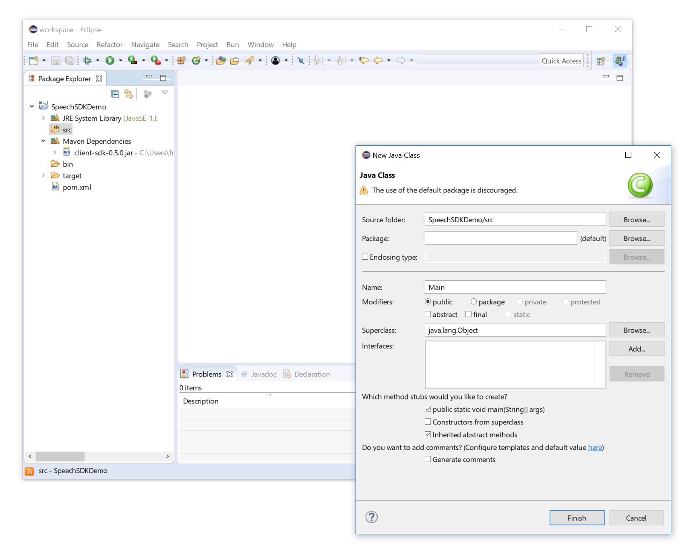
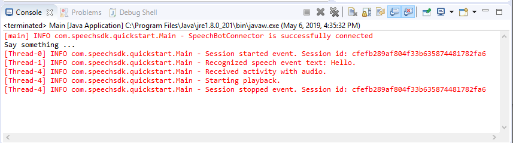

# Quickstart: Create a voice-first virtual assistant with the Speech SDK, Java

Quickstarts are also available for [speech-to-text](quickstart-java-jre.md) and [speech-translation](quickstart-translate-speech-java-jre.md).

In this article, you create a Java console application by using the [Cognitive Services Speech SDK](speech-sdk.md). The application will connect to a previously authored bot configured to use the Direct Line Speech channel, send a voice request, and return a voice response activity (if configured). The application is built with the Speech SDK Maven package and the Eclipse Java IDE on Windows, Ubuntu Linux, or on macOS. It runs on a 64-bit Java 8 runtime environment (JRE).

## Prerequisites

This quickstart requires:

* Operating System: Windows (64-bit), Ubuntu Linux 16.04/18.04 (64-bit), or macOS 10.13 or later
* [Eclipse Java IDE](https://www.eclipse.org/downloads/)
* [Java 8](https://www.oracle.com/technetwork/java/javase/downloads/jre8-downloads-2133155.html) or [JDK 8](https://www.oracle.com/technetwork/java/javase/downloads/index.html)
* An Azure subscription key for Speech Services. [Get one for free](get-started.md) or create it on the [Azure portal](https://portal.azure.com).
* A pre-configured bot created using Bot Framework version 4.2 or above. The bot would need to subscribe to the new "Direct Line Speech" channel to receive voice inputs.

    > [!NOTE]
    > Direct Line Speech (Preview) is currently available in a subset of Speech Services regions. Please refer to [the list of supported regions for voice-first virtual assistants](regions.md#Voice-first virtual assistants) and ensure your resources are deployed in one of those regions.

If you're running Ubuntu 16.04/18.04, make sure these dependencies are installed before starting Eclipse:

```console
sudo apt-get update
sudo apt-get install build-essential libssl1.0.0 libasound2 wget
```

If you're running Windows (64-bit), ensure you have installed the Microsoft Visual C++ Redistributable for your platform:
* [Download Microsoft Visual C++ Redistributable for Visual Studio 2017](https://support.microsoft.com/help/2977003/the-latest-supported-visual-c-downloads)

## Optional: Get started fast

This quickstart will describe, step by step, how to make a simple client application to connect to your speech-enabled bot. If you prefer to dive right in, the complete, ready-to-compile source code used in this quickstart is available in the [Speech SDK Samples](https://aka.ms/csspeech/samples) under the `quickstart` folder.

## Create and configure project

[!INCLUDE [](../../../includes/cognitive-services-speech-service-quickstart-java-create-proj.md)]

Additionally, to enable logging, update the **pom.xml** file to include the following dependency.

   ```xml
    <dependency>
        <groupId>org.slf4j</groupId>
        <artifactId>slf4j-simple</artifactId>
        <version>1.7.5</version>
    </dependency>
   ```

## Add sample code

1. To add a new empty class to your Java project, select **File** > **New** > **Class**.

1. In the **New Java Class** window, enter **speechsdk.quickstart** into the **Package** field, and **Main** into the **Name** field.

   

1. Open the newly created **Main** class and replace the contents of the `Main.java` file with the following starting code.

    ```java
    package speechsdk.quickstart;

    import com.microsoft.cognitiveservices.speech.audio.AudioConfig;
    import com.microsoft.cognitiveservices.speech.audio.PullAudioOutputStream;
    import com.microsoft.cognitiveservices.speech.dialog.DialogServiceConfig;
    import com.microsoft.cognitiveservices.speech.dialog.DialogServiceConnector;
    import org.slf4j.Logger;
    import org.slf4j.LoggerFactory;

    import javax.sound.sampled.AudioFormat;
    import javax.sound.sampled.AudioSystem;
    import javax.sound.sampled.DataLine;
    import javax.sound.sampled.SourceDataLine;
    import java.io.InputStream;

    public class Main {
        final Logger log = LoggerFactory.getLogger(Main.class);

        public static void main(String[] args) {
            // New code will go here
        }

        private void playAudioStream(PullAudioOutputStream audio) {
            ActivityAudioStream stream = new ActivityAudioStream(audio);
            final ActivityAudioStream.ActivityAudioFormat audioFormat = stream.getActivityAudioFormat();
            final AudioFormat format = new AudioFormat(
                    AudioFormat.Encoding.PCM_SIGNED,
                    audioFormat.getSamplesPerSecond(),
                    audioFormat.getBitsPerSample(),
                    audioFormat.getChannels(),
                    audioFormat.getFrameSize(),
                    audioFormat.getSamplesPerSecond(),
                    false);
            try {
                int bufferSize = format.getFrameSize();
                final byte[] data = new byte[bufferSize];

                SourceDataLine.Info info = new DataLine.Info(SourceDataLine.class, format);
                SourceDataLine line = (SourceDataLine) AudioSystem.getLine(info);
                line.open(format);

                if (line != null) {
                    line.start();
                    int nBytesRead = 0;
                    while (nBytesRead != -1) {
                        nBytesRead = stream.read(data);
                        if (nBytesRead != -1) {
                            line.write(data, 0, nBytesRead);
                        }
                    }
                    line.drain();
                    line.stop();
                    line.close();
                }
                stream.close();

            } catch (Exception e) {
                e.printStackTrace();
            }
        }

    }
    ```

1. In the **main** method, you will first configure your `DialogServiceConfig` and use it to create a `DialogServiceConnector` instance. This will connect to the Direct line speech channel to interact with your bot. An `AudioConfig` instance is also used to specify the source for audio input. In this example, the default microphone is used with `AudioConfig.fromDefaultMicrophoneInput()`.

    * Replace the string `YourSubscriptionKey` with your subscription key, which you can get from [here](get-started.md).
    * Replace the string `YourServiceRegion` with the [region](regions.md) associated with your subscription.
    * Replace the string `YourChannelSecret` with your direct line speech channel secret.

    > [!NOTE]
    > Direct Line Speech (Preview) is currently available in a subset of Speech Services regions. Please refer to [the list of supported regions for voice-first virtual assistants](regions.md#voice-first-virtual-assistants) and ensure your resources are deployed in one of those regions.

    ```java
    final String channelSecret = "YourChannelSecret"; // Your channel secret
    final String subscriptionKey = "YourSubscriptionKey"; // Your subscription key
    final String region = "YourServiceRegion"; // Your speech subscription service region. Note: only a subset of regions are currently supported
    final DialogServiceConfig botConfig = DialogServiceConfig.fromBotSecret(channelSecret, subscriptionKey, region);

    // Configure audio input from microphone.
    final AudioConfig audioConfig = AudioConfig.fromDefaultMicrophoneInput();

    // Create a DialogServiceConnector instance
    final DialogServiceConnector connector = new DialogServiceConnector(botConfig, audioConfig);
    ```

1. `DialogServiceConnector` relies on several events to communicate its bot activities, speech recognition results, and other information. Add these event listeners next.

    ```java
    // Recognizing will provide the intermediate recognized text while an audio stream is being processed
    connector.recognizing.addEventListener((o, speechRecognitionResultEventArgs) -> {
        log.info("Recognizing speech event text: {}", speechRecognitionResultEventArgs.getResult().getText());
    });

    // Recognized will provide the final recognized text once audio capture is completed
    connector.recognized.addEventListener((o, speechRecognitionResultEventArgs) -> {
        log.info("Recognized speech event reason text: {}", speechRecognitionResultEventArgs.getResult().getText());
    });

    // SessionStarted will notify when audio begins flowing to the service for a turn
    connector.sessionStarted.addEventListener((o, sessionEventArgs) -> {
        log.info("Session Started event id: {} ", sessionEventArgs.getSessionId());
    });

    // SessionStopped will notify when a turn is complete and it's safe to begin listening again
    connector.sessionStopped.addEventListener((o, sessionEventArgs) -> {
        log.info("Session stopped event id: {}", sessionEventArgs.getSessionId());
    });

    // Canceled will be signaled when a turn is aborted or experiences an error condition
    connector.canceled.addEventListener((o, canceledEventArgs) -> {
        log.info("Canceled event details: {}", canceledEventArgs.getErrorDetails());
        connector.disconnectAsync();
    });

    // ActivityReceived is the main way your bot will communicate with the client and uses bot framework activities.
    connector.activityReceived.addEventListener((o, activityEventArgs) -> {
        final String act = activityEventArgs.getActivity().serialize();
            log.info("Received activity {} audio", activityEventArgs.hasAudio() ? "with" : "without");
            if (activityEventArgs.hasAudio()) {
                playAudioStream(activityEventArgs.getAudio());
            }
        });
    ```

1. Connect the `DialogServiceConnector` to Direct Line Speech by invoking the `connectAsync()` method. To test your bot, you can invoke the `listenOnceAsync` method to send audio input from your microphone. Additionally, you can also use the `sendActivityAsync` method to send a custom activity as a serialized string. These custom activities can provide additional data that your bot will use in the conversation.

    ```java
    connector.connectAsync();
    // Start listening.
    System.out.println("Say something ...");
    connector.listenOnceAsync();

    // connector.sendActivityAsync(...)
    ```

1. Save changes to the `Main` file.

1. For supporting response playback, you will add an additional class that will transform the PullAudioOutputStream object returned from the getAudio() API to a java InputStream for ease of handling. This ActivityAudioStream is a specialized class which will handle audio response from the "Direct Line Speech channel". It will provide accessors to fetch audio format information required for handling playback: For that select **File** > **New** > **Class**.

1. In the **New Java Class** window, enter **speechsdk.quickstart** into the **Package** field, and **ActivityAudioStream** into the **Name** field.

1. Open the newly created **ActivityAudioStream** class and replace with code provided below.

    ```java
    package com.speechsdk.quickstart;

    import com.microsoft.cognitiveservices.speech.audio.PullAudioOutputStream;

    import java.io.IOException;
    import java.io.InputStream;


    public final class ActivityAudioStream extends InputStream {
        /**
         * The number of samples played per second. (16 kHz)
         */
        public static final long SAMPLE_RATE = 16000;
        /**
         * The number of bits in each sample of a sound that has this format. (16 bits)
         */
        public static final int BITS_PER_SECOND = 16;
        /**
         * The number of audio channels in this format (1 for mono).
         */
        public static final int CHANNELS = 1;
        /**
         * The number of bytes in each frame of a sound that has this format (2).
         */
        public static final int FRAME_SIZE = 2;

        /**
         * Reads up to a specified maximum number of bytes of data from the audio
         * stream, putting them into the given byte array.
         *
         * @param b   the buffer into which the data is read
         * @param off the offset, from the beginning of array <code>b</code>, at which
         *            the data will be written
         * @param len the maximum number of bytes to read
         * @return the total number of bytes read into the buffer, or -1 if there
         * is no more data because the end of the stream has been reached
         */
        @Override
        public int read(byte[] b, int off, int len) {
            byte[] tempBuffer = new byte[len];
            int n = (int) this.pullStreamImpl.read(tempBuffer);
            for (int i = 0; i < n; i++) {
                if (off + i > b.length) {
                    throw new ArrayIndexOutOfBoundsException(b.length);
                }
                b[off + i] = tempBuffer[i];
            }
            if (n == 0) {
                return -1;
            }
            return n;
        }

        /**
         * Reads the next byte of data from the activity audio stream if available.
         *
         * @return the next byte of data, or -1 if the end of the stream is reached
         * @see #read(byte[], int, int)
         * @see #read(byte[])
         * @see #available
         * <p>
         */
        @Override
        public int read() {
            byte[] data = new byte[1];
            int temp = read(data);
            if (temp <= 0) {
                // we have a weird situation if read(byte[]) returns 0!
                return -1;
            }
            return data[0] & 0xFF;
        }

        /**
         * Reads up to a specified maximum number of bytes of data from the activity audio stream
         * putting them into the given byte array.
         *
         * @param b the buffer into which the data is read
         * @return the total number of bytes read into the buffer, or -1 if there
         * is no more data because the end of the stream has been reached
         */
        @Override
        public int read(byte[] b) {
            int n = (int) pullStreamImpl.read(b);
            if (n == 0) {
                return -1;
            }
            return n;
        }

        /**
         * Skips over and discards a specified number of bytes from this
         * audio input stream.
         *
         * @param n the requested number of bytes to be skipped
         * @return the actual number of bytes skipped
         * @throws IOException if an input or output error occurs
         * @see #read
         * @see #available
         */
        @Override
        public long skip(long n) {
            if (n <= 0) {
                return 0;
            }
            if (n <= Integer.MAX_VALUE) {
                byte[] tempBuffer = new byte[(int) n];
                return read(tempBuffer);
            }
            long count = 0;
            for (long i = n; i > 0; i -= Integer.MAX_VALUE) {
                int size = (int) Math.min(Integer.MAX_VALUE, i);
                byte[] tempBuffer = new byte[size];
                count += read(tempBuffer);
            }
            return count;
        }

        /**
         * Closes this audio input stream and releases any system resources associated
         * with the stream.
         */
        @Override
        public void close() {
            this.pullStreamImpl.close();
        }

        /**
         * Fetch the audio format for the ActivityAudioStream. The ActivityAudioFormat defines the sample rate, bits per sample and the # channels
         *
         * @return instance of the ActivityAudioFormat associated with the stream
         */
        public ActivityAudioStream.ActivityAudioFormat getActivityAudioFormat() {
            return activityAudioFormat;
        }

        /**
         * Returns the maximum number of bytes that can be read (or skipped over) from this
         * audio input stream without blocking.
         *
         * @return the number of bytes that can be read from this audio input stream without blocking.
         * As this implementation does not buffer this will be defaulted to 0
         */
        @Override
        public int available() {
            return 0;
        }

        public ActivityAudioStream(final PullAudioOutputStream stream) {
            pullStreamImpl = stream;
            this.activityAudioFormat = new ActivityAudioStream.ActivityAudioFormat(SAMPLE_RATE, BITS_PER_SECOND, CHANNELS, FRAME_SIZE, AudioEncoding.PCM_SIGNED);
        }

        private PullAudioOutputStream pullStreamImpl;

        private ActivityAudioFormat activityAudioFormat;

        /**
         * ActivityAudioFormat is an internal format which contains metadata regarding the type of arrangement of
         * audio bits in this activity audio stream.
         */
        static class ActivityAudioFormat {

            private long samplesPerSecond;
            private int bitsPerSample;
            private int channels;
            private int frameSize;
            private AudioEncoding encoding;

            public ActivityAudioFormat(long samplesPerSecond, int bitsPerSample, int channels, int frameSize, AudioEncoding encoding) {
                this.samplesPerSecond = samplesPerSecond;
                this.bitsPerSample = bitsPerSample;
                this.channels = channels;
                this.encoding = encoding;
                this.frameSize = frameSize;
            }

            /**
             * Fetch the number of samples played per second for the associated audio stream format.
             *
             * @return the number of samples played per second
             */
            public long getSamplesPerSecond() {
                return samplesPerSecond;
            }

            /**
             * Fetch the number of bits in each sample of a sound that has this audio stream format.
             *
             * @return the number of bits per sample
             */
            public int getBitsPerSample() {
                return bitsPerSample;
            }

            /**
             * Fetch the number of audio channels used by this audio stream format.
             *
             * @return the number of channels
             */
            public int getChannels() {
                return channels;
            }

            /**
             * Fetch the default number of bytes in a frame required by this audio stream format.
             *
             * @return the number of bytes
             */
            public int getFrameSize() {
                return frameSize;
            }

            /**
             * Fetch the audio encoding type associated with this audio stream format.
             *
             * @return the encoding associated
             */
            public AudioEncoding getEncoding() {
                return encoding;
            }
        }

        /**
         * Enum defining the types of audio encoding supported by this stream
         */
        public enum AudioEncoding {
            PCM_SIGNED("PCM_SIGNED");

            String value;

            AudioEncoding(String value) {
                this.value = value;
            }
        }
    }

    ```

1. Save changes to the `ActivityAudioStream` file.

## Build and run the app

Press F11, or select **Run** > **Debug**.
The console will display a message "Say something"
At this point, you may speak an English phrase or sentence that your bot will understand. Your speech will be transmitted to your bot through the Direct Line Speech channel where it will be recognized, processed by your bot and the response will be returned as an activity. If your bot returns speech as response, the audio will be played back using the `AudioPlayer` class.



## Next steps

Additional samples, such as how to read speech from an audio file, are available on GitHub.

> [!div class="nextstepaction"]
> [Create and deploy a basic bot](https://docs.microsoft.com/azure/bot-service/bot-builder-tutorial-basic-deploy?view=azure-bot-service-4.0)

## See also

- [About voice-first virtual assistants](voice-first-virtual-assistants.md)
- [Get a Speech Services subscription key for free](get-started.md)
- [Custom wake words](speech-devices-sdk-create-kws.md)
- [Connect Direct Line Speech to your bot](https://docs.microsoft.com/azure/bot-service/bot-service-channel-connect-directlinespeech)
- [Explore Java samples on GitHub](https://aka.ms/csspeech/samples)
