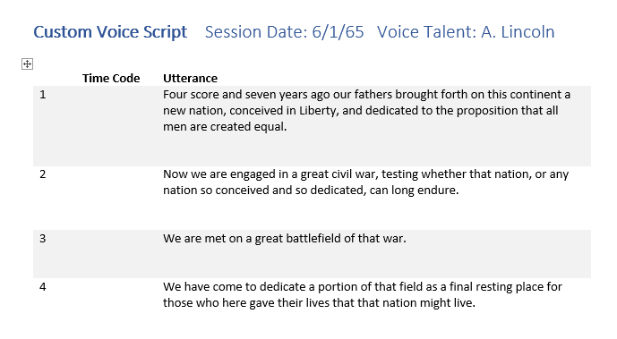
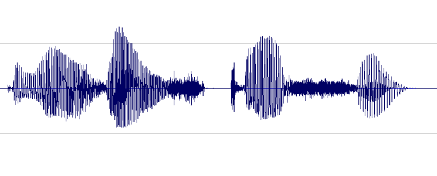

# Record voice samples to create a custom voice

Creating a high-quality production custom voice from scratch is not a casual undertaking. The central component of a custom voice is a large collection of audio samples of human speech. It's vital that these audio recordings be of high quality. Choose a voice talent who has experience making these kinds of recordings, and have them recorded by a competent recording engineer using professional equipment.

Before you can make these recordings, though, you need a script: the words that will be spoken by your voice talent to create the audio samples. For best results, your script must have good phonetic coverage and sufficient variety to train the custom voice model.

Many small but important details go into creating a professional voice recording. This guide is a roadmap for a process that will help you get good, consistent results.

> [!TIP]
> For the highest quality results, consider engaging Microsoft to help develop your custom voice. Microsoft has extensive experience producing high-quality voices for its own products, including Cortana and Office.

## Voice recording roles

There are four basic roles in a custom voice recording project:

Role|Purpose
-|-
Voice talent        |This person's voice will form the basis of the custom voice.
Recording engineer  |Oversees the technical aspects of the recording and operates the recording equipment.
Director            |Prepares the script and coaches the voice talent's performance.
Editor              |Finalizes the audio files and prepares them for upload to the Custom Voice portal.

An individual may fill more than one role. This guide assumes that you will be primarily filling the director role and hiring both a voice talent and a recording engineer. If you want to make the recordings yourself, this article includes some information about the recording engineer role. The editor role isn't needed until after the session, so can be performed by the director or the recording engineer.

## Choose your voice talent

Actors with experience in voiceover or voice character work make good custom voice talent. You can also often find suitable talent among announcers and newsreaders.

Choose voice talent whose natural voice you like. It is possible to create unique "character" voices, but it's much harder for most talent to perform them consistently, and the effort can cause voice strain.

> [!TIP]
> Generally, avoid using recognizable voices to create a custom voice—unless, of course, your goal is to produce a celebrity voice. Lesser-known voices are usually less distracting to users.

The single most important factor for choosing voice talent is consistency. Your recordings should all sound like they were made on the same day in the same room. You can approach this ideal through good recording practices and engineering.

Your voice talent is the other half of the equation. They must be able to speak with consistent rate, volume level, pitch, and tone. Clear diction is a must. The talent also needs to be able to strictly control their pitch variation, emotional affect, and speech mannerisms.

Recording custom voice samples can be more fatiguing than other kinds of voice work. Most voice talent can record for two or three hours a day. Limit sessions to three or four a week, with a day off in-between if possible.

Recordings made for a voice model should be emotionally neutral. That is, a sad utterance should not be read in a sad way. Mood can be added to the synthesized speech later through prosody controls. Work with your voice talent to develop a "persona" that defines the overall sound and emotional tone of the custom voice. In the process, you'll pinpoint what "neutral" sounds like for that persona.

A persona might have, for example, a naturally upbeat personality. So "their" voice might carry a note of optimism even when they speak neutrally. However, such a personality trait should be subtle and consistent. Listen to readings by existing voices to get an idea of what you're aiming for.

> [!TIP]
> Usually, you'll want to own the voice recordings you make. Your voice talent should be amenable to a work-for-hire contract for the project.

## Create a script

The starting point of any custom voice recording session is the script, which contains the utterances to be spoken by your voice talent. (The term "utterances" encompasses both full sentences and shorter phrases.)

The utterances in your script can come from anywhere: fiction, non-fiction, transcripts of speeches, news reports, and anything else available in printed form. If you want to make sure your voice does well on specific kinds of words (such as medical terminology or programming jargon), you might want to include sentences from scholarly papers or technical documents. For a brief discussion of potential legal issues, see the ["Legalities"](#legalities) section. You can also write your own text.

Your utterances don't need to come from the same source, or the same kind of source. They don't even need to have anything to do with each other. However, if you will use set phrases (for example, "You have successfully logged in") in your speech application, make sure to include them in your script. This will give your custom voice a better chance of pronouncing those phrases well. And if you should decide to use a recording in place of synthesized speech, you'll already have it in the same voice.

While consistency is key in choosing voice talent, variety is the hallmark of a good script. Your script should include many different words and sentences with a variety of sentence lengths, structures, and moods. Every sound in the language should be represented multiple times and in numerous contexts (called *phonetic coverage*).

Furthermore, the text should incorporate all the ways that a particular sound can be represented in writing, and place each sound at varying places in the sentences. Both declarative sentences and questions should be included and read with appropriate intonation.

It's difficult to write a script that provides *just enough* data to allow the Custom Speech portal to build a good voice. In practice, the simplest way to make a script that achieves robust phonetic coverage is to include a large number of samples. The standard voices that Microsoft provides were built from tens of thousands of utterances. You should be prepared to record a few to several thousand utterances at minimum to build a production-quality custom voice.

Check the script carefully for errors. If possible, have someone else check it too. When you run through the script with your talent, you'll probably catch a few more mistakes.

### Script format

You can write your script in Microsoft Word. The script is for use during the recording session, so you can set it up any way you find easy to work with. Create the text file that's required by the Custom Voice portal separately.

A basic script format contains three columns:

* The number of the utterance, starting at 1. Numbering makes it easy for everyone in the studio to refer to a particular utterance ("let's try number 356 again"). You can use the Word paragraph numbering feature to number the rows of the table automatically.
* A blank column where you'll write the take number or time code of each utterance to help you find it in the finished recording.
* The text of the utterance itself.

> [!NOTE]
> Most studios record in short segments known as *takes*. Each take typically contains 10 to 24 utterances. Just noting the take number is sufficient to find an utterance later. If you're recording in a studio that prefers to make longer recordings, you'll want to note the time code instead. The studio will have a prominent time display.

Leave enough space after each row to write notes. Be sure that no utterance is split between pages. Number the pages, and print your script on one side of the paper.

Print three copies of the script: one for the talent, one for the engineer, and one for the director (you). Use a paper clip instead of staples: an experienced voice artist will separate the pages to avoid making noise as the pages are turned.

### Legalities

Under copyright law, an actor's reading of copyrighted text might be a performance for which the author of the work should be compensated. This performance will not be recognizable in the final product, the custom voice. Even so, the legality of using a copyrighted work for this purpose is not well established. Microsoft cannot provide legal advice on this issue; consult your own counsel.

Fortunately, it is possible to avoid these issues entirely. There are many sources of text you can use without permission or license.

|Text source|Description|
|-|-|
|[CMU Arctic corpus](http://festvox.org/cmu_arctic/)|About 1100 sentences selected from out-of-copyright works specifically for use in speech synthesis projects. An excellent starting point.|
|Works no longer under copyright|Typically works published prior to 1923. For English, [Project Gutenberg](https://www.gutenberg.org/) offers tens of thousands of such works. You may want to focus on newer works, as the language will be closer to modern English.|
|Government&nbsp;works|Works created by the United States government are not copyrighted in the United States, though the government may claim copyright in other countries/regions.|
|Public domain|Works for which copyright has been explicitly disclaimed or that have been dedicated to the public domain. It may not be possible to waive copyright entirely in some jurisdictions.|
|Permissively-licensed works|Works distributed under a license like Creative Commons or the GNU Free Documentation License (GFDL). Wikipedia uses the GFDL. Some licenses, however, may impose restrictions on performance of the licensed content that may impact the creation of a custom voice model, so read the license carefully.|

## Recording your script

Record your script at a professional recording studio that specializes in voice work. They'll have a recording booth, the right equipment, and the right people to operate it. It pays not to skimp on recording.

Discuss your project with the studio's recording engineer and listen to their advice. The recording should have little or no dynamic range compression (maximum of 4:1). It is critical that the audio have consistent volume and a high signal-to-noise ratio, while being free of unwanted sounds.

### Do it yourself

If you want to make the recording yourself, rather than going into a recording studio, here's a short primer. Thanks to the rise of home recording and podcasting, it's easier than ever to find good recording advice and resources online.

Your "recording booth" should be a small room with no noticeable echo or "room tone." It should be as quiet and soundproof as possible. Drapes on the walls can be used to reduce echo and neutralize or "deaden" the sound of the room.

Use a high-quality studio condenser microphone ("mic" for short) intended for recording voice. Sennheiser, AKG, and even newer Zoom mics can yield good results. You can buy a mic, or rent one from a local audio-visual rental firm. Look for one with a USB interface. This type of mic conveniently combines the microphone element, preamp, and analog-to-digital converter into one package, simplifying hookup.

You may also use an analog microphone. Many rental houses offer "vintage" microphones renowned for their voice character. Note that professional analog gear uses balanced XLR connectors, rather than the 1/4-inch plug that's used in consumer equipment. If you go analog, you'll also need a preamp and a computer audio interface with these connectors.

Install the microphone on a stand or boom, and install a pop filter in front of the microphone to eliminate noise from "plosive" consonants like "p" and "b." Some microphones come with a suspension mount that isolates them from vibrations in the stand, which is helpful.

The voice talent must stay at a consistent distance from the microphone. Use tape on the floor to mark where they should stand. If the talent prefers to sit, take special care to monitor mic distance and avoid chair noise.

Use a stand to hold the script. Avoid angling the stand so that it can reflect sound toward the microphone.

The person operating the recording equipment—the engineer—should be in a separate room from the talent, with some way to talk to the talent in the recording booth (a *talkback circuit).*

The recording should contain as little noise as possible, with a goal of an 80-db signal-to-noise ratio or better.

Listen closely to a recording of silence in your "booth," figure out where any noise is coming from, and eliminate the cause. Common sources of noise are air vents, fluorescent light ballasts, traffic on nearby roads, and equipment fans (even notebook PCs might have fans). Microphones and cables can pick up electrical noise from nearby AC wiring, usually a hum or buzz. A buzz can also be caused by a *ground loop*, which is caused by having equipment plugged into more than one electrical circuit.

> [!TIP]
> In some cases, you might be able to use an equalizer or a noise reduction software plug-in to help remove noise from your recordings, although it is always best to stop it at its source.

Set levels so that most of the available dynamic range of digital recording is used without overdriving. That means set the audio loud, but not so loud that it becomes distorted. An example of the waveform of a good recording is shown in the following image:

Here, most of the range (height) is used, but the highest peaks of the signal do not reach the top or bottom of the window. You can also see that the silence in the recording approximates a thin horizontal line, indicating a low noise floor. This recording has acceptable dynamic range and signal-to-noise ratio.

Record directly into the computer via a high-quality audio interface or a USB port, depending on the mic you're using. For analog, keep the audio chain simple: mic, preamp, audio interface, computer. You can license both [Avid Pro Tools](https://www.avid.com/en/pro-tools) and [Adobe Audition](https://www.adobe.com/products/audition.html) monthly at a reasonable cost. If your budget is extremely tight, try the free [Audacity](https://www.audacityteam.org/).

Record at 44.1 kHz 16 bit monophonic (CD quality) or better. Current state-of-the-art is 48 kHz 24-bit, if your equipment supports it. You will down-sample your audio to 16 kHz 16-bit before you submit it to the Custom Voice portal. Still, it pays to have a high-quality original recording in the event edits are needed.

Ideally, have different people serve in the roles of director, engineer, and talent. Don't try to do it all yourself. In a pinch, one person can be both the director and the engineer.

### Before the session

To avoid wasting studio time, run through the script with your voice talent before the recording session. While the voice talent becomes familiar with the text, they can clarify the pronunciation of any unfamiliar words.

> [!NOTE]
> Most recording studios offer electronic display of scripts in the recording booth. In this case, type your run-through notes directly into the script's document. You'll still want a paper copy to take notes on during the session, though. Most engineers will want a hard copy, too. And you'll still want a third printed copy as a backup for the talent in case the computer is down.

Your voice talent might ask which word you want emphasized in an utterance (the "operative word"). Tell them that you want a natural reading with no particular emphasis. Emphasis can be added when speech is synthesized; it should not be a part of the original recording.

Direct the talent to pronounce words distinctly. Every word of the script should be pronounced as written. Sounds should not be omitted or slurred together, as is common in casual speech, *unless they have been written that way in the script*.

|Written text|Unwanted casual pronunciation|
|-|-|
|never going to give you up|never gonna give you up|
|there are four lights|there're four lights|
|how's the weather today|how's th' weather today|
|say hello to my little friend|say hello to my lil' friend|

The talent should *not* add distinct pauses between words. The sentence should still flow naturally, even while sounding a little formal. This fine distinction might take practice to get right.

### The recording session

Create a reference recording, or *match file,* of a typical utterance at the beginning of the session. Ask the talent to repeat this line every page or so. Each time, compare the new recording to the reference. This practice helps the talent remain consistent in volume, tempo, pitch, and intonation. Meanwhile, the engineer can use the match file as a reference for levels and overall consistency of sound.

The match file is especially important when you resume recording after a break or on another day. You'll want to play it a few times for the talent and have them repeat it each time until they are matching well.

Coach your talent to take a deep breath and pause for a moment before each utterance. Record a couple of seconds of silence between utterances. Words should be pronounced the same way each time they appear, considering context. For example, "record" as a verb is pronounced differently from "record" as a noun.

Record a good five seconds of silence before the first recording to capture the "room tone." This practice helps the Custom Voice portal compensate for any remaining noise in the recordings.

> [!TIP]
> All you really need to capture is the voice talent, so you can make a monophonic (single-channel) recording of just their lines. However, if you record in stereo, you can use the second channel to record the chatter in the control room to capture discussion of particular lines or takes. Remove this track from the version that's uploaded to the Custom Voice portal.

Listen closely, using headphones, to the voice talent's performance. You're looking for good but natural diction, correct pronunciation, and a lack of unwanted sounds. Don't hesitate to ask your talent to re-record an utterance that doesn't meet these standards.

> [!TIP]
> If you are using a large number of utterances, a single utterance might not have a noticeable effect on the resultant custom voice. It might be more expedient to simply note any utterances with issues, exclude them from your dataset, and see how your custom voice turns out. You can always go back to the studio and record the missed samples later.

Note the take number or time code on your script for each utterance. Ask the engineer to mark each utterance in the recording's metadata or cue sheet as well.

Take regular breaks and provide a beverage to help your voice talent keep their voice in good shape.

### After the session

Modern recording studios run on computers. At the end of the session, you receive one or more audio files, not a tape. These files will probably be WAV or AIFF format in CD quality (44.1 kHz 16-bit) or better. 48 kHz 24-bit is common and desirable. Higher sampling rates, such as 96 kHz, are generally not needed.

The Custom Voice portal requires each provided utterance to be in its own file. Each audio file delivered by the studio contains multiple utterances. So the primary post-production task is to split up the recordings and prepare them for submission. The recording engineer might have placed markers in the file (or provided a separate cue sheet) to indicate where each utterance starts.

Use your notes to find the exact takes you want, and then use a sound editing utility, such as [Avid Pro Tools](https://www.avid.com/en/pro-tools), [Adobe Audition](https://www.adobe.com/products/audition.html), or the free [Audacity](https://www.audacityteam.org/), to copy each utterance into a new file.

Leave only about 0.2 seconds of silence at the beginning and end of each clip, except for the first. That file should start with a full five seconds of silence. Do not use an audio editor to "zero out" silent parts of the file. Including the "room tone" will help the Custom Voice algorithms compensate for any residual background noise.

Listen to each file carefully. At this stage, you can edit out small unwanted sounds that you missed during recording, like a slight lip smack before a line, but be careful not to remove any actual speech. If you can't fix a file, remove it from your dataset and note that you have done so.

Convert each file to 16 bits and a sample rate of 16 kHz before saving and, if you recorded the studio chatter, remove the second channel. Save each file in WAV format, naming the files with the utterance number from your script.

Finally, create the *transcript* that associates each WAV file with a text version of the corresponding utterance. [Creating custom voice fonts](how-to-customize-voice-font.md) includes details of the required format. You can copy the text directly from your script. Then create a Zip file of the WAV files and the text transcript.

Archive the original recordings in a safe place in case you need them later. Preserve your script and notes, too.

## Next steps

You're ready to upload your recordings and create your custom voice.

> [!div class="nextstepaction"]
> [Create custom voice fonts](how-to-customize-voice-font.md)
