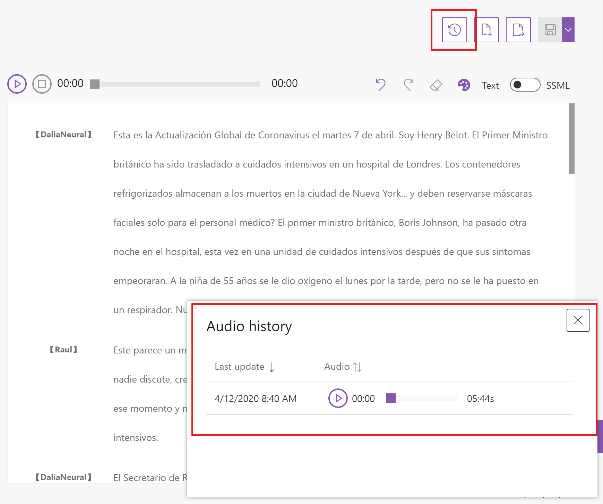

# Speech Service release notes

## Text-to-speech 2021-April release

**Neural TTS is available across 21 regions**

- **Twelve new regions added** - Neural TTS is now available in these new 12 regions: `Japan East`, `Japan West`, `Korea Central`, `North Central US`, `North Europe`, `South Central US`, `Southeast Asia`, `UK South`, `west Central US`, `West Europe`, `West US`, `West US 2`. Check [here](regions.md#text-to-speech) for full list of 21 supported regions.

## Text-to-speech 2021-March release

**New languages and voices added for neural TTS**

- **Six new languages introduced** - 12 new voices in 6 new locales are added into the neural TTS language list: Nia in `cy-GB` Welsh (United Kingdom), Aled in `cy-GB` Welsh (United Kingdom), Rosa in `en-PH` English (Philippines), James in `en-PH` English (Philippines), Charline in `fr-BE` French (Belgium), Gerard in `fr-BE` French (Belgium), Dena in `nl-BE` Dutch (Belgium), Arnaud in `nl-BE` Dutch (Belgium), Polina in `uk-UA` Ukrainian (Ukraine), Ostap in `uk-UA` Ukrainian (Ukraine), Uzma in `ur-PK` Urdu (Pakistan), Asad in `ur-PK` Urdu (Pakistan).

- **Five languages from preview to GA** - 10 voices in 5 locales introduced in 2020-November now are GA: Kert in `et-EE` Estonian (Estonia), Colm in `ga-IE` Irish (Ireland), Nils in `lv-LV` Latvian (Latvia), Leonas in `lt-LT` Lithuanian (Lithuania), Joseph in `mt-MT` Maltese (Malta).

- **New male voice added for French (Canada)** - A new voice Antoine is available for `fr-CA` French (Canada).

- **Quality improvement** - Pronunciation error rate reduction on `hu-HU` Hungarian - 48.17%, `nb-NO` Norwegian - 52.76%, `nl-NL` Dutch (Netherlands) - 22.11%.

With this release, we now support a total of 142 neural voices across 60 languages/locales. In addition, over 70 standard voices are available in 49 languages/locales. Visit [Language support](language-support.md#text-to-speech) for the full list.

**Get facial pose events to animate characters**

The [Viseme event](how-to-speech-synthesis-viseme.md) is added to Neural TTS, which allows users to get the facial pose sequence and duration from synthesized speech. Viseme can be used to control the movement of 2D and 3D avatar models, perfectly matching mouth movements to synthesized speech. Now, viseme only works for en-US-AriaNeural voice.

**Add the bookmark element in Speech Synthesis Markup Language (SSML)**

The [bookmark element](speech-synthesis-markup.md#bookmark-element) allows you to insert custom markers in SSML to get the offset of each marker in the audio stream. It can be used to reference a specific location in the text or tag sequence.

## Speech SDK 1.16.0: 2021-March release

> [!NOTE]
> The Speech SDK on Windows depends on the shared Microsoft Visual C++ Redistributable for Visual Studio 2015, 2017 and 2019. Download it [here](https://support.microsoft.com/help/2977003/the-latest-supported-visual-c-downloads).

#### New features

- **C++/C#/Java/Python**: Moved to the latest version of GStreamer (1.18.3) to add support for transcribing any media format on Windows, Linux and Android. See documentation [here](https://docs.microsoft.com/azure/cognitive-services/speech-service/how-to-use-codec-compressed-audio-input-streams).
- **C++/C#/Java/Objective-C/Python**: Added support for decoding compressed TTS/synthesized audio to the SDK. If you set output audio format to PCM and GStreamer is available on your system, the SDK will automatically request compressed audio from the service to save bandwidth and decode the audio on the client. You can set `SpeechServiceConnection_SynthEnableCompressedAudioTransmission` to `false` to disable this feature. Details for [C++](https://docs.microsoft.com/cpp/cognitive-services/speech/microsoft-cognitiveservices-speech-namespace#propertyid), [C#](https://docs.microsoft.com/dotnet/api/microsoft.cognitiveservices.speech.propertyid?view=azure-dotnet), [Java](https://docs.microsoft.com/java/api/com.microsoft.cognitiveservices.speech.propertyid?view=azure-java-stable), [Objective-C](https://docs.microsoft.com/objectivec/cognitive-services/speech/spxpropertyid), [Python](https://docs.microsoft.com/python/api/azure-cognitiveservices-speech/azure.cognitiveservices.speech.propertyid?view=azure-python).
- **JavaScript**: Node.js users can now use the [`AudioConfig.fromWavFileInput` API](https://docs.microsoft.com/javascript/api/microsoft-cognitiveservices-speech-sdk/audioconfig?view=azure-node-latest#fromWavFileInput_File_). This addresses [GitHub issue #252](https://github.com/microsoft/cognitive-services-speech-sdk-js/issues/252).
- **C++/C#/Java/Objective-C/Python**: Added `GetVoicesAsync()` method for TTS to return all available synthesis voices. Details for [C++](https://docs.microsoft.com/cpp/cognitive-services/speech/speechsynthesizer#getvoicesasync), [C#](https://docs.microsoft.com/dotnet/api/microsoft.cognitiveservices.speech.speechsynthesizer?view=azure-dotnet#methods), [Java](https://docs.microsoft.com/java/api/com.microsoft.cognitiveservices.speech.speechsynthesizer?view=azure-java-stable#methods), [Objective-C](https://docs.microsoft.com/objectivec/cognitive-services/speech/spxspeechsynthesizer#getvoiceasync), and [Python](https://docs.microsoft.com/python/api/azure-cognitiveservices-speech/azure.cognitiveservices.speech.speechsynthesizer?view=azure-python#methods).
- **C++/C#/Java/JavaScript/Objective-C/Python**: Added `VisemeReceived` event for TTS/speech synthesis to return synchronous viseme animation. See documentation [here](https://docs.microsoft.com/azure/cognitive-services/speech-service/how-to-speech-synthesis-viseme).
- **C++/C#/Java/JavaScript/Objective-C/Python**: Added `BookmarkReached` event for TTS. You can set bookmarks in the input SSML and get the audio offsets for each bookmark. See documentation [here](https://docs.microsoft.com/azure/cognitive-services/speech-service/speech-synthesis-markup#bookmark-element).
- **Java**: Added support for speaker recognition APIs. Details [here](https://docs.microsoft.com/java/api/com.microsoft.cognitiveservices.speech.speakerrecognizer?view=azure-java-stable).
- **C++/C#/Java/JavaScript/Objective-C/Python**: Added two new output audio formats with WebM container for TTS (Webm16Khz16BitMonoOpus and Webm24Khz16BitMonoOpus). These are better formats for streaming audio with the Opus codec. Details for [C++](https://docs.microsoft.com/cpp/cognitive-services/speech/microsoft-cognitiveservices-speech-namespace#speechsynthesisoutputformat), [C#](https://docs.microsoft.com/dotnet/api/microsoft.cognitiveservices.speech.speechsynthesisoutputformat?view=azure-dotnet), [Java](https://docs.microsoft.com/java/api/com.microsoft.cognitiveservices.speech.speechsynthesisoutputformat?view=azure-java-stable), [JavaScript](https://docs.microsoft.com/javascript/api/microsoft-cognitiveservices-speech-sdk/speechsynthesisoutputformat?view=azure-node-latest), [Objective-C](https://docs.microsoft.com/objectivec/cognitive-services/speech/spxspeechsynthesisoutputformat), [Python](https://docs.microsoft.com/python/api/azure-cognitiveservices-speech/azure.cognitiveservices.speech.speechsynthesisoutputformat?view=azure-python).
- **C++/C#/Java**: Added support for retrieving voice profile for speaker recognition scenario. Details for [C++](https://docs.microsoft.com/cpp/cognitive-services/speech/speakerrecognizer), [C#](https://docs.microsoft.com/dotnet/api/microsoft.cognitiveservices.speech.speakerrecognizer?view=azure-dotnet), and [Java](https://docs.microsoft.com/java/api/com.microsoft.cognitiveservices.speech.speakerrecognizer?view=azure-java-stable).
- **C++/C#/Java/Objective-C/Python**: Added support for separate shared library for audio microphone and speaker control. This allows to use the SDK in environments that do not have required audio library dependencies.
- **Objective-C/Swift**: Added support for module framework with umbrella header. This allows to import Speech SDK as a module in iOS/Mac Objective-C/Swift apps. This addresses [GitHub issue #452](https://github.com/Azure-Samples/cognitive-services-speech-sdk/issues/452).
- **Python**: Added support for [Python 3.9](https://docs.microsoft.com/azure/cognitive-services/speech-service/quickstarts/setup-platform?pivots=programming-language-python) and dropped support for Python 3.5 per Python's [end-of-life for 3.5](https://devguide.python.org/devcycle/#end-of-life-branches).

#### Improvements

- As part of our multi release effort to reduce the Speech SDK's memory usage and disk footprint, Android binaries are now 3% to 5% smaller.
- Improved accuracy, readability and see-also sections of our C# reference documentation [here](https://docs.microsoft.com/dotnet/api/microsoft.cognitiveservices.speech?view=azure-dotnet).

#### Bug fixes

- **JavaScript**: Large WAV file headers are now parsed correctly (increases header slice to 512 bytes). This addresses [GitHub issue #962](https://github.com/Azure-Samples/cognitive-services-speech-sdk/issues/962).
- **JavaScript**: Corrected microphone timing issue if mic stream ends before stop recognition, addressing an issue with Speech Recognition not working in Firefox.
- **JavaScript**: We now correctly handle initialization promise when the browser forces mic off before turnOn completes.
- **JavaScript**: We replaced url dependency with url-parse. This addresses [GitHub issue #264](https://github.com/microsoft/cognitive-services-speech-sdk-js/issues/264).
- **Android**: Fixed callbacks not working when `minifyEnabled` is set to true.
- **C++/C#/Java/Objective-C/Python**: `TCP_NODELAY` will be correctly set to underlying socket IO for TTS to reduce latency.
- **C++/C#/Java/Python/Objective-C/Go**: Fixed an occasional crash when the recognizer was destroyed just after starting a recognition.
- **C++/C#/Java**: Fixed an occasional crash in the destruction of speaker recognizer.

#### Samples

- **JavaScript**: [Browser samples](https://github.com/Azure-Samples/cognitive-services-speech-sdk/tree/master/samples/js/browser) no longer require separate JavaScript library file download.

## Speech CLI (also known as SPX): 2021-March release

> [!NOTE]
> Get started with the Azure Speech service command line interface (CLI) [here](https://docs.microsoft.com/azure/cognitive-services/speech-service/spx-basics). The CLI enables you to use the Azure Speech service without writing any code.

#### New features

- Added `spx intent` command for intent recognition, replacing `spx recognize intent`.
- Recognize and intent can now use Azure functions to calculate word error rate using `spx recognize --wer url <URL>`.
- Recognize can now output results as VTT files using `spx recognize --output vtt file <FILENAME>`.
- Sensitive key info now obscured in debug/verbose output.
- Added URL checking and error message for content field in batch transcription create.

**COVID-19 abridged testing**:

As the ongoing pandemic continues to require our engineers to work from home, pre-pandemic manual verification scripts have been significantly reduced. We test on fewer devices with fewer configurations, and the likelihood of environment-specific bugs slipping through may be increased. We still rigorously validate with a large set of automation. In the unlikely event that we missed something, please let us know on [GitHub](https://github.com/Azure-Samples/cognitive-services-speech-sdk/issues?q=is%3Aissue+is%3Aopen). 
Stay healthy!

## Text-to-speech 2021-February release

**Custom Neural Voice GA**

Custom Neural Voice is GA in February in 13 languages: Chinese (Mandarin, Simplified), English (Australia), English (India), English (United Kingdom), English (United States), French (Canada), French (France), German (Germany), Italian (Italy), Japanese (Japan), Korean (Korea), Portuguese (Brazil), Spanish (Mexico), and Spanish (Spain). Learn more about [what is Custom Neural Voice](custom-neural-voice.md) and [how to use it responsibly](concepts-guidelines-responsible-deployment-synthetic.md). 
Custom Neural Voice feature requires registration and Microsoft may limit access based on Microsoft’s eligibility criteria. Learn more about the [limited access](https://docs.microsoft.com/legal/cognitive-services/speech-service/custom-neural-voice/limited-access-custom-neural-voice?context=/azure/cognitive-services/speech-service/context/context).  

## Speech SDK 1.15.0: 2021-January release

> [!NOTE]
> The Speech SDK on Windows depends on the shared Microsoft Visual C++ Redistributable for Visual Studio 2015, 2017 and 2019. Download it [here](https://support.microsoft.com/help/2977003/the-latest-supported-visual-c-downloads).

**Highlights summary**
- Smaller memory and disk footprint making the SDK more efficient.
- Higher fidelity output formats available for custom neural voice private preview.
- Intent Recognizer can now get return more than the top intent, giving you the ability to make a separate assessment about your customer's intent.
- Your voice assistant or bot are now easier to set up, and you can make it stop listening immediately, and exercise greater control over how it responds to errors.
- Improved on device performance through making compression optional.
- Use the Speech SDK on Windows ARM/ARM64.
- Improved low level debugging.
- Pronunciation assessment feature is now more widely available.
- Several Bug fixes to address issues YOU, our valued customers, have flagged on GitHub! THANK YOU! Keep the feedback coming!

**Improvements**
- The Speech SDK is now more efficient and lightweight. We have started a multi release effort to reduce the Speech SDK's memory usage and disk footprint. As a first step we made significant file size reductions in shared libraries on most platforms. Compared to the 1.14 release:
  - 64-bit UWP-compatible Windows libraries are about 30% smaller.
  - 32-bit Windows libraries are not yet seeing a size improvements.
  - Linux libraries are 20-25% smaller.
  - Android libraries are 3-5% smaller.

**New features**
- **All**: New 48KHz output formats available for the private preview of custom neural voice through the TTS speech synthesis API: Audio48Khz192KBitRateMonoMp3, audio-48khz-192kbitrate-mono-mp3, Audio48Khz96KBitRateMonoMp3, audio-48khz-96kbitrate-mono-mp3, Raw48Khz16BitMonoPcm, raw-48khz-16bit-mono-pcm, Riff48Khz16BitMonoPcm, riff-48khz-16bit-mono-pcm.
- **All**: Custom voice is also easier to use. Added support for setting custom voice via `EndpointId` ([C++](/cpp/cognitive-services/speech/speechconfig#setendpointid), [C#](/dotnet/api/microsoft.cognitiveservices.speech.speechconfig.endpointid#Microsoft_CognitiveServices_Speech_SpeechConfig_EndpointId), [Java](/java/api/com.microsoft.cognitiveservices.speech.speechconfig.setendpointid#com_microsoft_cognitiveservices_speech_SpeechConfig_setEndpointId_String_), [JavaScript](/javascript/api/microsoft-cognitiveservices-speech-sdk/speechconfig#endpointId), [Objective-C](/objectivec/cognitive-services/speech/spxspeechconfiguration#endpointid), [Python](/python/api/azure-cognitiveservices-speech/azure.cognitiveservices.speech.speechconfig#endpoint-id)). Before this change, custom voice users needed to set the endpoint URL via the `FromEndpoint` method. Now customers can use the `FromSubscription` method just like public voices, and then provide the deployment ID by setting `EndpointId`. This simplifies setting up custom voices. 
- **C++/C#/Java/Objective-C/Python**: Get more than the top intent from`IntentRecognizer`. It now supports configuring the JSON result containing all intents and not only the top scoring intent via `LanguageUnderstandingModel FromEndpoint` method by using `verbose=true` uri parameter. This addresses [GitHub issue #880](https://github.com/Azure-Samples/cognitive-services-speech-sdk/issues/880). See updated documentation [here](./get-started-intent-recognition.md#add-a-languageunderstandingmodel-and-intents).
- **C++/C#/Java**: Make your voice assistant or bot stop listening immediately. `DialogServiceConnector` ([C++](/cpp/cognitive-services/speech/dialog-dialogserviceconnector), [C#](/dotnet/api/microsoft.cognitiveservices.speech.dialog.dialogserviceconnector), [Java](/java/api/com.microsoft.cognitiveservices.speech.dialog.dialogserviceconnector)) now has a `StopListeningAsync()` method to accompany `ListenOnceAsync()`. This will immediately stop audio capture and gracefully wait for a result, making it perfect for use with "stop now" button-press scenarios.
- **C++/C#/Java/JavaScript**: Make your voice assistant or bot react better to underlying system errors. `DialogServiceConnector` ([C++](/cpp/cognitive-services/speech/dialog-dialogserviceconnector), [C#](/dotnet/api/microsoft.cognitiveservices.speech.dialog.dialogserviceconnector), [Java](/java/api/com.microsoft.cognitiveservices.speech.dialog.dialogserviceconnector), [JavaScript](/javascript/api/microsoft-cognitiveservices-speech-sdk/dialogserviceconnector)) now has a new `TurnStatusReceived` event handler. These optional events correspond to every [`ITurnContext`](/dotnet/api/microsoft.bot.builder.iturncontext) resolution on the Bot and will report turn execution failures when they happen, e.g. as a result of an unhandled exception, timeout, or network drop between Direct Line Speech and the bot. `TurnStatusReceived` makes it easier to respond to failure conditions. For example, if a bot takes too long on a backend database query (e.g. looking up a product), `TurnStatusReceived` allows the client to know to reprompt with "sorry, I didn't quite get that, could you please try again" or something similar.
- **C++/C#**: Use the Speech SDK on more platforms. The [Speech SDK NuGet package](https://www.nuget.org/packages/Microsoft.CognitiveServices.Speech) now supports Windows ARM/ARM64 desktop native binaries (UWP was already supported) to make the Speech SDK more useful on more machine types.
- **Java**: [`DialogServiceConnector`](/java/api/com.microsoft.cognitiveservices.speech.dialog.dialogserviceconnector) now has a `setSpeechActivityTemplate()` method that was unintentionally excluded from the language previously. This is equivalent to setting the `Conversation_Speech_Activity_Template` property and will request that all future Bot Framework activities originated by the Direct Line Speech service merge the provided content into their JSON payloads.
- **Java**: Improved low level debugging. The [`Connection`](/java/api/com.microsoft.cognitiveservices.speech.connection) class now has a `MessageReceived` event, similar to other programing languages (C++, C#). This event provides low-level access to incoming data from the service and can be useful for diagnostics and debugging.
- **JavaScript**: Easier setup for Voice Assistants and bots through [`BotFrameworkConfig`](/javascript/api/microsoft-cognitiveservices-speech-sdk/botframeworkconfig), which now has `fromHost()` and `fromEndpoint()` factory methods that simplify the use of custom service locations versus manually setting properties. We also standardized optional specification of `botId` to use a non-default bot across the configuration factories.
- **JavaScript**: Improved on device performance through added string control property for websocket compression. For performance reasons we disabled websocket compression by default. This can be reenabled for low bandwidth scenarios. More details [here](/javascript/api/microsoft-cognitiveservices-speech-sdk/propertyid). This addresses [GitHub issue #242](https://github.com/microsoft/cognitive-services-speech-sdk-js/issues/242).
- **JavaScript**: Added support for pronunciation assessment to enable evaluation of speech pronunciation. See the quickstart [here](./how-to-pronunciation-assessment.md?pivots=programming-language-javascript).

**Bug fixes**
- **All** (except JavaScript): Fixed a regression in version 1.14, in which too much memory was allocated by the recognizer.
- **C++**: Fixed a garbage collection issue with `DialogServiceConnector`, addressing [GitHub issue #794](https://github.com/Azure-Samples/cognitive-services-speech-sdk/issues/794).
- **C#**: Fixed an issue with thread shutdown that caused objects to block for about a second when disposed.
- **C++/C#/Java**: Fixed an exception preventing an application from setting speech authorization token or activity template more than once on a `DialogServiceConnector`.
- **C++/C#/Java**: Fixed a recognizer crash due to a race condition in teardown.
- **JavaScript**: [`DialogServiceConnector`](/javascript/api/microsoft-cognitiveservices-speech-sdk/dialogserviceconnector) did not previously honor the optional `botId` parameter specified in `BotFrameworkConfig`'s factories. This made it necessary to set the `botId` query string parameter manually to use a non-default bot. The bug has been corrected and `botId` values provided to `BotFrameworkConfig`'s factories will be honored and used, including the new `fromHost()` and `fromEndpoint()` additions. This also applies to the `applicationId` parameter for `CustomCommandsConfig`.
- **JavaScript**: Fixed [GitHub issue #881](https://github.com/Azure-Samples/cognitive-services-speech-sdk/issues/881), allowing recognizer object re-usage.
- **JavaScript**: Fixed an issue where the SKD was sending `speech.config` multiple times in one TTS session, wasting bandwidth.
- **JavaScript**: Simplified error handling on microphone authorization, allowing more descriptive message to bubble up when user has not allowed microphone input on their browser.
- **JavaScript**: Fixed [GitHub issue #249](https://github.com/microsoft/cognitive-services-speech-sdk-js/issues/249) where type errors in `ConversationTranslator` and `ConversationTranscriber` caused a compilation error for TypeScript users.
- **Objective-C**: Fixed an issue where GStreamer build failed for iOS on Xcode 11.4, addressing [GitHub issue #911](https://github.com/Azure-Samples/cognitive-services-speech-sdk/issues/911).
- **Python**: Fixed [GitHub issue #870](https://github.com/Azure-Samples/cognitive-services-speech-sdk/issues/870), removing "DeprecationWarning: the imp module is deprecated in favor of importlib".

**Samples**
- [From-file sample for JavaScript browser](https://github.com/Azure-Samples/cognitive-services-speech-sdk/blob/master/quickstart/javascript/browser/from-file/index.html) now uses files for speech recognition. This addresses [GitHub issue #884](https://github.com/Azure-Samples/cognitive-services-speech-sdk/issues/884).

## Speech CLI (also known as SPX): 2021-January release

**New features**
- Speech CLI is now available as a [NuGet package](https://www.nuget.org/packages/Microsoft.CognitiveServices.Speech.CLI/) and can be installed via .NET CLI as a .NET global tool you can call from the shell/command line.
- The [Custom Speech DevOps Template repo](https://github.com/Azure-Samples/Speech-Service-DevOps-Template) has been updated to use Speech CLI for its Custom Speech workflows.

**COVID-19 abridged testing**:
As the ongoing pandemic continues to require our engineers to work from home, pre-pandemic manual verification scripts have been significantly reduced. We test on fewer devices with fewer configurations, and the likelihood of environment-specific bugs slipping through may be increased. We still rigorously validate with a large set of automation. In the unlikely event that we missed something, please let us know on [GitHub](https://github.com/Azure-Samples/cognitive-services-speech-sdk/issues?q=is%3Aissue+is%3Aopen). 
Stay healthy!

## Text-to-speech 2020-December release

**New neural voices in GA and preview**

Released 51 new voices for a total of 129 neural voices across 54 languages/locales:

- **46 new voices in GA locales**: Shakir in `ar-EG` Arabic (Egypt), Hamed in `ar-SA` Arabic (Saudi Arabia), Borislav in `bg-BG` Bulgarian (Bulgaria), Joana in `ca-ES` Catalan (Spain), Antonin in `cs-CZ` Czech (Czech Republic), Jeppe in `da-DK` Danish (Denmark), Jonas in `de-AT` German (Austria), Jan in `de-CH` German (Switzerland), Nestoras in `el-GR` Greek (Greece), Liam in `en-CA` English (Canada), Connor in `en-IE` English (Ireland), Madhur in `en-IN` Hindi (India), Mohan in `en-IN` Telugu (India), Prabhat in `en-IN` English (India), Valluvar in `en-IN` Tamil (India), Enric in `es-ES` Catalan (Spain), Kert in `et-EE` Estonian (Estonia), Harri in `fi-FI` Finnish (Finland), Selma in `fi-FI` Finnish (Finland), Fabrice in `fr-CH` French (Switzerland), Colm in `ga-IE` Irish (Ireland), Avri in `he-IL` Hebrew (Israel), Srecko in `hr-HR` Croatian (Croatia), Tamas in `hu-HU` Hungarian (Hungary), Gadis in `id-ID` Indonesian (Indonesia), Leonas in `lt-LT` Lithuanian (Lithuania), Nils in `lv-LV` Latvian (Latvia), Osman in `ms-MY` Malay (Malaysia), Joseph in `mt-MT` Maltese (Malta), Finn in `nb-NO` Norwegian, Bokmål (Norway), Pernille in `nb-NO` Norwegian, Bokmål (Norway), Fenna in `nl-NL` Dutch (Netherlands), Maarten in `nl-NL` Dutch (Netherlands), Agnieszka in `pl-PL` Polish (Poland), Marek in `pl-PL` Polish (Poland), Duarte in `pt-BR` Portuguese (Brazil), Raquel in `pt-PT` Portuguese (Potugal), Emil in `ro-RO` Romanian (Romania), Dmitry in `ru-RU` Russian (Russia), Svetlana in `ru-RU` Russian (Russia), Lukas in `sk-SK` Slovak (Slovakia), Rok in `sl-SI` Slovenian (Slovenia), Mattias in `sv-SE` Swedish (Sweden), Sofie in `sv-SE` Swedish (Sweden), Niwat in `th-TH` Thai (Thailand), Ahmet in `tr-TR` Turkish (Turkey), NamMinh in `vi-VN` Vietnamese (Vietnam), HsiaoChen in `zh-TW` Taiwanese Mandarin (Taiwan), YunJhe in `zh-TW` Taiwanese Mandarin (Taiwan), HiuMaan in `zh-HK` Chinese Cantonese (Hong Kong), WanLung in `zh-HK` Chinese Cantonese (Hong Kong).

- **5 new voices in preview locales**: Kert in `et-EE` Estonian (Estonia), Colm in `ga-IE` Irish (Ireland), Nils in `lv-LV` Latvian (Latvia), Leonas in `lt-LT` Lithuanian (Lithuania), Joseph in `mt-MT` Maltese (Malta).

With this release, we now support a total of 129 neural voices across 54 languages/locales. In addition, over 70 standard voices are available in 49 languages/locales. Visit [Language support](language-support.md#text-to-speech) for the full list.

**Updates for Audio Content Creation**
- Improved voice selection UI with voice categories and detailed voice descriptions. 
- Enabled intonation tuning for all neural voices across different languages.
- Automated the UI localization based on the language of the browser.
- Enabled `StyleDegree` controls for all `zh-CN` Neural voices.
Visit the [Audio Content Creation tool](https://speech.microsoft.com/audiocontentcreation) to check out the new features. 

**Updates for zh-CN voices**
- Updated all `zh-CN` neural voices to support English speaking.
- Enabled all `zh-CN` neural voices to support intonation adjustment. SSML or Audio Content Creation tool can be used to adjust for the best intonation.
- Updated all `zh-CN` multi-style neural voices to support `StyleDegree` control. Emotion intensity (soft or strong) is adjustable.
- Updated `zh-CN-YunyeNeural` to support multiple styles which can perform different emotions.

## Text-to-speech 2020-November release

**New locales and voices in preview**
- **Five new voices and languages** are introduced to the Neural TTS portfolio. They are: Grace in Maltese (Malta), Ona in Lithuanian (Lithuania), Anu in Estonian (Estonia), Orla in Irish (Ireland) and Everita in Latvian (Latvia).
- **Five new `zh-CN` voices with multiple styles and roles support**: Xiaohan, Xiaomo, Xiaorui, Xiaoxuan and Yunxi.

> These voices are available in public preview in three Azure regions: EastUS, SouthEastAsia and WestEurope.

**Neural TTS Container GA**
- With Neural TTS Container, developers can run speech synthesis with the most natural digital voices in their own environment for specific security and data governance requirements. Check [how to install Speech Containers](speech-container-howto.md). 

**New features**
- **Custom Voice**: enabled users to copy a voice model from one region to another; supported endpoint suspension and resuming. Go to the [portal](https://speech.microsoft.com/customvoice) here.
- [SSML silence tag](speech-synthesis-markup.md#add-silence) support. 
- General TTS voice quality improvements: Improved word-level pronunciation accuracy in nb-NO. Reduced 53% pronunciation error.

> Read more at [this tech blog](https://techcommunity.microsoft.com/t5/azure-ai/neural-text-to-speech-previews-five-new-languages-with/ba-p/1907604).

## Text-to-speech 2020-October release

**New features**
- Jenny supports a new `newscast` style. See [how to use the speaking styles in SSML](speech-synthesis-markup.md#adjust-speaking-styles).
- **Neural voices upgraded to HiFiNet vocoder, with higher audio fidelity and faster synthesis speed**. This benefits customers whose scenario relies on hi-fi audio or long interactions, including video dubbing, audio books, or online education materials. [Read more about the story and hear the voice samples on our tech community blog](https://techcommunity.microsoft.com/t5/azure-ai/azure-neural-tts-upgraded-with-hifinet-achieving-higher-audio/ba-p/1847860)
- **[Custom Voice](https://speech.microsoft.com/customvoice) & [Audio Content Creation Studio](https://speech.microsoft.com/audiocontentcreation) localized to 17 locales**. Users can easily switch the UI to a local language for a more friendly experience.   
- **Audio Content Creation**: Added style degree control for XiaoxiaoNeural; Refined the customized break feature to include incremental breaks of 50ms. 

**General TTS voice quality improvements**
- Improved word-level pronunciation accuracy in `pl-PL` (error rate reduction: 51%) and `fi-FI` (error rate reduction: 58%)
- Improved `ja-JP` single word reading for the dictionary scenario. Reduced pronunciation error by 80%.
- `zh-CN-XiaoxiaoNeural`: Improved sentiment/CustomerService/Newscast/Cheerful/Angry style voice quality.
- `zh-CN`: Improved Erhua pronunciation and light tone and refined space prosody, which greatly improves intelligibility. 

## Speech SDK 1.14.0: 2020-October release

> [!NOTE]
> The Speech SDK on Windows depends on the shared Microsoft Visual C++ Redistributable for Visual Studio 2015, 2017 and 2019. Download it [here](https://support.microsoft.com/help/2977003/the-latest-supported-visual-c-downloads).

**New features**
- **Linux**: Added support for Debian 10 and Ubuntu 20.04 LTS.
- **Python/Objective-C**: Added support for the `KeywordRecognizer` API. Documentation will be [here](./custom-keyword-basics.md).
- **C++/Java/C#**: Added support to set any `HttpHeader` key/value via `ServicePropertyChannel::HttpHeader`.
- **JavaScript**: Added support for the `ConversationTranscriber` API. Read documentation [here](./how-to-use-conversation-transcription.md?pivots=programming-language-javascript). 
- **C++/C#**: Added new `AudioDataStream FromWavFileInput` method (to read .WAV files) [here (C++)](/cpp/cognitive-services/speech/audiodatastream) and [here (C#)](/dotnet/api/microsoft.cognitiveservices.speech.audiodatastream).
-  **C++/C#/Java/Python/Objective-C/Swift**: Added a `stopSpeakingAsync()` method to stop text-to-speech synthesis. Read the Reference documentation [here (C++)](/cpp/cognitive-services/speech/microsoft-cognitiveservices-speech-namespace), [here (C#)](/dotnet/api/microsoft.cognitiveservices.speech), [here (Java)](/java/api/com.microsoft.cognitiveservices.speech), [here (Python)](/python/api/azure-cognitiveservices-speech/azure.cognitiveservices.speech),  and [here (Objective-C/Swift)](/objectivec/cognitive-services/speech/).
- **C#, C++, Java**: Added a `FromDialogServiceConnector()` function to the `Connection` class that can be used to monitor connection and disconnection events for `DialogServiceConnector`. Read the Reference documentation [here (C#)](/dotnet/api/microsoft.cognitiveservices.speech.connection), [here (C++)](/cpp/cognitive-services/speech/connection), and [here (Java)](/java/api/com.microsoft.cognitiveservices.speech.connection).
- **C++/C#/Java/Python/Objective-C/Swift**: Added support for Pronunciation Assessment, which evaluates speech pronunciation and gives speakers feedback on the accuracy and fluency of spoken audio. Read the documentation [here](how-to-pronunciation-assessment.md).

**Breaking change**
- **JavaScript**: PullAudioOutputStream.read() has a return type change from an internal Promise to a Native JavaScript Promise.

**Bug fixes**
- **All**: Fixed 1.13 regression in `SetServiceProperty` where values with certain special characters were ignored.
- **C#**: Fixed Windows console samples on Visual Studio 2019 failing to find native DLLs.
- **C#**: Fixed crash with memory management if stream is used as `KeywordRecognizer` input.
- **ObjectiveC/Swift**: Fixed crash with memory management if stream is used as recognizer input.
- **Windows**: Fixed co-existence issue with BT HFP/A2DP on UWP.
- **JavaScript**: Fixed mapping of session IDs to improve logging and aid in internal debug/service correlations.
- **JavaScript**: Added fix for `DialogServiceConnector` disabling `ListenOnce` calls after the first call is made.
- **JavaScript**: Fixed issue where result output would only ever be "simple".
- **JavaScript**: Fixed continuous recognition issue in Safari on macOS.
- **JavaScript**: CPU load mitigation for high request throughput scenario.
- **JavaScript**: Allow access to details of Voice Profile Enrollment result.
- **JavaScript**: Added fix for continuous recognition in `IntentRecognizer`.
- **C++/C#/Java/Python/Swift/ObjectiveC**: Fixed incorrect url for australiaeast and brazilsouth in `IntentRecognizer`.
- **C++/C#**: Added `VoiceProfileType` as an argument when creating a `VoiceProfile` object.
- **C++/C#/Java/Python/Swift/ObjectiveC**: Fixed potential `SPX_INVALID_ARG` when trying to read `AudioDataStream` from a given position.
- **IOS**: Fixed crash with speech recognition on Unity

**Samples**
- **ObjectiveC**: Added sample for keyword recognition [here](https://github.com/Azure-Samples/cognitive-services-speech-sdk/tree/master/samples/objective-c/ios/speech-samples).
- **C#/JavaScript**: Added quickstart for conversation transcription [here (C#)](https://github.com/Azure-Samples/cognitive-services-speech-sdk/tree/master/quickstart/csharp/dotnet/conversation-transcription) and [here (JavaScript)](https://github.com/Azure-Samples/cognitive-services-speech-sdk/tree/master/quickstart/javascript/node/conversation-transcription).
- **C++/C#/Java/Python/Swift/ObjectiveC**: Added sample for pronunciation assessment [here](https://github.com/Azure-Samples/cognitive-services-speech-sdk/tree/master/samples)
- **Xamarin**: Updated quickstart to latest Visual Studio template [here](https://github.com/Azure-Samples/cognitive-services-speech-sdk/tree/master/quickstart/csharp/xamarin).

**Known Issue**
- DigiCert Global Root G2 certificate is not supported by default in HoloLens 2 and Android 4.4 (KitKat) and needs to be added to the system to make the Speech SDK functional. The certificate will be added to HoloLens 2 OS images in the near future. Android 4.4 customers need to add the updated the certificate to the system.

**COVID-19 abridged testing:**
Due to working remotely over the last few weeks, we couldn't do as much manual verification testing as we normally do. We haven't made any changes we think could have broken anything, and our automated tests all passed. In the unlikely event that we missed something, please let us know on [GitHub](https://github.com/Azure-Samples/cognitive-services-speech-sdk/issues?q=is%3Aissue+is%3Aopen). 
Stay healthy!

## Speech CLI (also known as SPX): 2020-October release
SPX is the command line interface to use the Azure Speech service without writing code. 
Download the latest version [here](./spx-basics.md).  

**New features**
- `spx csr dataset upload --kind audio|language|acoustic` – create datasets from local data, not just from URLs.
- `spx csr evaluation create|status|list|update|delete` – compare new models against baseline truth/other models.
- `spx * list` – supports non-paged experience (doesn't require --top X --skip X).
- `spx * --http header A=B` – support custom headers (added for Office for custom authentication). 
- `spx help` – improved text and back-tick text color coded (blue).

## Text-to-speech 2020-September release

### New features

* **Neural TTS** 
	* **Extended to support 18 new languages/locales.** They are Bulgarian, Czech, German (Austria),  German (Switzerland), Greek, English (Ireland), French (Switzerland), Hebrew, Croatian, Hungarian, Indonesian, Malay, Romanian, Slovak, Slovenian, Tamil, Telugu and Vietnamese. 
	* **Released 14 new voices to enrich the variety in the existing languages.** See [full language and voice list](language-support.md#neural-voices).
	* **New speaking styles for `en-US` and `zh-CN` voices.** Jenny, the new voice in English (US), supports chatbot, customer service, and assistant styles. 10 new speaking styles are available with our zh-CN voice, XiaoXiao. In addition, the XiaoXiao neural voice supports `StyleDegree` tuning. See [how to use the speaking styles in SSML](speech-synthesis-markup.md#adjust-speaking-styles).

* **Containers: Neural TTS Container released in public preview with 16 voices available in 14 languages.** Learn more on [how to deploy Speech Containers for Neural TTS](speech-container-howto.md)  

Read the [full announcement of the TTS updates for Ignite 2020](https://techcommunity.microsoft.com/t5/azure-ai/ignite-2020-neural-tts-updates-new-language-support-more-voices/ba-p/1698544) 

## Text-to-speech 2020-August release

### New features

* **Neural TTS: new speaking style for `en-US` Aria voice**. AriaNeural can sound like a news caster when reading news. The 'newscast-formal' style sounds more serious, while the 'newscast-casual' style is more relaxed and informal. See [how to use the speaking styles in SSML](speech-synthesis-markup.md).

* **Custom Voice: a new feature is released to automatically check training data quality**. When you upload your data, the system will examine various aspects of your audio and transcript data, and automatically fix or filter issues to improve the quality of the voice model. This covers the volume of your audio, the noise level, the pronunciation accuracy of speech, the alignment of speech with the normalized text, silence in the audio, in addition to the audio and script format. 

* **Audio Content Creation: a set of new features to enable more powerful voice tuning and audio management capabilities**.

    * Pronunciation:  the pronunciation tuning feature is updated to the latest phoneme set. You can pick the right phoneme element from the library and refine the pronunciation of the words you have selected. 

    * Download: The audio "Download"/"Export" feature is enhanced to support generating audio by paragraph. You can edit content in the same file/SSML, while generating multiple audio outputs. The file structure of "Download" is refined as well. Now, you can easily get all audio files in one folder. 

    * Task status : The multi-file export experience is improved. When you export multiple files in the past, if one of the files has failed, the entire task will fail. But now, all other files will be successfully exported. The task report is enriched with more detailed and structured information. You can check the logs for all failed files and sentences now with the report. 

    * SSML documentation: linked to SSML document to help you check the rules for how to use all tuning features.

* **The Voice List API is updated to include a user-friendly display name and the speaking styles supported for neural voices**.

### General TTS voice quality improvements

* Reduced word-level pronunciation error % for `ru-RU` (errors reduced by 56%) and `sv-SE` (errors reduced by 49%)

* Improved polyphony word reading on `en-US` neural voices by 40%. Examples of polyphony words include "read", "live", "content", "record", "object", etc. 

* Improved the naturalness of the question tone in `fr-FR`. MOS (Mean Opinion Score) gain: +0.28

* Updated the vocoders for the following voices, with fidelity improvements and overall performance speed-up by 40%.

    | Locale | Voice |
    |---|---|    
    | `en-GB` | Mia |
    | `es-MX` | Dalia |
    | `fr-CA` | Sylvie |
    | `fr-FR` | Denise |
    | `ja-JP` | Nanami |
    | `ko-KR` | Sun-Hi |

### Bug fixes

* Fixed a number of bugs with the Audio Content Creation tool 
    * Fixed issue with auto refreshing. 
    * Fixed issues with voice styles in zh-CN in the South East Asia region.
    * Fixed stability issue, including an export error with the 'break' tag, and errors in punctuation.

## New speech-to-text locales: 2020-August Release
Speech-to-text released 26 new locales in August: 2 European languages `cs-CZ` and `hu-HU`, 5 English locales and 19 Spanish locales that cover most South American countries. Below is a list of the new locales. See the complete language list [here](./language-support.md).

| Locale  | Language                          |
|---------|-----------------------------------|
| `cs-CZ` | Czech (Czech Republic)            | 
| `en-HK` | English (Hong Kong)               | 
| `en-IE` | English (Ireland)                 | 
| `en-PH` | English (Philippines)             | 
| `en-SG` | English (Singapore)               | 
| `en-ZA` | English (South Africa)            | 
| `es-AR` | Spanish (Argentina)               | 
| `es-BO` | Spanish (Bolivia)                 | 
| `es-CL` | Spanish (Chile)                   | 
| `es-CO` | Spanish (Colombia)                | 
| `es-CR` | Spanish (Costa Rica)              | 
| `es-CU` | Spanish (Cuba)                    | 
| `es-DO` | Spanish (Dominican Republic)      | 
| `es-EC` | Spanish (Ecuador)                 | 
| `es-GT` | Spanish (Guatemala)               | 
| `es-HN` | Spanish (Honduras)                | 
| `es-NI` | Spanish (Nicaragua)               | 
| `es-PA` | Spanish (Panama)                  | 
| `es-PE` | Spanish (Peru)                    | 
| `es-PR` | Spanish (Puerto Rico)             | 
| `es-PY` | Spanish (Paraguay)                | 
| `es-SV` | Spanish (El Salvador)             | 
| `es-US` | Spanish (USA)                     | 
| `es-UY` | Spanish (Uruguay)                 | 
| `es-VE` | Spanish (Venezuela)               | 
| `hu-HU` | Hungarian (Hungary)               | 

## Speech SDK 1.13.0: 2020-July release

> [!NOTE]
> The Speech SDK on Windows depends on the shared Microsoft Visual C++ Redistributable for Visual Studio 2015, 2017 and 2019. Download and install it from [here](https://support.microsoft.com/help/2977003/the-latest-supported-visual-c-downloads).

**New features**
- **C#**: Added support for asynchronous conversation transcription. See documentation [here](./how-to-async-conversation-transcription.md).  
- **JavaScript**: Added Speaker Recognition support for both [browser](https://github.com/Azure-Samples/cognitive-services-speech-sdk/tree/master/quickstart/javascript/browser/speaker-recognition) and [node.js](https://github.com/Azure-Samples/cognitive-services-speech-sdk/tree/master/quickstart/javascript/node/speaker-recognition).
- **JavaScript**: Added support for automatic language detection/language ID. See documentation [here](./how-to-automatic-language-detection.md?pivots=programming-language-javascript).
- **Objective-C**: Added support for [multi-device conversation](./multi-device-conversation.md) and [conversation transcription](./conversation-transcription.md). 
- **Python**: Added compressed audio support for Python on Windows and Linux. See documentation [here](./how-to-use-codec-compressed-audio-input-streams.md). 

**Bug fixes**
- **All**: Fixed an issue that caused the KeywordRecognizer to not move forward the streams after a recognition.
- **All**: Fixed an issue that caused the stream obtained from a KeywordRecognitionResult to not contain the keyword.
- **All**: Fixed an issue that the SendMessageAsync does not really send the message over the wire after the users finish waiting for it.
- **All**: Fixed a crash in Speaker Recognition APIs when users call VoiceProfileClient::SpeakerRecEnrollProfileAsync method multiple times and did not wait for the calls to finish.
- **All**: Fixed enable file logging in VoiceProfileClient and SpeakerRecognizer classes.
- **JavaScript**: Fixed an [issue](https://github.com/microsoft/cognitive-services-speech-sdk-js/issues/74) with throttling when browser is minimized.
- **JavaScript**: Fixed an [issue](https://github.com/microsoft/cognitive-services-speech-sdk-js/issues/78) with a memory leak on streams.
- **JavaScript**: Added caching for OCSP responses from NodeJS.
- **Java**: Fixed an issue that was causing BigInteger fields to always return 0.
- **iOS**: Fixed an [issue](https://github.com/Azure-Samples/cognitive-services-speech-sdk/issues/702) with publishing Speech SDK-based apps in the iOS App Store.

**Samples**
- **C++**: Added sample code for Speaker Recognition [here](https://github.com/Azure-Samples/cognitive-services-speech-sdk/tree/master/samples/cpp/windows/console/samples/speaker_recognition_samples.cpp).

**COVID-19 abridged testing:**
Due to working remotely over the last few weeks, we couldn't do as much manual verification testing as we normally do. We haven't made any changes we think could have broken anything, and our automated tests all passed. In the unlikely event that we missed something, please let us know on [GitHub](https://github.com/Azure-Samples/cognitive-services-speech-sdk/issues?q=is%3Aissue+is%3Aopen). 
Stay healthy!

## Text-to-speech 2020-July release

### New features

* **Neural TTS, 15 new neural voices**: The new voices added to the Neural TTS portfolio are Salma in `ar-EG` Arabic (Egypt), Zariyah in `ar-SA` Arabic (Saudi Arabia), Alba in `ca-ES` Catalan (Spain), Christel in `da-DK` Danish (Denmark), Neerja in `es-IN` English (India), Noora in `fi-FI` Finnish (Finland), Swara in `hi-IN` Hindi (India), Colette in `nl-NL` Dutch (Netherlands), Zofia in `pl-PL` Polish (Poland), Fernanda in `pt-PT` Portuguese (Portugal), Dariya in `ru-RU` Russian (Russia), Hillevi in `sv-SE` Swedish (Sweden), Achara in `th-TH` Thai (Thailand), HiuGaai in `zh-HK` Chinese (Cantonese, Traditional) and HsiaoYu in `zh-TW` Chinese (Taiwanese Mandarin). Check all [supported languages](./language-support.md#neural-voices).  

* **Custom Voice, streamlined voice testing with the training flow to simplify user experience**: With the new testing feature, each voice will be automatically tested with a predefined test set optimized for each language to cover general and voice assistant scenarios. These test sets are carefully selected and tested to include typical use cases and phonemes in the language. Besides, users can still select to upload their own test scripts when training a model.

* **Audio Content Creation: a set of new features is released to enable more powerful voice tuning and audio management capabilities**

    * `Pitch`, `rate`, and `volume` are enhanced to support tuning with a predefined value, like slow, medium and fast. It's now straightforward for users to pick a 'constant' value for their audio editing.

    

    * Users can now review the `Audio history` for their work file. With this feature, users can easily track all the generated audio related to a working file. They can check the history version and compare the quality while tuning at the same time. 

    

    * The `Clear` feature is now more flexible. Users can clear a specific tuning parameter while keeping other parameters available for the selected content.  

    * A tutorial video was added on the [landing page](https://speech.microsoft.com/audiocontentcreation) to help users quickly get started with TTS voice tuning and audio management. 

### General TTS voice quality improvements

* Improved TTS vocoder in for higher fidelity and lower latency.

    * Updated Elsa in `it-IT` to a new vocoder which achieved +0.464 CMOS (Comparative Mean Opinion Score) gain in voice quality, 40% faster in synthesis and 30% reduction on first byte latency. 
    * Updated Xiaoxiao in `zh-CN` to the new vocoder with +0148 CMOS gain for the general domain, +0.348 for the newscast style and +0.195 for the lyrical style. 

* Updated `de-DE` and `ja-JP` voice models to make the TTS output more natural.
    
    * Updated Katja in `de-DE` with the latest prosody modeling method, the MOS (Mean Opinion Score) gain is +0.13. 
    * Updated Nanami in `ja-JP` with a new pitch accent prosody model, the MOS (Mean Opinion Score) gain is +0.19;  

* Improved word-level pronunciation accuracy in five languages.

    | Language | Pronunciation error reduction |
    |---|---|
    | `en-GB` | 51% |
    | `ko-KR` | 17% |
    | `pt-BR` | 39% |
    | `pt-PT` | 77% |
    | `id-ID` | 46% |

### Bug fixes

* Currency reading
    * Fixed the issue with currency reading for `es-ES` and `es-MX`
     
    | Language | Input | Readout after improvement |
    |---|---|---|
    | `es-MX` | $1.58 | un peso cincuenta y ocho centavos |
    | `es-ES` | $1.58 | un dólar cincuenta y ocho centavos |

    * Support for negative currency (like “-325 €” ) in following locales: `en-US`, `en-GB`, `fr-FR`, `it-IT`, `en-AU`, `en-CA`.

* Improved address reading in `pt-PT`.
* Fixed Natasha (`en-AU`) and Libby (`en-UK`) pronunciation issues on the word "for" and "four".  
* Fixed bugs on Audio Content Creation tool
    * The additional and unexpected pause after the second paragraph is fixed.  
    * 'No break' feature is added back from a regression bug. 
    * The random refresh issue of Speech Studio is fixed.  

### Samples/SDK

* JavaScript: Fixes playback issue in Firefox, and Safari on macOS and iOS. 

## Speech SDK 1.12.1: 2020-June release
**Speech CLI (also known as SPX)**
-   Added in-CLI help search features:
    -   `spx help find --text TEXT`
    -   `spx help find --topic NAME`
-   Updated to work with newly deployed v3.0 Batch and Custom Speech APIs:
    -   `spx help batch examples`
    -   `spx help csr examples`

**New features**
-   **C\#, C++**: Speaker Recognition Preview: This feature enables speaker identification (who is speaking?) and speaker verification (is the speaker who they claim to be?). Start with an [overview](./speaker-recognition-overview.md), read the [Speaker Recognition basics article](./get-started-speaker-recognition.md), or the [API reference docs](/rest/api/speakerrecognition/).

**Bug fixes**
-   **C\#, C++**: Fixed microphone recording was not working in 1.12 in speaker recognition.
-   **JavaScript**: Fixes for Text-To-Speech in Firefox, and Safari on macOS and iOS.
-   Fix for Windows application verifier access violation crash on conversation transcription when using eight-channel stream.
-   Fix for Windows application verifier access violation crash on multi-device conversation translation.

**Samples**
-   **C#**: [Code sample](https://github.com/Azure-Samples/cognitive-services-speech-sdk/tree/master/quickstart/csharp/dotnet/speaker-recognition) for speaker recognition.
-   **C++**: [Code sample](https://github.com/Azure-Samples/cognitive-services-speech-sdk/tree/master/quickstart/cpp/windows/speaker-recognition) for speaker recognition.
-   **Java**: [Code sample](https://github.com/Azure-Samples/cognitive-services-speech-sdk/tree/master/quickstart/java/android/intent-recognition) for intent recognition on Android. 

**COVID-19 abridged testing:**
Due to working remotely over the last few weeks, we couldn't do as much manual verification testing as we normally do. We haven't made any changes we think could have broken anything, and our automated tests all passed. In the unlikely event that we missed something, please let us know on [GitHub](https://github.com/Azure-Samples/cognitive-services-speech-sdk/issues?q=is%3Aissue+is%3Aopen). 
Stay healthy!

## Speech SDK 1.12.0: 2020-May release
**Speech CLI (Also Know As SPX)**
- **SPX** is a new command line tool that allows you to perform recognition, synthesis, translation, batch transcription, and custom speech management from the command line. Use it to test the Speech Service, or to script the Speech Service tasks you need to perform. Download the tool and read the documentation [here](./spx-overview.md).

**New features**
- **Go**: New Go language support for [speech recognition](./get-started-speech-to-text.md?pivots=programming-language-go) and [custom voice assistant](./quickstarts/voice-assistants.md?pivots=programming-language-go). Set up your dev environment [here](./quickstarts/setup-platform.md?pivots=programming-language-go). For sample code, see the Samples section below. 
- **JavaScript**: Added Browser support for Text-To-Speech. See documentation [here](./get-started-text-to-speech.md?pivots=programming-language-JavaScript).
- **C++, C#, Java**: New `KeywordRecognizer` object and APIs supported on Windows, Android, Linux & iOS platforms. Read the documentation [here](./custom-keyword-overview.md). For sample code, see the Samples section below. 
- **Java**: Added multi-device conversation with translation support. See the reference doc [here](/java/api/com.microsoft.cognitiveservices.speech.transcription).

**Improvements & Optimizations**
- **JavaScript**: Optimized browser microphone implementation improving speech recognition accuracy.
- **Java**: Refactored bindings using direct JNI implementation without SWIG. This change reduces by 10x the bindings size for all Java packages used for Windows, Android, Linux and Mac and eases further development of the Speech SDK Java implementation.
- **Linux**: Updated support [documentation](./speech-sdk.md?tabs=linux) with the latest RHEL 7 specific notes.
- Improved connection logic to attempt connecting multiple times when service and network errors occur.
- Updated the [portal.azure.com](https://portal.azure.com) Speech Quickstart page to help developers take the next step in the Azure Speech journey.

**Bug fixes**
- **C#, Java**: Fixed an [issue](https://github.com/Azure-Samples/cognitive-services-speech-sdk/issues/587) with loading SDK libraries on Linux ARM (both 32 bit and 64 bit).
- **C#**: Fixed explicit disposal of native handles for TranslationRecognizer, IntentRecognizer and Connection objects.
- **C#**: Fixed audio input lifetime management for ConversationTranscriber object.
- Fixed an issue where `IntentRecognizer` result reason was not set properly when recognizing intents from simple phrases.
- Fixed an issue where `SpeechRecognitionEventArgs` result offset was not set correctly.
- Fixed a race condition where SDK was trying to send a network message before opening the websocket connection. Was reproducible for `TranslationRecognizer` while adding participants.
- Fixed memory leaks in the keyword recognizer engine.

**Samples**
- **Go**: Added quickstarts for [speech recognition](./get-started-speech-to-text.md?pivots=programming-language-go) and [custom voice assistant](./quickstarts/voice-assistants.md?pivots=programming-language-go). Find sample code [here](https://github.com/microsoft/cognitive-services-speech-sdk-go/tree/master/samples). 
- **JavaScript**: Added quickstarts for [Text-to-speech](./get-started-text-to-speech.md?pivots=programming-language-javascript), [Translation](./get-started-speech-translation.md?pivots=programming-language-csharp&tabs=script), and [Intent Recognition](./get-started-intent-recognition.md?pivots=programming-language-javascript).
- Keyword recognition samples for [C\#](https://github.com/Azure-Samples/cognitive-services-speech-sdk/tree/master/quickstart/csharp/uwp/keyword-recognizer) and [Java](https://github.com/Azure-Samples/cognitive-services-speech-sdk/tree/master/quickstart/java/android/keyword-recognizer) (Android).  

**COVID-19 abridged testing:**
Due to working remotely over the last few weeks, we couldn't do as much manual verification testing as we normally do. We haven't made any changes we think could have broken anything, and our automated tests all passed. If we missed something, please let us know on [GitHub](https://github.com/Azure-Samples/cognitive-services-speech-sdk/issues?q=is%3Aissue+is%3Aopen). 
Stay healthy!

## Speech SDK 1.11.0: 2020-March release
**New features**
- Linux: Added support for Red Hat Enterprise Linux (RHEL)/CentOS 7 x64 with [instructions](./how-to-configure-rhel-centos-7.md) on how to configure the system for Speech SDK.
- Linux: Added support for .NET Core C# on Linux ARM32 and ARM64. Read more [here](./speech-sdk.md?tabs=linux). 
- C#, C++: Added `UtteranceId` in `ConversationTranscriptionResult`, a consistent ID across all the intermediates and final speech recognition result. Details for [C#](/dotnet/api/microsoft.cognitiveservices.speech.transcription.conversationtranscriptionresult), [C++](/cpp/cognitive-services/speech/transcription-conversationtranscriptionresult).
- Python: Added support for `Language ID`. See speech_sample.py in [GitHub repo](https://github.com/Azure-Samples/cognitive-services-speech-sdk/tree/master/samples/python/console).
- Windows: Added compressed audio input format support on Windows platform for all the win32 console applications. Details [here](./how-to-use-codec-compressed-audio-input-streams.md). 
- JavaScript: Support speech synthesis (text-to-speech) in NodeJS. Learn more [here](https://github.com/Azure-Samples/cognitive-services-speech-sdk/tree/master/quickstart/javascript/node/text-to-speech). 
- JavaScript: Add new API's to enable inspection of all send and received messages. Learn more [here](https://github.com/Azure-Samples/cognitive-services-speech-sdk/tree/master/quickstart/javascript). 
		
**Bug fixes**
- C#, C++: Fixed an issue so `SendMessageAsync` now sends binary message as binary type. Details for [C#](/dotnet/api/microsoft.cognitiveservices.speech.connection.sendmessageasync#Microsoft_CognitiveServices_Speech_Connection_SendMessageAsync_System_String_System_Byte___System_UInt32_), [C++](/cpp/cognitive-services/speech/connection).
- C#, C++: Fixed an issue where using `Connection MessageReceived` event may cause crash if `Recognizer` is disposed before `Connection` object. Details for [C#](/dotnet/api/microsoft.cognitiveservices.speech.connection.messagereceived), [C++](/cpp/cognitive-services/speech/connection#messagereceived).
- Android: Audio buffer size from microphone decreased from 800ms to 100ms to improve latency.
- Android: Fixed an [issue](https://github.com/Azure-Samples/cognitive-services-speech-sdk/issues/563) with x86 Android emulator in Android Studio.
- JavaScript: Added support for Regions in China with the `fromSubscription` API. Details [here](/javascript/api/microsoft-cognitiveservices-speech-sdk/speechconfig#fromsubscription-string--string-). 
- JavaScript: Add more error information for connection failures from NodeJS.
		
**Samples**
- Unity: Intent recognition public sample is fixed, where LUIS json import was failing. Details [here](https://github.com/Azure-Samples/cognitive-services-speech-sdk/issues/369).
- Python: Sample added for `Language ID`. Details [here](https://github.com/Azure-Samples/cognitive-services-speech-sdk/blob/master/samples/python/console/speech_sample.py).
	
**Covid19 abridged testing:**
Due to working remotely over the last few weeks, we couldn't do as much manual device verification testing as we normally do. For example, we couldn't test microphone input and speaker output on Linux, iOS, and macOS. We haven't made any changes we think could have broken anything on these platforms, and our automated tests all passed. In the unlikely event that we missed something, please let us know on [GitHub](https://github.com/Azure-Samples/cognitive-services-speech-sdk/issues?q=is%3Aissue+is%3Aopen).  
Thank you for your continued support. As always, please post questions or feedback on [GitHub](https://github.com/Azure-Samples/cognitive-services-speech-sdk/issues?q=is%3Aissue+is%3Aopen) or [Stack Overflow](https://stackoverflow.microsoft.com/questions/tagged/731). 
Stay healthy!

## Speech SDK 1.10.0: 2020-February release

**New features**

 - Added Python packages to support the new 3.8 release of Python.
 - Red Hat Enterprise Linux (RHEL)/CentOS 8 x64 support (C++, C#, Java, Python).
   > [!NOTE] 
   > Customers must configure OpenSSL according to [these instructions](./how-to-configure-openssl-linux.md).
 - Linux ARM32 support for Debian and Ubuntu.
 - DialogServiceConnector now supports an optional "bot ID" parameter on BotFrameworkConfig. This parameter allows the use of multiple Direct Line Speech bots with a single Azure speech resource. Without the parameter specified, the default bot (as determined by the Direct Line Speech channel configuration page) will be used.
 - DialogServiceConnector now has a SpeechActivityTemplate property. The contents of this JSON string will be used by Direct Line Speech to pre-populate a wide variety of supported fields in all activities that reach a Direct Line Speech bot, including activities automatically generated in response to events like speech recognition.
 - TTS now uses subscription key for authentication, reducing the first byte latency of the first synthesis result after creating a synthesizer.
 - Updated speech recognition models for 19 locales for an average word error rate reduction of 18.6% (es-ES, es-MX, fr-CA, fr-FR, it-IT, ja-JP, ko-KR, pt-BR, zh-CN, zh-HK, nb-NO, fi-FL, ru-RU, pl-PL, ca-ES, zh-TW, th-TH, pt-PT, tr-TR). The new models bring significant improvements across multiple domains including Dictation, Call-Center Transcription and Video Indexing scenarios.

**Bug fixes**

 - Fixed bug where Conversation Transcriber did not await  properly in JAVA APIs 
 - Android x86 emulator fix for Xamarin [GitHub issue](https://github.com/Azure-Samples/cognitive-services-speech-sdk/issues/363)
 - Add missing (Get|Set)Property methods to AudioConfig
 - Fix a TTS bug where the audioDataStream could not be stopped when connection fails
 - Using an endpoint without a region would cause USP failures for conversation translator
 - ID generation in Universal Windows Applications now uses an appropriately unique GUID algorithm; it previously and unintentionally defaulted to a stubbed implementation that often produced collisions over large sets of interactions.
 
 **Samples**
 
 - Unity sample for using Speech SDK with [Unity microphone and push mode streaming](https://github.com/Azure-Samples/cognitive-services-speech-sdk/tree/master/samples/unity/from-unitymicrophone)

**Other changes**

 - [OpenSSL configuration documentation updated for Linux](./how-to-configure-openssl-linux.md)

## Speech SDK 1.9.0: 2020-January release

**New Features**

- Multi-device conversation: connect multiple devices to the same speech or text-based conversation, and optionally translate messages sent between them. Learn more in [this article](multi-device-conversation.md). 
- Keyword recognition support added for Android .aar package and added support for x86 and x64 flavors. 
- Objective-C: `SendMessage` and `SetMessageProperty` methods added to `Connection` object. See documentation [here](/objectivec/cognitive-services/speech/spxconnection).
- TTS C++ api now supports `std::wstring` as synthesis text input, removing the need to convert a wstring to string before passing it to the SDK. See details [here](/cpp/cognitive-services/speech/speechsynthesizer#speaktextasync). 
- C#: [Language ID](./how-to-automatic-language-detection.md?pivots=programming-language-csharp) and [source language config](./how-to-specify-source-language.md?pivots=programming-language-csharp) are now available.
- JavaScript: Added a feature to `Connection` object to pass through custom messages from the Speech Service as callback `receivedServiceMessage`.
- JavaScript: Added support for `FromHost API` to ease use with on-prem containers and sovereign clouds. See documentation [here](speech-container-howto.md).
- JavaScript: We now honor `NODE_TLS_REJECT_UNAUTHORIZED` thanks to a contribution from [orgads](https://github.com/orgads). See details [here](https://github.com/microsoft/cognitive-services-speech-sdk-js/pull/75).

**Breaking changes**

- `OpenSSL` has been updated to version 1.1.1b and is statically linked to the Speech SDK core library for Linux. This may cause a break if your inbox `OpenSSL` has not been installed to the `/usr/lib/ssl` directory in the system. Please check [our documentation](how-to-configure-openssl-linux.md) under Speech SDK docs to work around the issue.
- We have changed the data type returned for C# `WordLevelTimingResult.Offset` from `int` to `long` to allow for access to `WordLevelTimingResults` when speech data is longer than 2 minutes.
- `PushAudioInputStream` and `PullAudioInputStream` now send wav header information to the Speech Service based on `AudioStreamFormat`, optionally specified when they were created. Customers must now use the [supported audio input format](how-to-use-audio-input-streams.md). Any other formats will get suboptimal recognition results or may cause other issues. 

**Bug fixes**

- See the `OpenSSL` update under Breaking changes above. We fixed both an intermittent crash and a performance issue (lock contention under high load) in Linux and Java. 
- Java: Made improvements to object closure in high concurrency scenarios.
- Restructured our NuGet package. We removed the three copies of `Microsoft.CognitiveServices.Speech.core.dll` and `Microsoft.CognitiveServices.Speech.extension.kws.dll` under lib folders, making the NuGet package smaller and faster to download, and we added headers needed to compile some C++ native apps.
- Fixed quickstart samples [here](https://github.com/Azure-Samples/cognitive-services-speech-sdk/tree/master/quickstart/cpp). These were exiting without displaying "microphone not found" exception on Linux, macOS, Windows.
- Fixed SDK crash with long speech recognition results on certain code paths like [this sample](https://github.com/Azure-Samples/cognitive-services-speech-sdk/tree/master/samples/csharp/uwp/speechtotext-uwp).
- Fixed SDK deployment error in Azure Web App environment to address [this customer issue](https://github.com/Azure-Samples/cognitive-services-speech-sdk/issues/396).
- Fixed a TTS error while using multi `<voice>` tag or `<audio>` tag to address [this customer issue](https://github.com/Azure-Samples/cognitive-services-speech-sdk/issues/433). 
- Fixed a TTS 401 error when the SDK is recovered from suspended.
- JavaScript: Fixed a circular import of audio data thanks to a contribution from [euirim](https://github.com/euirim). 
- JavaScript: added support for setting service properties, as added in 1.7.
- JavaScript: fixed an issue where a connection error could result in continuous, unsuccessful websocket reconnect attempts.

**Samples**

- Added keyword recognition sample for Android [here](https://github.com/Azure-Samples/cognitive-services-speech-sdk/tree/master/samples/java/android/sdkdemo).
- Added TTS sample for the server scenario [here](https://github.com/Azure-Samples/cognitive-services-speech-sdk/blob/master/samples/csharp/sharedcontent/console/speech_synthesis_server_scenario_sample.cs).
- Added Multi-device conversation quickstarts for C# and C++ [here](quickstarts/multi-device-conversation.md).

**Other changes**

- Optimized SDK core library size on Android.
- SDK in 1.9.0 and onwards supports both `int` and `string` types in the voice signature version field for Conversation Transcriber.

## Speech SDK 1.8.0: 2019-November release

**New Features**

- Added a `FromHost()` API, to ease use with on-prem containers and sovereign clouds.
- Added Automatic Source Language Detection for Speech Recognition (in Java and C++)
- Added `SourceLanguageConfig` object for Speech Recognition, used to specify expected source languages (in Java and C++)
- Added `KeywordRecognizer` support on Windows (UWP), Android and iOS through the NuGet and Unity packages
- Added Remote Conversation Java API to do Conversation Transcription in asynchronous batches.

**Breaking changes**

- Conversation Transcriber functionalities moved under namespace `Microsoft.CognitiveServices.Speech.Transcription`.
- Parts of the Conversation Transcriber methods are moved to new `Conversation` class.
- Dropped support for 32-bit (ARMv7 and x86) iOS

**Bug fixes**

- Fix for crash if local `KeywordRecognizer` is used without a valid Speech service subscription key

**Samples**

- Xamarin sample for `KeywordRecognizer`
- Unity sample for `KeywordRecognizer`
- C++ and Java samples for Automatic Source Language Detection.

## Speech SDK 1.7.0: 2019-September release

**New Features**

- Added beta support for Xamarin on Universal Windows Platform (UWP), Android, and iOS
- Added iOS support for Unity
- Added `Compressed` input support for ALaw, Mulaw, FLAC on Android, iOS and Linux
- Added `SendMessageAsync` in `Connection` class for sending a message to service
- Added `SetMessageProperty` in `Connection` class for setting property of a message
- TTS added bindings for Java (JRE and Android), Python, Swift, and Objective-C
- TTS added playback support for macOS, iOS, and Android.
- Added "word boundary" information for TTS.

**Bug fixes**

- Fixed IL2CPP build issue on Unity 2019 for Android
- Fixed issue with malformed headers in wav file input being processed incorrectly
- Fixed issue with UUIDs not being unique in some connection properties
- Fixed a few warnings about nullability specifiers in the Swift bindings (might require small code changes)
- Fixed a bug that caused websocket connections to be closed ungracefully under network load
- Fixed an issue on Android that sometimes results in duplicate impression IDs used by `DialogServiceConnector`
- Improvements to the stability of connections across multi-turn interactions and the reporting of failures (via `Canceled` events) when they occur with `DialogServiceConnector`
- `DialogServiceConnector` session starts will now properly provide events, including when calling `ListenOnceAsync()` during an active `StartKeywordRecognitionAsync()`
- Addressed a crash associated with `DialogServiceConnector` activities being received

**Samples**

- Quickstart for Xamarin
- Updated CPP Quickstart with Linux ARM64 information
- Updated Unity quickstart with iOS information

## Speech SDK 1.6.0: 2019-June release

**Samples**

- Quickstart samples for Text To Speech on UWP and Unity
- Quickstart sample for Swift on iOS
- Unity samples for Speech & Intent Recognition and Translation
- Updated quickstart samples for `DialogServiceConnector`

**Improvements / Changes**

- Dialog namespace:
  - `SpeechBotConnector` has been renamed to `DialogServiceConnector`
  - `BotConfig` has been renamed to `DialogServiceConfig`
  - `BotConfig::FromChannelSecret()` has been remapped to `DialogServiceConfig::FromBotSecret()`
  - All existing Direct Line Speech clients continue to be supported after the rename
- Update TTS REST adapter to support proxy, persistent connection
- Improve error message when an invalid region is passed
- Swift/Objective-C:
  - Improved error reporting: Methods that can result in an error are now present in two versions: One that exposes an `NSError` object for error handling, and one that raises an exception. The former are exposed to Swift. This change requires adaptations to existing Swift code.
  - Improved event handling

**Bug fixes**

- Fix for TTS: where `SpeakTextAsync` future returned without waiting until audio has completed rendering
- Fix for marshaling strings in C# to enable full language support
- Fix for .NET core app problem to load core library with net461 target framework in samples
- Fix for occasional issues to deploy native libraries to the output folder in samples
- Fix for web socket closing reliably
- Fix for possible crash while opening a connection under heavy load on Linux
- Fix for missing metadata in the framework bundle for macOS
- Fix for problems with `pip install --user` on Windows

## Speech SDK 1.5.1

This is a bug fix release and only affecting the native/managed SDK. It is not affecting the JavaScript version of the SDK.

**Bug fixes**

- Fix FromSubscription when used with Conversation Transcription.
- Fix bug in keyword spotting for voice assistants.

## Speech SDK 1.5.0: 2019-May release

**New features**

- Keyword spotting (KWS) is now available for Windows and Linux. KWS functionality might work with any microphone type, official KWS support, however, is currently limited to the microphone arrays found in the Azure Kinect DK hardware or the Speech Devices SDK.
- Phrase hint functionality is available through the SDK. For more information, see [here](./get-started-speech-to-text.md).
- Conversation transcription functionality is available through the SDK. See [here](./conversation-transcription.md).
- Add support for voice assistants using the Direct Line Speech channel.

**Samples**

- Added samples for new features or new services supported by the SDK.

**Improvements / Changes**

- Added various recognizer properties to adjust service behavior or service results (like masking profanity and others).
- You can now configure the recognizer through the standard configuration properties, even if you created the recognizer `FromEndpoint`.
- Objective-C: `OutputFormat` property was added to `SPXSpeechConfiguration`.
- The SDK now supports Debian 9 as a Linux distribution.

**Bug fixes**

- Fixed a problem where the speaker resource was destructed too early in text-to-speech.

## Speech SDK 1.4.2

This is a bug fix release and only affecting the native/managed SDK. It is not affecting the JavaScript version of the SDK.

## Speech SDK 1.4.1

This is a JavaScript-only release. No features have been added. The following fixes were made:

- Prevent web pack from loading https-proxy-agent.

## Speech SDK 1.4.0: 2019-April release

**New features**

- The SDK now supports the text-to-speech service as a beta version. It is supported on Windows and Linux Desktop from C++ and C#. For more information, check the [text-to-speech overview](text-to-speech.md#get-started).
- The SDK now supports MP3 and Opus/OGG audio files as stream input files. This feature is available only on Linux from C++ and C# and is currently in beta (more details [here](how-to-use-codec-compressed-audio-input-streams.md)).
- The Speech SDK for Java, .NET core, C++ and Objective-C have gained macOS support. The Objective-C support for macOS is currently in beta.
- iOS: The Speech SDK for iOS (Objective-C) is now also published as a CocoaPod.
- JavaScript: Support for non-default microphone as an input device.
- JavaScript: Proxy support for Node.js.

**Samples**

- Samples for using the Speech SDK with C++ and with Objective-C on macOS have been added.
- Samples demonstrating the usage of the text-to-speech service have been added.

**Improvements / Changes**

- Python: Additional properties of recognition results are now exposed via the `properties` property.
- For additional development and debug support, you can redirect SDK logging and diagnostics information into a log file (more details [here](how-to-use-logging.md)).
- JavaScript: Improve audio processing performance.

**Bug fixes**

- Mac/iOS: A bug that led to a long wait when a connection to the Speech service could not be established was fixed.
- Python: improve error handling for arguments in Python callbacks.
- JavaScript: Fixed wrong state reporting for speech ended on RequestSession.

## Speech SDK 1.3.1: 2019-February refresh

This is a bug fix release and only affecting the native/managed SDK. It is not affecting the JavaScript version of the SDK.

**Bug fix**

- Fixed a memory leak when using microphone input. Stream based or file input is not affected.

## Speech SDK 1.3.0: 2019-February release

**New Features**

- The Speech SDK supports selection of the input microphone through the `AudioConfig` class. This allows you to stream audio data to the Speech service from a non-default microphone. For more information, see the documentation describing [audio input device selection](how-to-select-audio-input-devices.md). This feature is not yet available from JavaScript.
- The Speech SDK now supports Unity in a beta version. Provide feedback through the issue section in the [GitHub sample repository](https://aka.ms/csspeech/samples). This release supports Unity on Windows x86 and x64 (desktop or Universal Windows Platform applications), and Android (ARM32/64, x86). More information is available in our [Unity quickstart](./get-started-speech-to-text.md?pivots=programming-language-csharp&tabs=unity).
- The file `Microsoft.CognitiveServices.Speech.csharp.bindings.dll` (shipped in previous releases) isn't needed anymore. The functionality is now integrated into the core SDK.

**Samples**

The following new content is available in our [sample repository](https://aka.ms/csspeech/samples):

- Additional samples for `AudioConfig.FromMicrophoneInput`.
- Additional Python samples for intent recognition and translation.
- Additional samples for using the `Connection` object in iOS.
- Additional Java samples for translation with audio output.
- New sample for use of the [Batch Transcription REST API](batch-transcription.md).

**Improvements / Changes**

- Python
  - Improved parameter verification and error messages in `SpeechConfig`.
  - Add support for the `Connection` object.
  - Support for 32-bit Python (x86) on Windows.
  - The Speech SDK for Python is out of beta.
- iOS
  - The SDK is now built against the iOS SDK version 12.1.
  - The SDK now supports iOS versions 9.2 and later.
  - Improve reference documentation and fix several property names.
- JavaScript
  - Add support for the `Connection` object.
  - Add type definition files for bundled JavaScript
  - Initial support and implementation for phrase hints.
  - Return properties collection with service JSON for recognition
- Windows DLLs do now contain a version resource.
- If you create a recognizer `FromEndpoint` you can add parameters directly to the endpoint URL. Using `FromEndpoint` you can't configure the recognizer through the standard configuration properties.

**Bug fixes**

- Empty proxy username and proxy password were not handled correctly. With this release, if you set proxy username and proxy password to an empty string, they will not be submitted when connecting to the proxy.
- SessionId's created by the SDK were not always truly random for some languages&nbsp;/ environments. Added random generator initialization to fix this issue.
- Improve handling of authorization token. If you want to use an authorization token, specify in the `SpeechConfig` and leave the subscription key empty. Then create the recognizer as usual.
- In some cases the `Connection` object wasn't released correctly. This issue has been fixed.
- The JavaScript sample was fixed to support audio output for translation synthesis also on Safari.

## Speech SDK 1.2.1

This is a JavaScript-only release. No features have been added. The following fixes were made:

- Fire end of stream at turn.end, not at speech.end.
- Fix bug in audio pump that did not schedule next send if the current send failed.
- Fix continuous recognition with auth token.
- Bug fix for different recognizer / endpoints.
- Documentation improvements.

## Speech SDK 1.2.0: 2018-December release

**New Features**

- Python
  - The Beta version of Python support (3.5 and above) is available with this release. For more information, see here](quickstart-python.md).
- JavaScript
  - The Speech SDK for JavaScript has been open-sourced. The source code is available on [GitHub](https://github.com/Microsoft/cognitive-services-speech-sdk-js).
  - We now support Node.js, more info can be found [here](./get-started-speech-to-text.md).
  - The length restriction for audio sessions has been removed, reconnection will happen automatically under the cover.
- `Connection` object
  - From the `Recognizer`, you can access a `Connection` object. This object allows you to explicitly initiate the service connection and subscribe to connect and disconnect events.
    (This feature is not yet available from JavaScript and Python.)
- Support for Ubuntu 18.04.
- Android
  - Enabled ProGuard support during APK generation.

**Improvements**

- Improvements in the internal thread usage, reducing the number of threads, locks, mutexes.
- Improved error reporting / information. In several cases, error messages have not been propagated out all the way out.
- Updated development dependencies in JavaScript to use up-to-date modules.

**Bug fixes**

- Fixed memory leaks due to a type mismatch in `RecognizeAsync`.
- In some cases exceptions were being leaked.
- Fixing memory leak in translation event arguments.
- Fixed a locking issue on reconnect in long running sessions.
- Fixed an issue that could lead to missing final result for failed translations.
- C#: If an `async` operation wasn't awaited in the main thread, it was possible the recognizer could be disposed before the async task was completed.
- Java: Fixed a problem resulting in a crash of the Java VM.
- Objective-C: Fixed enum mapping; RecognizedIntent was returned instead of `RecognizingIntent`.
- JavaScript: Set default output format to 'simple' in `SpeechConfig`.
- JavaScript: Removing inconsistency between properties on the config object in JavaScript and other languages.

**Samples**

- Updated and fixed several samples (for example output voices for translation, etc.).
- Added Node.js samples in the [sample repository](https://aka.ms/csspeech/samples).

## Speech SDK 1.1.0

**New Features**

- Support for Android x86/x64.
- Proxy Support: In the `SpeechConfig` object, you can now call a function to set the proxy information (hostname, port, username, and password). This feature is not yet available on iOS.
- Improved error code and messages. If a recognition returned an error, this did already set `Reason` (in canceled event) or `CancellationDetails` (in recognition result) to `Error`. The canceled event now contains two additional members, `ErrorCode` and `ErrorDetails`. If the server returned additional error information with the reported error, it will now be available in the new members.

**Improvements**

- Added additional verification in the recognizer configuration, and added additional error message.
- Improved handling of long-time silence in middle of an audio file.
- NuGet package: for .NET Framework projects, it prevents building with AnyCPU configuration.

**Bug fixes**

- Fixed several exceptions found in recognizers. In addition, exceptions are caught and converted into `Canceled` event.
- Fix a memory leak in property management.
- Fixed bug in which an audio input file could crash the recognizer.
- Fixed a bug where events could be received after a session stop event.
- Fixed some race conditions in threading.
- Fixed an iOS compatibility issue that could result in a crash.
- Stability improvements for Android microphone support.
- Fixed a bug where a recognizer in JavaScript would ignore the recognition language.
- Fixed a bug preventing setting the `EndpointId` (in some cases) in JavaScript.
- Changed parameter order in AddIntent in JavaScript, and added missing `AddIntent` JavaScript signature.

**Samples**

- Added C++ and C# samples for pull and push stream usage in the [sample repository](https://aka.ms/csspeech/samples).

## Speech SDK 1.0.1

Reliability improvements and bug fixes:

- Fixed potential fatal error due to race condition in disposing recognizer
- Fixed potential fatal error when unset properties occur.
- Added additional error and parameter checking.
- Objective-C: Fixed possible fatal error caused by name overriding in NSString.
- Objective-C: Adjusted visibility of API
- JavaScript: Fixed regarding events and their payloads.
- Documentation improvements.

In our [sample repository](https://aka.ms/csspeech/samples), a new sample for JavaScript was added.

## Cognitive Services Speech SDK 1.0.0: 2018-September release

**New features**

- Support for Objective-C on iOS. Check out our [Objective-C quickstart for iOS](https://github.com/Azure-Samples/cognitive-services-speech-sdk/tree/master/quickstart/objectivec/ios/from-microphone).
- Support for JavaScript in browser. Check out our [JavaScript quickstart](./get-started-speech-to-text.md).

**Breaking changes**

- With this release, a number of breaking changes are introduced.
  Check [this page](https://aka.ms/csspeech/breakingchanges_1_0_0) for details.

## Cognitive Services Speech SDK 0.6.0: 2018-August release

**New features**

- UWP apps built with the Speech SDK now can pass the Windows App Certification Kit (WACK).
  Check out the [UWP quickstart](./get-started-speech-to-text.md?pivots=programming-language-chsarp&tabs=uwp).
- Support for .NET Standard 2.0 on Linux (Ubuntu 16.04 x64).
- Experimental: Support Java 8 on Windows (64-bit) and Linux (Ubuntu 16.04 x64).
  Check out the [Java Runtime Environment quickstart](./get-started-speech-to-text.md?pivots=programming-language-java&tabs=jre).

**Functional change**

- Expose additional error detail information on connection errors.

**Breaking changes**

- On Java (Android), the `SpeechFactory.configureNativePlatformBindingWithDefaultCertificate` function no longer requires a path parameter. Now the path is automatically detected on all supported platforms.
- The get-accessor of the property `EndpointUrl` in Java and C# was removed.

**Bug fixes**

- In Java, the audio synthesis result on the translation recognizer is implemented now.
- Fixed a bug that could cause inactive threads and an increased number of open and unused sockets.
- Fixed a problem, where a long-running recognition could terminate in the middle of the transmission.
- Fixed a race condition in recognizer shutdown.

## Cognitive Services Speech SDK 0.5.0: 2018-July release

**New features**

- Support Android platform (API 23: Android 6.0 Marshmallow or higher). Check out the [Android quickstart](./get-started-speech-to-text.md?pivots=programming-language-java&tabs=android).
- Support .NET Standard 2.0 on Windows. Check out the [.NET Core quickstart](./get-started-speech-to-text.md?pivots=programming-language-csharp&tabs=dotnetcore).
- Experimental: Support UWP on Windows (version 1709 or later).
  - Check out the [UWP quickstart](./get-started-speech-to-text.md?pivots=programming-language-csharp&tabs=uwp).
  - Note that UWP apps built with the Speech SDK do not yet pass the Windows App Certification Kit (WACK).
- Support long-running recognition with automatic reconnection.

**Functional changes**

- `StartContinuousRecognitionAsync()` supports long-running recognition.
- The recognition result contains more fields. They're offset from the audio beginning and duration (both in ticks) of the recognized text and additional values that represent recognition status, for example, `InitialSilenceTimeout` and `InitialBabbleTimeout`.
- Support AuthorizationToken for creating factory instances.

**Breaking changes**

- Recognition events: `NoMatch` event type was merged into the `Error` event.
- SpeechOutputFormat in C# was renamed to `OutputFormat` to stay aligned with C++.
- The return type of some methods of the `AudioInputStream` interface changed slightly:
  - In Java, the `read` method now returns `long` instead of `int`.
  - In C#, the `Read` method now returns `uint` instead of `int`.
  - In C++, the `Read` and `GetFormat` methods now return `size_t` instead of `int`.
- C++: Instances of audio input streams now can be passed only as a `shared_ptr`.

**Bug fixes**

- Fixed incorrect return values in the result when `RecognizeAsync()` times out.
- The dependency on media foundation libraries on Windows was removed. The SDK now uses Core Audio APIs.
- Documentation fix: Added a [regions](regions.md) page to describe the supported regions.

**Known issue**

- The Speech SDK for Android doesn't report speech synthesis results for translation. This issue will be fixed in the next release.

## Cognitive Services Speech SDK 0.4.0: 2018-June release

**Functional changes**

- AudioInputStream

  A recognizer now can consume a stream as the audio source. For more information, see the related [how-to guide](how-to-use-audio-input-streams.md).

- Detailed output format

  When you create a `SpeechRecognizer`, you can request `Detailed` or `Simple` output format. The `DetailedSpeechRecognitionResult` contains a confidence score, recognized text, raw lexical form, normalized form, and normalized form with masked profanity.

**Breaking change**

- Changed to `SpeechRecognitionResult.Text` from `SpeechRecognitionResult.RecognizedText` in C#.

**Bug fixes**

- Fixed a possible callback issue in the USP layer during shutdown.
- If a recognizer consumed an audio input file, it was holding on to the file handle longer than necessary.
- Removed several deadlocks between the message pump and the recognizer.
- Fire a `NoMatch` result when the response from service is timed out.
- The media foundation libraries on Windows are delay loaded. This library is required for microphone input only.
- The upload speed for audio data is limited to about twice the original audio speed.
- On Windows, C# .NET assemblies now are strong named.
- Documentation fix: `Region` is required information to create a recognizer.

More samples have been added and are constantly being updated. For the latest set of samples, see the [Speech SDK samples GitHub repository](https://aka.ms/csspeech/samples).

## Cognitive Services Speech SDK 0.2.12733: 2018-May release

This release is the first public preview release of the Cognitive Services Speech SDK.
