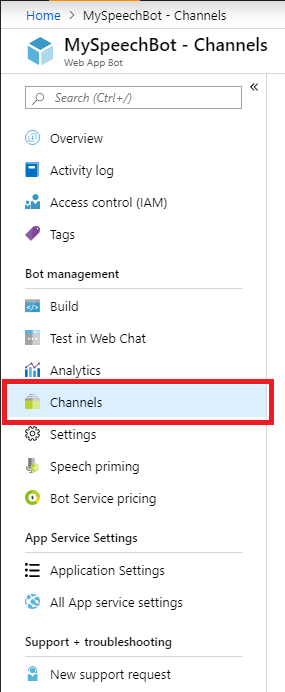
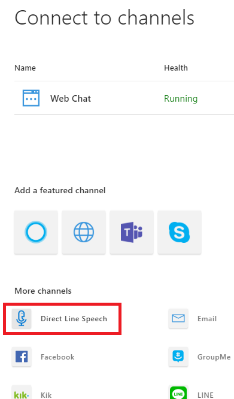
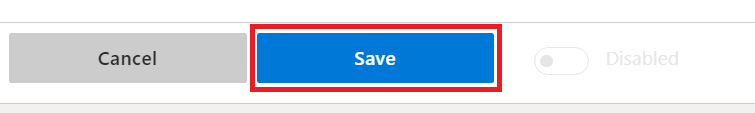
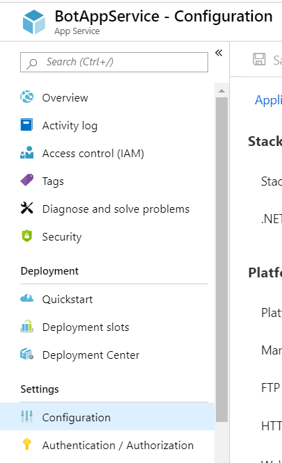
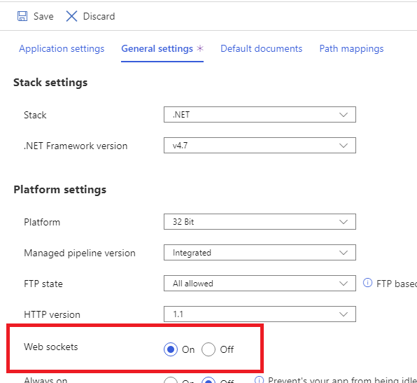
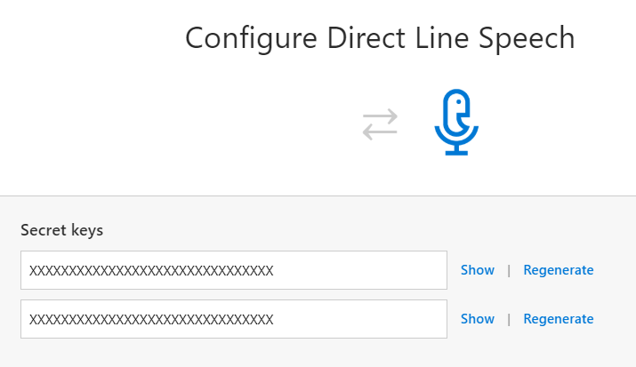

> [!NOTE]
> **PRE-PUBLISH NOTE TODO:** remove this note prior to actual publishing! This page will be published to the bot framework docs as a peer to [the Direct Line page](https://docs.microsoft.com/en-us/azure/bot-service/bot-service-channel-connect-directline?view=azure-bot-service-3.0). It's included here only to put it in preliminary source control/review.

# Connect a bot to Direct Line Speech (Preview)

You can configure your bot to allow client applications to communicate with it through the Direct Line Speech channel.

Once you have [built a Bot Framework bot with the Bot Builder SDK v4.5](https://aka.ms/botframework/4.5), onboarding your bot with Direct Line Speech will enable a low latency, high reliability connection with client applications using the [Cognitive Services Speech SDK](https://aka.ms/speech/sdk). These connections are optimized for voice in, voice out conversational experiences.

## Sign up for Direct Line Speech (Preview)

1. Direct Line Speech is currently in preview and requires a quick sign-up before using it. Please go to the [Direct Line Speech public preview page](https://aka.ms/directlinespeech/signup) to get in touch and get access.

## Add the Direct Line Speech channel

1. To add the Direct Line Speech Channel, first open the bot in the [Azure Portal](https://portal.azure.com), and click on **Channels** in the configuration blade.

    

1. In the channel selection page, find and click `Direct Line Speech` to choose the channel.

    

    > [!NOTE]
    > Direct Line Speech is in preview and requires [sign-up](https://aka.ms/directlinespeech/signup). If you don't see the Direct Line Speech channel available in the channel selection page, please ensure you've completed registration and received approval using your active Azure Portal account.

1. This will take you to a configuration page for Direct Line Speech. Once you've reviewed the terms of use, click `Save` to confirm your channel selection.

    

## Enable the Bot Framework Streaming Protocol

With the Direct Line Speech channel connected to your bot, you now need to enable Bot Framework Streaming Protocol support for optimal low-latency interaction.

1. First, navigate to the **App Service** for your bot in the [Azure Portal](https://portal.azure.com) and click on **Settings** in the configuration blade.

    > [!NOTE]
    > This setting is under the **App Service** supporting your bot, not the bot itself.

    

1. Click on `General settings` and then select the option to enable `Web socket` support.

    

1. Click `Save` at the top of the configuration page. The Bot Framework Streaming Protocol is now enabled for your bot.

## Manage secret keys

Client applications will need a channel secret to connect to your bot through the Direct Line Speech channel. Once you've saved your channel selection, you can retrieve these secret keys from the **Configure Direct Line Speech** page in the Azure Portal.

## Adding protocol support to your bot

With the Direct Line Speech channel connected and support for the Bot Framework Streaming Protocol enabled, all that's left is to add code to your bot to support the optimized communication. Follow the instructions on [adding Streaming protocol support to your bot](https://aka.ms/botframework/addstreamingprotocolsupport) to ensure full compatibility with Direct Line Speech.
