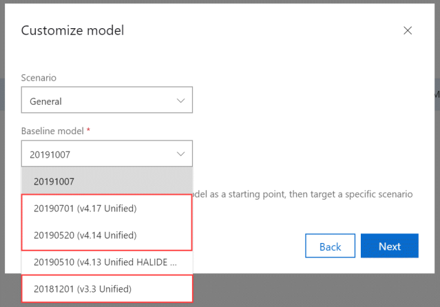
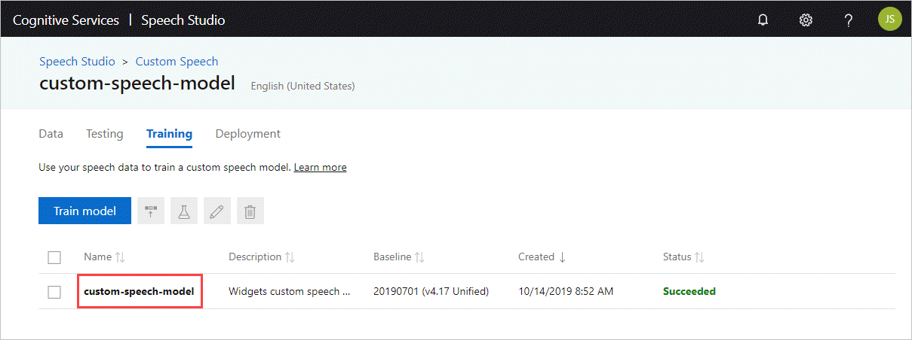
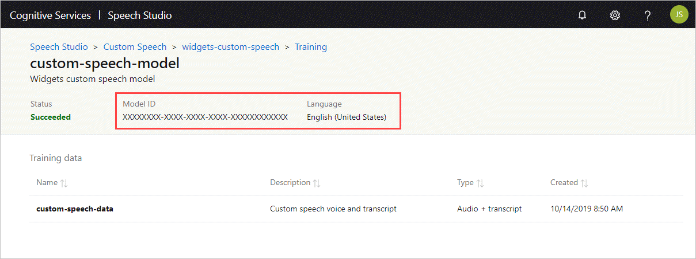
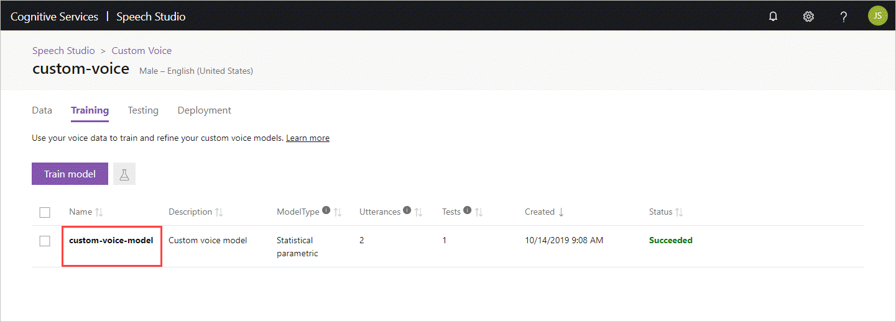
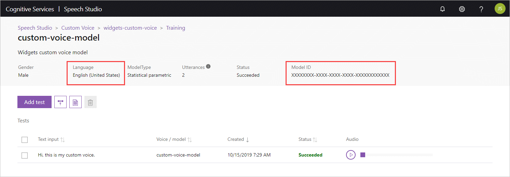

# Install and run Speech service containers (Preview)

Containers enable you to run some of the Speech service APIs in your own environment. Containers are great for specific security and data governance requirements. In this article you'll learn how to download, install, and run a Speech container.

Speech containers enable customers to build a speech application architecture that is optimized for both robust cloud capabilities and edge locality. There are four different containers available. The two standard containers are **Speech-to-text** and **Text-to-speech**. The two custom containers are **Custom Speech-to-text** and **Custom Text-to-speech**. Speech containers have the same [pricing](https://azure.microsoft.com/pricing/details/cognitive-services/speech-services/) as the cloud-based Azure Speech Services.

> [!IMPORTANT]
> All speech containers are currently offered as part of a [Public "Gated" Preview](../cognitive-services-container-support.md#container-availability-in-azure-cognitive-services). An announcement will be made when speech containers progress to General Availability (GA).

| Function | Features | Latest |
|--|--|--|
| Speech-to-text | Analyzes sentiment and transcribes continuous real-time speech or batch audio recordings with intermediate results.  | 2.2.0 |
| Custom Speech-to-text | Using a custom model from the [Custom Speech portal](https://speech.microsoft.com/customspeech), transcribes continuous real-time speech or batch audio recordings into text with intermediate results. | 2.2.0 |
| Text-to-speech | Converts text to natural-sounding speech with plain text input or Speech Synthesis Markup Language (SSML). | 1.4.0 |
| Custom Text-to-speech | Using a custom model from the [Custom Voice portal](https://aka.ms/custom-voice-portal), converts text to natural-sounding speech with plain text input or Speech Synthesis Markup Language (SSML). | 1.4.0 |

If you don't have an Azure subscription, create a [free account](https://azure.microsoft.com/free/?WT.mc_id=A261C142F) before you begin.

## Prerequisites

The following prerequisites before using Speech containers:

| Required | Purpose |
|--|--|
| Docker Engine | You need the Docker Engine installed on a [host computer](#the-host-computer). Docker provides packages that configure the Docker environment on [macOS](https://docs.docker.com/docker-for-mac/), [Windows](https://docs.docker.com/docker-for-windows/), and [Linux](https://docs.docker.com/engine/installation/#supported-platforms). For a primer on Docker and container basics, see the [Docker overview](https://docs.docker.com/engine/docker-overview/).<br><br> Docker must be configured to allow the containers to connect with and send billing data to Azure. <br><br> **On Windows**, Docker must also be configured to support Linux containers.<br><br> |
| Familiarity with Docker | You should have a basic understanding of Docker concepts, like registries, repositories, containers, and container images, as well as knowledge of basic `docker` commands. |
| Speech resource | In order to use these containers, you must have:<br><br>An Azure _Speech_ resource to get the associated API key and endpoint URI. Both values are available on the Azure portal's **Speech** Overview and Keys pages. They are both required to start the container.<br><br>**{API_KEY}**: One of the two available resource keys on the **Keys** page<br><br>**{ENDPOINT_URI}**: The endpoint as provided on the **Overview** page |

## Request access to the container registry

Fill out and submit the [request form](https://aka.ms/cognitivegate) to request access to the container. 


[!INCLUDE [Request access to the container registry](../../../includes/cognitive-services-containers-request-access-only.md)]

[!INCLUDE [Authenticate to the container registry](../../../includes/cognitive-services-containers-access-registry.md)]

[!INCLUDE [Gathering required parameters](../containers/includes/container-gathering-required-parameters.md)]

## The host computer

[!INCLUDE [Host Computer requirements](../../../includes/cognitive-services-containers-host-computer.md)]

### Advanced Vector Extension support

The **host** is the computer that runs the docker container. The host *must support* [Advanced Vector Extensions](https://en.wikipedia.org/wiki/Advanced_Vector_Extensions#CPUs_with_AVX2) (AVX2). You can check for AVX2 support on Linux hosts with the following command:

```console
grep -q avx2 /proc/cpuinfo && echo AVX2 supported || echo No AVX2 support detected
```
> [!WARNING]
> The host computer is *required* to support AVX2. The container *will not* function correctly without AVX2 support.

### Container requirements and recommendations

The following table describes the minimum and recommended allocation of resources for each Speech container.

# [Speech-to-text](#tab/stt)

| Container | Minimum | Recommended |
|-----------|---------|-------------|
| Speech-to-text | 2 core, 2-GB memory | 4 core, 4-GB memory |

# [Custom Speech-to-text](#tab/cstt)

| Container | Minimum | Recommended |
|-----------|---------|-------------|
| Custom Speech-to-text | 2 core, 2-GB memory | 4 core, 4-GB memory |

# [Text-to-speech](#tab/tts)

| Container | Minimum | Recommended |
|-----------|---------|-------------|
| Text-to-speech | 1 core, 2-GB memory | 2 core, 3-GB memory |

# [Custom Text-to-speech](#tab/ctts)

| Container | Minimum | Recommended |
|-----------|---------|-------------|
| Custom Text-to-speech | 1 core, 2-GB memory | 2 core, 3-GB memory |

***

* Each core must be at least 2.6 gigahertz (GHz) or faster.

Core and memory correspond to the `--cpus` and `--memory` settings, which are used as part of the `docker run` command.

> [!NOTE]
> The minimum and recommended are based off of Docker limits, *not* the host machine resources. For example, speech-to-text containers memory map portions of a large language model, and it is *recommended* that the entire file fits in memory, which is an additional 4-6 GB. Also, the first run of either container may take longer, since models are being paged into memory.

## Get the container image with `docker pull`

Container images for Speech are available in the following Container Registry.

# [Speech-to-text](#tab/stt)

| Container | Repository |
|-----------|------------|
| Speech-to-text | `containerpreview.azurecr.io/microsoft/cognitive-services-speech-to-text:latest` |

# [Custom Speech-to-text](#tab/cstt)

| Container | Repository |
|-----------|------------|
| Custom Speech-to-text | `containerpreview.azurecr.io/microsoft/cognitive-services-custom-speech-to-text:latest` |

# [Text-to-speech](#tab/tts)

| Container | Repository |
|-----------|------------|
| Text-to-speech | `containerpreview.azurecr.io/microsoft/cognitive-services-text-to-speech:latest` |

# [Custom Text-to-speech](#tab/ctts)

| Container | Repository |
|-----------|------------|
| Custom Text-to-speech | `containerpreview.azurecr.io/microsoft/cognitive-services-custom-text-to-speech:latest` |

***

[!INCLUDE [Tip for using docker list](../../../includes/cognitive-services-containers-docker-list-tip.md)]

### Docker pull for the Speech containers

# [Speech-to-text](#tab/stt)

#### Docker pull for the Speech-to-text container

Use the [docker pull](https://docs.docker.com/engine/reference/commandline/pull/) command to download a container image from Container Preview registry.

```Docker
docker pull containerpreview.azurecr.io/microsoft/cognitive-services-speech-to-text:latest
```

> [!IMPORTANT]
> The `latest` tag pulls the `en-US` locale. For additional locales see [Speech-to-text locales](#speech-to-text-locales).

#### Speech-to-text locales

All tags, except for `latest` are in the following format and are case-sensitive:

```
<major>.<minor>.<patch>-<platform>-<locale>-<prerelease>
```

The following tag is an example of the format:

```
2.2.0-amd64-en-us-preview
```

For all of the supported locales of the **speech-to-text** container, please see [Speech-to-text image tags](../containers/container-image-tags.md#speech-to-text).

# [Custom Speech-to-text](#tab/cstt)

#### Docker pull for the Custom Speech-to-text container

Use the [docker pull](https://docs.docker.com/engine/reference/commandline/pull/) command to download a container image from Container Preview registry.

```Docker
docker pull containerpreview.azurecr.io/microsoft/cognitive-services-custom-speech-to-text:latest
```

> [!NOTE]
> The `locale` and `voice` for custom Speech containers is determined by the custom model ingested by the container.

# [Text-to-speech](#tab/tts)

#### Docker pull for the Text-to-speech container

Use the [docker pull](https://docs.docker.com/engine/reference/commandline/pull/) command to download a container image from Container Preview registry.

```Docker
docker pull containerpreview.azurecr.io/microsoft/cognitive-services-text-to-speech:latest
```

> [!IMPORTANT]
> The `latest` tag pulls the `en-US` locale and `jessarus` voice. For additional locales see [Text-to-speech locales](#text-to-speech-locales).

#### Text-to-speech locales

All tags, except for `latest` are in the following format and are case-sensitive:

```
<major>.<minor>.<patch>-<platform>-<locale>-<voice>-<prerelease>
```

The following tag is an example of the format:

```
1.3.0-amd64-en-us-jessarus-preview
```

For all of the supported locales and corresponding voices of the **text-to-speech** container, please see [Text-to-speech image tags](../containers/container-image-tags.md#text-to-speech).

> [!IMPORTANT]
> When constructing a *Standard Text-to-speech* HTTP POST, the [Speech Synthesis Markup Language (SSML)](speech-synthesis-markup.md) message requires a `voice` element with a `name` attribute. The value is the corresponding container locale and voice, also known as the ["short name"](language-support.md#standard-voices). For example, the `latest` tag would have a voice name of `en-US-JessaRUS`.

# [Custom Text-to-speech](#tab/ctts)

#### Docker pull for the Custom Text-to-speech container

Use the [docker pull](https://docs.docker.com/engine/reference/commandline/pull/) command to download a container image from Container Preview registry.

```Docker
docker pull containerpreview.azurecr.io/microsoft/cognitive-services-custom-text-to-speech:latest
```

> [!NOTE]
> The `locale` and `voice` for custom Speech containers is determined by the custom model ingested by the container.

***

## How to use the container

Once the container is on the [host computer](#the-host-computer), use the following process to work with the container.

1. [Run the container](#run-the-container-with-docker-run), with the required billing settings. More [examples](speech-container-configuration.md#example-docker-run-commands) of the `docker run` command are available.
1. [Query the container's prediction endpoint](#query-the-containers-prediction-endpoint).

## Run the container with `docker run`

Use the [docker run](https://docs.docker.com/engine/reference/commandline/run/) command to run the container. Refer to [gathering required parameters](#gathering-required-parameters) for details on how to get the `{Endpoint_URI}` and `{API_Key}` values. Additional [examples](speech-container-configuration.md#example-docker-run-commands) of the `docker run` command are also available.

# [Speech-to-text](#tab/stt)

To run the *Speech-to-text* container, execute the following `docker run` command.

```bash
docker run --rm -it -p 5000:5000 --memory 4g --cpus 4 \
containerpreview.azurecr.io/microsoft/cognitive-services-speech-to-text \
Eula=accept \
Billing={ENDPOINT_URI} \
ApiKey={API_KEY}
```

This command:

* Runs a *Speech-to-text* container from the container image.
* Allocates 4 CPU cores and 4 gigabytes (GB) of memory.
* Exposes TCP port 5000 and allocates a pseudo-TTY for the container.
* Automatically removes the container after it exits. The container image is still available on the host computer.


#### Analyze sentiment on the speech-to-text output 

Starting in v2.2.0 of the speech-to-text container, you can call the [sentiment analysis v3 API](../text-analytics/how-tos/text-analytics-how-to-sentiment-analysis.md) on the output. To call sentiment analysis, you will need a Text Analytics API resource endpoint. For example: 
* `https://westus2.api.cognitive.microsoft.com/text/analytics/v3.0-preview.1/sentiment`
* `https://localhost:5000/text/analytics/v3.0-preview.1/sentiment`

If you're accessing a Text analytics endpoint in the cloud, you will need a key. If you're running Text Analytics locally, you may not need to provide this.

The key and endpoint are passed to the Speech container as arguments, as in the following example.

```bash
docker run -it --rm -p 5000:5000 \
containerpreview.azurecr.io/microsoft/cognitive-services-speech-to-text:latest \
Eula=accept \
Billing={ENDPOINT_URI} \
ApiKey={API_KEY} \
CloudAI:SentimentAnalysisSettings:TextAnalyticsHost={TEXT_ANALYTICS_HOST} \
CloudAI:SentimentAnalysisSettings:SentimentAnalysisApiKey={SENTIMENT_APIKEY}
```

This command:

* Performs the same steps as the command above.
* Stores a Text Analytics API endpoint and key, for sending sentiment analysis requests. 


# [Custom Speech-to-text](#tab/cstt)

The *Custom Speech-to-text* container relies on a custom speech model. The custom model has to have been [trained](how-to-custom-speech-train-model.md) using the [custom speech portal](https://speech.microsoft.com/customspeech).

> [!IMPORTANT]
> The Custom Speech model needs to be trained from one of the following model versions:
> * **20181201 (v3.3 Unified)**
> * **20190520 (v4.14 Unified)**
> * **20190701 (v4.17 Unified)**<br>
> 

The custom speech **Model ID** is required to run the container. It can be found on the **Training** page of the custom speech portal. From the custom speech portal, navigate to the **Training** page and select the model.
<br>



Obtain the **Model ID** to use as the argument to the `ModelId` parameter of the `docker run` command.
<br>



The following table represents the various `docker run` parameters and their corresponding descriptions:

| Parameter | Description |
|---------|---------|
| `{VOLUME_MOUNT}` | The host computer [volume mount](https://docs.docker.com/storage/volumes/), which docker uses to persist the custom model. For example, *C:\CustomSpeech* where the *C drive* is located on the host machine. |
| `{MODEL_ID}` | The Custom Speech **Model ID** from the **Training** page of the custom speech portal. |
| `{ENDPOINT_URI}` | The endpoint is required for metering and billing. For more information, see [gathering required parameters](#gathering-required-parameters). |
| `{API_KEY}` | The API key is required. For more information, see [gathering required parameters](#gathering-required-parameters). |

To run the *Custom Speech-to-text* container, execute the following `docker run` command:

```bash
docker run --rm -it -p 5000:5000 --memory 4g --cpus 4 \
-v {VOLUME_MOUNT}:/usr/local/models \
containerpreview.azurecr.io/microsoft/cognitive-services-custom-speech-to-text \
ModelId={MODEL_ID} \
Eula=accept \
Billing={ENDPOINT_URI} \
ApiKey={API_KEY}
```

This command:

* Runs a *Custom Speech-to-text* container from the container image.
* Allocates 4 CPU cores and 4 gigabytes (GB) of memory.
* Loads the *Custom Speech-to-Text* model from the volume input mount, for example *C:\CustomSpeech*.
* Exposes TCP port 5000 and allocates a pseudo-TTY for the container.
* Downloads the model given the `ModelId` (if not found on the volume mount).
* If the custom model was previously downloaded, the `ModelId` is ignored.
* Automatically removes the container after it exits. The container image is still available on the host computer.

# [Text-to-speech](#tab/tts)

To run the *Text-to-speech* container, execute the following `docker run` command.

```bash
docker run --rm -it -p 5000:5000 --memory 2g --cpus 1 \
containerpreview.azurecr.io/microsoft/cognitive-services-text-to-speech \
Eula=accept \
Billing={ENDPOINT_URI} \
ApiKey={API_KEY}
```

This command:

* Runs a *Text-to-speech* container from the container image.
* Allocates 2 CPU cores and one gigabyte (GB) of memory.
* Exposes TCP port 5000 and allocates a pseudo-TTY for the container.
* Automatically removes the container after it exits. The container image is still available on the host computer.

# [Custom Text-to-speech](#tab/ctts)

The *Custom Text-to-speech* container relies on a custom voice model. The custom model has to have been [trained](how-to-custom-voice-create-voice.md) using the [custom voice portal](https://aka.ms/custom-voice-portal). The custom voice **Model ID** is required to run the container. It can be found on the **Training** page of the custom voice portal. From the custom voice portal, navigate to the **Training** page and select the model.
<br>



Obtain the **Model ID** to use as the argument to the `ModelId` parameter of the docker run command.
<br>



The following table represents the various `docker run` parameters and their corresponding descriptions:

| Parameter | Description |
|---------|---------|
| `{VOLUME_MOUNT}` | The host computer [volume mount](https://docs.docker.com/storage/volumes/), which docker uses to persist the custom model. For example, *C:\CustomSpeech* where the *C drive* is located on the host machine. |
| `{MODEL_ID}` | The Custom Speech **Model ID** from the **Training** page of the custom voice portal. |
| `{ENDPOINT_URI}` | The endpoint is required for metering and billing. For more information, see [gathering required parameters](#gathering-required-parameters). |
| `{API_KEY}` | The API key is required. For more information, see [gathering required parameters](#gathering-required-parameters). |

To run the *Custom Text-to-speech* container, execute the following `docker run` command:

```bash
docker run --rm -it -p 5000:5000 --memory 2g --cpus 1 \
-v {VOLUME_MOUNT}:/usr/local/models \
containerpreview.azurecr.io/microsoft/cognitive-services-custom-text-to-speech \
ModelId={MODEL_ID} \
Eula=accept \
Billing={ENDPOINT_URI} \
ApiKey={API_KEY}
```

This command:

* Runs a *Custom Text-to-speech* container from the container image.
* Allocates 2 CPU cores and one gigabyte (GB) of memory.
* Loads the *Custom Text-to-speech* model from the volume input mount, for example *C:\CustomVoice*.
* Exposes TCP port 5000 and allocates a pseudo-TTY for the container.
* Downloads the model given the `ModelId` (if not found on the volume mount).
* If the custom model was previously downloaded, the `ModelId` is ignored.
* Automatically removes the container after it exits. The container image is still available on the host computer.

***

> [!IMPORTANT]
> The `Eula`, `Billing`, and `ApiKey` options must be specified to run the container; otherwise, the container won't start.  For more information, see [Billing](#billing).

## Query the container's prediction endpoint

> [!NOTE]
> Use a unique port number if you're running multiple containers.

| Containers | SDK Host URL | Protocol |
|--|--|--|
| Speech-to-text and Custom Speech-to-text | `ws://localhost:5000` | WS |
| Text-to-speech and Custom Text-to-speech | `http://localhost:5000` | HTTP |

For more information on using WSS and HTTPS protocols, see [container security](../cognitive-services-container-support.md#azure-cognitive-services-container-security).

[!INCLUDE [Query Speech-to-text container endpoint](includes/speech-to-text-container-query-endpoint.md)]

#### Analyze sentiment

If you provided your Text Analytics API credentials [to the container](#analyze-sentiment-on-the-speech-to-text-output), you can use the Speech SDK to send speech recognition requests with sentiment analysis. You can configure the API responses to use either a *simple* or *detailed* format.

# [Simple format](#tab/simple-format)

To configure the Speech client to use a simple format, add `"Sentiment"` as a value for `Simple.Extensions`. If you want to choose a specific Text Analytics model version, replace `'latest'` in the `speechcontext-phraseDetection.sentimentAnalysis.modelversion` property configuration.

```python
speech_config.set_service_property(
    name='speechcontext-PhraseOutput.Simple.Extensions',
    value='["Sentiment"]',
    channel=speechsdk.ServicePropertyChannel.UriQueryParameter
)
speech_config.set_service_property(
    name='speechcontext-phraseDetection.sentimentAnalysis.modelversion',
    value='latest',
    channel=speechsdk.ServicePropertyChannel.UriQueryParameter
)
```

`Simple.Extensions` will return the sentiment result in root layer of the response.

```json
{
   "DisplayText":"What's the weather like?",
   "Duration":13000000,
   "Id":"6098574b79434bd4849fee7e0a50f22e",
   "Offset":4700000,
   "RecognitionStatus":"Success",
   "Sentiment":{
      "Negative":0.03,
      "Neutral":0.79,
      "Positive":0.18
   }
}
```

# [Detailed format](#tab/detailed-format)

To configure the Speech client to use a detailed format, add `"Sentiment"` as a value for `Detailed.Extensions`, `Detailed.Options`, or both. If you want to choose a specific Text Analytics model version, replace `'latest'` in the `speechcontext-phraseDetection.sentimentAnalysis.modelversion` property configuration.

```python
speech_config.set_service_property(
    name='speechcontext-PhraseOutput.Detailed.Options',
    value='["Sentiment"]',
    channel=speechsdk.ServicePropertyChannel.UriQueryParameter
)
speech_config.set_service_property(
    name='speechcontext-PhraseOutput.Detailed.Extensions',
    value='["Sentiment"]',
    channel=speechsdk.ServicePropertyChannel.UriQueryParameter
)
speech_config.set_service_property(
    name='speechcontext-phraseDetection.sentimentAnalysis.modelversion',
    value='latest',
    channel=speechsdk.ServicePropertyChannel.UriQueryParameter
)
```

`Detailed.Extensions` provides sentiment result in the root layer of the response. `Detailed.Options` provides the result in `NBest` layer of the response. They can be used separately or together.

```json
{
   "DisplayText":"What's the weather like?",
   "Duration":13000000,
   "Id":"6a2aac009b9743d8a47794f3e81f7963",
   "NBest":[
      {
         "Confidence":0.973695,
         "Display":"What's the weather like?",
         "ITN":"what's the weather like",
         "Lexical":"what's the weather like",
         "MaskedITN":"What's the weather like",
         "Sentiment":{
            "Negative":0.03,
            "Neutral":0.79,
            "Positive":0.18
         }
      },
      {
         "Confidence":0.9164971,
         "Display":"What is the weather like?",
         "ITN":"what is the weather like",
         "Lexical":"what is the weather like",
         "MaskedITN":"What is the weather like",
         "Sentiment":{
            "Negative":0.02,
            "Neutral":0.88,
            "Positive":0.1
         }
      }
   ],
   "Offset":4700000,
   "RecognitionStatus":"Success",
   "Sentiment":{
      "Negative":0.03,
      "Neutral":0.79,
      "Positive":0.18
   }
}
```

---

If you want to completely disable sentiment analysis, add a `false` value to `sentimentanalysis.enabled`.

```python
speech_config.set_service_property(
    name='speechcontext-phraseDetection.sentimentanalysis.enabled',
    value='false',
    channel=speechsdk.ServicePropertyChannel.UriQueryParameter
)
```

### Text-to-speech or Custom Text-to-speech

[!INCLUDE [Query Text-to-speech container endpoint](includes/text-to-speech-container-query-endpoint.md)]

### Run multiple containers on the same host

If you intend to run multiple containers with exposed ports, make sure to run each container with a different exposed port. For example, run the first container on port 5000 and the second container on port 5001.

You can have this container and a different Azure Cognitive Services container running on the HOST together. You also can have multiple containers of the same Cognitive Services container running.

[!INCLUDE [Validate container is running - Container's API documentation](../../../includes/cognitive-services-containers-api-documentation.md)]

## Stop the container

[!INCLUDE [How to stop the container](../../../includes/cognitive-services-containers-stop.md)]

## Troubleshooting

When starting or running the container, you may experience issues. Use an output [mount](speech-container-configuration.md#mount-settings) and enable logging. Doing so will allow the container to generate log files that are helpful when troubleshooting issues.

[!INCLUDE [Cognitive Services FAQ note](../containers/includes/cognitive-services-faq-note.md)]

## Billing

The Speech containers send billing information to Azure, using a *Speech* resource on your Azure account.

[!INCLUDE [Container's Billing Settings](../../../includes/cognitive-services-containers-how-to-billing-info.md)]

For more information about these options, see [Configure containers](speech-container-configuration.md).

<!--blogs/samples/video courses -->

[!INCLUDE [Discoverability of more container information](../../../includes/cognitive-services-containers-discoverability.md)]

## Summary

In this article, you learned concepts and workflow for downloading, installing, and running Speech containers. In summary:

* Speech provides four Linux containers for Docker, encapsulating various capabilities:
  * *Speech-to-text*
  * *Custom Speech-to-text*
  * *Text-to-speech*
  * *Custom Text-to-speech*
* Container images are downloaded from the container registry in Azure.
* Container images run in Docker.
* Whether using the REST API (Text-to-speech only) or the SDK (Speech-to-text or Text-to-speech) you specify the host URI of the container. 
* You're required to provide billing information when instantiating a container.

> [!IMPORTANT]
>  Cognitive Services containers are not licensed to run without being connected to Azure for metering. Customers need to enable the containers to communicate billing information with the metering service at all times. Cognitive Services containers do not send customer data (e.g., the image or text that is being analyzed) to Microsoft.

## Next steps

* Review [configure containers](speech-container-configuration.md) for configuration settings
* Learn how to [use Speech service containers with Kubernetes and Helm](speech-container-howto-on-premises.md)
* Use more [Cognitive Services containers](../cognitive-services-container-support.md)
