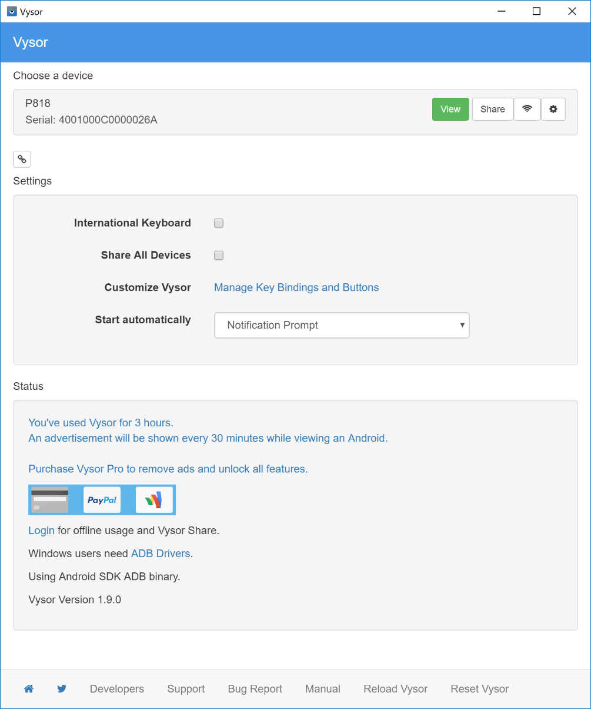
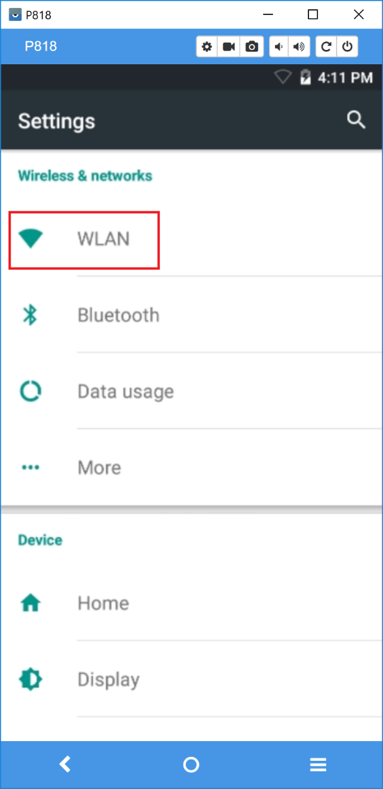
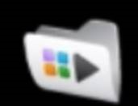
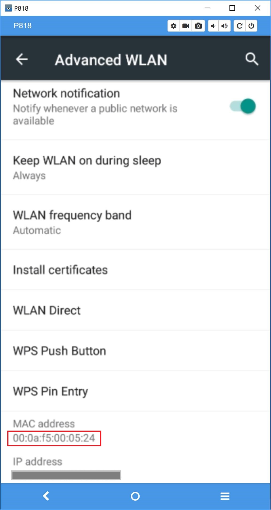
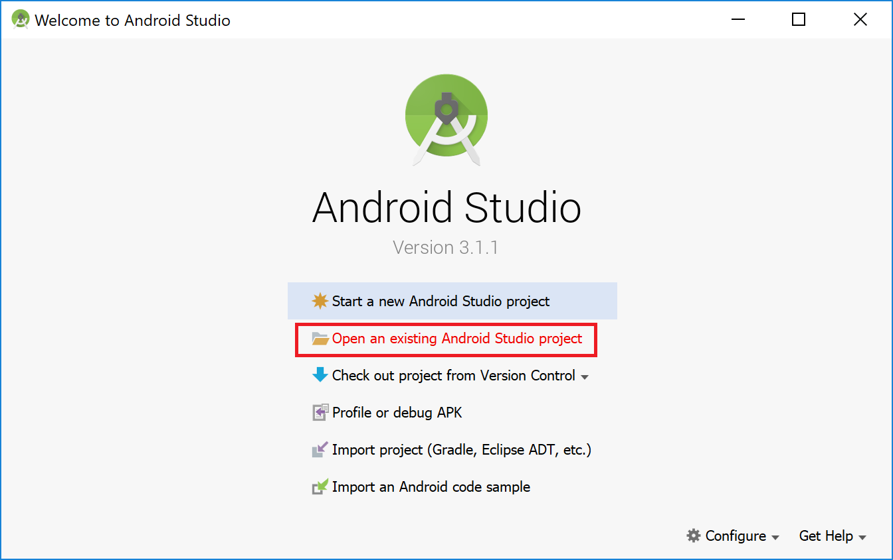
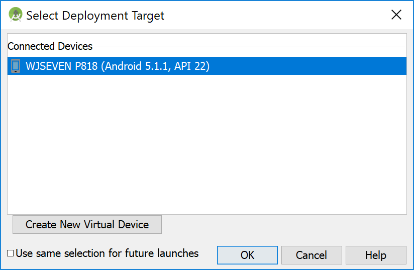
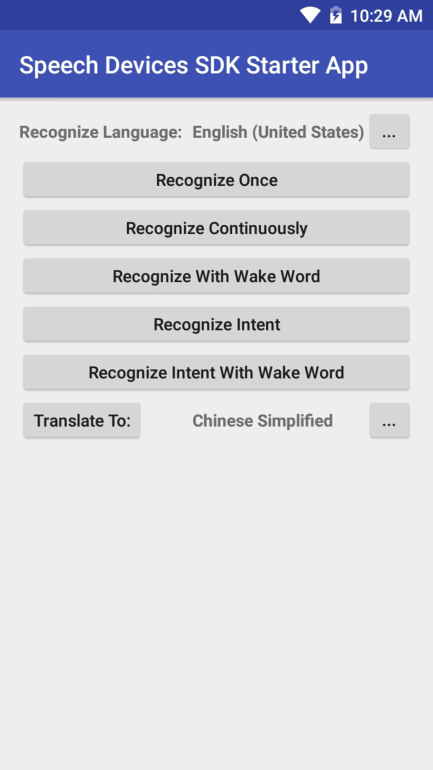
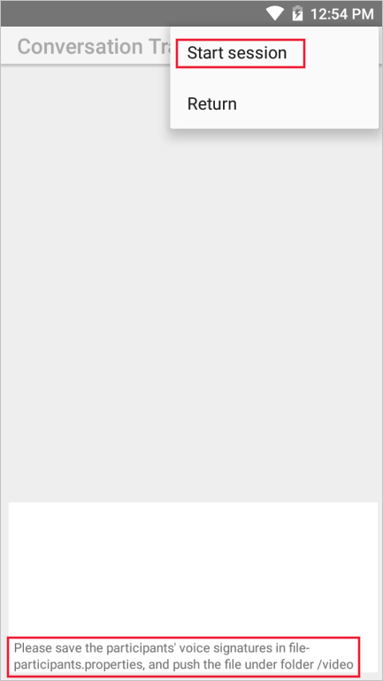

# Quickstart: Run the Speech Devices SDK sample app on Android

In this quickstart, you'll learn how to use the Speech Devices SDK for Android to build a speech-enabled product or use it as a [Conversation Transcription](conversation-transcription-service.md) device.

This guide requires an [Azure Cognitive Services](get-started.md) account with a Speech Services resource. If you don't have an account, you can use the [free trial](https://azure.microsoft.com/try/cognitive-services/) to get a subscription key.

The source code for the sample application is included with the Speech Devices SDK. It's also [available on GitHub](https://github.com/Azure-Samples/Cognitive-Services-Speech-Devices-SDK).

## Prerequisites

Before you start using the Speech Devices SDK, you'll need to:

* Follow the instructions provided with your [development kit](get-speech-devices-sdk.md) to power on the device.

* Download the latest version of the [Speech Devices SDK](https://aka.ms/sdsdk-download), and extract the .zip to your working directory.
   > [!NOTE]
   > The Android-Sample-Release.zip file includes the Android sample app and this quickstart assumes that the app is extracted to C:\SDSDK\Android-Sample-Release

* To get an [Azure subscription key for Speech Services](get-started.md)

* If you plan to use the Conversation Transcription you must use a [circular microphone device](get-speech-devices-sdk.md) and this feature is currently only available for "en-US" and "zh-CN" in regions, “centralus” and “eastasia”. You must have a speech key in one of those regions to use Conversation Transcription.

* If you plan to use the Speech Services to identify intents (or actions) from user utterances, you'll need a [Language Understanding Service (LUIS)](https://docs.microsoft.com/azure/cognitive-services/luis/azureibizasubscription) subscription. To learn more about LUIS and intent recognition, see [Recognize speech intents with LUIS, C#](https://docs.microsoft.com/azure/cognitive-services/speech-service/how-to-recognize-intents-from-speech-csharp).

    You can [create a simple LUIS model](https://docs.microsoft.com/azure/cognitive-services/luis/) or use the sample LUIS model, LUIS-example.json. The sample LUIS model is available from the [Speech Devices SDK download site](https://aka.ms/sdsdk-luis). To upload your model's JSON file to the [LUIS portal](https://www.luis.ai/home), select **Import new app**, and then select the JSON file.

* Install [Android Studio](https://developer.android.com/studio/) and [Vysor](https://vysor.io/download/) on your PC.

## Set up the device

1. Start Vysor on your computer.

    

1. Your device should be listed under **Choose a device**. Select the **View** button next to the device.

1. Connect to your wireless network by selecting the folder icon, and then select **Settings** > **WLAN**.

    

    > [!NOTE]
    > If your company has policies about connecting devices to its Wi-Fi system, you need to obtain the MAC address and contact your IT department about how to connect it to your company's Wi-Fi.
    >
    > To find the MAC address of the dev kit, select the file folder icon on the desktop of the dev kit.
    >
    >  
    >
    > Select **Settings**. Search for "mac address", and then select **Mac address** > **Advanced WLAN**. Write down the MAC address that appears near the bottom of the dialog box.
    >
    > 
    >
    > Some companies might have a time limit on how long a device can be connected to their Wi-Fi system. You might need to extend the dev kit's registration with your Wi-Fi system after a specific number of days.

## Run the sample application

To validate your development kit setup, build and install the sample application:

1. Start Android Studio.

1. Select **Open an existing Android Studio project**.

   

1. Go to C:\SDSDK\Android-Sample-Release\example. Select **OK** to open the example project.

1. Add your speech subscription key to the source code. If you want to try intent recognition, also add your [Language Understanding service](https://azure.microsoft.com/services/cognitive-services/language-understanding-intelligent-service/) subscription key and application ID.

   For speech and LUIS, your information goes into MainActivity.java:

   ```java
    // Subscription
    private static String SpeechSubscriptionKey = "<enter your subscription info here>";
    private static String SpeechRegion = "westus"; // You can change this if your speech region is different.
    private static String LuisSubscriptionKey = "<enter your subscription info here>";
    private static String LuisRegion = "westus2"; // you can change this, if you want to test the intent, and your LUIS region is different.
    private static String LuisAppId = "<enter your LUIS AppId>";
   ```

    If you are using conversation transcription, your speech key and region information are also needed in conversation.java:

   ```java
    private static final String CTSKey = "<Conversation Transcription Service Key>";
    private static final String CTSRegion="<Conversation Transcription Service Region>";// Region may be "centralus" or "eastasia"
    ```

1. The default wake word (keyword) is "Computer". You can also try one of the other provided wake words, like "Machine" or "Assistant". The resource files for these alternate wake words are in the Speech Devices SDK, in the keyword folder. For example, C:\SDSDK\Android-Sample-Release\keyword\Computer contains the files used for the wake word "Computer".

   > [!TIP]
   > You can also [create a custom wake word](speech-devices-sdk-create-kws.md).

    To use a new wake word, update the following two lines in `MainActivity.java`, and copy the wake word package to your app. For example, to use the wake word 'Machine' from the wake word package kws-machine.zip:

   * Copy the wake word package into the folder “C:\SDSDK\Android-Sample-Release\example\app\src\main\assets\”.
   * Update the `MainActivity.java` with the keyword and the package name:

     ```java
     private static final String Keyword = "Machine";
     private static final String KeywordModel = "kws-machine.zip" // set your own keyword package name.
     ```

1. Update the following lines, which contain the microphone array geometry settings:

   ```java
   private static final String DeviceGeometry = "Circular6+1";
   private static final String SelectedGeometry = "Circular6+1";
   ```

   This table lists supported values:

   |Variable|Meaning|Available values|
   |--------|-------|----------------|
   |`DeviceGeometry`|Physical mic configuration|For a circular dev kit: `Circular6+1` |
   |||For a linear dev kit: `Linear4`|
   |`SelectedGeometry`|Software mic configuration|For a circular dev kit that uses all mics: `Circular6+1`|
   |||For a circular dev kit that uses four mics: `Circular3+1`|
   |||For a linear dev kit that uses all mics: `Linear4`|
   |||For a linear dev kit that uses two mics: `Linear2`|

1. To build the application, on the **Run** menu, select **Run 'app'**. The **Select Deployment Target** dialog box appears.

1. Select your device, and then select **OK** to deploy the application to the device.

    

1. The Speech Devices SDK example application starts and displays the following options:

   

1. Try the new Conversation Transcription demo. Start transcribing with 'Start Session'. By default everyone is a guest. However, if you have participant’s voice signatures they can be put into a file `/video/participants.properties` on the device. To generate the voice signature, look at [Transcribe conversations (SDK)](how-to-use-conversation-transcription-service.md).

   

1. Experiment!

## Troubleshooting

   If you cannot connect to the Speech Device. Type the following command in a Command Prompt window. It will return a list of devices:

   ```powershell
    adb devices
   ```

   > [!NOTE]
   > This command uses the Android Debug Bridge, `adb.exe`, which is part of the Android Studio installation. This tool is located in C:\Users\[user name]\AppData\Local\Android\Sdk\platform-tools. You can add this directory to your path to make it more convenient to invoke `adb`. Otherwise, you must specify the full path to your installation of adb.exe in every command that invokes `adb`.
   >
   > If you see an error `no devices/emulators found` then check your USB cable is connected and ensure a high quality cable is used.
   >

## Next steps

> [!div class="nextstepaction"]
> [Review the release notes](devices-sdk-release-notes.md)
