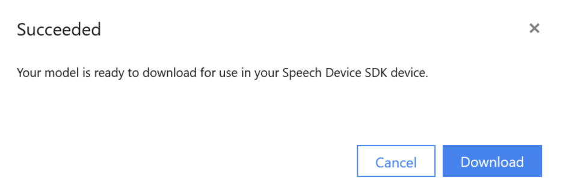

# Create a custom keyword by using the Speech service

Your device is always listening for a keyword (or phrase). For example, "Hey Cortana" is a keyword for the Cortana assistant. When the user says the keyword, the device sends all subsequent audio to the cloud, until the user stops speaking. Customizing your keyword is an effective way to differentiate your device and strengthen your branding.

In this article, you learn how to create a custom keyword for your device.

## Choose an effective keyword

Consider the following guidelines when you choose a keyword:

* Your keyword should be an English word or a phrase. It should take no longer than two seconds to say.

* Words of 4 to 7 syllables work best. For example, "Hey, Computer" is a good keyword. Just "Hey" is a poor one.

* Wake words should follow common English pronunciation rules.

* A unique or even a made-up word that follows common English pronunciation rules might reduce false positives. For example, "computerama" might be a good keyword.

* Do not choose a common word. For example, "eat" and "go" are words that people say frequently in ordinary conversation. They might be false triggers for your device.

* Avoid using a keyword that might have alternative pronunciations. Users would have to know the "right" pronunciation to get their device to respond. For example, "509" can be pronounced "five zero nine," "five oh nine," or "five hundred and nine." "R.E.I." can be pronounced "r-e-i" or "ray." "Live" can be pronounced "/līv/" or "/liv/".

* Do not use special characters, symbols, or digits. For example, "Go#" and "20 + cats" would not be good keywords. However, "go sharp" or "twenty plus cats" might work. You can still use the symbols in your branding and use marketing and documentation to reinforce the proper pronunciation.

> [!NOTE]
> If you choose a trademarked word as your keyword, be sure that you own that trademark or that you have permission from the trademark owner to use the word. Microsoft is not liable for any legal issues that might arise from your choice of keyword.

## Create your keyword

Before you can use a custom keyword with your device, you'll need to create a keyword with the Microsoft Custom Wake Word Generation service. After you provide a keyword, the service produces a file that you deploy to your development kit to enable the keyword on your device.

1. Go to the [Custom Speech Service Portal](https://aka.ms/sdsdk-speechportal) and **Sign in** or if you do not have a speech subscription choose [**Create a subscription**](https://go.microsoft.com/fwlink/?linkid=2086754)

    

1. At the [Custom Wake Word](https://aka.ms/sdsdk-wakewordportal) page type in the keyword of your choice and click **Add keyword**. We have some [guidelines](#choose-an-effective-keyword) to help choose an effective keyword. Currently we only support en-US language.

    

1. Three alternative pronunciations of your keyword will be created. You can choose all the pronunciations that you like. Then select **Submit** to generate the keyword. If you want to change the keyword please remove the existing one first, when you hover on the pronunciation line the delete icon will appear.

    

1. It might take up to one minute for the model to be generated. You will be prompted to download the file.

    

1. Save the .zip file to your computer. You will need this file to deploy your custom keyword to the development kit.

## Next steps

Test your custom keyword with [Speech Devices SDK Quickstart](https://aka.ms/sdsdk-quickstart).
