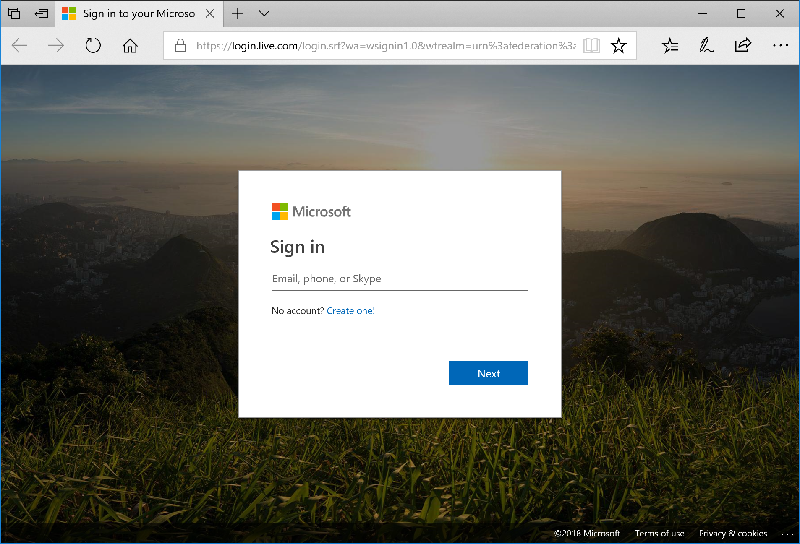
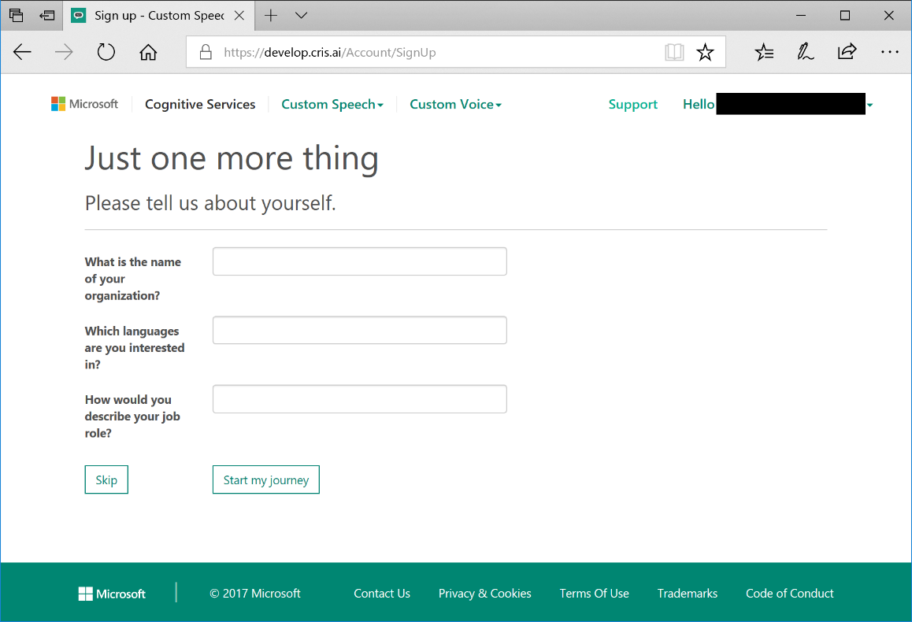
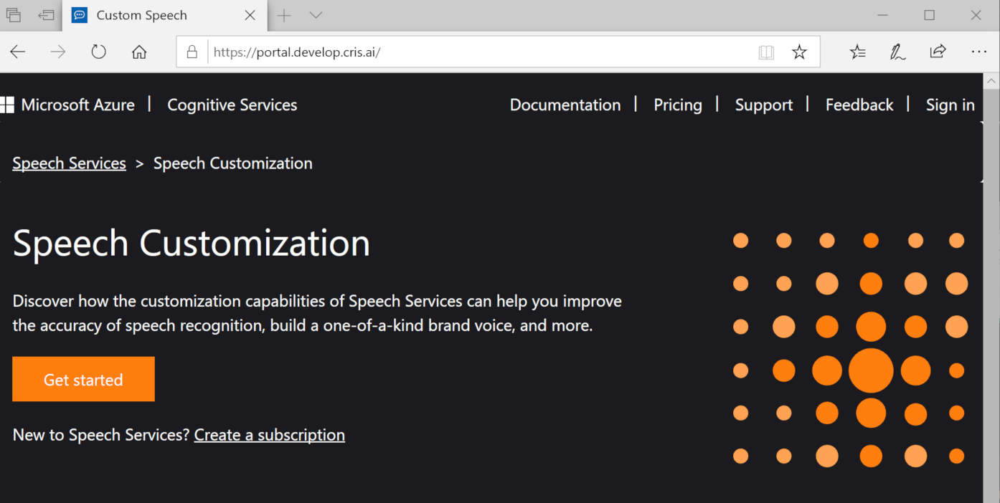
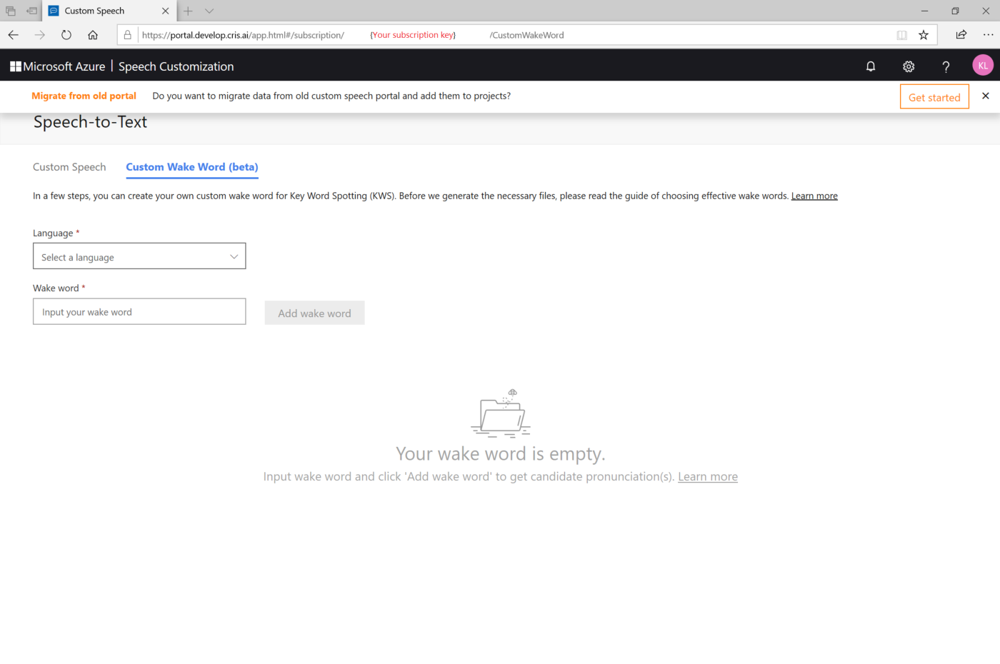
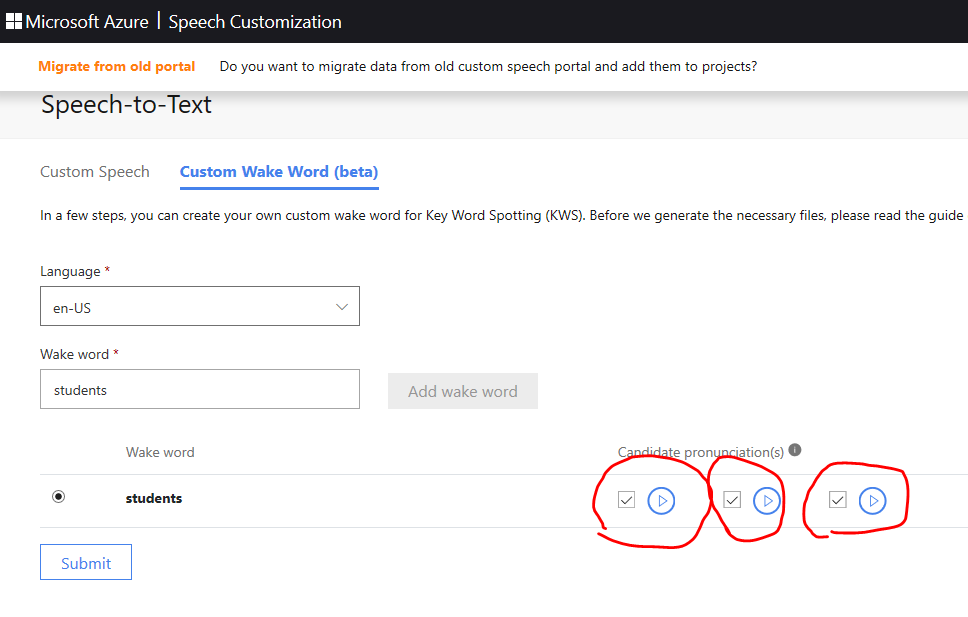

# Create a custom wake word by using the Speech service

Your device is always listening for a wake word (or phrase). For example, "Hey Cortana" is a wake word for the Cortana assistant. When the user says the wake word, the device sends all subsequent audio to the cloud, until the user stops speaking. Customizing your wake word is an effective way to differentiate your device and strengthen your branding.

In this article, you learn how to create a custom wake word for your device.

## Choose an effective wake word

Consider the following guidelines when you choose a wake word:

* Your wake word should be an English word or a phrase. It should take no longer than two seconds to say.

* Words of 4 to 7 syllables work best. For example, "Hey, Computer" is a good wake word. Just "Hey" is a poor one.

* Wake words should follow common English pronunciation rules.

* A unique or even a made-up word that follows common English pronunciation rules might reduce false positives. For example, "computerama" might be a good wake word.

* Do not choose a common word. For example, "eat" and "go" are words that people say frequently in ordinary conversation. They might be false triggers for your device.

* Avoid using a wake word that might have alternative pronunciations. Users would have to know the "right" pronunciation to get their device to respond. For example, "509" can be pronounced "five zero nine," "five oh nine," or "five hundred and nine." "R.E.I." can be pronounced "r-e-i" or "ray." "Live" can be pronounced "/līv/" or "/liv/".

* Do not use special characters, symbols, or digits. For example, "Go#" and "20 + cats" would not be good wake words. However, "go sharp" or "twenty plus cats" might work. You can still use the symbols in your branding and use marketing and documentation to reinforce the proper pronunciation.

> [!NOTE]
> If you choose a trademarked word as your wake word, be sure that you own that trademark or that you have permission from the trademark owner to use the word. Microsoft is not liable for any legal issues that might arise from your choice of wake word.

## Create your wake word

Before you can use a custom wake word with your device, you must create the wake word by using the Microsoft Custom Wake Word Generation service. After you provide a wake word, the service produces a file that you deploy to your development kit to enable your wake word on your device.

1. Go to the [Custom Speech service portal](https://cris.ai/).

1. Create a new account with the email address at which you received the invitation for Azure Active Directory. 

    
 
1.	After you sign in, fill out the form, and then select **Start my journey**.

    
 
1. The **Custom Wake Word** page is not available to the public, so there is no direct link that takes you there. The Custom Speech feature requires an Azure subscriptions, but the Custom Wake Word feature doesn't. If you got the **No Subscriptions found.** error page, just replace the **"Subscriptions?errorMessage=No%20Subscriptions%20found"** with "**customkws**" in the URL, and hit ENTER. The URL should be one of these: https://westus.cris.ai/customkws, https://eastasia.cris.ai/customkws or https://northeurope.cris.ai/customkws, depending on where your region is.

    
 
1. Type in the wake word of your choice, and then select **Submit the word**.

    
 
1. It might take a few minutes for the files to be generated. You should see a spinning circle in your browser window. After a moment, an information bar appears, asking you to download a .zip file.

    

1. Save the .zip file to your computer. You need this file to deploy the custom wake word to the development kit. To deploy the custom wake word, follow the instructions in [Get started with the Speech Devices SDK](speech-devices-sdk-qsg.md).

1. Select **Sign out.**

## Next steps

To get started, get a [free Azure account](https://azure.microsoft.com/free/) and sign up for the Speech Devices SDK.

> [!div class="nextstepaction"]
> [Sign up for the Speech Devices SDK](get-speech-devices-sdk.md)

