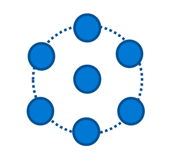
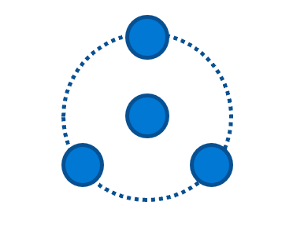

# Speech Devices SDK Microphone array recommendations

In this article, you learn how to design a microphone array for the Speech Devices SDK.

The Speech Devices SDK works best with a microphone array that has been designed according to the following guidelines, including the microphone geometry and component selection. Guidance is also given on integration and electrical considerations.

## Microphone geometry

The following array geometries are recommended for use with the Microsoft Audio Stack. Location of sound sources and rejection of ambient noise is improved with greater number of microphones with dependencies on specific applications, user scenarios, and the device form factor.

|     | Circular Array |     | Linear Array |     |
| --- | -------------- | --- | ------------ | --- |
|     |  |  |  |  |
| \# Mics | 7 | 4 | 4 | 2 |
| Geometry | 6 Outer, 1 Center, Radius = 42.5 mm, Evenly Spaced | 3 Outer, 1 Center, Radius = 42.5 mm, Evenly Spaced | Length = 120 mm, Spacing = 40 mm | Spacing = 40 mm |

Microphone channels should be ordered according to the numbering depicted for each above array, increasing from 0. The Microsoft Audio Stack will require an additional reference stream of audio playback to perform echo cancellation.

## Component selection

Microphone components should be selected to accurately reproduce a signal free of noise and distortion.

The recommended properties when selecting microphones are:

| Parameter | Recommended |
| --------- | ----------- |
| SNR | \>= 65 dB (1 kHz signal 94 dBSPL, A-weighted noise) |
| Amplitude Matching | ± 1 dB @ 1 kHz |
| Phase Matching | ± 2° @ 1 kHz |
| Acoustic Overload Point (AOP) | \>= 120 dBSPL (THD = 10%) |
| Bit Rate | Minimum 24-bit |
| Sampling Rate | Minimum 16 kHz\* |
| Frequency Response | ± 3 dB, 200-8000 Hz Floating Mask\* |
| Reliability | Storage Temperature Range -40°C to 70°C Operating Temperature Range -20°C to 55°C |

\*_Higher sampling rates or "wider" frequency ranges may be necessary
for high-quality communications (VoIP) applications_

Good component selection must be paired with good
electroacoustic integration in order to avoid impairing the performance
of the components used. Unique use cases may also necessitate additional
requirements (for example: operating temperature ranges).

## Microphone array integration

The performance of the microphone array when integrated into a device will differ from the component specification. It is important to ensure that the microphones are well matched after integration. Therefore the device performance measured after any fixed gain or EQ should meet the following recommendations:

| Parameter          | Recommended                                        |
| ------------------ | -------------------------------------------------- |
| SNR                | \> 63 dB (1 kHz signal 94 dBSPL, A-weighted noise) |
| Output Sensitivity | -26 dBFS/Pa @ 1 kHz (recommended)                  |
| Amplitude Matching | ± 2 dB, 200-8000 Hz                                |
| THD%\*             | ≤ 1%, 200-8000 Hz, 94 dBSPL, 5th Order             |
| Frequency Response | ± 6 dB, 200-8000 Hz Floating Mask\*\*              |

\*\*_A low distortion speaker is required to measure THD (e.g. Neumann KH120)_

\*\*_"Wider" frequency ranges may be necessary for high-quality communications (VoIP) applications_

## Speaker integration recommendations

As echo cancellation is necessary for speech recognition devices that
contain speakers, additional recommendations are provided for speaker
selection and integration.

| Parameter | Recommended |
| --------- | ----------- |
| Linearity Considerations | No non-linear processing after speaker reference, otherwise a hardware-based loopback reference stream is required |
| Speaker Loopback | Provided via WASAPI, private APIs, custom ALSA plug-in (Linux), or provided via firmware channel |
| THD% | 3rd Octave Bands minimum 5th Order, 70 dBA Playback @ 0.8 m ≤ 6.3%, 315-500 Hz ≤ 5%, 630-5000 Hz |
| Echo Coupling to Microphones | \> -10 dB TCLw using ITU-T G.122 Annex B.4 method, normalized to mic level TCLw = TCLwmeasured \+ (Measured Level - Target Output Sensitivity) TCLw = TCLwmeasured \+ (Measured Level - (-26)) |

## Integration design architecture

The following guidelines for architecture are necessary when integrating
microphones into a device:

| Parameter | Recommendation |
| --------- | -------------- |
| Mic Port Similarity | All microphone ports are same length in array |
| Mic Port Dimensions | Port size Ø0.8-1.0 mm. Port Length / Port Diameter \< 2 |
| Mic Sealing         | Sealing gaskets uniformly implemented in stack-up. Recommend \> 70% compression ratio for foam gaskets |
| Mic Reliability     | Mesh should be used to prevent dust and ingress (between PCB for bottom ported microphones and sealing gasket/top cover) |
| Mic Isolation       | Rubber gaskets and vibration decoupling through structure, particularly for isolating any vibration paths due to integrated speakers |
| Sampling Clock      | Device audio must be free of jitter and drop-outs with low drift |
| Record Capability   | The device must be able to record individual channel raw streams simultaneously |
| USB                 | All USB audio input devices must set descriptors according to the [USB Audio Devices Rev3 Spec](https://www.usb.org/document-library/usb-audio-devices-rev-30-and-adopters-agreement) |
| Microphone Geometry | Drivers must implement [Microphone Array Geometry Descriptors](https://docs.microsoft.com/windows-hardware/drivers/audio/ksproperty-audio-mic-array-geometry) correctly |
| Discoverability     | Devices must not have any undiscoverable or uncontrollable hardware, firmware, or 3rd party software-based non-linear audio processing algorithms to/from the device |
| Capture Format      | Capture formats must use a minimum sampling rate of 16 kHz and recommended 24-bit depth |

## Electrical architecture considerations

Where applicable, arrays may be connected to a USB host (such as an SoC that runs the Microsoft Audio Stack) and interfaces to Speech services or other applications.

Hardware components such as PDM-to-TDM conversion should ensure that the dynamic range and SNR of the microphones is preserved within re-samplers.

High-speed USB Audio Class 2.0 should be supported within any audio MCUs in order to provide the necessary bandwidth for up to seven channels at higher sample rates and bit depths.

## Next steps

> [!div class="nextstepaction"]
> [Learn more about the Speech devices SDK](speech-devices-sdk.md)
