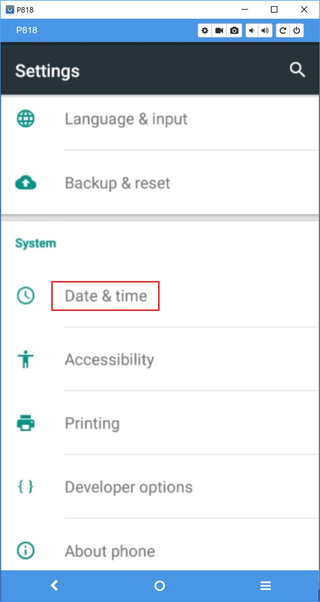
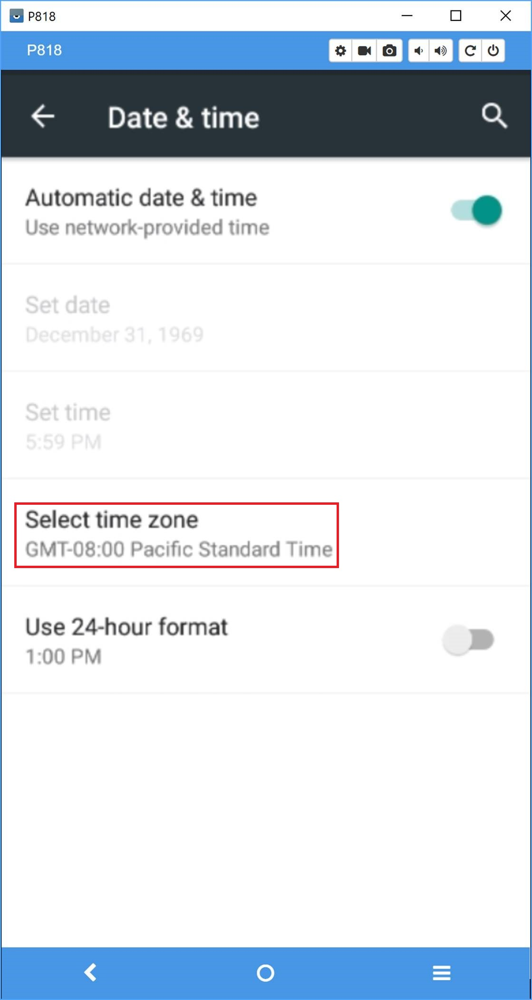

# Get started with the Speech Devices SDK

This article describes how to configure your development PC and your Speech device development kit for developing speech-enabled devices using the Speech Devices SDK. You will then build and deploy a sample application to the device. 

The source code for the sample application is included with the Speech Devices SDK and is also [available on GitHub](https://github.com/Azure-Samples/Cognitive-Services-Speech-Devices-SDK).

## Prerequisites

Before starting development with the Speech Devices SDK, gather the information and software you'll need.

* Obtain a development kit [from Roobo](http://ddk.roobo.com/). Kits are available with linear or circular microphone array configurations; choose the correct one for your needs.

    |Development kit configuration|Speaker location|
    |-----------------------------|------------|
    |Circular|Any direction from the device|
    |Linear|In front of the device|

* Obtain the latest version of the Speech Devices SDK, including an Android sample app, from the Speech Devices SDK's [download site](https://shares.datatransfer.microsoft.com/). Extract the ZIP file to a local folder (such as `C:\SDSDK`).

* Install [Android Studio](https://developer.android.com/studio/) and [Vysor](http://vysor.io/download/) on your PC.

* Obtain a Speech service [subscription key](get-started.md). You can obtain a 30-day free trial, or obtain a key from your Azure dashboard.

* If you wish to use the Speech service's intent recognition, subscribe to the [Language Understanding service](https://azure.microsoft.com/services/cognitive-services/language-understanding-intelligent-service/) (LUIS) and [obtain a subscription key](https://docs.microsoft.com/en-us/azure/cognitive-services/luis/azureibizasubscription). 

    You may [create a simple LUIS model](https://docs.microsoft.com/en-us/azure/cognitive-services/luis/) or use the sample LUIS model, `LUIS-example.json`, available from the Speech Devices SDK [download site](https://shares.datatransfer.microsoft.com/). Upload your model's JSON file to the [LUIS portal](https://www.luis.ai/home) by clicking **Import new app** and choosing the JSON file.

## Set up the development kit

1. Power up the dev kit using a mini USB cable connected to a PC or a power adptor. A green power indicator should light up under the top board.

1. Connect the development kit to a computer using a second mini USB cable.

    

1. Orient your development kit appropriately.

    |Development kit configuration|Orientation|
    |-----------------------------|------------|
    |Circular|Upright, with microphones facing the ceiling|
    |Linear|On its side, with microphones facing you (shown below)|

    

1. Install the certificates and the wake word (keyword) table file, and set the permissions of the sound device. Type the following commands in a command window.

    > [!NOTE]
    > These commands use the Android Debug Bridge, `adb.exe`, which is part of the Android Studio installation. This tool can be found in `C:\Users\[user name]\AppData\Local\Android\Sdk\platform-tools`. You might add this directory to your path to make it more convenient to invoke `adb`. Otherwise, you must specify the full path to your installation of `adb.exe` in every command that invokes `adb`.

    ```
    adb push C:\SDSDK\Android-Sample-Release\scripts\roobo_setup.sh /data/ 
    adb shell
    cd /data/ 
    chmod 777 roobo_setup.sh
    ./roobo_setup.sh
    exit
    ```

    > [!TIP]
    > Mute your PC's microphone and speaker. This way, you can be sure you are working with the development kit's microphones, and you won't accidentally trigger the device with audio from the PC.
    
1.	Launch Vysor on your computer.

    

1.	Your device should be listed under "Choose a device". Click the **View** button next to it. 
 
1.	Connect to your wireless network by clicking on the folder icon, then **Settings**, then **WLAN**.

    
 
 > [!NOTE]
 > If your company has policies regarding connecting devices to the wifi system, you need to obtain the Mac Address and contact your IT department about how to connect it to your wifi system. To find the Mac Address of the dev kit, click on the file folder icon on the desktop of the dev kit, then **Settings**, search for "Mac address", click on **Mac address** to get into **Advanced WLAN**, write down the Mac address found towards the bottom. Also, some companies might have a time limit of how long a device can be connected to their wifi systems. You might need to extend the dev kit's registration with your wifi system, after a certain number of days.  
 
 
   
   
   
   
   
 > If you want to attach a speaker to the dev kit, you can connect it to the Audio line out. You should also choose a good quality 3.5mm speaker.
 
   
 
## Run a sample application

To run the Roobo tests and validate your development kit setup, build and install the sample application.

1.	Launch Android Studio.

1.	Choose to open an existing Android Studio project.

    
 
1.	Browse to `C:\SDSDK\Android-Sample-Release\example`, then click **OK** to open the example project.
 
1.	Add your Speech subscription key to the source code. If you want to try out intent recognition, also add your [Language Understanding service](https://azure.microsoft.com/services/cognitive-services/language-understanding-intelligent-service/) subscription key and application ID. 

    Your keys and application information goes in the following lines in the source file `MainActivity.java`.

    ```java
    // Subscription
    private static final String SpeechSubscriptionKey = "[your speech key]";
    private static final String SpeechRegion = "westus";
    private static final String LuisSubscriptionKey = "[your LUIS key]";
    private static final String LuisRegion = "westus2.api.cognitive.microsoft.com";
    private static final String LuisAppId = "[your LUIS app id]"
    ```

1. The default wake word (keyword) is "Computer."  If you like, you may try one of the other provided wake words, "Machine" and "Assistant." The resource files for these alternate words can be found in the Speech Devices SDK in the "keyword" folder. For example, `C:\SDSDK\Android-Sample-Release\keyword\Computer` contains the files used for "Computer."

    You may also [create a custom wake word](speech-devices-sdk-create-kws.md).

    To install the desired wake word:
 
    * Create a `keyword` folder in the \data\ folder on the device by running the following commands in command window.

        ```
        adb shell
        cd /data
        mkdir keyword
        exit
        ```

    * Copy the files `kws.table`, `kws_g.fst`, `kws_k.fst`, and `words_kw.txt`) to the device's \data\keyword\ folder. Run the following commands in o command window. If you have created a [custom wake word](speech-devices-sdk-create-kws.md), the kws.table file generated from the web is going to be in the same directory as `kws.table`, `kws_g.fst`, `kws_k.fst`, and `words_kw.txt` files are. Please use adb push C:\SDSDK\Android-Sample-Release\keyword\[wake_word_name]\kws.table /data/keyword commmand to push the kws.table file to the dev kit instead.

        ```
        adb push C:\SDSDK\Android-Sample-Release\keyword\kws.table /data/keyword
        adb push C:\SDSDK\Android-Sample-Release\keyword\Computer\kws_g.fst /data/keyword
        adb push C:\SDSDK\Android-Sample-Release\keyword\Computer\kws_k.fst /data/keyword
        adb push C:\SDSDK\Android-Sample-Release\keyword\Computer\words_kw.txt /data/keyword
        ```
    
    * Reference these files in the sample application. Find the following lines in `MainActivity.java`. Make sure that the keyword specified is the one you are using and that the path points to the `kws.table` file that you pushed to the device.
        
        ```java
        private static final String Keyword = "Computer";
        private static final String KeywordModel = "/data/keyword/kws.table";
        ```

        > [!NOTE]
        > In your own code, you can use the `kws.table` file to create a keyword model instance and start recognition as follows.
        >
        > ```java
    	> KeywordRecognitionModel km = KeywordRecognitionModel.fromFile(KeywordModel);
        > final Task<?> task = reco.startKeywordRecognitionAsync(km);
        > ```

1.	Update the following lines containing the microphone array geometry settings.

    ```java
    private static final String DeviceGeometry = "Circular6+1";
    private static final String SelectedGeometry = "Circular6+1";
    ```

    |Variable|Meaning|Available values|
    |--------|-------|----------------|
    |`DeviceGeometry`|Physical mic configuration|`Circular6+1` for circular dev kit|
    ||| `Linear4` for linear dev kit|
    |`SelectedGeometry`|Software mic configuration|`Circular6+1` for circular dev kit using all mics|
    |||`Circular3+1` for circular dev kit using four mics|
    |||`Linear4` for linear dev kit using all mics|
    |||`Linear2` for linear dev kit using two mics|


1.	Build the application by choosing **Run 'app'** from the Run menu. The Select Deployment Target dialog appears. Choose your device and click **OK** to deploy the application to the device.

    
 
1.	The Speech Devices SDK example application starts, displaying the options shown here.

    

1. Play around with it!

## Troubleshooting

If you get certificate failures when using the Speech service, make sure the device has the correct date and time. Go to **Settings**, click on **Date & time** under System, and **Select time zone** to be your current time zone. Keep **Automatic date & time** ON. When you see the dev kit's time matches your PC's time, then you will know the dev kit is connected to the internet. 

 
 
 

For more development information, see Roobo's [development guide](http://dwn.roo.bo/server_upload/ddk/ROOBO%20Dev%20Kit-User%20Guide.pdf).

Roobo provides a tool that captures all audio to flash memory, which may help in troubleshooting audio issues. A version of the tool is provided for each development kit configuration. Choose your device at [the Roobo site](http://ddk.roobo.com/), then click the **ROOBO Tools** link at the bottom of the page.
