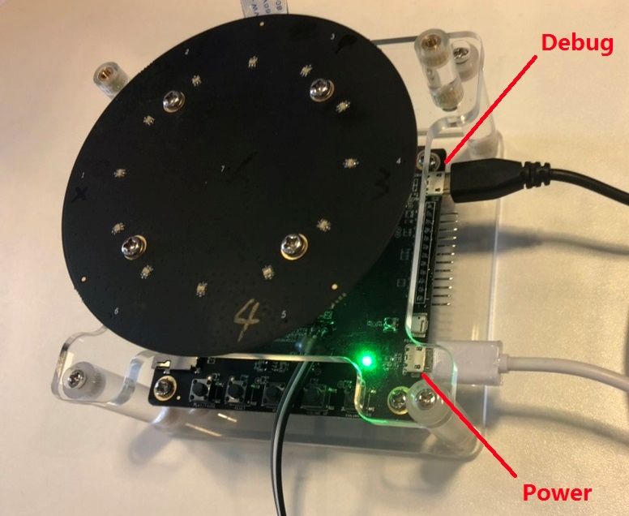

# Device: Roobo Smart Audio Dev Kit v2

This article provides device-specific information for the Roobo Smart Audio Dev Kit2.

## Set up the development kit

1. The development kit has two micro USB connectors. The left connector is to power the development kit and is highlighted as Power in the image below. The right one is to control it, and is marked Debug in the image. 
    
1. Power the development kit by using a micro USB cable to connect the power port to a PC or power adapter. A green power indicator will light up under the top board.
1. To control the development kit, connect the debug port to a computer by using a second micro USB cable. It is essential to use a high-quality cable to ensure reliable communications.
1. Orient your development kit Circularly - Upright, with microphones facing the ceiling as shown above

## Development information

For more development information, see the [Roobo development guide](http://dwn.roo.bo/server_upload/ddk/ROOBO%20Dev%20Kit-User%20Guide.pdf).

## Audio Record/Play

DDK2 audio operations can be performed in the following ways:
* Use ALSA Open-source libraries and their applications.
* Use appmainprog interface to do application development. 
DDK2 audio - related software framework uses standard ALSA framework, you can use libasound. So to develop software directly. So you can use ALSA's arecord and aplay directly to record and play audio.
