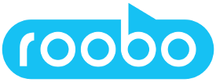

# About the Speech Devices SDK (Preview)

The [Microsoft Speech service](overview.md) works with a wide variety of devices and audio sources. Now, you can take your speech applications to the next level with matched hardware and software. The Speech Devices SDK is a pretuned library that's paired with purpose-built, microphone array development kits. 

The Speech Devices SDK can help you:
* Rapidly test new voice scenarios.
* More easily integrate the cloud-based Speech service into your device.
* Create an exceptional user experience for your customers. 

The Speech Devices SDK consumes the [Speech SDK](speech-sdk.md). It uses the Speech SDK to send the audio that's processed by our advanced audio processing algorithm from the device's microphone array to the [Speech service](overview.md). It uses multichannel audio to provide more accurate far-field [speech recognition](speech-to-text.md) via noise suppression, echo cancellation, beamforming, and dereverberation.

You can also use the Speech Devices SDK to build ambient devices that have your own [customized wake word](speech-devices-sdk-create-kws.md)—so the cue that initiates a user interaction is unique to your brand. 

The Speech Devices SDK facilitates a variety of voice-enabled scenarios, such as drive-thru ordering systems, in-store or in-home assistants, and smart speakers. You can respond to users with text, speak back to them in a default or [custom voice](how-to-customize-voice-font.md), provide search results, [translate](speech-translation.md) to other languages, and more. We look forward to seeing what you build!

## Development kit providers

Currently, these complete, end-to-end system reference designs are available: 

|||
|-|-|
||ROOBO provides complete artificial intelligence (AI) system solutions for household electric appliances, automobiles, robots, toys, and other industries. ROOBO's reference designs greatly reduce development time-to-market via integration with the Microsoft Speech service. [Visit ROOBO](http://ddk.roobo.com/).|

## Next steps

To get started, get a [free Azure account](https://azure.microsoft.com/free/ai/) and sign up for the Speech Devices SDK.

> [!div class="nextstepaction"]
> [Sign up for the Speech Devices SDK](get-speech-devices-sdk.md)

