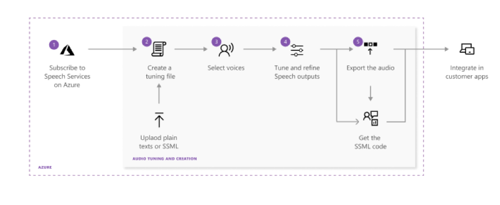

# Audio Content Generation

Audio Content Creation is an online tool that allow you to customize and fine-tune Microsoft's text-to-speech output for your apps and products. You can use this tool to fine-tune public and custom voices for more accurate natural expressions, and manage your output in the cloud.

The Audio Content Creation tool is based on [Speech Synthesis Markup Language (SSML)](speech-synthesis-markup.md). To simplify customization and tuning, Audio Content Generation allows you to visually inspect your text-to-speech outputs in real time.

## How does it work?

This diagram shows the steps it takes to tune and export customized speech-to-text outputs. Use the links below to learn more about each step.

1. The first step is to create an Azure account, register a Speech resource, and get a subscription key. Make sure that when you create your Speech resource, that you select the **S0** pricing tier, F0 resources aren't supported. Once you have a subscription key, you can use it to call the Speech service, and to access [Speech Studio](https://speech.microsoft.com).
2. [Create an audio tuning file](#placeholder) using plain text or SSML.
3. Choose the voice and the language that you'd like to tune. Audio Content Generation includes all of the [Microsoft text-to-speech voices](language-support.md#text-to-speech). You can use standard, neural, or your own custom voice.
   >[!NOTE]
   > Gated access is available for Custom Neural Voices, which allow you to create high-definition voices similar to natural-sounding speech. For additional details, see [Gating process](#link-to-ethics-content).

4. Review the default result. Then use the tuning tool to adjust pronunciation, pitch, rate, intonation, voice style, and more.

3. Choose the language and voices - Audio Content Creation includes all the Microsoft text-to-speech voices across more than 45 languages. You can choose from neural voices, standard voices, your custom voices, and the exclusive access to the High Definition version of the Neural voices that provide the most natural-sounding speech.  

4. Check the default playback result – Click Play to check out the default playback result from Speech services.   

5. Tune the audio output – Switch to Tuning section in the left, custom and refine the accuracy and naturalness of the audio output with a set of SSML features, including pronunciation, break, pitch, rate, volume, intonation, voice style, etc. Check the customized playback result again.

6. Save the file and export the audio - You can save your tuning track in the system in case you want to continue work on the file. Once you are satisfied with the audio output, click Export to create an audio generation task. View the export task status and download the final audio output for your products.   
