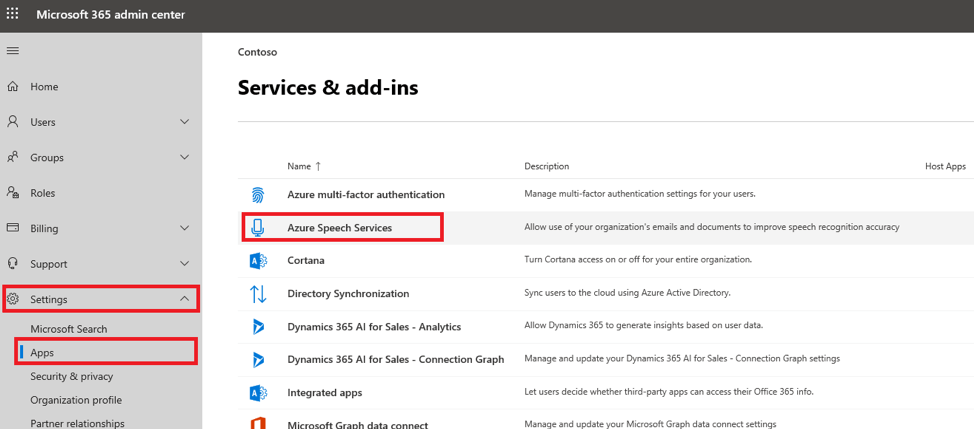
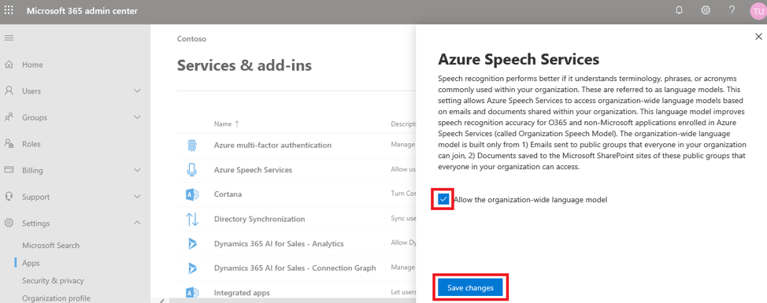
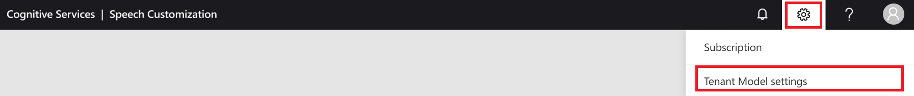

# Tutorial: Create a tenant model (preview)

Tenant Model (Custom Speech with Office 365 data) is an opt-in service for Office 365 enterprise customers that automatically generates a custom speech recognition model from your organization's Office 365 data. The model is optimized for technical terms, jargon, and people's names, all in a secure and compliant way.

> [!IMPORTANT]
> If your organization enrolls by using the Tenant Model service, Speech Service may access your organization’s language model. The model is generated from Office 365 public group emails and documents, which can be seen by anyone in your organization. Your organization's Office 365 admin can turn on or turn off the use of the organization-wide language model from the Office 365 admin portal.

In this tutorial, you learn how to:

> [!div class="checklist"]
> * Enroll in the Tenant Model by using the Microsoft 365 admin center
> * Get a Speech subscription key
> * Create a tenant model
> * Deploy a tenant model
> * Use your tenant model with the Speech SDK

## Enroll in the Tenant Model service

Before you can deploy your tenant model, you need to be enrolled in the Tenant Model service. Enrollment is completed in the Microsoft 365 admin center and can be done only by your Microsoft 365 admin.

1. Sign in to the [Microsoft 365 admin center](https://admin.microsoft.com).

1. In the left pane, select **Settings**, then select **Settings** from the nested menu, then select **Azure Speech Services** from the main window.

   

1. Select the **Allow the organization-wide language model** check box, and then select **Save changes**.

   

To turn off the tenant model instance:
1. Repeat the preceding steps 1 and 2.
1. Clear the **Allow the organization-wide language model** check box, and then select **Save changes**.

## Get a Speech subscription key

To use your tenant model with the Speech SDK, you need a Speech resource and its associated subscription key.

1. Sign in to the [Azure portal](https://aka.ms/azureportal).
1. Select **Create a resource**.
1. In the **Search** box, type **Speech**.
1. In the results list, select **Speech**, and then select **Create**.
1. Follow the onscreen instructions to create your resource. Make sure that:
   * **Location** is set to either **eastus** or **westus**.
   * **Pricing tier** is set to **S0**.
1. Select **Create**.

   After a few minutes, your resource is created. The subscription key is available in the **Overview** section for your resource.

## Create a language model

After your admin has enabled Tenant Model for your organization, you can create a language model that's based on your Office 365 data.

1. Sign in to [Speech Studio](https://speech.microsoft.com/).
1. At the top right, select **Settings** (gear icon), and then select **Tenant Model settings**.

   

   Speech Studio displays a message that lets you know whether you're qualified to create a tenant model.

   > [!NOTE]
   > Office 365 enterprise customers in North America are eligible to create a tenant model (English). If you're a Customer Lockbox, Customer Key, or Office 365 Government customer, this feature isn't available. To determine whether you're a Customer Lockbox or Customer Key customer, see:
   > * [Customer Lockbox](/microsoft-365/compliance/customer-lockbox-requests)
   > * [Customer Key](/microsoft-365/compliance/customer-key-overview)
   > * [Office 365 Government](https://www.microsoft.com/microsoft-365/government)

1. Select **Opt in**.

   When your tenant model is ready, you'll receive a confirmation email message with further instructions.

## Deploy your tenant model

When your tenant model instance is ready, deploy it by doing the following:

1. In your confirmation email message, select the **View model** button. Or sign in to [Speech Studio](https://speech.microsoft.com/).
1. At the top right, select **Settings** (gear icon), and then select **Tenant Model settings**.

   

1. Select **Deploy**.

   When your model has been deployed, the status changes to *Deployed*.

## Use your tenant model with the Speech SDK

Now that you've deployed your model, you can use it with the Speech SDK. In this section, you use sample code to call Speech Service by using Azure Active Directory (Azure AD) authentication.

Let's look at the code you'll use to call the Speech SDK in C#. In this example, you perform speech recognition by using your tenant model. This guide presumes that your platform is already set up. If you need setup help, see [Quickstart: Recognize speech, C# (.NET Core)](quickstarts/speech-to-text-from-microphone.md?pivots=programming-language-csharp&tabs=dotnetcore).

Copy this code into your project:

```csharp
namespace PrincetonSROnly.FrontEnd.Samples
{
    using System;
    using System.Collections.Generic;
    using System.IO;
    using System.Net.Http;
    using System.Text;
    using System.Text.RegularExpressions;
    using System.Threading.Tasks;
    using Microsoft.CognitiveServices.Speech;
    using Microsoft.CognitiveServices.Speech.Audio;
    using Microsoft.IdentityModel.Clients.ActiveDirectory;
    using Newtonsoft.Json.Linq;

    // ServiceApplicationId is a fixed value. No need to change it.

    public class TenantLMSample
    {
        private const string EndpointUriArgName = "EndpointUri";
        private const string SubscriptionKeyArgName = "SubscriptionKey";
        private const string UsernameArgName = "Username";
        private const string PasswordArgName = "Password";
        private const string ClientApplicationId = "f87bc118-1576-4097-93c9-dbf8f45ef0dd";
        private const string ServiceApplicationId = "18301695-f99d-4cae-9618-6901d4bdc7be";

        public static async Task ContinuousRecognitionWithTenantLMAsync(Uri endpointUri, string subscriptionKey, string audioDirPath, string username, string password)
        {
            var config = SpeechConfig.FromEndpoint(endpointUri, subscriptionKey);

            // Passing client specific information for obtaining LM
            if (string.IsNullOrEmpty(username) || string.IsNullOrEmpty(password))
            {
                config.AuthorizationToken = await AcquireAuthTokenWithInteractiveLoginAsync().ConfigureAwait(false);
            }
            else
            {
                config.AuthorizationToken = await AcquireAuthTokenWithUsernamePasswordAsync(username, password).ConfigureAwait(false);
            }

            var stopRecognition = new TaskCompletionSource<int>();

            // Creates a speech recognizer using file as audio input.
            // Replace with your own audio file name.
            using (var audioInput = AudioConfig.FromWavFileInput(audioDirPath))
            {
                using (var recognizer = new SpeechRecognizer(config, audioInput))
                {
                    // Subscribes to events
                    recognizer.Recognizing += (s, e) =>
                    {
                        Console.WriteLine($"RECOGNIZING: Text={e.Result.Text}");
                    };

                    recognizer.Recognized += (s, e) =>
                    {
                        if (e.Result.Reason == ResultReason.RecognizedSpeech)
                        {
                            Console.WriteLine($"RECOGNIZED: Text={e.Result.Text}");
                        }
                        else if (e.Result.Reason == ResultReason.NoMatch)
                        {
                            Console.WriteLine($"NOMATCH: Speech could not be recognized.");
                        }
                    };

                    recognizer.Canceled += (s, e) =>
                    {
                        Console.WriteLine($"CANCELED: Reason={e.Reason}");
                        if (e.Reason == CancellationReason.Error)
                        {
                            Exception exp = new Exception(string.Format("Error Code: {0}\nError Details{1}\nIs your subscription information updated?", e.ErrorCode, e.ErrorDetails));
                            throw exp;
                        }

                        stopRecognition.TrySetResult(0);
                    };

                    recognizer.SessionStarted += (s, e) =>
                    {
                        Console.WriteLine("\n    Session started event.");
                    };

                    recognizer.SessionStopped += (s, e) =>
                    {
                        Console.WriteLine("\n    Session stopped event.");
                        Console.WriteLine("\nStop recognition.");
                        stopRecognition.TrySetResult(0);
                    };

                    // Starts continuous recognition. Uses StopContinuousRecognitionAsync() to stop recognition.
                    await recognizer.StartContinuousRecognitionAsync().ConfigureAwait(false);

                    // Waits for completion.
                    // Use Task.WaitAny to keep the task rooted.
                    Task.WaitAny(new[] { stopRecognition.Task });

                    // Stops recognition.
                    await recognizer.StopContinuousRecognitionAsync().ConfigureAwait(false);
                }
            }
        }

        public static void Main(string[] args)
        {
            var arguments = new Dictionary<string, string>();
            string inputArgNamePattern = "--";
            Regex regex = new Regex(inputArgNamePattern);
            if (args.Length > 0)
            {
                foreach (var arg in args)
                {
                    var userArgs = arg.Split("=");
                    arguments[regex.Replace(userArgs[0], string.Empty)] = userArgs[1];
                }
            }

            var endpointString = arguments.GetValueOrDefault(EndpointUriArgName, $"wss://westus.online.princeton.customspeech.ai/msgraphcustomspeech/conversation/v1");
            var endpointUri = new Uri(endpointString);

            if (!arguments.ContainsKey(SubscriptionKeyArgName))
            {
                Exception exp = new Exception("Subscription Key missing! Please pass in a Cognitive services subscription Key using --SubscriptionKey=\"your_subscription_key\"" +
                    "Find more information on creating a Cognitive services resource and accessing your Subscription key here: https://docs.microsoft.com/azure/cognitive-services/cognitive-services-apis-create-account?tabs=multiservice%2Cwindows");
                throw exp;
            }

            var subscriptionKey = arguments[SubscriptionKeyArgName];
            var username = arguments.GetValueOrDefault(UsernameArgName, null);
            var password = arguments.GetValueOrDefault(PasswordArgName, null);

            var audioDirPath = Path.Combine(Path.GetDirectoryName(System.Reflection.Assembly.GetExecutingAssembly().Location), "../../../AudioSamples/DictationBatman.wav");
            if (!File.Exists(audioDirPath))
            {
                Exception exp = new Exception(string.Format("Audio File does not exist at path: {0}", audioDirPath));
                throw exp;
            }

            ContinuousRecognitionWithTenantLMAsync(endpointUri, subscriptionKey, audioDirPath, username, password).GetAwaiter().GetResult();
        }

        private static async Task<string> AcquireAuthTokenWithUsernamePasswordAsync(string username, string password)
        {
            var tokenEndpoint = "https://login.microsoftonline.com/common/oauth2/token";
            var postBody = $"resource={ServiceApplicationId}&client_id={ClientApplicationId}&grant_type=password&username={username}&password={password}";
            var stringContent = new StringContent(postBody, Encoding.UTF8, "application/x-www-form-urlencoded");
            using (HttpClient httpClient = new HttpClient())
            {
                var response = await httpClient.PostAsync(tokenEndpoint, stringContent).ConfigureAwait(false);

                if (response.IsSuccessStatusCode)
                {
                    var result = await response.Content.ReadAsStringAsync().ConfigureAwait(false);

                    JObject jobject = JObject.Parse(result);
                    return jobject["access_token"].Value<string>();
                }
                else
                {
                    throw new Exception($"Requesting token from {tokenEndpoint} failed with status code {response.StatusCode}: {await response.Content.ReadAsStringAsync().ConfigureAwait(false)}");
                }
            }
        }

        private static async Task<string> AcquireAuthTokenWithInteractiveLoginAsync()
        {
            var authContext = new AuthenticationContext("https://login.windows.net/microsoft.onmicrosoft.com");
            var deviceCodeResult = await authContext.AcquireDeviceCodeAsync(ServiceApplicationId, ClientApplicationId).ConfigureAwait(false);

            Console.WriteLine(deviceCodeResult.Message);

            var authResult = await authContext.AcquireTokenByDeviceCodeAsync(deviceCodeResult).ConfigureAwait(false);

            return authResult.AccessToken;
        }
    }
}
```

Next, you need to rebuild and run the project from the command line. Before you run the command, update a few parameters by doing the following:

1. Replace `<Username>` and `<Password>` with the values for a valid tenant user.
1. Replace `<Subscription-Key>` with the subscription key for your Speech resource. This value is available in the **Overview** section for your Speech resource in the [Azure portal](https://aka.ms/azureportal).
1. Replace `<Endpoint-Uri>` with the following endpoint. Make sure that you replace `{your region}` with the region where your Speech resource was created. These regions are supported: `westus`, `westus2`, and `eastus`. Your region information is available in the **Overview** section of your Speech resource in the [Azure portal](https://aka.ms/azureportal).
   ```
   "wss://{your region}.online.princeton.customspeech.ai/msgraphcustomspeech/conversation/v1".
   ```
1. Run the following command:

   ```bash
   dotnet TenantLMSample.dll --Username=<Username> --Password=<Password> --SubscriptionKey=<Subscription-Key> --EndpointUri=<Endpoint-Uri>
   ```

In this tutorial, you've learned how to use Office 365 data to create a custom speech recognition model, deploy it, and use it with the Speech SDK.

## Next steps

* [Speech Studio](https://speech.microsoft.com/)
* [Speech SDK](speech-sdk.md)
