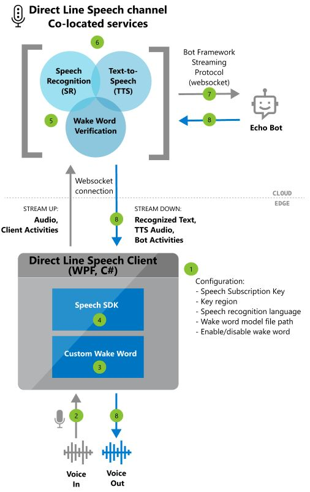
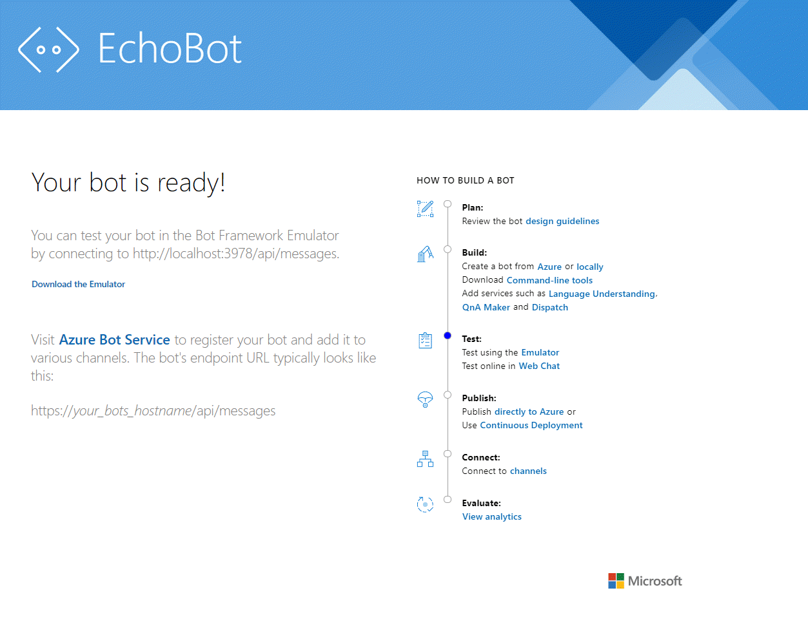

# Tutorial: Voice-enable your bot using the Speech SDK

You can now use the power of the Speech service to easily voice-enable a chat bot.

In this tutorial, you'll create an Echo Bot using Microsoft Bot-Framework, deploy it to Azure, and register it with the Bot-Framework Direct Line Speech channel. Then you'll configure a sample client app for Windows that lets you speak to your bot and hear it respond back to you.

This tutorial is designed for developers who are just starting their journey with Azure, Bot-Framework bots, Direct Line Speech, or the Speech SDK, and want to quickly build a working system with limited coding. No experience or familiarity with these services is needed.

At the end of this exercise, you'll have set up a system that will operate as follows:

1. The sample client application is configured to connect to Direct Line Speech channel and the Echo Bot
1. Audio is recorded from the default microphone on button press (or continuously recorded if custom keyword is activated)
1. Optionally, custom keyword detection happens, gating audio streaming to the cloud
1. Using Speech SDK, the app connects to Direct Line Speech channel and streams audio
1. Optionally, higher accuracy keyword verification happens on the service
1. The audio is passed to the speech recognition service and transcribed to text
1. The recognized text is passed to the Echo-Bot as a Bot Framework Activity 
1. The response text is turned into audio by the Text-to-Speech (TTS) service, and streamed back to the client application for playback



> [!NOTE]
> The steps in this tutorial do not require a paid service. As a new Azure user, you'll be able to use credits from your free Azure trial subscription and the free tier of the Speech service to complete this tutorial.

Here's what this tutorial covers:
> [!div class="checklist"]
> * Create new Azure resources
> * Build, test, and deploy the Echo Bot sample to an Azure App Service
> * Register your bot with Direct Line Speech channel
> * Build and run the Windows Voice Assistant Client to interact with your Echo Bot
> * Add custom keyword activation
> * Learn to change the language of the recognized and spoken speech

## Prerequisites

Here's what you'll need to complete this tutorial:

- A Windows 10 PC with a working microphone and speakers (or headphones)
- [Visual Studio 2017](https://visualstudio.microsoft.com/downloads/) or higher
- [.NET Framework Runtime 4.6.1](https://dotnet.microsoft.com/download) or higher
- An Azure account. [Sign up for free](https://azure.microsoft.com/free/ai/).
- A [GitHub](https://github.com/) account
- [Git for Windows](https://git-scm.com/download/win)

## Create a resource group

The client app that you'll create in this tutorial uses a handful of Azure services. To reduce the round-trip time for responses from your bot, you'll want to make sure that these services are located in the same Azure region. In this section, you'll create a resource group in the **West US** region. This resource group will be used when creating individual resources for the Bot-Framework, the  Direct Line Speech channel, and the Speech service.

1. <a href="https://ms.portal.azure.com/#create/Microsoft.ResourceGroup" target="_blank">Create a resource group <span class="docon docon-navigate-external x-hidden-focus"></span></a>
1. You'll be prompted to provide some information:
   * Set **Subscription** to **Free Trial** (you can also use an existing subscription).
   * Enter a name for your **Resource group**. We recommend **SpeechEchoBotTutorial-ResourceGroup**.
   * From the **Region** drop-down, select **West US**.
1. Click **Review and create**. You should see a banner that read **Validation passed**.
1. Click **Create**. It may take a few minutes to create the resource group.
1. As with the resources you'll create later in this tutorial, it's a good idea to pin this resource group to your dashboard for easy access. If you'd like to pin this resource group, click the pin icon in the upper right of the dashboard.

### Choosing an Azure region

If you'd like to use a different region for this tutorial these factors may limit your choices:

* Ensure that you use a [supported Azure region](regions.md#voice-assistants).
* The Direct Line Speech channel uses the text-to-speech service, which has standard and neural voices. Neural voices are [limited to specific Azure regions](regions.md#standard-and-neural-voices).
* Free trial keys may be restricted to a specific region.

For more information about regions, see [Azure locations](https://azure.microsoft.com/global-infrastructure/locations/).

## Create resources

Now that you have a resource group in a supported region, the next step is to create individual resources for each service that you'll use in this tutorial.

### Create a Speech service resource

Follow these instructions to create a Speech resource:

1. <a href="https://ms.portal.azure.com/#create/Microsoft.CognitiveServicesSpeechServices" target="_blank">Create a Speech service resource <span class="docon docon-navigate-external x-hidden-focus"></span></a>
4. You'll be prompted to provide some information:
   * Give your resource a **Name**. We recommend **SpeechEchoBotTutorial-Speech**
   * For **Subscription**, make sure **Free Trial** is selected.
   * For **Location**, select **West US**.
   * For **Pricing tier**, select **F0**. This is the free tier.
   * For **Resource group**, select **SpeechEchoBotTutorial-ResourceGroup**.
5. After you've entered all required information, click **Create**. It may take a few minutes to create your resource.
6. Later in this tutorial you'll need subscription keys for this service. You can access these keys at any time from your resource's **Overview** (Manage keys) or **Keys**.

At this point, check that your resource group (**SpeechEchoBotTutorial-ResourceGroup**) has a Speech resource:

| Name | Type  | Location |
|------|-------|----------|
| SpeechEchoBotTutorial-Speech | Cognitive Services | West US |

### Create an Azure App Service plan

The next step is to create an App Service Plan. An App Service plan defines a set of compute resources for a web app to run.

1. <a href="https://ms.portal.azure.com/#create/Microsoft.AppServicePlanCreate" target="_blank">Create an Azure App Service plan <span class="docon docon-navigate-external x-hidden-focus"></span></a>
4. You'll be prompted to provide some information:
   * Set **Subscription** to **Free Trial** (you can also use an existing subscription).
   * For **Resource group**, select **SpeechEchoBotTutorial-ResourceGroup**.
   * Give your resource a **Name**. We recommend **SpeechEchoBotTutorial-AppServicePlan**
   * For **Operating System**, select **Windows**.
   * For **Region**, select **West US**.
   * For **Pricing Tier**, make sure that **Standard S1** is selected. This should be the default value. If it isn't, make sure you set the **Operating System** to **Windows** as described above.
5. Click **Review and create**. You should see a banner that read **Validation passed**.
6. Click **Create**. It may take a few minutes to create the resource group.

At this point, check that your resource group (**SpeechEchoBotTutorial-ResourceGroup**) has two resources:

| Name | Type  | Location |
|------|-------|----------|
| SpeechEchoBotTutorial-AppServicePlan | App Service Plan | West US |
| SpeechEchoBotTutorial-Speech | Cognitive Services | West US |

## Build an Echo Bot

Now that you've created some resources, let's build a bot. We're going to start with the Echo Bot sample, which as the name implies, echoes the text that you've entered as its response. Don't worry, the sample code is ready for you to use without any changes. It's configured to work with the Direct Line Speech channel, which we'll connect after we've deployed the bot to Azure.

> [!NOTE]
> The instructions that follow, as well as additional information about the Echo Bot are available in the [sample's README on GitHub](https://github.com/microsoft/BotBuilder-Samples/blob/master/samples/csharp_dotnetcore/02.echo-bot/README.md).

### Run the bot sample on your machine

1. Clone the samples repository:

   ```bash
   git clone https://github.com/Microsoft/botbuilder-samples.git
   ```

2. Launch Visual Studio.
3. From the toolbar, select **File** > **Open** > **Project/Solution**, and open the Echo Bot project solution:

   ```
   samples\csharp_dotnetcore\02.echo-bot\EchoBot.sln
   ```

4. After the project is loaded, press <kbd>F5</kbd> to build and run the project.
5. A browser should launch and you'll see a screen looking similar to this.
    > [!div class="mx-imgBorder"]
    > [](media/tutorial-voice-enable-your-bot-speech-sdk/echobot-running-on-localhost.png#lightbox)

### Test the bot sample with the Bot Framework Emulator

The [Bot Framework Emulator](https://github.com/microsoft/botframework-emulator) is a desktop app that allows bot developers to test and debug their bots locally or remotely through a tunnel. The Emulator supports typed text as the input (not voice). The bot will response with text. Follow these steps to use the Bot Framework Emulator to test your Echo Bot running locally, with text input and text output. After we deploy the bot to Azure we will test it with voice input and voice output.

1. Install the [Bot Framework Emulator](https://github.com/Microsoft/BotFramework-Emulator/releases/latest) version 4.3.0 or greater
2. Launch the Bot Framework Emulator and open your bot:
   * **File** -> **Open Bot**.
3. Enter the URL for your bot. For example:

   ```
   http://localhost:3978/api/messages
   ```
   and press "Connect".
4. The bot should immediately greet you with "Hello and welcome!" message. Type in any text message and confirm you get a response from the bot.
5. This is what an exchange of communication with an Echo Bot instance might look like:
    [](media/tutorial-voice-enable-your-bot-speech-sdk/bot-framework-emulator.png#lightbox)

## Deploy your bot to an Azure App Service

The next step is to deploy the Echo Bot to Azure. There are a few ways to deploy a bot, but in this tutorial we'll focus on publishing directly from Visual Studio.

> [!NOTE]
> Alternatively, you can deploy a bot using the [Azure CLI](https://docs.microsoft.com/azure/bot-service/bot-builder-deploy-az-cli) and [deployment templates](https://github.com/microsoft/BotBuilder-Samples/tree/master/samples/csharp_dotnetcore/adaptive-dialog/03.core-bot).

1. From Visual Studio, open the Echo Bot that's been configured for use with Direct Line Speech channel:

   ```
   samples\csharp_dotnetcore\02.echo-bot\EchoBot.sln
   ```

1. In the **Solution Explorer**, right-click the **EchoBot** project and select **Publish...**
1. A new window titled **Pick a publish target** will open.
1. Select **App Service** from the **Azure services** navigation, select **Create New**, then click **Create Profile**.
1. When the **Create App Service** window appears:
   * Click **Add an account**, and sign in with your Azure account credentials. If you're already signed in, select the account you want from the drop-down list.
   * For the **App Name**, you'll need to enter a globally unique name for your Bot. This name is used to create a unique bot URL. A default value will be populated including the date and time (For example: "EchoBot20190805125647"). You can use the default name for this tutorial.
   * For **Subscription**, set it to **Free Trial**
   * For **Resource Group**, select **SpeechEchoBotTutorial-ResourceGroup**
   * For **Hosting Plan**, select **SpeechEchoBotTutorial-AppServicePlan**
   * For **Application Insights**, leave as **None**
1. Click **Create**
1. Click **Publish** on the right side of the newly created profile
1. You should see a success message in Visual Studio that looks like this:

   ```
   Publish Succeeded.
   Web App was published successfully https://EchoBot20190805125647.azurewebsites.net/
   ```

1. Your default browser should open and display a page that reads: "Your bot is ready!".
1. At this point, check your Resource Group **SpeechEchoBotTutorial-ResourceGroup** in the Azure portal, and confirm there are three resources:

| Name | Type  | Location |
|------|-------|----------|
| EchoBot20190805125647 | App Service | West US |
| SpeechEchoBotTutorial-AppServicePlan | App Service plan | West US |
| SpeechEchoBotTutorial-Speech | Cognitive Services | West US |

## Enable web sockets

You'll need to make a small configuration change so that your bot can communicate with the Direct Line Speech channel using web sockets. Follow these steps to enable web sockets:

1. Navigate to the [Azure portal](https://portal.azure.com), and locate your App Service. The resource should be named similar to **EchoBot20190805125647** (your unique app name).
2. In the **Azure services** navigation, under **Settings**, click **Configuration**.
3. Select the **General settings** tab.
4. Locate the toggle for **Web sockets** and set it to **On**.
5. Click **Save**.

> [!TIP]
> You can use the controls at the top of your Azure App Service page to stop or restart the service. This may come in handy when troubleshooting.

## Create a channel registration

Now that you've created an Azure App Service to host your bot, the next step is to create a **Bot Channels Registration**. Creating a channel registration is a prerequisite for registering your bot with Bot-Framework channels, including Direct Line Speech channel.

> [!NOTE]
> If you'd like to learn more about how bots leverage channels, see [Connect a bot to channels](https://docs.microsoft.com/azure/bot-service/bot-service-manage-channels?view=azure-bot-service-4.0).


1. <a href="https://ms.portal.azure.com/#create/Microsoft.BotServiceConnectivityGalleryPackage" target="_blank">Create an Azure Bot Channels Registration <span class="docon docon-navigate-external x-hidden-focus"></span></a>
2. You'll be prompted to provide some information:
   * For **Bot handle**, enter **SpeechEchoBotTutorial-BotRegistration-####** and replace **####** with your a number of your choice. Note that Bot handle must be globally unique. If you enter a Bot handle but get the error message _The requested bot ID is not available_, then pick a different number. In the examples below we used 8726
   * For **Subscription**, select **Free Trial**.
   * For **Resource group**, select **SpeechEchoBotTutorial-ResourceGroup**.
   * For **Location**, select **West US**.
     * For **Pricing tier**, select **F0**.
     * For **Messaging endpoint**, enter the URL for your web app with the `/api/messages` path appended at the end. For example: if your globally unique App Name was **EchoBot20190805125647**, your messaging endpoint would be: `https://EchoBot20190805125647.azurewebsites.net/api/messages/`.
     * For **Application insights**, you can set this to **Off**. For more information, see [Bot analytics](https://docs.microsoft.com/azure/bot-service/bot-service-manage-analytics?view=azure-bot-service-4.0).
     * Ignore **Auto create App ID and password**.
5. At the bottom of the **Bot Channels Registration** blade, click **Create**.

At this point, check your Resource Group **SpeechEchoBotTutorial-ResourceGroup** in the Azure portal. It should now show four resources:

| Name | Type  | Location |
|------|-------|----------|
| EchoBot20190805125647 | App Service | West US |
| SpeechEchoBotTutorial-AppServicePlan | App Service plan | West US |
| SpeechEchoBotTutorial-BotRegistration-8726 | Bot Channels Registration | global |
| SpeechEchoBotTutorial-Speech | Cognitive Services | West US |

> [!IMPORTANT]
> The Bot Channels Registration resource will show the Global region even though you selected West US. This is expected.

## Optional: Test in web chat

The Azure Bot Channels Registration page has a **Test in Web Chat** option under **Bot Management**. It will not work by default with your bot, since web chat needs to authenticate against your bot. If you would like to test your deployed bot with text input, follow the steps below. Note that these steps are optional, and are not required in order to continue with the next steps of the tutorial. 

1. Locate and open your **EchoBotTutorial-BotRegistration-####** resource in the [Azure portal](https://portal.azure.com)
1. From the **Bot management** navigation, select **Settings**. Copy the value under **Microsoft App ID**
1. Open the Visual Studio EchoBot solution. In the solution explorer, locate and double click on **appsettings.json**
1. Replace the empty string next to **MicrosoftAppId** in the JSON file with the copied ID value
1. Got back to the Azure portal, in **Bot management** navigation, select **Settings**, and click on **(Manage)** next to **Microsoft App ID**
1. Click on **New client secret**. Add a description (e.g. "web chat") and click **Add**. Copy the new secret
1. Replace the empty string next to **MicrosoftAppPassword** in the JSON file with the copied secret value
1. Save the JSON file. It should look something like this:
```json
{
  "MicrosoftAppId": "3be0abc2-ca07-475e-b6c3-90c4476c4370",
  "MicrosoftAppPassword": "-zRhJZ~1cnc7ZIlj4Qozs_eKN.8Cq~U38G"
}
```
9. Re-publish the app (right-click on **EchoBot** project in Visual Studio solution explorer, select **Publish...** and click on the **Publish** button)
10. Now you are ready to test the bot in web chat!

## Register the Direct Line Speech channel

Now it's time to register your bot with the Direct Line Speech channel. This channel is what's used to create a connection between your echo bot and a client app compiled with the Speech SDK.

1. Locate and open your **SpeechEchoBotTutorial-BotRegistration-####** resource in the [Azure portal](https://portal.azure.com).
1. From the **Bot management** navigation, select **Channels**.
   * Look for **More channels**, locate and click **Direct Line Speech**.
   * Review the text on the page titled **Configure Direct line Speech**, then expand the drop-down menu labeled "Cognitive service account."
   * Select the speech resource you created earlier (e.g., **SpeechEchoBotTutorial-Speech**) from the menu to associate your bot to your speech subscription key.
   * Ignore the rest of the optional fields
   * Click **Save**.

1. From the **Bot management** navigation, click **Settings**.
   * Check the box labeled **Enable Streaming Endpoint**. This is needed to enable a communication protocol built on web sockets between your bot and the Direct Line Speech channel.
   * Click **Save**.

> [!TIP]
> If you'd like to learn more, see [Connect a bot to Direct Line Speech](https://docs.microsoft.com/azure/bot-service/bot-service-channel-connect-directlinespeech?view=azure-bot-service-4.0). This page includes additional information and known issues.

## Run the Windows Voice Assistant Client

In this step, you're going to run the Windows Voice Assistant Client. The client is a Windows Presentation Foundation (WPF) app in C# that uses the [Speech SDK](https://docs.microsoft.com/azure/cognitive-services/speech-service/speech-sdk) to manage communication with your bot using the Direct Line Speech channel. Use it to interact with and test your bot before writing a custom client app. It's open source, so you can either download the executable and run it, or build it yourself.

The Windows Voice Assistant Client has a simple UI that allows you to configure the connection to your bot, view the text conversation, view Bot-Framework activities in JSON format, and display adaptive cards. It also supports the use of custom keywords. You'll use this client to speak with your bot and receive a voice response.

Before we move on, make sure that your microphone and speakers are enabled and working.

1. Navigate to the GitHub repository for the [Windows Voice Assistant Client](https://github.com/Azure-Samples/Cognitive-Services-Voice-Assistant/blob/master/clients/csharp-wpf/README.md).
1. Follow the instructions provided there to either
   * download a ZIP package containing the executable to run, or
   * build the executable yourself, by cloning the repository and building the project.

1. Launch the client application and configure it to connect to your bot, based on the instructions in the GitHub repository
1. Click **Reconnect** and make sure you see the message **Press the mic button, or type to start talking to your bot**.
1. Let's test it out. Click the microphone button, and speak a few words in English. The recognized text will appear as you speak. When you're done speaking, the bot will reply in its own voice, saying "echo" followed by the recognized words.
1. You can also use text to communicate with the bot. Just type in the text at the bottom bar. 

### Troubleshooting errors in Windows Voice Assistant Client

If you get an error message in your main app window, use this table to identify and troubleshoot the error:

| Error | What should you do? |
|-------|----------------------|
|Error (AuthenticationFailure) : WebSocket Upgrade failed with an authentication error (401). Check for correct subscription key (or authorization token) and region name| In the Settings page of the app, make sure you entered the Speech Subscription key and its region correctly.<br>Make sure your speech key and key region were entered correctly. |
|Error (ConnectionFailure) : Connection was closed by the remote host. Error code: 1011. Error details: We could not connect to the bot before sending a message | Make sure you [checked the "Enable Streaming Endpoint"](#register-the-direct-line-speech-channel) box and/or [toggled **Web sockets**](#enable-web-sockets) to On.<br>Make sure your Azure App Service is running. If it is, try restarting your App Service.|
|Error (ConnectionFailure) : Connection was closed by the remote host. Error code: 1002. Error details: The server returned status code '503' when status code '101' was expected | Make sure you [checked the "Enable Streaming Endpoint"](#register-the-direct-line-speech-channel) box and/or [toggled **Web sockets**](#enable-web-sockets) to On.<br>Make sure your Azure App Service is running. If it is, try restarting your App Service.|
|Error (ConnectionFailure) : Connection was closed by the remote host. Error code: 1011. Error details: Response status code does not indicate success: 500 (InternalServerError)| Your bot specified a neural voice in its output Activity [Speak](https://github.com/microsoft/botframework-sdk/blob/master/specs/botframework-activity/botframework-activity.md#speak) field, but the Azure region associated with your Speech subscription key does not support neural voices. See [Standard and neural voices](https://docs.microsoft.com/azure/cognitive-services/speech-service/regions#standard-and-neural-voices).|

If your issue isn't addressed in the table, see [Voice assistants: Frequently asked questions](faq-voice-assistants.md). If your are still not able to resolve your issue after following all the steps in this tutorial, please enter a new issue in the  [Voice Assistant GitHub page](https://github.com/Azure-Samples/Cognitive-Services-Voice-Assistant/issues).

#### A note on connection time out

If you are connected to a bot and no activity happened in the last 5 minutes, the service will automatically close the websocket connection with the client and with the bot. This is by design. A message will appear in the bottom bar: *"Active connection timed out but ready to reconnect on demand"*. You do not need to press the "Reconnect" button - simply press the microphone button and start talking, type in a text message, or say the keyword (if one is enabled). The connection will automatically be reestablished.  
### View bot activities

Every bot sends and receives **Activity** messages. In the **Activity Log** window of Windows Voice Assistant Client, you'll see timestamped logs with each activity that the client has received from the bot. You can also see the activities that the client sent to the bot using the [`DialogServiceConnector.SendActivityAsync`](https://docs.microsoft.com/dotnet/api/microsoft.cognitiveservices.speech.dialog.dialogserviceconnector.sendactivityasync)  method. When you select a log item, it will show the details of the associated activity as JSON.

Here's a sample json of an Activity the client received:

```json
{
    "attachments":[],
    "channelData":{
        "conversationalAiData":{
             "requestInfo":{
                 "interactionId":"8d5cb416-73c3-476b-95fd-9358cbfaebfa",
                 "version":"0.2"
             }
         }
    },
    "channelId":"directlinespeech",
    "conversation":{
        "id":"129ebffe-772b-47f0-9812-7c5bfd4aca79",
        "isGroup":false
    },
    "entities":[],
    "from":{
        "id":"SpeechEchoBotTutorial-BotRegistration-8726"
    },
    "id":"89841b4d-46ce-42de-9960-4fe4070c70cc",
    "inputHint":"acceptingInput",
    "recipient":{
        "id":"129ebffe-772b-47f0-9812-7c5bfd4aca79|0000"
    },
    "replyToId":"67c823b4-4c7a-4828-9d6e-0b84fd052869",
    "serviceUrl":"urn:botframework:websocket:directlinespeech",
    "speak":"<speak version='1.0' xmlns='https://www.w3.org/2001/10/synthesis' xml:lang='en-US'><voice name='Microsoft Server Speech Text to Speech Voice (en-US, AriaRUS)'>Echo: Hello and welcome.</voice></speak>",
    "text":"Echo: Hello and welcome.",
    "timestamp":"2019-07-19T20:03:51.1939097Z",
    "type":"message"
}
```

To learn more about what's returned in the JSON output, see [fields in the Activity](https://github.com/microsoft/botframework-sdk/blob/master/specs/botframework-activity/botframework-activity.md). For the purpose of this tutorial, you can focus on the [Text](https://github.com/microsoft/botframework-sdk/blob/master/specs/botframework-activity/botframework-activity.md#text) and [Speak](https://github.com/microsoft/botframework-sdk/blob/master/specs/botframework-activity/botframework-activity.md#speak) fields.

### View client source code for calls to the Speech SDK

The Windows Voice Assistant Client uses the NuGet package [Microsoft.CognitiveServices.Speech](https://www.nuget.org/packages/Microsoft.CognitiveServices.Speech/), which contains the Speech SDK. A good place to start reviewing the sample code is the method InitSpeechConnector() in file [`VoiceAssistantClient\MainWindow.xaml.cs`](https://github.com/Azure-Samples/Cognitive-Services-Voice-Assistant/blob/master/clients/csharp-wpf/VoiceAssistantClient/MainWindow.xaml.cs), which creates these two Speech SDK objects:
- [`DialogServiceConfig`](https://docs.microsoft.com/dotnet/api/microsoft.cognitiveservices.speech.dialog.dialogserviceconfig) - For configuration settings (e.g., speech subscription key, key region)
- [`DialogServiceConnector`](https://docs.microsoft.com/dotnet/api/microsoft.cognitiveservices.speech.dialog.dialogserviceconnector.-ctor) - To manage the channel connection and client subscription events for handling recognized speech and bot responses.

## Add custom keyword activation

The Speech SDK supports custom keyword activation. Similar to "Hey Cortana" for Microsoft's Assistant, you can write an app that will continuously listen for a keyword of your choice. Keep in mind that a keyword can be single word or a multi-word phrase.

> [!NOTE]
> The term *keyword* is often used interchangeably with the term *wake word*, and you may see both used in Microsoft documentation.

Keyword detection is done on the client app. If using a keyword, audio is only streamed to the Direct Line Speech channel if the keyword is detected. The Direct Line Speech channel includes a component called *keyword verification (KWV)*, which does more complex processing in the cloud to verify that the keyword you've chosen is at the start of the audio stream. If key word verification succeeds, then the channel will communicate with the bot.

Follow these steps to create a keyword model, configure the Windows Voice Assistant Client to use this model, and finally, test it with your bot.

1. Follow these instructions to [create a custom keyword by using the Speech service](https://docs.microsoft.com/azure/cognitive-services/speech-service/speech-devices-sdk-create-kws).
2. Unzip the model file that you downloaded in the previous step. It should be named for your keyword. You're looking for a file named `kws.table`.
3. In the Windows Voice Assistant Client, locate the **Settings** menu (look for the gear icon in the top right). Locate **Model file path** and enter the full path name for the `kws.table` file from step 2.
4. Make sure to check the box labeled **Enabled**. You should see this message next to the check box: "Will listen for the keyword upon next connection". If you've provided the wrong file or an invalid path, you should see an error message.
5. Enter your speech **subscription key**, **subscription key region**, and then click **OK** to close the **Settings** menu.
6. Click **Reconnect**. You should see a message that reads: "New conversation started - type, press the microphone button, or say the keyword". The app is now continuously listening.
7. Speak any phrase that starts with your keyword. For example: "**{your keyword}**, what time is it?". You don't need to pause after uttering the keyword. When finished, two things happen:
   * You'll see a transcription of what you spoke
   * Shortly after, you'll hear the bot's response
8. Continue to experiment with the three input types that your bot supports:
   * Typed-text in the bottom bar
   * Pressing the microphone icon and speaking
   * Saying a phrase that starts with your keyword

### View the source code that enables keyword

In the Windows Voice Assistant Client source code, take a look at these files to review the code that's used to enable keyword detection:

1. [`VoiceAssistantClient\Models.cs`](https://github.com/Azure-Samples/Cognitive-Services-Voice-Assistant/blob/master/clients/csharp-wpf/VoiceAssistantClient/Models.cs) includes a call to the Speech SDK method [`KeywordRecognitionModel.fromFile()`](https://docs.microsoft.com/javascript/api/microsoft-cognitiveservices-speech-sdk/keywordrecognitionmodel?view=azure-node-latest#fromfile-string-), which is used to instantiate the model from a local file on disk.
1. [`VoiceAssistantClient\MainWindow.xaml.cs`](https://github.com/Azure-Samples/Cognitive-Services-Voice-Assistant/blob/master/clients/csharp-wpf/VoiceAssistantClient/MainWindow.xaml.cs) includes a call to Speech SDK method [`DialogServiceConnector.StartKeywordRecognitionAsync()`](https://docs.microsoft.com/dotnet/api/microsoft.cognitiveservices.speech.dialog.dialogserviceconnector.startkeywordrecognitionasync), which activates continuous keyword detection.

## (Optional) Change the language and bot voice

The bot that you've created will listen for and respond in English, with a default US English text-to-speech voice. However, you're not limited to using English, or a default voice. In this section, you'll learn how to change the language that your bot will listen for and respond in. You will also learn how to select a different voice for that language.

### Change the language

You can chose from any one of the languages mentioned in the [speech-to-text](language-support.md#speech-to-text) table. In the example below, we will change the language to German.

1. Open the Windows Voice Assistant Client app, click on the settings button (upper-right gear icon), and enter `de-de` in the Language field (this is the Locale value mentioned in the [speech-to-text](language-support.md#speech-to-text) table). This sets the spoken language to be recognized, overriding the default `en-us`. This also instructs Direct Line Speech channel to use a default German voice for the Bot reply.
2. Close the settings page, and click on the Reconnect button to establish a new connection to your echo bot.
3. Click on the microphone button, and say a phrase in German. You will see the recognized text and the echo bot replying with the default German voice.

### Change the default bot voice

Selecting the text-to-speech voice and controlling pronunciation can be done if the Bot specifies the reply in the form of a [Speech Synthesis Markup Language](speech-synthesis-markup.md) (SSML) instead of simple text. The echo bot does not use SSML, but we can easily modify the code to do that. In the example below we add SSML to the echo bot reply, such that the German voice Stefan Apollo (a male voice) will be used instead of the default female voice. See list of [Standard Voices](language-support.md#standard-voices) and [Neural Voices](language-support.md#neural-voices) supported for your language.

1. Let's start by opening `samples\csharp_dotnetcore\02.echo-bot\echo-bot.cs`.
2. Locate these two lines:
    ```csharp
    var replyText = $"Echo: {turnContext.Activity.Text}";
    await turnContext.SendActivityAsync(MessageFactory.Text(replyText, replyText), cancellationToken);
    ```
3. Replace them with:
    ```csharp
    var replyText = $"Echo: {turnContext.Activity.Text}";
    var replySpeak = @"<speak version='1.0' xmlns='https://www.w3.org/2001/10/synthesis' xml:lang='de-DE'>
                    <voice name='Microsoft Server Speech Text to Speech Voice (de-DE, Stefan, Apollo)'>" +
                    $"{replyText}" + "</voice></speak>";
    await turnContext.SendActivityAsync(MessageFactory.Text(replyText, replySpeak), cancellationToken);
    ```
4. Build your solution in Visual Studio and fix any build errors.

The second argument in the method 'MessageFactory.Text' sets the [Activity speak field](https://github.com/Microsoft/botframework-sdk/blob/master/specs/botframework-activity/botframework-activity.md#speak) in the bot reply. With the above change, it has been replaced from simple text to SSML in order to specify a non-default German voice.

### Redeploy your bot

Now that you've made the necessary change to the bot, the next step is to republish it to your Azure App Service and try it out:

1. In the Solution Explorer window, right-click on the **EchoBot** project and select **Publish**.
2. Your previous deployment configuration has already been loaded as the default. Simply click **Publish** next to **EchoBot20190805125647 - Web Deploy**.
3. The **Publish Succeeded** message will appear in the Visual Studio output window, and a web page will launch with the message "Your bot is ready!".
4. Open the Windows Voice Assistant Client app, click on the settings button (upper-right gear icon), and make sure you still have `de-de` in the Language field.
5. Follow the instructions in [Run the Windows Voice Assistant Client](#run-the-windows-voice-assistant-client) to reconnect with your newly deployed bot, speak in the new language and hear you bot reply in that language with the new voice.

## Clean up resources

If you're not going to continue using the echo-bot deployed in this tutorial, you can remove it and all its associated Azure resources by simply deleting the Azure Resource group **SpeechEchoBotTutorial-ResourceGroup**.

1. From the [Azure portal](https://portal.azure.com), click on **Resource Groups** from the **Azure services** navigation.
2. Find the resource group named: **SpeechEchoBotTutorial-ResourceGroup**. Click the three dots (...).
3. Select **Delete resource group**.

## Next steps

> [!div class="nextstepaction"]
> [Build your own client app with the Speech SDK](quickstart-voice-assistant-csharp-uwp.md)

## See also

* Deploying to an [Azure region near you](https://azure.microsoft.com/global-infrastructure/locations/) to see bot response time improvement
* Deploying to an [Azure region that supports high quality Neural TTS voices](https://docs.microsoft.com/azure/cognitive-services/speech-service/regions#standard-and-neural-voices)
* Pricing associated with Direct Line Speech channel:
  * [Bot Service pricing](https://azure.microsoft.com/pricing/details/bot-service/)
  * [Speech service](https://azure.microsoft.com/pricing/details/cognitive-services/speech-services/)
* Building and deploying your own voice-enabled bot:
  * Build a [Bot-Framework bot](https://dev.botframework.com/). Register it with [Direct Line Speech channel](https://docs.microsoft.com/azure/bot-service/bot-service-channel-connect-directlinespeech?view=azure-bot-service-4.0) and [customize your bot for voice](https://docs.microsoft.com/azure/bot-service/directline-speech-bot?view=azure-bot-service-4.0)
  * Explore existing [Bot-Framework solutions](https://microsoft.github.io/botframework-solutions/index): Build a [virtual assistant](https://microsoft.github.io/botframework-solutions/overview/virtual-assistant-solution/) and [extend it to Direct Line Speech](https://microsoft.github.io/botframework-solutions/clients-and-channels/tutorials/enable-speech/1-intro/)
