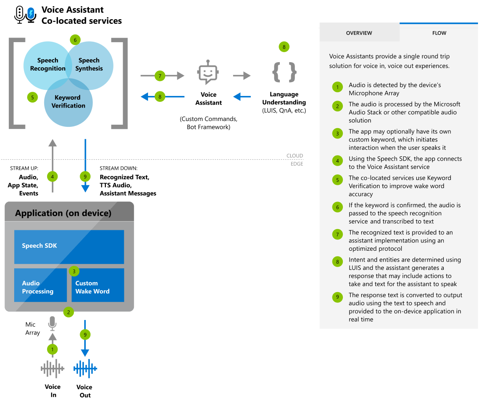
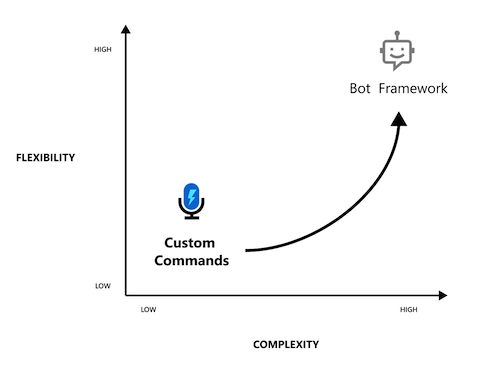

# What is a voice assistant?

Voice assistants using the Speech service empowers developers to create natural, human-like conversational interfaces for their applications and experiences.

The voice assistant service provides fast, reliable interaction between a device and an assistant implementation that uses either (1) the Bot Framework's Direct Line Speech channel or (2) the integrated Custom Commands (Preview) service for task completion.

Applications connect to the voice assistant service with the Speech Software Development Kit (SDK).

   

## Choosing an assistant solution

The first step to creating a voice assistant is to decide what it should do. The Speech service provides multiple, complementary solutions for crafting your assistant interactions. Whether you want the flexibility and versatility that the Bot Framework's [Direct Line Speech](direct-line-speech.md) channel provides or the simplicity of [Custom Commands (Preview)](custom-commands.md) for straightforward scenarios, selecting the right tools will get you started.

| If you want... | Then consider... | For example... |
|-------------------|------------------|----------------|
|Open-ended conversation with robust skills integration and full deployment control | The Bot Framework's [Direct Line Speech](direct-line-speech.md) channel | <ul><li>"I need to go to Seattle"</li><li>"What kind of pizza can I order?"</li></ul>
|Command and control or task-oriented conversation with simplified authoring and hosting | [Custom Commands (Preview)](custom-commands.md) | <ul><li>"Turn on the overhead light"</li><li>"Make it 5 degrees warmer"</ul>

We recommend [Direct Line Speech](direct-line-speech.md) as the best default choice if you aren't yet sure what you'd like your assistant to handle. It offers integration with a rich set of tools and authoring aids such as the [Virtual Assistant Solution and Enterprise Template](https://docs.microsoft.com/azure/bot-service/bot-builder-enterprise-template-overview) and the [QnA Maker service](https://docs.microsoft.com/azure/cognitive-services/QnAMaker/Overview/overview) to build on common patterns and use your existing knowledge sources.

[Custom Commands (Preview)](custom-commands.md) provides a streamlined authoring and hosting experience specifically tailored for natural language command and control scenarios.

   

## Core features

Whether you choose [Direct Line Speech](direct-line-speech.md) or [Custom Commands (Preview)](custom-commands.md) to create your assistant interactions, you can use a rich set of customization features to customize your assistant to your brand, product, and personality.

| Category | Features |
|----------|----------|
|[Custom keyword](speech-devices-sdk-create-kws.md) | Users can start conversations with assistants with a custom keyword like "Hey Contoso." An app does this with a custom keyword engine in the Speech SDK, which can be configured with a custom keyword [that you can generate here](speech-devices-sdk-create-kws.md). Voice assistants can use service-side keyword verification to improve the accuracy of the keyword activation (versus the device alone).
|[Speech to text](speech-to-text.md) | Voice assistants convert real-time audio into recognized text using [Speech-to-text](speech-to-text.md) from the Speech service. This text is available, as it's transcribed, to both your assistant implementation and your client application.
|[Text to speech](text-to-speech.md) | Textual responses from your assistant are synthesized using [Text-to-speech](text-to-speech.md) from the Speech service. This synthesis is then made available to your client application as an audio stream. Microsoft offers the ability to build your own custom, high-quality Neural TTS voice that gives a voice to your brand. To learn more, [contact us](mailto:mstts@microsoft.com).

## Getting started with voice assistants

We offer quickstarts designed to have you running code in less than 10 minutes. This table includes a list of voice assistant quickstarts, organized by language.

| Quickstart | Platform | API reference |
|------------|----------|---------------|
| C#, UWP | Windows | [Browse](https://aka.ms/csspeech/csharpref) |
| Java | Windows, macOS, Linux | [Browse](https://aka.ms/csspeech/javaref) |
| Java | Android | [Browse](https://aka.ms/csspeech/javaref) |

## Sample code

Sample code for creating a voice assistant is available on GitHub. These samples cover the client application for connecting to your assistant in several popular programming languages.

* [Voice assistant samples (SDK)](https://aka.ms/csspeech/samples)
* [Tutorial: Voice enable your assistant with the Speech SDK, C#](tutorial-voice-enable-your-bot-speech-sdk.md)

## Tutorial

A tutorial on how to [voice-enable your assistant using the Speech SDK and Direct Line Speech channel](tutorial-voice-enable-your-bot-speech-sdk.md).

## Customization

Voice assistants built using the Speech service can use the full range of customization options available for [speech-to-text](speech-to-text.md), [text-to-speech](text-to-speech.md), and [custom keyword selection](speech-devices-sdk-create-kws.md).

> [!NOTE]
> Customization options vary by language/locale (see [Supported languages](supported-languages.md)).

## Reference docs

* [Speech SDK](speech-sdk-reference.md)
* [Azure Bot Service](https://docs.microsoft.com/azure/bot-service/?view=azure-bot-service-4.0)

## Next steps

* [Get a Speech service subscription key for free](get-started.md)
* [Get the Speech SDK](speech-sdk.md)
* [Learn more about Custom Commands (Preview)](custom-commands.md)
* [Learn more about Direct Line Speech](direct-line-speech.md)
