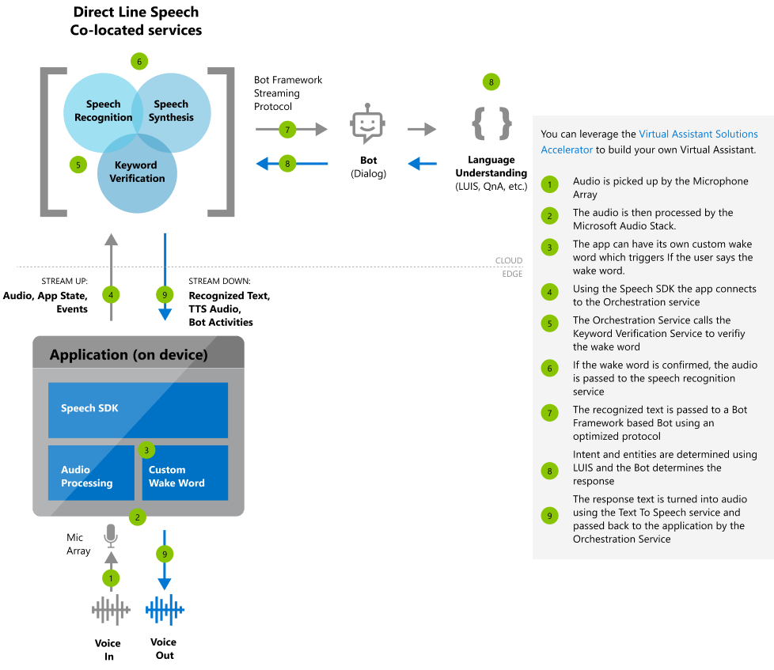

# About custom voice-first virtual assistants preview

Custom virtual assistants using Azure Speech Services empower developers to create natural, human-like conversational interfaces for their applications and experiences. The Bot Framework's Direct Line Speech channel enhances these capabilities by providing a coordinated, orchestrated entry point to a compatible bot that enables voice in, voice out interaction with low latency and high reliability. These bots can use Microsoft's Language Understanding (LUIS) for natural language interaction. Direct Line Speech is accessed by devices using the Speech Software Development Kit (SDK).

   

Direct Line Speech and its associated functionality for custom voice-first virtual assistants are an ideal supplement to the [Virtual Assistant Solution and Enterprise Template](https://docs.microsoft.com/azure/bot-service/bot-builder-enterprise-template-overview). Though Direct Line Speech can work with any compatible bot, these resources provide a reusable baseline for high-quality conversational experiences as well as common supporting skills and models for getting started quickly.

## Core features

| Category | Features |
|----------|----------|
|[Custom wake word](speech-devices-sdk-create-kws.md) | You can enable users to begin conversations with bots using a custom keyword like "Hey Contoso." This task is accomplished with a custom wake word engine in the Speech SDK, which can be configured with a custom wake word [that you can generate here](speech-devices-sdk-create-kws.md). The Direct Line Speech channel includes service-side wake word verification that improves the accuracy of the wake word activation versus the device alone.
|[Speech to text](speech-to-text.md) | The Direct Line Speech channel includes real-time transcription of audio into recognized text using [Speech-to-text](speech-to-text.md) from Azure Speech Services. This text is available to both your bot and your client application as it is transcribed.
|[Text to speech](text-to-speech.md) | Textual responses from your bot will be synthesized using [Text-to-speech](text-to-speech.md) from Azure Speech Services. This synthesis will then be made available to your client application as an audio stream. Microsoft offers the ability to build your own custom, high-quality Neural TTS voice that gives a voice to your brand, to learn more [contact us](mailto:mstts@microsoft.com).
|[Direct Line Speech](https://docs.microsoft.com/azure/bot-service/bot-service-channel-connect-directlinespeech) | As a channel within the Bot Framework, Direct Line Speech enables a smooth and seamless connection between your client application, a compatible bot, and the capabilities of Azure Speech Services. For more information on configuring your bot to use the Direct Line Speech channel, see [its page in the Bot Framework documentation](https://docs.microsoft.com/azure/bot-service/bot-service-channel-connect-directlinespeech).

## Get started with virtual assistants

We offer quickstarts designed to have you running code in less than 10 minutes. This table includes a list of voice-first virtual assistant quickstarts organized by language.

| Quickstart | Platform | API reference |
|------------|----------|---------------|
| C#, UWP | Windows | [Browse](https://aka.ms/csspeech/csharpref) |
| Java | Windows, macOS, Linux | [Browse](https://aka.ms/csspeech/javaref) |
| Java | Android | [Browse](https://aka.ms/csspeech/javaref) |

## Sample code

Sample code for creating a voice-first virtual assistant is available on GitHub. These samples cover the client application for connecting to your bot in several popular programming languages.

* [Voice-first virtual assistant samples (SDK)](https://aka.ms/csspeech/samples)
* [Tutorial: Voice enable your bot with the Speech SDK, C#](tutorial-voice-enable-your-bot-speech-sdk.md)

## Tutorial
A tutorial on how to [voice-enable your bot using the Speech SDK and Direct Line Speech channel](tutorial-voice-enable-your-bot-speech-sdk.md).

## Customization

Voice-first virtual assistants built using Azure Speech Services can use the full range of customization options available for [speech-to-text](speech-to-text.md), [text-to-speech](text-to-speech.md), and [custom keyword selection](speech-devices-sdk-create-kws.md).

> [!NOTE]
> Customization options vary by language/locale (see [Supported languages](supported-languages.md)).

## Reference docs

* [Speech SDK](speech-sdk-reference.md)
* [Azure Bot Service](https://docs.microsoft.com/azure/bot-service/?view=azure-bot-service-4.0)

## Next steps

* [Get a Speech Services subscription key for free](get-started.md)
* [Get the Speech SDK](speech-sdk.md)
* [Create and deploy a basic bot](https://docs.microsoft.com/azure/bot-service/bot-builder-tutorial-basic-deploy?view=azure-bot-service-4.0)
* [Get the Virtual Assistant Solution and Enterprise Template](https://github.com/Microsoft/AI)
