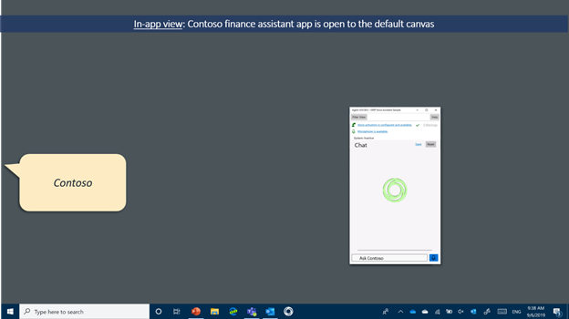
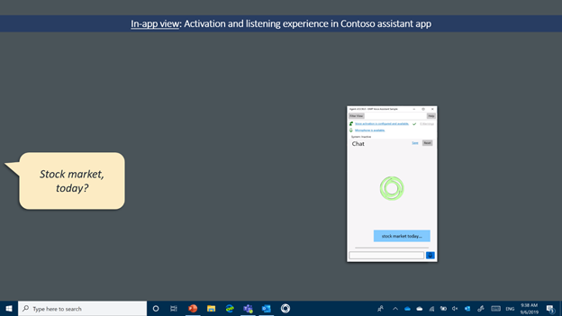
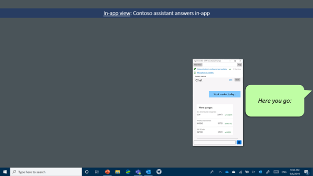
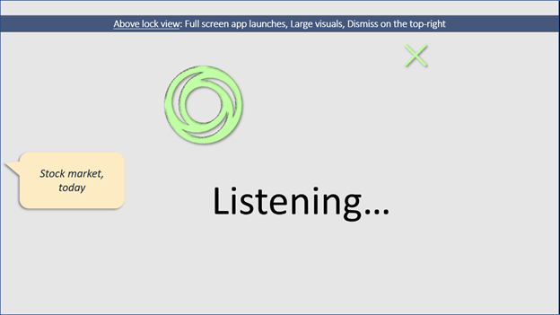
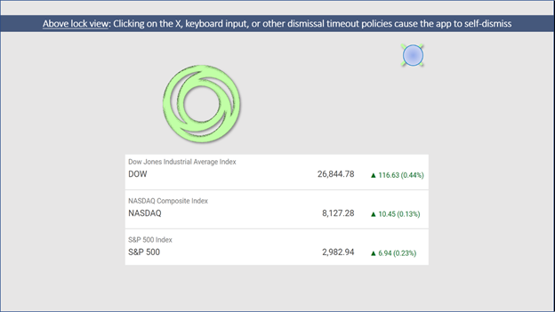
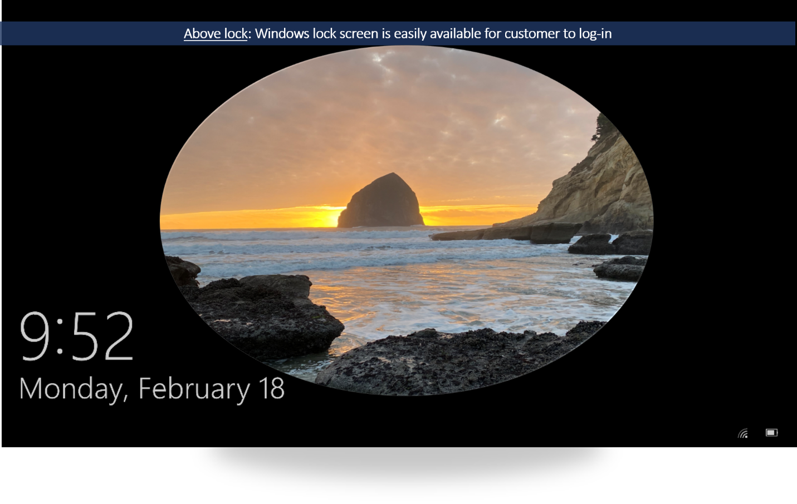
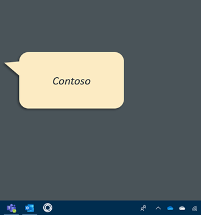
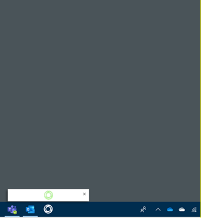
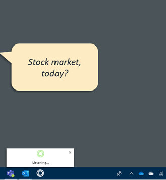
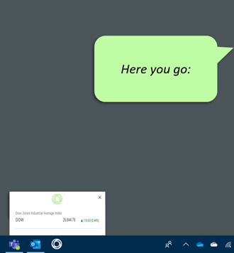

# Design assistant experiences for Windows 10

Voice assistants developed on Windows 10 must implement the user experience guidelines below to provide the best possible experiences for voice activation on Windows 10. This document will guide developers through understanding the key work needed for a voice assistant to integrate with the Windows 10 Shell.

## Contents

- [Summary of voice activation views supported in Windows 10](#summary-of-voice-activation-views-supported-in-windows-10)
- [Requirements summary](#requirements-summary)
- [Best practices for good listening experiences](#best-practices-for-good-listening-experiences)
- [Design guidance for in-app voice activation](#design-guidance-for-in-app-voice-activation)
- [Design guidance for voice activation above lock](#design-guidance-for-voice-activation-above-lock)
- [Design guidance for voice activation preview](#design-guidance-for-voice-activation-preview)

## Summary of voice activation views supported in Windows 10

Windows 10 infers an activation experience for the customer context based on the device context. The following summary table is a high-level overview of the different views available when the screen is on.

| View (Availability) | Device context | Customer goal | Appears when | Design needs |
| --- | --- | --- | --- | --- |
| **In-app (19H1)** | Below lock, assistant has focus | Interact with the assistant app | Assistant processes the request in-app | Main in-app view listening experience |
| **Above lock (19H2)** | Above lock, unauthenticated | Interact with the assistant, but from a distance | System is locked and assistant requests activation | Full-screen visuals for far-field UI. Implement dismissal policies to not block unlocking. |
| **Voice activation preview (20H1)** | Below lock, assistant does not have focus | Interact with the assistant, but in a less intrusive way | System is below lock and assistant requests background activation | Minimal canvas. Resize or hand-off to the main app view as needed. |

## Requirements summary

Minimal effort is required to access the different experiences. However, assistants do need to implement the right design guidance for each view. This table below provides a checklist of the requirements that must be followed.

| **Voice activation view** | **Assistant requirements summary** |
| --- | --- |
| **In-app** | <ul><li>Process the request in-app</li><li>Provides UI indicators for listening states</li><li>UI adapts as window sizes change</li></ul> |
| **Above lock** | <ul><li>Detect lock state and request activation</li><li>Do not provide always persistent UX that would block access to the Windows lock screen</li><li>Provide full screen visuals and a voice-first experience</li><li>Honor dismissal guidance below</li><li>Follow privacy and security considerations below</li></ul> |
| **Voice activation preview** | <ul><li>Detect unlock state and request background activation</li><li>Draw minimal listening UX in the preview pane</li><li>Draw a close X in the top-right and self-dismiss and stop streaming audio when pressed</li><li>Resize or hand-off to the main assistant app view as needed to provide answers</li></ul> |

## Best practices for good listening experiences

Assistants should build a listening experience to provide critical feedback so the customer can understand the state of the assistant. Below are some possible states to consider when building an assistant experience. These are only possible suggestions, not mandatory guidance.

- Assistant is available for speech input
- Assistant is in the process of activating (either a keyword or mic button press)
- Assistant is actively streaming audio to the assistant cloud
- Assistant is ready for the customer to start speaking
- Assistant is hearing that words are being said
- Assistant understands that the customer is done speaking
- Assistant is processing and preparing a response
- Assistant is responding

Even if states change rapidly it is worth considering providing UX for states, since durations are variable across the Windows ecosystem. Visual feedback as well as brief audio chimes or chirps, also called &quot;earcons&quot;, can be part of the solution. Likewise, visual cards coupled with audio descriptions make for good response options.

## Design guidance for in-app voice activation

When the assistant app has focus, the customer intent is clearly to interact with the app, so all voice activation experiences should be handled by the main app view. This view may be resized by the customer. To help explain assistant shell interactions, the rest of this document uses the concrete example of a financial service assistant named Contoso. In this and subsequent diagrams, what the customer says will appear in cartoon speech bubbles on the left with assistant responses in cartoon bubbles on the right.

**In-app view. Initial state when voice activation begins:**

**In-app view. After successful voice activation, listening experience begins:**

**In-app view. All responses remain in the app experience.**

## Design guidance for voice activation above lock

Available with 19H2, assistants built on Windows voice activation platform are available to answer above lock.

### Customer opt-in

Voice activation above lock is always disabled by default. Customers opt-in through the Windows settings>Privacy>Voice Activation. For details on monitoring and prompting for this setting, see the [above lock implementation guide](windows-voice-assistants-implementation-guide.md#detecting-above-lock-activation-user-preference).

### Not a lock-screen replacement

While notifications or other standard app lock-screen integration points remain available for the assistant, the Windows lock screen always defines the initial customer experience until a voice activation occurs. After voice activation is detected, the assistant app temporarily appears above the lock screen. To avoid customer confusion, when active above lock, the assistant app must never present UI to ask for any kind of credentials or log in.

### Above lock experience following voice activation

When the screen is on, the assistant app is full screen with no title bar above the lock screen. Larger visuals and strong voice descriptions with strong voice-primary interface allow for cases where the customer is too far away to read UI or has their hands busy with another (non-PC) task.

When the screen remains off, the assistant app could play an earcon to indicate the assistant is activating and provide a voice-only experience.

### Dismissal policies

The assistant must implement the dismissal guidance in this section to make it easier for customers to log in the next time they want to use their Windows PC. Below are specific requirements, which the assistant must implement:

- **All assistant canvases that show above lock must contain an X** in the top right that dismisses the assistant.
- **Pressing any key must also dismiss the assistant app**. Keyboard input is a traditional lock app signal that the customer wants to log in. Therefore, any keyboard/text input should not be directed to the app. Instead, the app should self-dismiss when keyboard input is detected, so the customer can easily log in to their device.
- **If the screen goes off, the app must self-dismiss.** This ensures that the next time the customer uses their PC, the login screen will be ready and waiting for them.
- If the app is &quot;in use&quot;, it may continue above lock. &quot;in use&quot; constitutes any input or output. For example, when streaming music or video the app may continue above lock. &quot;Follow on&quot; and other multiturn dialog steps are permitted to keep the app above lock.
- **Implementation details on dismissing the application** can be found [in the above lock implementation guide](windows-voice-assistants-implementation-guide.md#closing-the-application).

### Privacy &amp; security considerations above lock

Many PCs are portable but not always within customer reach. They may be briefly left in hotel rooms, airplane seats, or workspaces, where other people have physical access. If assistants that are enabled above lock aren't prepared, they can become subject to the class of so-called &quot;[evil maid](https://en.wikipedia.org/wiki/Evil_maid_attack)&quot; attacks.

Therefore, assistants should follow the guidance in this section to help keep experience secure. Interaction above lock occurs when the Windows user is unauthenticated. This means that, in general, **input to the assistant should also be treated as unauthenticated**.

- Assistants should **implement a skill whitelist to identify skills that are confirmed secure and safe** to be accessed above lock.
- Speaker ID technologies can play a role in alleviating some risks, but Speaker ID is not a suitable replacement for Windows authentication.
- The skill whitelist should consider three classes of actions or skills:

| **Action class** | **Description** | **Examples (not a complete list)** |
| --- | --- | --- |
| Safe without authentication | General purpose information or basic app command and control | &quot;What time is it?&quot;, &quot;Play the next track&quot; |
| Safe with Speaker ID | Impersonation risk, revealing personal information. | &quot;What&#39;s my next appointment?&quot;, &quot;Review my shopping list&quot;, &quot;Answer the call&quot; |
| Safe only after Windows authentication | High-risk actions that an attacker could use to harm the customer | &quot;Buy more groceries&quot;, &quot;Delete my (important) appointment&quot;, &quot;Send a (mean) text message&quot;, &quot;Launch a (nefarious) webpage&quot; |

For the case of Contoso, general information around public stock information is safe without authentication. Customer-specific information such as number of shares owned is likely safe with Speaker ID. However, buying or selling stocks should never be allowed without Windows authentication.

To further secure the experience, **weblinks, or other app-to-app launches will always be blocked by Windows until the customer signs in.** As a last resort mitigation, Microsoft reserves the right to remove an application from the whitelist of enabled assistants if a serious security issue is not addressed in a timely manner.

## Design guidance for voice activation preview

Below lock, when the assistant app does _not_ have focus, Windows provides a less intrusive voice activation UI to help keep the customer in flow. This is especially true for the case of false activations that would be highly disruptive if they launched the full app. The core idea is that each assistant has another home in the Shell, the assistant taskbar icon. When the request for background activation occurs, a small view above the assistant taskbar icon appears. Assistants should provide a small listening experience in this canvas. After processing the requests, assistants can choose to resize this view to show an in-context answer or to hand off their main app view to show larger, more detailed visuals.

- To stay minimal, the preview does not have a title bar, so **the assistant must draw an X in the top right to allow customers to dismiss the view.** Refer to [Closing the Application](windows-voice-assistants-implementation-guide.md#closing-the-application) for the specific APIs to call when the dismiss button is pressed.
- To support voice activation previews, assistants may invite customers to pin the assistant to the taskbar during first run.

**Voice activation preview: Initial state**

The Contoso assistant has a home on the taskbar: their swirling, circular icon.

**As activation progresses**, the assistant requests background activation. The assistant is given a small preview pane (default width 408 and height: 248). If server-side voice activation determines the signal was a false positive, this view could be dismissed for minimal interruption.

**When final activation is confirmed**, the assistant presents its listening UX. Assistant must always draw a dismiss X in the top right of the voice activation preview.

**Quick answers** may be shown in the voice activation preview. A TryResizeView will allow assistants to request different sizes.

**Hand-off**. At any point, the assistant may hand off to its main app view to provide more information, dialogue, or answers that require more screen real estate. Please refer to the [Transition from compact view to full view](windows-voice-assistants-implementation-guide.md#transition-from-compact-view-to-full-view) section for implementation details.

## Next steps

> [!div class="nextstepaction"]
> [Get started on developing your voice assistant](how-to-windows-voice-assistants-get-started.md)