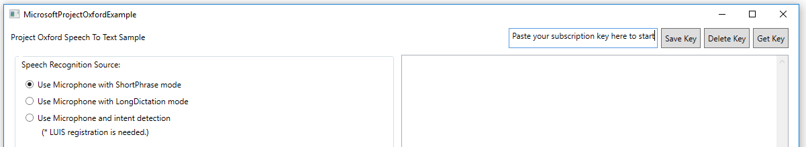
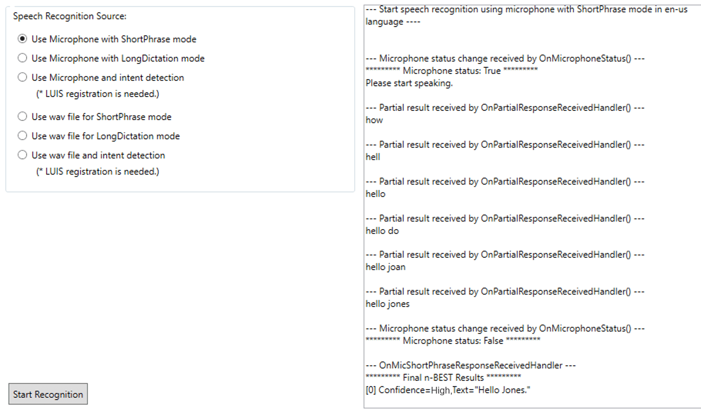

# Quickstart: Use the Bing Speech Recognition API in C&#35; for .NET on Windows

[!INCLUDE [Deprecation note](../../../../includes/cognitive-services-bing-speech-api-deprecation-note.md)]

This page shows how to develop a basic Windows application that uses the Speech Recognition API to convert spoken audio to text. Using the client library allows for real-time streaming, which means that when your client application sends audio to the service, it simultaneously and asynchronously receives partial recognition results back.

Developers who want to use Speech Service from apps that run on any device can use the C# desktop library. To use the library, install the [NuGet package Microsoft.ProjectOxford.SpeechRecognition-x86](https://www.nuget.org/packages/Microsoft.ProjectOxford.SpeechRecognition-x86/) for a 32-bit platform and the [NuGet package Microsoft.ProjectOxford.SpeechRecognition-x64](https://www.nuget.org/packages/Microsoft.ProjectOxford.SpeechRecognition-x64/) for a 64-bit platform. For the client library API reference, see [Microsoft Speech C# desktop library](https://cdn.rawgit.com/Microsoft/Cognitive-Speech-STT-Windows/master/docs/SpeechSDK/index.html).

The following sections describe how to install, build, and run the C# sample application by using the C# desktop library.

## Prerequisites

### Platform requirements

The following sample was developed for Windows 8+ and .NET Framework 4.5+ by using [Visual Studio 2015, Community Edition](https://www.visualstudio.com/products/visual-studio-community-vs).

### Get the sample application

Clone the sample from the [Speech C# desktop library sample](https://github.com/microsoft/cognitive-speech-stt-windows) repository.

### Subscribe to the Speech Recognition API, and get a free trial subscription key

The Speech API is part of Cognitive Services (previously Project Oxford). You can get free trial subscription keys from the [Cognitive Services subscription](https://azure.microsoft.com/try/cognitive-services/) page. After you select the Speech API, select **Get API Key** to get the key. It returns a primary and secondary key. Both keys are tied to the same quota, so you can use either key.

> [!IMPORTANT]
> * Get a subscription key. Before you use the Speech client libraries, you must have a [subscription key](https://azure.microsoft.com/try/cognitive-services/).
>
> * Use your subscription key. With the provided C# desktop sample application, paste your subscription key into the text box when you run the sample. For more information, see [Run the sample application](#step-3-run-the-sample-application).

## Step 1: Install the sample application

1. Start Visual Studio 2015, and select **File** > **Open** > **Project/Solution**.

2. Browse to the folder where you saved the downloaded Speech Recognition API files. Select **Speech** > **Windows**, and then select the Sample-WP folder.

3. Double-click to open the Visual Studio 2015 Solution (.sln) file named SpeechToText-WPF-Samples.sln. The solution opens in Visual Studio.

## Step 2: Build the sample application

1. If you want to use *recognition with intent*, you first need to sign up for the [Language Understanding Intelligent Service (LUIS)](https://azure.microsoft.com/services/cognitive-services/language-understanding-intelligent-service/). Then use the endpoint URL of your LUIS app to set the value of the key `LuisEndpointUrl` in the app.config file in the samples/SpeechRecognitionServiceExample folder. For more information on the endpoint URL of the LUIS app, see [Publish your app](../../luis/luis-get-started-create-app.md#publish-your-app).

   > [!TIP]
   > Replace the `&` character in the LUIS endpoint URL with `&amp;` to ensure that the URL is correctly interpreted by the XML parser.

2. Press Ctrl+Shift+B, or select **Build** on the ribbon menu. Then select **Build Solution**.

## Step 3: Run the sample application

1. After the build is finished, press F5 or select **Start** on the ribbon menu to run the sample.

2. Go to the **Project Oxford Speech to Text Sample** window. Paste your subscription key into the **Paste your subscription key here to start** text box as shown. To persist your subscription key on your PC or laptop, select **Save Key**. To delete the subscription key from the system, select **Delete Key** to remove it from your PC or laptop.

   

3. Under **Speech Recognition Source**, choose one of the six speech sources, which fall into two main input categories:

   * Use your computer's microphone or an attached microphone to capture speech.
   * Play an audio file.

   Each category has three recognition modes:

    * **ShortPhrase mode**: An utterance up to 15 seconds long. As data is sent to the server, the client receives multiple partial results and one final result with multiple n-best choices.
    * **LongDictation mode**: An utterance up to two minutes long. As data is sent to the server, the client receives multiple partial results and multiple final results, based on where the server indicates sentence pauses.
    * **Intent detection**: The server returns additional structured information about the speech input. To use intent detection, you need to first train a model by using [LUIS](https://azure.microsoft.com/services/cognitive-services/language-understanding-intelligent-service/).

Use sample audio files with this sample application. Find the files in the repository you downloaded with this sample under the samples/SpeechRecognitionServiceExample folder. These sample audio files run automatically if no other files are chosen when you select **Use wav file for Shortphrase mode** or **Use wav file for Longdictation mode** as your speech input. Currently, only WAV audio format is supported.

## Samples explained

### Recognition events

* **Partial Results events**: This event gets called every time Speech Service predicts what you might be saying, even before you finish speaking (if you use `MicrophoneRecognitionClient`) or finish sending data (if you use `DataRecognitionClient`).
* **Error events**: Called when the service detects an error.
* **Intent events**: Called on "WithIntent" clients (only in ShortPhrase mode) after the final recognition result is parsed into a structured JSON intent.
* **Result events**:
  * In `ShortPhrase` mode, this event is called and returns the n-best results after you finish speaking.
  * In `LongDictation` mode, the event handler is called multiple times, based on where the service identifies sentence pauses.
  * **For each of the n-best choices**, a confidence value and a few different forms of the recognized text are returned. For more information, see [Output format](../Concepts.md#output-format).

Event handlers are already pointed out in the code in the form of code comments.

## Related topics

* [Microsoft Speech desktop library reference](https://cdn.rawgit.com/Microsoft/Cognitive-Speech-STT-Windows/master/docs/SpeechSDK/index.html)
* [Get started with the Microsoft Speech Recognition API in Java on Android](GetStartedJavaAndroid.md)
* [Get started with the Microsoft Speech Recognition API in Objective-C on iOS](Get-Started-ObjectiveC-iOS.md)
* [Get started with the Microsoft Speech Recognition API in JavaScript](GetStartedJSWebsockets.md)
* [Get started with the Microsoft Speech Recognition API via REST](GetStartedREST.md)
