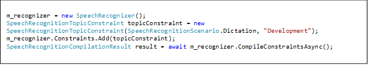
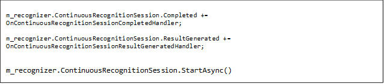
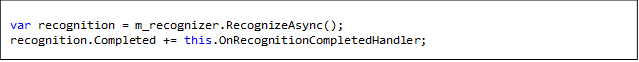

# Get started with Bing Speech Recognition in C&#35; for .Net Universal Apps on Windows 10 (including Phone)

Learn to create and develop a simple Windows 10 Universal Application that uses the [Windows.Media.SpeechRecognition API](https://msdn.microsoft.com/en-us/library/windows.media.speechrecognition.aspx) to convert spoken audio input into text by sending audio to Microsoft’s servers in the cloud. Alternatively you have a choice of using a REST API, which requires batching up all of your audio into a single buffer, uploading the full audio buffer, and getting a recognition result text back. Documentation for the REST API can be found [here](../API-Reference-REST/BingVoiceRecognition.md). Using the [Windows.Media.SpeechRecognition API](https://msdn.microsoft.com/en-us/library/windows.media.speechrecognition.aspx) allows for real-time streaming, so that as the audio is being spoken and streamed to the server, partial recognition results are returned back to the application. The rest of this tutorial describes the use of the [Windows.Media.SpeechRecognition API](https://msdn.microsoft.com/en-us/library/windows.media.speechrecognition.aspx). A sample Windows 10 Universal Application project (to be used with Visual Studio 2015) illustrating basic [Windows.Media.SpeechRecognition API](https://msdn.microsoft.com/en-us/library/windows.media.speechrecognition.aspx) usage can be found for your reference. Download [Universal APP SDK](https://oxfordportal.blob.core.windows.net/example-speech/SpeechRecognitionExample.UniversalApp.zip).

## Prerequisites

1.	Install Windows 10 from [here](http://dev.windows.com/en-us/).
2.	Install Visual Studio 2015 from [here](http://dev.windows.com/en-us/). During the installation of Visual Studio 2015, make sure that you select the **Custom installation** option and check all the **Universal Windows App Development Tools** options.
3.	Upgrade your Visual Studio 2015 to **Update 2**.

If you have a **pre-existing installation of Visual Studio 2015** and are unsure if the **Universal Windows App Development Tools** options were set, do the following.

1. Go to **Control Panel** > **Programs** > **Programs and Features** and look for your Microsoft Visual Studio 2015 entry.
2. Right-click on the **Visual Studio 2015** application and choose **Change**.
3. Wait a bit and, in the upcoming Visual Studio 2015 dialog box, choose **Modify**. Look in the upcoming list of options for **Universal Windows App Development Tools** and click on that to reveal all the options under **Universal Windows App Development Tools** to select all of them.
34. Hit **Next** and then **Update** to install **Update 2**.

## Step 1: Create an Windows 10 Universal Application Project

In this step you will create a Windows 10 Universal application project where you will use the [Windows.Media.SpeechRecognition API](https://msdn.microsoft.com/en-us/library/windows.media.speechrecognition.aspx)

1. Open Visual Studio 2015.
2. From the **File** menu, click **New** and then **Project**.
In the **New Project** dialog box, click **Visual C#** > **Windows** > **Windows Universal** > **Blank App (Windows Universal)**.

## Step 2: Add Speech Recognition API Use in Your Application
Now, you will add use of the Bing Speech Recognition API in your application to convert spoken audio input into text. You can look at the code in MainPage.xaml.cs [Universal APP SDK](https://oxfordportal.blob.core.windows.net/example-speech/SpeechRecognitionExample.UniversalApp.zip) for reference.

1. Create a SpeechRecognizer object.

2. Create at least one SpeechRecognitionConstraint type object and add to the SpeechRecognizer object created above. For our simple dictation scenario, we use the pre-defined SpeechRecognitionTopicConstraint constraint type.

3. Compile the constraints.

SpeechRecognizer supports 2 types of recognition sessions:

* **Continuous recognition sessions** for prolonged audio input from the user. Here, recognition results for phrases spoken during the session are continually produced and returned to the user while the user continues speaking. A continuous session needs to be either explicitly ended or automatically times out after a configurable period of silence (default is 20 seconds).

* **Speech recognition session for recognizing** a short phrase. The session is terminated and the recognition results returned when a pause is detected by the recognizer.

The objects corresponding to each of these types of sessions have various events for which handlers can be attached to obtain notification of various interesting events during the recognition session.

A continuous recognition session can be started by calling the SpeechRecognizer.ContinuousRecognitionSession.StartAsync method. The SpeechRecognizer.ContinuousRecognitionSession object provides the following events:

* **ResultGenerated event:** Triggered every time results of a phrase spoken during the session are available. The results are passed as an argument to any handlers attached to the event.

* **Completed event:** Triggered at the end of a continuous recognition session.

A speech recognition session for short phrase recognition can be started by calling the SpeechRecognizer.RecognizeAsync method. This returns an IAsyncOperation< SpeechRecognitionResult > object, which provides the Completed event that is triggered upon completion of the recognition session. The results are passed as an argument to any handlers attached to the Completed event.

For the short phrase and continuous recognition scenarios, results are available in a SpeechRecognitionResult object accessible through the arguments of the Completed and ResultGenerated event handlers respectively. This object provides n-best alternatives in decreasing order of quality (results with highest recognition confidence level is first followed by results with decreasing recognition confidence levels).

Additionally, the SpeechRecognizer object itself includes a HypothesisGenerated event that is triggered every time partial results (or hypothesis) of the recognition is available before the final recognition results are produced. This event applies to both short phrase and continuous speech recognition sessions. Partial recognition results are passed as an argument to any handlers attached to the event.

## Step 3: Deploying and Running Your Application
This part describes some of the necessary steps for successfully running the speech recognition feature in your app.

1. Add the **Microphone** capability in your project’s Package.appxmanifest (see the example project for reference)
2. If you run the app on Windows 10 Mobile, enable the speech recognition service on your Windows Phone device or the emulator by going to **Settings** > **Privacy** > **Speech, inking & typing**, and enabling the **Get to know me** feature.

      On desktop and other Windows 10 universal devices, you will receive a prompt on starting the application, asking permission to use the speech recognition service.

In conclusion, we should note that this tutorial and the example project provided here only illustrates basic functionality of the [Windows.Media.SpeechRecognition API](https://msdn.microsoft.com/en-us/library/windows.media.speechrecognition.aspx). These APIs offer a much richer set of features that we encourage you to explore through the API documentation on MSDN.

## Related Topics
* [Get Started with Speech Recognition in C Sharp for .Net on Windows Desktop](GetStartedCSharpDesktop.md)
* [Get Started with Speech Recognition in C Sharp for .Net on Windows Phone 8.1](GetStartedCSharpWinPhone.md)
* [Get started with Speech Recognition in Java on Android](GetStartedJavaAndroid.md)
* [Get started with Speech Recognition in Objective C on iOS](Get-Started-ObjectiveC-iOS.md)
* [Get started with Bing Speech API in cURL](GetStarted-cURL.md)

