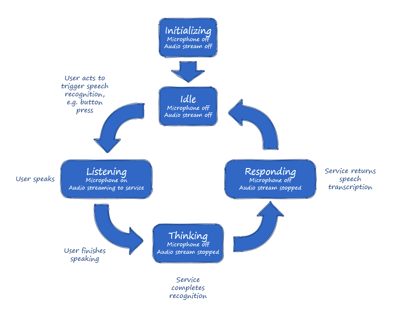

# Basic concepts

[!INCLUDE [Deprecation note](../../../includes/cognitive-services-bing-speech-api-deprecation-note.md)]

This page describes some basic concepts in Microsoft speech recognition service. We recommend you to read this page before using Microsoft speech recognition API in your application.

## Understanding speech recognition

If this is the first time you're creating a speech-enabled application, or if it's the first time you're adding speech capabilities to an existing application, this section helps you get started. If you already have some experience with speech-enabled applications, you may choose to just skim this section, or you may skip it entirely if you're an old hand at speech and you want to get right to the protocol details.

### Audio streams

Foremost among the basic concepts of speech is the *audio stream*. Unlike a keystroke, which occurs at a single point in time and contains a single piece of information, a spoken request is spread over hundreds of milliseconds and contains many kilobytes of information. The duration of spoken utterances presents some difficulty to developers looking to provide a streamlined and elegant speech experience for their application. Today's computers and algorithms perform speech transcription in approximately half of the duration of the utterance, so a 2-second utterance can be transcribed in roughly 1 second, but any application that experiences a 1-second delay in processing user is neither streamlined nor elegant.

Fortunately, there are ways of "hiding" the transcription time by performing transcription on one
part of the utterance while the user is speaking another part. For example, by splitting a 1-second utterance into 10 chunks of 100 milliseconds and by performing transcription on each chunk in turn, over 450 of the total 500 milliseconds required for transcription can be "hidden" so that the user is unaware transcription is being performed while he/she is speaking. When thinking about this example, remember that the service is performing transcription on the previous 100 milliseconds of audio while the user is speaking the next 100, so when the user stops speaking, the service will only have to transcribe roughly 100 milliseconds of audio to produce a result.

To achieve this user experience, spoken audio information is collected in chunks and transcribed as the user speaks. These audio chunks collectively from the *audio stream*, and the process of sending these audio chunks to the service is called *audio streaming.* Audio streaming is an important part of any speech-enabled application; tuning the chunk size and optimizing the streaming implementation are some of the most impactful ways of improving your application's user experience.

### Microphones

People process spoken audio using their ears, but inanimate hardware uses microphones. To enable speech in any application, you need to integrate with the microphone providing the audio stream for your application.

The APIs for your microphone must allow you to start and stop receiving audio bytes from the microphone. You need to decide what user actions will trigger the microphone to start listening for speech. You may choose to have a button press trigger the start of listening, or you may choose to have a *key word* or *wake word* spotter always listening to the microphone and to use the output of that module to trigger sending audio to the Microsoft Speech Service.

### End of speech

Detecting *when* a speaker has *stopped* speaking seems simple enough for humans but is a rather difficult problem outside of laboratory conditions. It is not enough to simply look for pure silence after an utterance, since there is often a lot of ambient noise to complicate things. The Microsoft Speech Service does an excellent job of quickly detecting when a user has stopped speaking, and the service can inform your application of this fact, but this arrangement does mean that your application is the last to know when the user stop speaking. This isn't at all like other forms of input where your application is the *first* to know when the user's input starts *and* ends.

### Asynchronous service responses

The fact that your application needs to be informed of when user input is complete doesn't impose any performance penalties or programming difficulties on your application, but it does require that you think about speech requests differently from the input request/response patterns with which you are familiar. Since your application won't know when the user stops speaking, your application must continue to stream audio to the service while simultaneously and asynchronously waiting on a response from the service. This pattern is unlike other request/response web protocols like HTTP. In those protocols, you must complete a request before receiving any response; in the Microsoft Speech Service protocol, you receive responses *while you are still streaming audio for the request*.

> [!NOTE]
> This feature is not supported when using Speech HTTP REST API.

### Turns

Speech is a carrier of information. When you speak, you are trying to convey information that is in your possession to someone who is listening for that information. When conveying information, you usually take turns speaking and listening. Likewise, your speech-enabled application interacts with users by alternately listening and responding, although your application usually does most of the listening. The user's spoken input and the service response to this input is called a *turn*. A *turn* starts when
the user speaks and ends when your application has completed handling of the speech service response.

### Telemetry

Creating a speech-enabled device or application can be challenging, even for experienced developers. Stream-based protocols often seem daunting at first glance, and important details like silence detection may be completely new. With so many messages needing to be successfully sent and received to complete a single request/response pair, it is *very* important to collect complete and accurate data about those messages. The Microsoft Speech Service protocol provides for the collection of this data. You should make every effort to supply the required data as accurately as possible; by supplying complete and accurate data, you will be helping yourself -- should you ever need help from the Microsoft Speech Service Team in troubleshooting your client implementation, the quality of the telemetry data you have gathered will be critical for problem analysis.

> [!NOTE]
> This feature is not supported when using speech recognition REST API.

### Speech application states

The steps you take to enable speech input in your application are a little different than the steps for other forms of input such as mouse clicks or finger taps. You must keep track of when your application is listening to the microphone and sending data to the speech service, when it is waiting for a response from the service and when it is in an idle state. The relationship between these states is shown in the diagram below.



Since the Microsoft Speech Service participates in some of the states, the service protocol defines messages that help your application transition between states. Your application needs to interpret and act on these protocol messages to track and manage the speech application states.

## Using the speech recognition service from your apps

Microsoft speech recognition service  provides two ways for developers to add Speech to their apps.

- [REST APIs](GetStarted/GetStartedREST.md): Developers can use HTTP calls from their apps to the service for speech recognition.
- [Client libraries](GetStarted/GetStartedClientLibraries.md): For advanced features, developers can download Microsoft Speech client libraries, and link into their apps.  The client libraries are available on various platforms (Windows, Android, iOS) using different languages (C#, Java, JavaScript, ObjectiveC).

| Use cases | [REST APIs](GetStarted/GetStartedREST.md) | [Client Libraries](GetStarted/GetStartedClientLibraries.md) |
|-----|-----|-----|
| Convert a short spoken audio, for example, commands (audio length < 15 s) without interim results | Yes | Yes |
| Convert a long audio (> 15 s) | No | Yes |
| Stream audio with interim results desired | No | Yes |
| Understand the text converted from audio using LUIS | No | Yes |

 If your language or platform does not yet have an SDK, you can create your own implementation based on the [protocol documentation](API-Reference-REST/websocketprotocol.md).

## Recognition modes

There are three modes of recognition: `interactive`, `conversation`, and `dictation`. The recognition mode adjusts speech recognition based on how the users are likely to speak. Choose the appropriate recognition mode for your application.

> [!NOTE]
> Recognition modes might have different behaviors in the [REST protocol](#rest-speech-recognition-api) than they do in the [WebSocket protocol](#webSocket-speech-recognition-api). For example, the REST API does not support continuous recognition, even in conversation or dictation mode.
> [!NOTE]
> These modes are applicable when you directly use the REST or WebSocket protocol. The [client libraries](GetStarted/GetStartedClientLibraries.md) use different parameters to specify recognition mode. For more information, see the client library of your choice.

The Microsoft Speech Service returns only one recognition phrase result for all recognition modes. There is a limit of 15 seconds for any single utterance.

### Interactive mode

In `interactive` mode, a user makes short requests and expects the application to perform an action in response.

The following characteristics are typical of interactive mode applications:

- Users know they are speaking to a machine and not to another human.
- Application users know ahead of time what they want to say, based on what they want the application to do.
- Utterances typically last about 2-3 seconds.

### Conversation mode

In `conversation` mode, users are engaged in a human-to-human conversation.

The following characteristics are typical of conversation mode applications:

- Users know that they are talking to another person.
- Speech recognition enhances the human conversations by allowing one or both participants to see the spoken text.
- Users do not always plan what they want to say.
- Users frequently use slang and other informal speech.

### Dictation mode

In `dictation` mode, users recite longer utterances to the application for further processing.

The following characteristics are typical of dictation mode applications:

- Users know that they are talking to a machine.
- Users are shown the speech recognition text results.
- Users often plan what they want to say and use more formal language.
- Users employ full sentences that last 5-8 seconds.

> [!NOTE]
> In dictation and conversation modes, the Microsoft Speech Service does not return partial results. Instead, the service returns stable phrase results after silence boundaries in the audio stream. Microsoft might enhance the speech protocol to improve the user experience in these continuous recognition modes.

## Recognition languages

The *recognition language* specifies the language that your application user speaks. Specify the *recognition language* with the *language* URL query parameter on the connection. The value of the *language* query parameter uses the IETF language tag [BCP 47](https://en.wikipedia.org/wiki/IETF_language_tag), and **must** be one of the languages that are supported by speech recognition API. The complete list of languages supported by the Speech Service can be found in the page [Supported Languages](API-Reference-REST/supportedlanguages.md).

The Microsoft Speech Service rejects invalid connection requests by displaying an `HTTP 400 Bad Request` response. An invalid request is one that:

- Does not include a *language* query parameter value.
- Includes a *language* query parameter that is incorrectly formatted.
- Includes a *language* query parameter that is not one of the support languages.

You may choose to build an application that supports one or all of the languages that are supported by the service.

### Example

In the following example, an application uses *conversation* speech recognition mode for a US English speaker.

```HTTP
https://speech.platform.bing.com/speech/recognition/conversation/cognitiveservices/v1?language=en-US
```

## Transcription responses

The transcription responses return the converted text from audio to clients. A transcription response contains the following fields:

- `RecognitionStatus` specifies the status of the recognition. The possible values are given in the table below.

| Status | Description |
| ------------- | ---------------- |
| Success | The recognition was successful and the DisplayText field is present |
| NoMatch | Speech was detected in the audio stream, but no words from the target language were matched. See [NoMatch Recognition Status(#nomatch-recognition-status) for more details  |
| InitialSilenceTimeout | The start of the audio stream contained only silence, and the service timed out waiting for speech |
| BabbleTimeout | The start of the audio stream contained only noise, and the service timed out waiting for speech |
| Error | The recognition service encountered an internal error and could not continue |

- `DisplayText` represents the recognized phrase after capitalization, punctuation, and inverse-text-normalization have been applied and profanity has been masked with asterisks. The DisplayText field is present *only* if the `RecognitionStatus` field has the value `Success`.

- `Offset` specifies the offset (in 100-nanosecond units) at which the phrase was recognized, relative to the start of the audio stream.

- `Duration`specifies the duration (in 100-nanosecond units) of this speech phrase.

A transcription response returns more information if desired. See [output format](#output-format) for how to return more detailed outputs.

Microsoft Speech Service supports additional transcription process that includes adding capitalization and punctuation, masking profanity, and normalizing text to common forms. For example, if a user speaks a phrase represented by the words "remind me to buy six iPhones", Microsoft's Speech Services will return the transcribed text "Remind me to buy 6 iPhones." The process that converts the word "six" to the number "6" is called *Inverse Text Normalization* (*ITN* for short).

### NoMatch recognition status

The transcription response returns `NoMatch` in `RecognitionStatus` when the Microsoft Speech Service detects speech in the audio stream but is unable to match that speech to the language grammar being used for the request. For example, a *NoMatch* condition might occur if a user says something in German when the recognizer expects US English as the spoken language. The waveform pattern of the utterance would indicate the presence of human speech, but none of the words spoken would match the US English lexicon being used by the recognizer.

Another *NoMatch* condition occurs when the recognition algorithm is unable to find an accurate match for the sounds contained in the audio stream. When this condition happens, the Microsoft Speech Service may produce *speech.hypothesis* messages that contain *hypothesized text* but will produce a *speech.phrase* message in which the *RecognitionStatus* is *NoMatch*. This condition is normal; you must not make any assumptions about the accuracy or fidelity of the text in the *speech.hypothesis* message. Furthermore, you must not assume that because the Microsoft Speech Service produces *speech.hypothesis* messages that the service is able to produce a *speech.phrase* message with *RecognitionStatus* *Success*.

## Output format

Microsoft Speech Service can return a variety of payload formats in transcription responses. All payloads are JSON structures.

You can control the phrase result format by specifying the `format` URL query parameter. By default, the service returns `simple` results.

| Format | Description |
|-----|-----|
| `simple` | A simplified phrase result containing the recognition status and the recognized text in display form. |
| `detailed` | A recognition status and N-best list of phrase results where each phrase result contains all four recognition forms and a confidence score. |

The `detailed` format contains [N-best values](#n-best-values), in addition to `RecognitionStatus`, `Offset`, and `duration`, in the response.

### N-best values

Listeners, whether human or machine, can never be certain that they heard *exactly* what was spoken. A listener can assign a *probability* only to a particular interpretation of an utterance. 

In normal conditions, when speaking to others with whom they frequently interact, people have a high probability of recognizing the words that were spoken. Machine-based speech listeners strive to achieve similar accuracy levels and, under the right conditions, [they achieve parity with humans](https://blogs.microsoft.com/next/2016/10/18/historic-achievement-microsoft-researchers-reach-human-parity-conversational-speech-recognition/#sm.001ykosqs14zte8qyxj2k9o28oz5v).

The algorithms that are used in speech recognition explore alternative interpretations of an utterance as part of normal processing. Usually, these alternatives are discarded as the evidence in favor of a single interpretation becomes overwhelming. In less than optimal conditions, however, the speech recognizer finishes with a list of alternate possible interpretations. The top *N* alternatives in this list are called the *N-best list*. Each alternative is assigned a [confidence score](#confidence). Confidence scores range from 0 to 1. A score of 1 represents the highest level of confidence. A score of 0 represents the lowest level of confidence.

> [!NOTE]
> The number of entries in the N-best list vary across multiple utterances. The number of entries can vary across multiple recognitions of the *same* utterance. This variation is a natural and expected outcome of the probabilistic nature of the speech recognition algorithm.

Each entry returned in the N-best list contains

- `Confidence`, which represents the [confidence scores](#confidence) of this entry.
- `Lexical`, which is the [lexical form](#lexical-form) of the recognized text.
- `ITN`, which is the [ITN form](#itn-form) of the recognized text.
- `MaskedITN`, which is the [masked ITN form](#masked-itn-form) of the recognized text.
- `Display`, which is the [display form](#display-form) of the recognized text.

### Confidence scores <a id="confidence"></a>

Confidence scores are integral to speech recognition systems. The Microsoft Speech Service obtains confidence scores from a *confidence classifier*. Microsoft trains the confidence classifier over a set of features that are designed to maximally discriminate between correct and incorrect recognition. Confidence scores are evaluated for individual words and entire utterances.

If you choose to use the confidence scores that are returned by the service, be aware of the following behavior:

- Confidence scores can be compared only within the same recognition mode and language. Do not compare scores between different languages or different recognition modes. For example, a confidence score in interactive recognition mode has *no* correlation to a confidence score in dictation mode.
- Confidence scores are best used on a restricted set of utterances. There is naturally a great degree of variability in the scores for a large set of utterances.

If you choose to use a confidence score value as a *threshold* on which your application acts, use speech recognition to establish the threshold values.

- Execute speech recognition on a representative sample of utterances for your application.
- Collect the confidence scores for each recognition in the sample set.
- Base your threshold value on some percentile of confidence for that sample.

No single threshold value is appropriate for all applications. An acceptable confidence score for one application might be unacceptable for another application.

### lexical form

The lexical form is the recognized text, exactly how it occurred in the utterance and without punctuation or capitalization. For example, the lexical form of the address "1020 Enterprise Way" would be *ten twenty enterprise way*, assuming that it was spoken that way. The lexical form of the sentence "Remind me to buy 5 pencils" is *remind me to buy five pencils*.

The lexical form is most appropriate for applications that need to perform non-standard text normalization. The lexical form is also appropriate for applications that need unprocessed recognition words.

Profanity is never masked in the lexical form.

### ITN form

Text normalization is the process of converting text from one form to another "canonical" form. For example, the phone number "555-1212" might be converted to the canonical form *five five five one two one two*. *Inverse* text normalization (ITN) reverses this process, converting the words "five five five one two one two" to the inverted canonical form *555-1212*. The ITN form of a recognition result does not include capitalization or punctuation.

The ITN form is most appropriate for applications that act on the recognized text. For example, an application that allows a user to speak search terms and then uses these terms in a web query would use the ITN form. Profanity is never masked in the ITN form. To mask profanity, use the *Masked ITN form*.

### Masked ITN form

Because profanity is naturally a part of spoken language, the Microsoft Speech Service recognizes such words and phrases when they are spoken. Profanity might not, however, be appropriate for all applications, especially those applications with a restricted, non-adult user audience.

The masked ITN form applies profanity masking to the inverse text normalization form. To mask profanity, set the value of the profanity parameter value to `masked`. When profanity is masked, words that are recognized as part of the language's profanity lexicon are replaced with asterisks. For example: *remind me to buy 5 **** pencils*. The masked ITN form of a recognition result does not include capitalization or punctuation.

> [!NOTE]
> If the profanity query parameter value is set to `raw`, the masked ITN form is the same as the ITN form. Profanity is *not* masked.

### Display form

Punctuation and capitalization signal where to put emphasis, where to pause, and so on, which makes text easier to understand. The display form adds punctuation and capitalization to recognition results, making it the most appropriate form for applications that display the spoken text.

Because the display form extends the masked ITN form, you can set the profanity parameter value to `masked` or `raw`. If the value is set to `raw`, the recognition results include any profanity spoken by the user. If the value is set to `masked`, words recognized as part of the language's profanity lexicon are replaced with asterisks.

### Sample responses

All payloads are JSON structures.

The payload format of the `simple` phrase result:

```json
{
  "RecognitionStatus": "Success",
  "DisplayText": "Remind me to buy 5 pencils.",
  "Offset": "1236645672289",
  "Duration": "1236645672289"
}
```

The payload format of the `detailed` phrase result:

```json
{
  "RecognitionStatus": "Success",
  "Offset": "1236645672289",
  "Duration": "1236645672289",
  "NBest": [
      {
        "Confidence" : "0.87",
        "Lexical" : "remind me to buy five pencils",
        "ITN" : "remind me to buy 5 pencils",
        "MaskedITN" : "remind me to buy 5 pencils",
        "Display" : "Remind me to buy 5 pencils.",
      },
      {
        "Confidence" : "0.54",
        "Lexical" : "rewind me to buy five pencils",
        "ITN" : "rewind me to buy 5 pencils",
        "MaskedITN" : "rewind me to buy 5 pencils",
        "Display" : "Rewind me to buy 5 pencils.",
      }
  ]
}
```

## Profanity-handling in speech recognition

The Microsoft Speech Service recognizes all forms of human speech, including words and phrases that many people would classify as "profanity." You can control how the service handles profanity by using the *profanity* query parameter. By default, the service masks profanity in *speech.phrase* results and does not return *speech.hypothesis* messages that contain profanity.

| *Profanity* value | Description |
| - | - |
| `masked` | Masks profanity with asterisks. This behavior is the default. | 
| `removed` | Removes profanity from all results. |
| `raw` | Recognizes and returns profanity in all results. |

### Profanity value `Masked`

To mask profanity, set the *profanity* query parameter to the value *masked*. When the *profanity* query parameter has this value or is not specified for a request, the service *masks* profanity. The service performs masking by replacing profanity in the recognition results with asterisks. When you specify profanity-masking handling, the service does not return *speech.hypothesis* messages that contain profanity.

### Profanity value `Removed`

When the *profanity* query parameter has the value *removed*, the service removes profanity from both *speech.phrase* and *speech.hypothesis* messages. The results are the same *as if the profanity words were not spoken*.

#### Profanity-only utterances

A user might speak *only* profanity when an application has configured the service to remove profanity. For this scenario, if the recognition mode is *dictation* or *conversation*, the service does not return a *speech.result*. If the recognition mode is *interactive*, the service returns a *speech.result* with the status code *NoMatch*. 

### Profanity value `Raw`

When the *profanity* query parameter has the value *raw*, the service does not remove or mask profanity in either the *speech.phrase* or *speech.hypothesis* messages.
