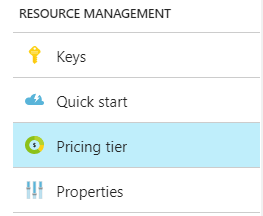

# Welcome to Text Analytics API in Microsoft Cognitive Services

[Microsoft Cognitive Services](https://azure.microsoft.com/services/cognitive-services/) is a collection of machine learning and AI technologies in the cloud, exposed through APIs so that you can consume state-of-the-art technology in your development projects.

 Within Cognitive Services, **Text Analytics API** provides capabilities for sentiment analysis, key phrase extraction, and language detection. Our models are pretrained. To run any workload, all you need to do is upload your data for scoring and analysis.

## Capabilities in Text Analytics

Text analysis can mean different things, but in Cognitive Services, APIs are exposed for the three types of analysis described in the following table. Each one is backed by natural language processing resources hosted in Azure, including ready-to-use pretrained models for scoring raw text that you upload to the service.

| Operations | APIs | Description |
|-----------|------|-------------|
|[Sentiment Analysis](text-analytics-concept-sentiment-analysis.md) | [REST](https://westus.dev.cognitive.microsoft.com/docs/services/TextAnalytics.V2.0/operations/56f30ceeeda5650db055a3c9)   [.NET](https://github.com/Microsoft/Cognitive-TextAnalytics-DotNet)  [Android](https://github.com/Microsoft/Cognitive-TextAnalytics-Android) | Sentiment analysis helps you find out what customers think of your brand or topic by analyzing any text for clues about sentiment. This API returns a sentiment score between 0 and 1 for each document. The sentiment score is generated using classification techniques. |
|[Key Phrase Extraction](text-analytics-concept-keyword-extraction.md) | [REST](https://westus.dev.cognitive.microsoft.com/docs/services/TextAnalytics.V2.0/operations/56f30ceeeda5650db055a3c6)   [.NET](https://github.com/Microsoft/Cognitive-TextAnalytics-DotNet)  [Android](https://github.com/Microsoft/Cognitive-TextAnalytics-Android)| Automatically extract key phrases to quickly identify the main points. For example, for the input text ‘The food was delicious and there were wonderful staff’, the service returns the main talking points: ‘food’ and ‘wonderful staff’. Key phrase extraction uses technology from Microsoft Office's sophisticated Natural Language Processing toolkit. |
|[Language Detection](text-analytics-concept-language-detection.md) | [REST](https://westus.dev.cognitive.microsoft.com/docs/services/TextAnalytics.V2.0/operations/56f30ceeeda5650db055a3c7)    [.NET](https://github.com/Microsoft/Cognitive-TextAnalytics-DotNet)  [Android](https://github.com/Microsoft/Cognitive-TextAnalytics-Android)|  For up to 120 languages, the service can detect which language the input text is written in and report a single language code for every document submitted on the request. The code is paired with a score indicating the strength of the score. Typically, the score is either 1.0 for a positive identification, 0.5 for mixed languages or content that is only. |

> [!Note] 
> Text Analytics API is available for consumption scenarios rather than custom development projects. For this reason, we do not document the implementation details or internal architecture of specific technologies. 

 ## Typical workflow

 The workflow is simple: you submit data for analysis and handle outputs in your code. Analyzers are consumed as-is, with no additional configuration or customization.
 
1. [Sign up](https://docs.microsoft.com/azure/cognitive-services/cognitive-services-apis-create-account) for the **Text Analytics API** when creating a Cognitive Services account. As with most Azure Services, there is a free version so that you can experiment at no cost.

2. Post raw unstructured text for scoring or analysis, in JSON, as part of a request for one of the following resources: sentiment analysis, key phrase extraction, or language detection.  

3. Store or stream the response returned from each request. Depending on the request, results are either a sentiment score, a collection of extracted keywords, or a language code.

Output is returned in the form of JSON documents in a one-to-one ratio: one JSON document output for every document input. You can subsequently analyze, visualize, or categorize the results into actionable insights.

Data is not stored in your account. Operations performed by Text Analytics API are stateless, which means the text you provide is processed and results are returned immediately. 

With a few minor exceptions, the content you provide can be used as-is for all three operations. Given a single JSON documents collection, your code can invoke a series of operations (language detection, keyword extraction, sentiment analysis) over the same data.

## Supported languages

Text Analytics can detect language for up to 120 different languages. For sentiment analysis and key phrase extraction, the list of supported languages is more selective as we refine the analyzers to accommodate the linguistic rules of additional languages.

Language support is initially rolled out in preview, graduating to generally available (GA) status, independently of each other and of the Text Analytics service overall. Several languages remain in preview, even though the Text Analytics API itself is GA.

| Language    | Language code | Sentiment | Key phrases |
|:----------- |:----:|:----:|:----:|
| Danish      | `da` | ✔ \* |  |
| German       | `de` | ✔ \* | ✔ |
| Greek       | `el` | ✔ \* |  |
| English     | `en` | ✔ | ✔ | 
| Spanish     | `es` | ✔ | ✔ | 
| Finnish     | `fi` | ✔ \* |  | 
| French      | `fr` | ✔ | ✔ \* | 
| Japanese    | `ja` |  | ✔ |   |
| Italian     | `it` | ✔ \* |  | 
| Dutch       | `nl` | ✔ \* |  | 
| Norwegian   | `no` | ✔ \* |  | 
| Polish      | `pl` | ✔ \* |  | 
| Portuguese  | `pt` | ✔ |  | 
| Russian     | `ru` | ✔ \* |  | 
| Swedish     | `sv` | ✔ \* |  | 
| Turkish     | `tr` | ✔ \* |  | 

\* indicates language support in preview

## Data limits

Text Analytics accepts raw text data. The service currently sets a limit of 10 KB for each document. If you need to analyze larger documents, you can break them up into 10 KB chunks. If you still require a higher limit, [contact us](https://azure.microsoft.com/overview/sales-number/) so that we can discuss your requirements.

|Limits | |
|------------------------|---------------|
| Maximum size of a single document | 10 KB |
| Maximum size of entire request | 1 MB |
| Maximum number of documents in a request | 1,000 documents |

Rate limiting exists at a rate of 100 calls per minute. We therefore recommend that you submit large quantities of documents in a single call. 

## Signup and billing

Although Cognitive Services has multiple APIs, we ask you to sign up for them individually so that you can manage costs and availability for each one.

+ [Pricing for text analytics](https://azure.microsoft.com/pricing/details/cognitive-services/text-analytics/)
+ [Calculator](https://azure.microsoft.com/pricing/calculator/?service=cognitive-services)

Billing is based on transactions, where a transaction is based on the number of documents multiplied by unit of operation. There is no storage component to billing because we do not store your data. The following table illustrates the billing model at a glance.

| Document | Sentiment | Key Phrase | Language Detection | Transactions |
|----------|-----------|------------|--------------------|--------------|
| 1  | ✔ | ✔ | ✔ | 3 |
| 100 | ✔ | ✔ |   | 200 |
| 1000 |   |   | ✔ | 1000 |

Each tier provides an allocation of transactions to be consumed over a 30-day billing cycle. The counter is reset back to 0 on day 31. 

**What happens if transactions get used up before the current billing period ends?**

At the Free tier, excess requests are not handled and you get a message explaining why the request was dropped.

For billable tiers, an overage rate is applied for each transaction above the limit. The overage rate varies by tier, as indicated on the [pricing page](https://azure.microsoft.com/pricing/details/cognitive-services/text-analytics/). 

 > [!Note]
 > Text Analytics was [first announced](https://blogs.technet.microsoft.com/machinelearning/2016/06/21/text-analytics-api-now-available-in-multiple-languages/) in June 2016 and is now [generally available (GA)](https://azure.microsoft.com//blog/) with support for production workloads. Preview pricing has been retired. For more information about service level agreements (SLA) from Microsoft, see [SLA for Cognitive Services](https://azure.microsoft.com/support/legal/sla/cognitive-services/v1_1/).

**How to sign up**

Sign in to the Azure portal, create a [Cognitive Services API account](https://docs.microsoft.com/azure/cognitive-services/cognitive-services-apis-create-account), choosing the **Text Analytics API**.

**How to restrict access to the API**

Selectively enable or disable access to specific APIs within your organization by [creating resource policies](../../azure-resource-manager/resource-manager-policy-portal.md).

**How to change tiers**

Standard billing is offered at graduated levels of transactions. You can switch tiers and still keep the same endpoint and access keys.

1. Sign in to [Azure portal](https://portal.azure.com) and find your Text Analytics API dashboard.

2. Click **Price Tier**.

   

3. Choose the tier you want and click **Select**.  The new limits take effect as soon as the selection is processed. 

   

## Next steps

First, try the [interactive demo](https://azure.microsoft.com/services/cognitive-services/text-analytics/). You can paste a text input (5K character maximum) to detect the language (up to 120), calculate a sentiment score, or extract key phrases.

Next, step through the [quickstart REST API tutorial](quick-start.md) to learn the basic workflow using the REST API. You can use a Web API testing tool like Chrome Postman or Telerik Fiddler to minimize code investments while you evaluate the service.

For .NET developers, we recommend the [Cognitive Services Text Analytics .NET SDK](https://github.com/Microsoft/Cognitive-TextAnalytics-DotNet) for developing text analysis apps in managed code.

## See also

 [Cognitive Services Documentation page](https://docs.microsoft.com/azure/cognitive-services/)   
 [Cognitive Services Product page](https://azure.microsoft.com/services/cognitive-services/)