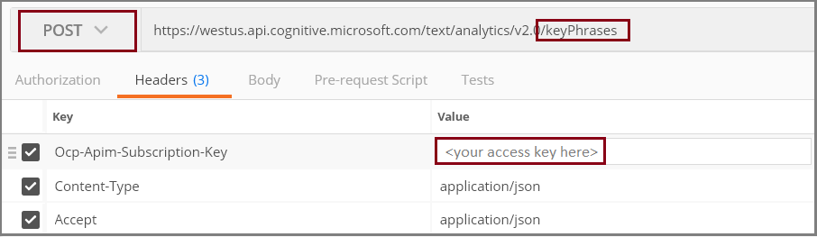
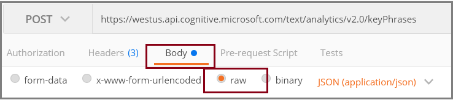

# Analyze keywords, sentiment and language in ten minutes (REST API)

In this Quickstart, learn how to call the Text Analytics REST APIs to perform key phrase extraction, sentiment analysis, and language detection on text provided in requests to Microsoft Cognitive Services.

To complete this Quickstart, you need an interactive tool for sending HTTP requests. 

+ [Chrome Postman](https://chrome.google.com/webstore/detail/postman/fhbjgbiflinjbdggehcddcbncdddomop), [Telerik Fiddler](https://www.telerik.com/download/fiddler), or any interactive Web API testing tool is recommended if you already have it. Once a request is set up, request headers and body are retained for multiple operations, which means less copy and paste. 
+ Alternatively, use the built-in console app in our REST API documentation pages to interact with each API individually. To use it, click the **Open API testing console** button on any of our doc pages.

## Before you begin

To use Microsoft Cognitive Service APIs, create a [Cognitive Services API account](https://docs.microsoft.com/azure/cognitive-services/cognitive-services-apis-create-account) in the Azure portal. 

If you don't have an Azure subscription, create a [free account](https://azure.microsoft.com/free/) before you begin.

> [!Note]
> Cognitive Services has many APIs. Billing, policies, and release cycles vary for each API, so we ask you to sign up for each one individually. 

## Set up a request 

In this first exercise, you will structure the request, using key phrase extraction as the first analysis.

Text Analytics APIs invoke operations against pretrained models and machine learning algorithms running in Azure data centers. You need your own key to access the operations. 

Endpoints for each operation include the resource providing the underlying algorithms used for a particular analysis: **sentiment analysis**, **key phrase extraction**, and **language detection**. Each request must specify which resource to use. We list them in full below.

1. In the [Azure portal](https://portal.azure.com), find the Text Analysis API. If it's not pinned to dashboard, search for "text analytics" to find the page. Leave the page open so that you can copy an acess key and endpoint, starting in the next step.

2. If you are using Postman or another tool, set up the request as follows:

   + Choose **Post** as the request type.
   + Paste in the endpoint you copied from the portal page.
   + Append a resource. In this exercise, start with **/keyPhrases**.

  Endpoints for each available resource are as follows (your region may vary):

   + `https://westus.api.cognitive.microsoft.com/text/analytics/v2.0/sentiment`
   + `https://westus.api.cognitive.microsoft.com/text/analytics/v2.0/keyPhrases`
   + `https://westus.api.cognitive.microsoft.com/text/analytics/v2.0/languages`

3. Set three request headers:

   + `Ocp-Apim-Subscription-Key` set to your access key, obtained from Azure portal.
   + `Content-Type` set to application/json.
   + `Accept` set to application/json.

  Your request should look similar to the following screenshot:

   

4. Click **Body** and choose **raw** for the format.

   

5. Paste in the JSON documents below text for analysis. 

   ```
    {
        "documents": [
            {
                "language": "en",
                "id": "1",
                "text": "We love this trail and make the trip every year. The views are breathtaking and well worth the hike!"
            },
            {
                "language": "en",
                "id": "2",
                "text": "Poorly marked trails! I thought we were goners. Worst hike ever."
            },
            {
                "language": "en",
                "id": "3",
                "text": "Everyone in my family liked the trail but thought it was too challenging for the less athletic among us. Not necessarily recommended for small children."
            },
            {
                "language": "en",
                "id": "4",
                "text": "It was foggy so we missed the spectacular views, but the trail was ok. Worth checking out if you are in the area."
            },                
            {
                "language": "en",
                "id": "5",
                "text": "Me encanta este sendero. Tiene hermosas vistas y muchos lugares para detenerse y descansar"
            }
        ]
    }
```

### About the request body

Input rows must be JSON in raw text. XML is not supported. The schema is simple, consisting of the elements below. You can use the same documents for all three operations: sentiment, key phrase, and language detection.

> [!Note]
> The Spanish string is included to demonstrate [language detection](#detect-language), described in a following section.

+ `id` is required. The data type is string, but in practice document IDs tend to be integers. The system uses this ID to structure the output. Language codes, keywords, and sentiment scores are provided for each ID.

+ `text` field contains unstructured raw text, up to 10 KB. For more information about limits, see [Text Analytics Overview > Data limits](overview.md#data-limits). 

+ `language` is used only in sentiment analysis and key phrase extraction. It is ignored in language detection. For both sentiment analysis and key phrase extraction, language is an optional parameter but if you do not provide it, the service performs an additional language detection pass. For maximum efficiency, you should always include the language in the request, assuming you know what it is. Refer to the [Text Analytics Overview > Supported Languages](overview.md#supported-languages) for a list of supported languages.

## Key phrase extraction

1. Make sure you set up the request as described in the previous section.

2. Click **Send** to submit the request.

All POST requests return a JSON formatted response with the IDs and detected properties. An example of the output for key phrase extraction is shown below. The keyPhrases algorithm iterates over the entire collection before extracting phrases, using the context of all strings to determine which ones to extract.

```
{
    "documents": [
        {
            "keyPhrases": [
                "year",
                "trail",
                "trip",
                "views"
            ],
            "id": "1"
        },
        {
            "keyPhrases": [
                "Worst hike",
                "trails",
                "goners"
            ],
            "id": "2"
        },
        {
            "keyPhrases": [
                "family",
                "trail",
                "us",
                "small children"
            ],
            "id": "3"
        },
        {
            "keyPhrases": [
                "spectacular views",
                "trail",
                "Worth",
                "area"
            ],
            "id": "4"
        },
        {
            "keyPhrases": [
                "Tiene hermosas vistas y muchos lugares para detenerse y descansar",
                "encanta este sendero"
            ],
            "id": "5"
        }
    ],
    "errors": []
}
```

### Review the output

Presenting inputs and outputs side by side helps us see how the key phrase extraction algorithm operates. 

The analyzer finds and discards non-essential words, and keeps single terms or phrases that appear to be the subject or object of a sentence.

| ID | Input | key phrase output | 
|----|-------|------|
| 1 | "We love this trail and make the trip every year. The views are breathtaking and well worth the hike!" | "year", "trail", "trip", "views"" |
| 2 | "Poorly marked trails! I thought we were goners. Worst hike ever." | "Worst hike",  "trails", "goners" |
| 3 | "Everyone in my family liked the trail but thought it was too challenging for the less athletic among us. Not necessarily recommended for small children." | "family", "trail", "us", "small children"|
| 4 | "It was foggy so we missed the spectacular views, but the trail was ok. Worth checking out if you are in the area." | "spectacular views", "trail", "Worth", "area" |
| 5 | "Tiene hermosas vistas y muchos lugares para detenerse y descansar", "encanta este sendero" | |

### Change the language code for the Spanish string

Key phrase extraction is verbose for the Spanish string. Let's change the language from `en` to `es` for Spanish and resend the request. Notice the results are now consistent with what we see for the English strings.

        {
            "keyPhrases": [
                "lugares",
                "sendero"
            ],
            "id": "5"

## Analyze sentiment

Using the same documents, you can edit the existing request to call the sentiment analysis algorithm and return sentiment scores.

1. In the request header, replace `/keyPhrases` with `/sentiment` in the endpoint.

2. Click **Send**.

The response includes a sentiment score between 0.0 (negative) and 1.0 (positive) to indicate relative sentiment.

```
{
    "documents": [
        {
            "score": 0.989059339865683,
            "id": "1"
        },
        {
            "score": 0.00626599157674657,
            "id": "2"
        },
        {
            "score": 0.919842553279166,
            "id": "3"
        },
        {
            "score": 0.841722489453801,
            "id": "4"
        },
        {
            "score": 0.5,
            "id": "5"
        }
    ],
    "errors": []
}
```

The API returns a score and ID, but not the input string. The following table shows the original strings so that you can evaluate the score with your own interpretation of positive or negative sentiment.

| ID | Score | Bias | String |
|----|-------|------|--------|
| 1 | 0.989059339865683  | positive | "We love this trail and make the trip every year. The views are breathtaking and well worth the hike!" |
| 2 | 0.00626599157674657  | negative | "Poorly marked trails! I thought we were goners. Worst hike ever." |
| 3 | 0.919842553279166  | positive | "Everyone in my family liked the trail but thought it was too challenging for the less athletic among us. Not necessarily recommended for small children." |
| 4 | 0.841722489453801  | positive | "It was foggy so we missed the spectacular views, but the trail was ok. Worth checking out if you are in the area." |
| 5 | 0.5 | indeterminate <sup>1</sup> | "Me encanta este sendero. Tiene hermosas vistas y muchos lugares para detenerse y descansar." |

<sup>1</sup> The Spanish string is not parsed for sentiment because the language code is `en` instead of `es`. When a string cannot be analyzed for sentiment, the score is always 0.5 exactly.

<a name="detect-language></a>

## Detect language

Using same documents, you can edit the existing request to call the language detection algorithm.

1.  Replace `/sentiment` with `/languages` in the endpoint.

2. Click **Send**.

The language code input, which was useful for other analyses, is ignored for language detection. Text Analytics operates only on the `text` you provide. Response output for each document includes a friendly language name, an ISO language code, and a score indicating the strength of the analysis. 

Notice that the last document is correctly identified as Spanish, even though the string was tagged as `en`.

            "id": "5",
            "detectedLanguages": [
                {
                    "name": "Spanish",
                    "iso6391Name": "es",
                    "score": 1
                }
            ]


## Next steps

+ [Visit the product page](//go.microsoft.com/fwlink/?LinkID=759712) to try out an interactive demo of the APIs. Submit text, choose an analysis, and view results without writing any code.

+ [Visit API reference documentation](//go.microsoft.com/fwlink/?LinkID=759346) for technical documentation for the APIs. Documentation embeds interactive requests so that you can call the API from each documentation page.

+ Learn how to call the [Text Analytics API from PowerApps](https://powerapps.microsoft.com/blog/custom-connectors-and-text-analytics-in-powerapps-part-one/), an application development platform that does not require in-depth programming knowledge to use.

+ To see how the Text Analytics API can be used as part of a bot, see the [Emotional Bot](http://docs.botframework.com/bot-intelligence/language/#example-emotional-bot) example on the Bot Framework site.

## See also 

 [Welcome to Text Analytics in Microsoft Cognitive Services on Azure](overview.md)  
 [Frequently asked questions (FAQ)](text-analytics-resource-faq.md)