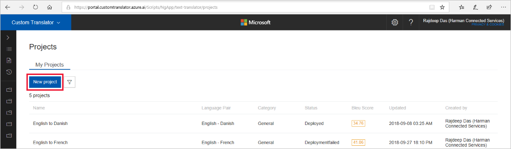

# Create project?

1.  In the [Custom Translator](https://portal.customtranslator.azure.ai) portal,
    tap “New project”.

    

2.  Enter the following details about your project in the dialog:

    a.  Project name (required): Give your project a unique, meaningful name. It
        is not necessary to mention the languages within the title.

    b.  Description: A short summary about the project. This description has no
        influence over the behavior of the Custom Translator or your resulting
        custom system, but can help you differentiate between different
        projects.

    c.  Language pair (required): Select the language that you are translating
        from and to.

    d.  Category (required): Select the category that is most appropriate for
        your project. The category describes the terminology and style of the
        documents you intend to translate.

    e.  Category description: Use this field to better describe the particular
        field or industry in which you are working. For example, if your
        category is medicine, you might add a particular article, such a surgery,
        or pediatrics. The description has no influence over the behavior of the
        Custom Translator or your resulting custom system.

    f.  Project label: The [project label](#project-label) distinguishes between
        projects with the same language pair and category. As a best practice,
        use a label *only* if you are planning to build multiple projects for
        the same language pair and same category and want to access these
        projects with a different CategoryID. Do not use this field if you are
        building systems for one category only. A project label is not required
        and not helpful to distinguish between language pairs. You can use the
        same label for multiple projects.

    

3.  Click on Create

## Next steps

- Read about [filter projects](how-to-search-projects.md).
