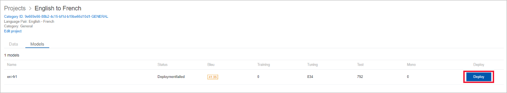

# Deploy/ undeploy a model

To request a deployment or undeployment,

1.  Click on the project name

2.  In the project page, go to Models tab.

    -  For a successfully trained model, it shows “Deploy” button, if not deployed.

    -  If a model is deployed already, you will see “Undeploy” button for that model.

        

3.  Click on Deploy/ Undeploy. You can view the status of your deploy/ undeploy request in the “Status” column.

## Next steps

- Read about [migrate from Hub]().
