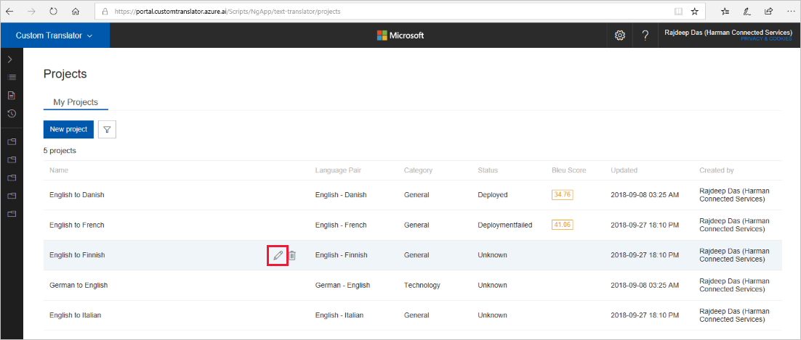

# Edit a project?

1.  Click on the pencil icon that appears when you hover over a project.

    

2.  In the dialog, you can modify either the project name or the description of the project. 

    

3.  Click on the filter button.

>**Note**:You cannot modify the project label, category, or language pair. 

## Next steps

- Read about [view project detail](how-to-view-project-details.md).
