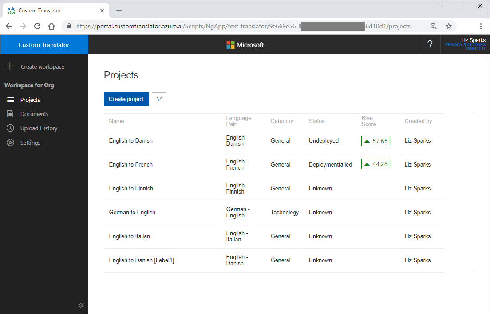
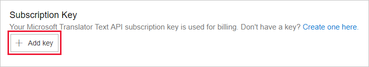
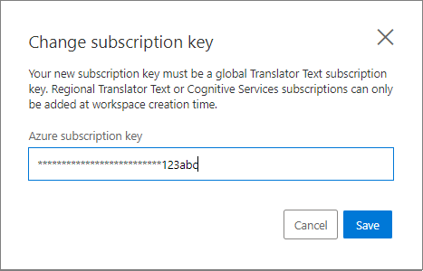
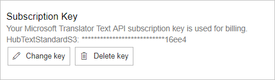
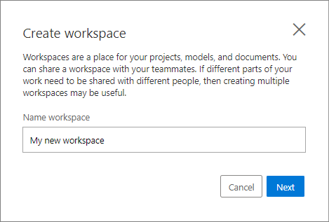
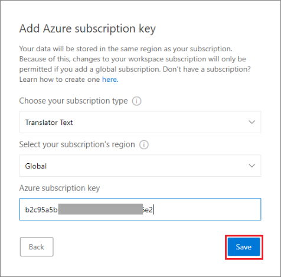
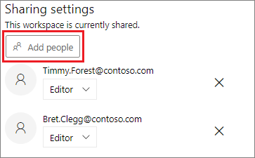
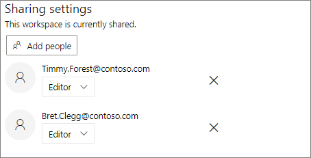

# How to manage settings

Within the Custom Translator settings page, you can create a new workspace, share your workspace, and add or modify your Microsoft Translation subscription key.

To access the settings page:

1. Sign in to the [Custom Translator](https://portal.customtranslator.azure.ai/) portal.
2. On Custom Translator portal, click on the gear icon in the sidebar.

    

## Associating Microsoft Translator Subscription

You need to have a Microsoft Translator Text API subscription key associated with your workspace to train or deploy models.

If you don’t have a subscription, follow the steps below:

1. Subscribe to the Microsoft Translator Text API. This article shows how to subscribe for the Microsoft Translator Text API.
2. Note the key for your translator subscription. Either of the  Key1 or Key2 are acceptable.
3. Navigate back to the Custom Translator portal.

### Add existing key

1.	Navigate to the “Settings” page for your workspace.
2.	Click Add Key

    

3. In the dialog, enter the key for your translator subscription, then click the “Add” button.

    
4.	After you’ve added a key, you can modify or delete the key at any time.

    

## Manage your workspace

A workspace is a work area for composing and building your custom translation system. A workspace can contain multiple projects, models, and documents.

If different part of your work needs to be shared with different people, then creating multiple workspaces may be useful.

## Create a new workspace

1.	Navigate to the workspace “Settings” page.
2.	Click on the “New workspace” button in the “Create New Workspace” section.

    

4.	In the dialog, enter the name of the new workspace.
5.	Click “Create”.

    

## Share your workspace

In Custom Translator you can share your workspace with others, if different part of your work needs to be shared with different people.

1.	Navigate to the workspace “Settings” page.
2.	Click the “Share” button in the “Sharing Settings” section.

    

3.	On the dialog, enter a comma-separated list of email addresses you want this workspace shared with. Make sure you share with the email address that person uses to sign in to Custom Translator with. Then, select the appropriate level of sharing permission.

4.	If your workspace still has the default name “My workspace”, you will be required to change it before sharing your workspace.
5.	Click “Save”.

## Sharing permissions

1.	**Reader:** A reader in the workspace will be able to view all information in the workspace.

2.	**Editor:** An editor in the workspace will be able to add documents, train models, and delete documents and projects. They can add a subscription key, but can't modify who the workspace is shared with, delete the workspace, or change the workspace name.

3.	**Owner:** An owner has full permissions to the workspace.

## Change sharing permission

When a workspace is shared, the “Sharing Settings” section shows all email addresses that this workspace is shared with. You can change existing sharing permission for each email address if you have owner access to the workspace.

1.	In the “Sharing Settings” section for each email a dropdown menu shows the current permission level.

2.	Click the dropdown menu and select the new permission level you want to assign to that email address.

    

## Next steps

- Learn [how to migrate your workspace and project](how-to-migrate.md) from [Microsoft Translator Hub](https://hub.microsofttranslator.com)
