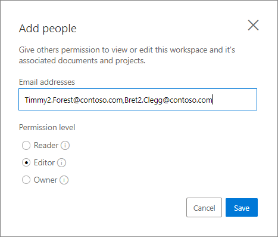
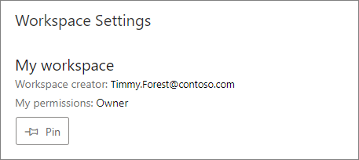

# How to manage settings

Within the Custom Translator settings page, you can share your workspace, modify your Translator subscription key, and delete workspace.

To access the settings page:

1. Sign in to the [Custom Translator](https://portal.customtranslator.azure.ai/) portal.
2. On Custom Translator portal, click on the gear icon in the sidebar.

    

## Associating Translator Subscription

You need to have a Translator subscription key associated with your workspace to train or deploy models.

If you don’t have a subscription, follow the steps below:

1. Subscribe to create a Translator resource. Follow [How to sign up for Translator](https://docs.microsoft.com/azure/cognitive-services/translator/translator-how-to-signup) to subscribe and acquire a Translator key.
2. Note the key for your Translator subscription. Either of the  Key1 or Key2 are acceptable.
3. Navigate back to the Custom Translator portal.

## Create a new workspace

1. Click on the "+ Create workspace” button in “Custom Translator” sidebar.

    

2. In the dialog, enter the name of the new workspace.
3. Click “Next”.
4. Choose subscription type.
5. Select subscription region. The region must match the selected region when Translator resource key was created.
6. Enter the key for your translator subscription, then click the “Save” button.

    

### Modify existing key

1. Navigate to the “Settings” page for your workspace.
2. Click Change Key

    

3. In the dialog, enter the key for your Translator subscription, then click the “Save” button.

    

## Manage your workspace

A workspace is a work area for composing and building your custom translation system. A workspace can contain multiple projects, models, and documents.

If different part of your work needs to be shared with different people, then creating multiple workspaces may be useful.

## Share your workspace

In Custom Translator you can share your workspace with others, if different part of your work needs to be shared with different people.

1. Navigate to the workspace “Settings” page.
2. Click the “Add people” button in the “Sharing settings” section.

    

3. On the dialog, enter a comma-separated list of email addresses you want this workspace shared with. Make sure you share with the email address that person uses to sign in to Custom Translator with. Then, select the appropriate level of sharing permission and click the "Save" button.

    

4. If your workspace still has the default name “My workspace”, you will be required to change it before sharing your workspace.
5. Click “Save”.

## Sharing permissions

1. **Reader:** A reader in the workspace will be able to view all information in the workspace.

2. **Editor:** An editor in the workspace will be able to add documents, train models, and delete documents and projects. They can add a subscription key, but can't modify who the workspace is shared with, delete the workspace, or change the workspace name.

3. **Owner:** An owner has full permissions to the workspace.

## Change sharing permission

When a workspace is shared, the “Sharing settings” section shows all email addresses that this workspace is shared with. You can change existing sharing permission for each email address if you have owner access to the workspace.

1. In the “Sharing settings” section for each email a dropdown menu shows the current permission level.

2. Click the dropdown menu and select the new permission level you want to assign to that email address.

    

## Pin your workspace

Your first created workspace is by default pinned. Each time you sign-in, your pinned workspace is displayed on site load. If you have created many workspaces and desire to make one of them your default when you sign-in, you need to pin it.

1. In the sidebar, click on the name of the workspace you want to pin.
2. Navigate to the "Settings" page for your workspace.
3. Click on the Pin icon.

    

## Next steps

- Learn [how to create your workspace and projects](workspace-and-project.md)
