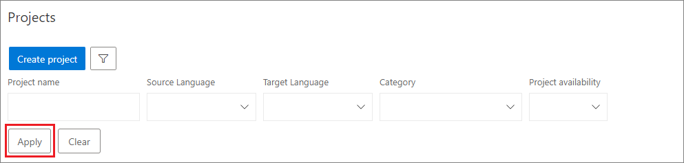
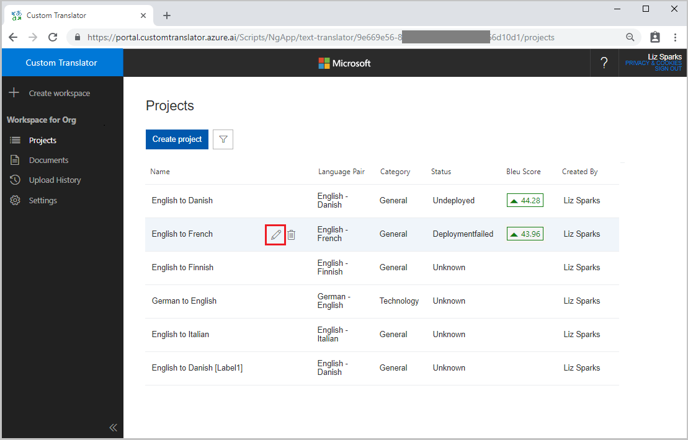
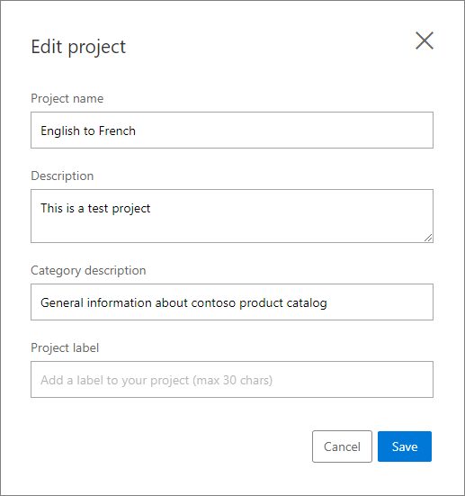
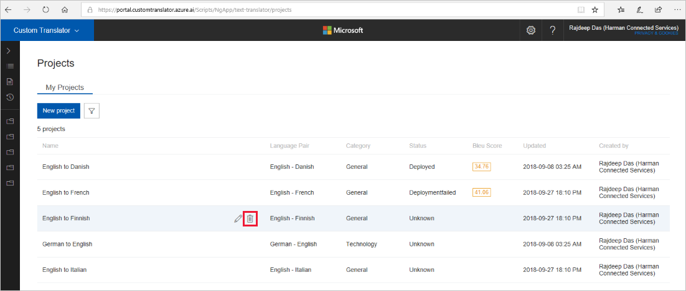

# Search, edit, and delete projects

Custom Translator provides multiple ways to manage your projects in efficient manner. You can create many projects, search based on your criteria, and edit your projects. Deleting a project is also possible in Custom Translator.  

## Search and filter projects

The filter tool allows you to search projects by different filter conditions. It filters like project name, status, source and target language, and category of the project.

1.  Click on the filter button.

    

1.  You can filter by any (or all) of the following fields: project name,
    status, source language, target language, and category.

2.  Click apply.

    

3.  Clear the filter to view all your projects by tapping “Clear”.

## Edit a project

Custom Translator gives you the ability to edit the name and description of a project. Other project metadata like the category, source language, and target language are not available for edit. The steps below describe how to edit a project.

1.  Click on the pencil icon that appears when you hover over a project.

    

2.  In the dialog, you can modify either the project name or the description of the project, but cannot modify the project label, category, or language pair.

    

3.  Click on the filter button.

## Delete a project

You can delete a project when you no longer need it. Below steps describe how to delete a project.

1. Hover on any project record and click on the trash icon.

   

2. Confirm deletion. Deleting a project will delete all models that were created within that project. Deleting project will not affect your  documents.

   

## Next steps

- [Upload documents](how-to-upload-document.md) to start building your custom translation model.
