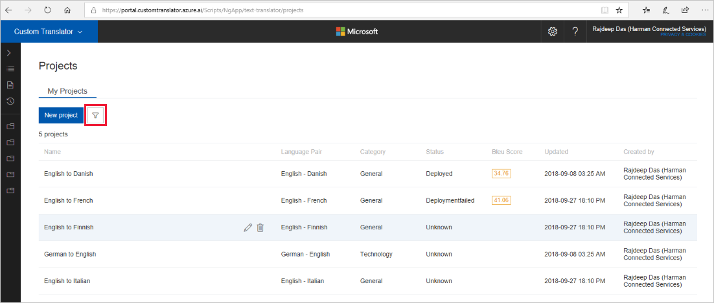

# Search, edit, delete project

Custom Translator provides various ways to manage your projects in efficient manner. You can create multiple projects, search based on your criteria, edit your projects. Deleting a project is also possible in Custom Translator.  

## Search and filter projects

1.  Click on the filter button.

    

1.  You can filter by any (or all) of the following fields: project name,
    status, source language, target language, and category.

2.  Click apply.

    

3.  Clear the filter to view all your projects by tapping “Clear”.

## Edit a project

1.  Click on the pencil icon that appears when you hover over a project.

    

2.  In the dialog, you can modify either the project name or the description of the project. 

    

3.  Click on the filter button.

[!NOTE] You cannot modify the project label, category, or language pair. 

## Delete a project

1.  Hover on any project record and click on the trash icon.

    

2. Confirm deletion. Deleting a project will delete all models that were created
within that project. 

    .

[!NOTE] Deleting project will not affect your  documents.

## Next steps

- [Upload document](how-to-upload-document) to start building translation models.
