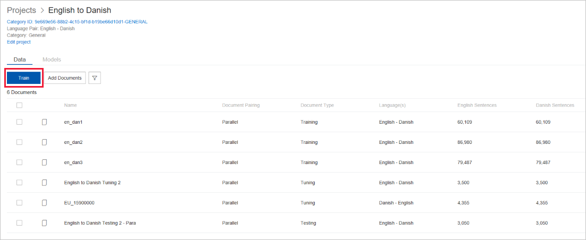
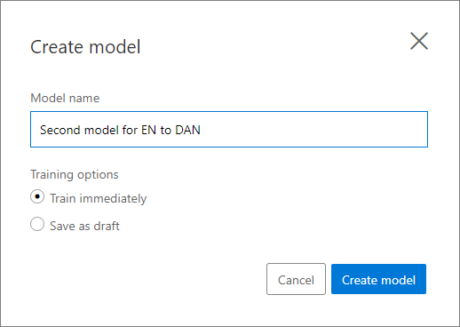
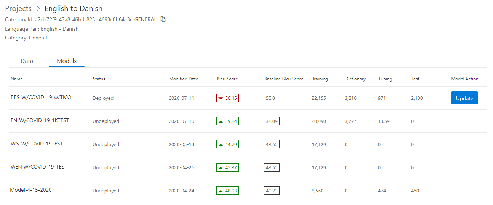
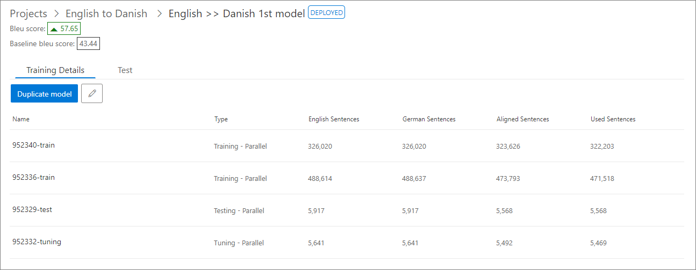
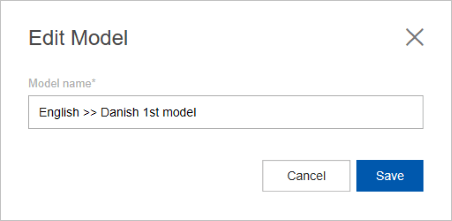

# Train a model

Training a model is the important step to building a translation model, because without a training, model can't be built. Training happens based on documents you select for the trainings.

To train a model:

1.  Select the project where you want to build a model.

2.  The Data tab for the project will show all the relevant documents for the project language pair. Manually select the documents you want to use to train your model. You can select training, tuning, and testing documents from this screen. Also you just select the training set and have Custom Translator create the tuning and test sets for you.

    -  Document name: Name of the document.

    -  Pairing: If this document is a parallel or monolingual document. Monolingual documents are currently not supported for training.

    -  Document type: Can be training, tuning, testing, or dictionary.

    -  Language pair: This show the source and target language for the project.

    -  Source sentences: Shows the number of sentences extracted from the source file.

    -  Target sentences: Shows the number of sentences extracted from the target file.

    

3.  Click Train button.

4.  On the dialog, specify a name for your model.

5.  Click Train model.

    

6.  Custom Translator will submit the training, and show the status of the
    training in the models tab.

    

>[!Note]
>Custom Translator supports 10 concurrent trainings within a workspace at any point in time.

## Edit a model

You can edit a model using the Edit link on the Model Details page.

1.  Click on the Pencil icon.

    

2.  In the dialog change,

    1.  Model Name (required): Give your model a meaningful name.

        

3.  Click Save.

## Next steps

- Learn [how to view model details](how-to-view-model-details.md).
