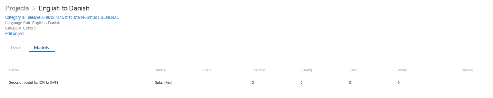
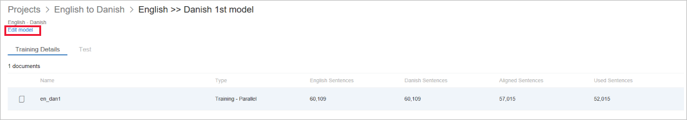

# Train a model

Training a model is the important step to building a translation model. Training happens based on documents you select for that trainings.

To train a model,

1.  Select the project in which you want to build the model.

2.  The “Data” tab for the project will show all the relevant documents for the project language pair. Manually select the documents you want to use to train your model. You can select training, tuning, and testing documents from this screen. Also you just select the training set and have Custom Translator create the tuning and test sets for you.

    -  Document name: Name of the documents.

    -  Pairing: If this document is a parallel or monolingual document.
    - Monolingual documents are currently not supported for training.

    -  Document type: Can be training, tuning, testing, or dictionary.

    -  Language pair: This show the source and target language for the project.

    -  Source sentences: Shows the number of sentences extracted from the
    - source file.

    -  Target sentences: Shows the number of sentences extracted from the
    - target file.

    

3.  Tap on the “Train” button.

4.  On the dialog, specify a name for your model.

5.  Tap “Train model”.

    

6.  Custom Translator will submit the training, and show the status of the
    training in the models tab.

    

## Edit a model

You can edit a project using the Edit link on Model detail page.

1.  Click on the Pencil icon

    

2.  In the dialog change,

    1.  Model Name (required): Give your project a meaningful name.

        

3.  Click Save

## Next steps

- Read about [models details](how-to-view-model-details.md) to know about  analysis of a model and training.
