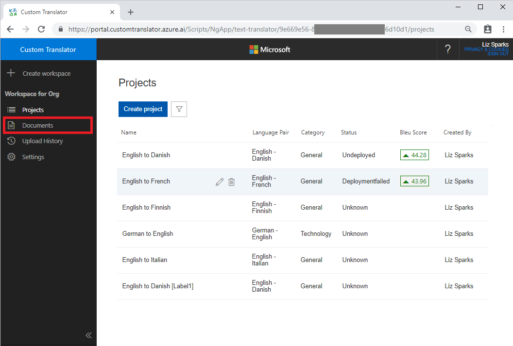
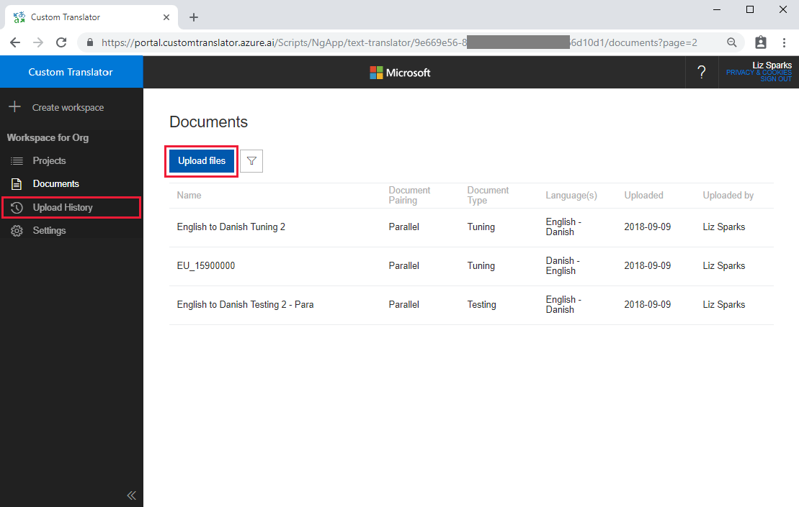
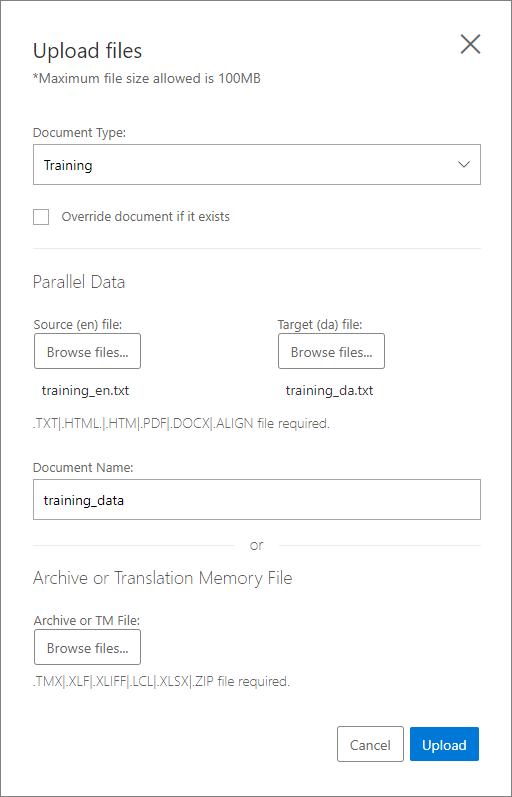
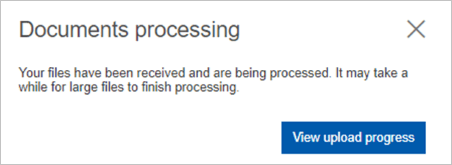
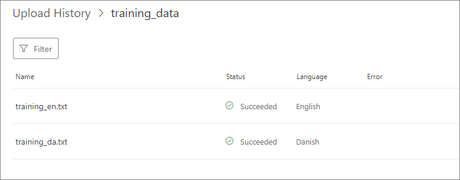
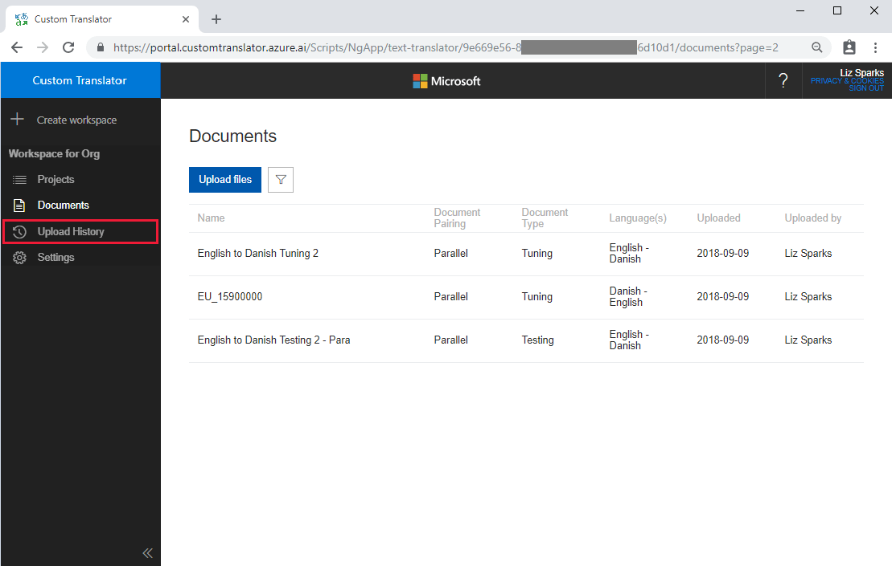

# Upload a document

In [Custom Translator](https://portal.customtranslator.azure.ai), you can upload parallel documents to train your translation models. [Parallel documents](what-are-parallel-documents.md) are pairs of documents where one is a translation of the other. One document in the pair contains sentences in the source language and the other document contains these sentences translated into the target language.

Before uploading your documents, review the [document formats and naming convention guidance](document-formats-naming-convention.md) to make sure your file format is supported in Custom Translator.

## How to upload document?

From [Custom Translator](https://portal.customtranslator.azure.ai) portal, click on “Documents” tab to go to documents page.

1.  Click on the Upload files button on the documents page.

    

2.  On the dialog fill in the following information:

    a.  Document type:

    -  Training: These document(s) will be used for training set.
    -  Tuning: These document(s) will be used for tuning set.
    -  Testing: These document(s) will be used for testing set.
    -  Phrase Dictionary: These document(s) will be used for phrase  dictionary.
    -  Sentence Dictionary: These document(s) will be used for sentence  dictionary

    b.  Language pair

    c.  Override document if exists: Select this check box if you want to
        overwrite any existing documents with the same name.

    d.  Fill in the relevant section for either parallel data or combo data.

    -  Parallel data:
        -  Source file: Select source language file from your local computer.
        -  Target file: Select target language file from your local computer.
        -  Document name: Used only if you're uploading parallel files.

    - Combo data:
        -  Combo File: Select the combo file from your local computer. Your combo file has both of your source and target language sentences. [Naming convention](document-formats-naming-convention.md) is important for combo files.

    e.  Click Upload

    

3.  At this point, we're processing your documents and attempting to extract sentences. You can click “View upload Progress” to check the status of your documents as they process.

    

4.  This page will display the status, and any errors for each file within your
    upload. You can view past upload status at any time by clicking on the
    “Upload history” tab.

    

## View upload history

In upload history page you can view history of all document uploads details like document type, language pair, upload status etc.

1. From the [Custom Translator](https://portal.customtranslator.azure.ai) portal,
    click Upload History tab to view history.

    

2. This page shows the status of all of your past uploads. It displays
    uploads from most recent to least recent. For each upload, it shows the document name, upload status, the upload date, the number of files uploaded, type of file uploaded, and the language pair of the file.

    

3. Click on any upload history record. In upload history details page,
    you can view the files uploaded as part of the upload, uploaded status of the file, language of the file and error message (if there is any error in upload).

## Next steps

- Use the [document details page](how-to-view-document-details.md) to review list of extracted sentences.
- [How to train a model](how-to-train-model.md).
