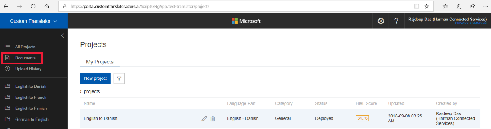
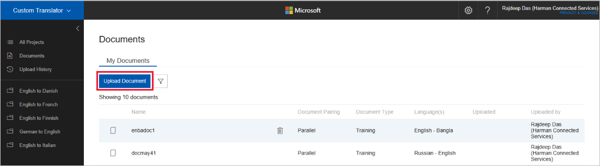

# Upload document

On [Custom Translator](https://portal.customtranslator.azure.ai) portal, click on “Documents” tab to go to documents page.

1.  Click on the “Upload Document” button on the documents page.

    

2.  On the dialog fill in the following information:

    a.  Document type:

    -  Training: These document(s) will be used for training set.
    -  Tuning: These document(s) will be used for tuning set.
    -  Testing: These document(s) will be used for testing set.
    -  Dictionary (WIP)

    b.  Language pair

    c.  Override document if exists: Select this check box if you want to
        overwrite any existing documents with the same name.

    d.  Fill in the relevant section for either parallel data or combo data.

    -  Parallel data:
        -  Source file: Select source language file from your local computer.
        -  Target file: Select target language file from your local computer.
        -  Document name: Used only if you are uploading parallel files.

    - Combo data:
        -  Combo File: Select the combo file from your local computer. Your combo file has both of your source and target language sentences. [Naming convention](concept-document-formats-naming-convention.md) is important for combo files.

    e.  Click Upload

    

3.  At this point, we are processing your documents and attempting to extract sentences. You can click “View upload Progress” to check the status of your documents as they process.

    

4.  This page will display the status, and any errors for each file within your
    upload. You can view past upload status at any time by clicking on the
    “Upload history” tab.

    

## Next steps

- Read about [document details](how-to-view-document-details.md).
