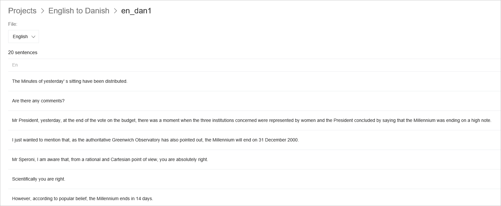
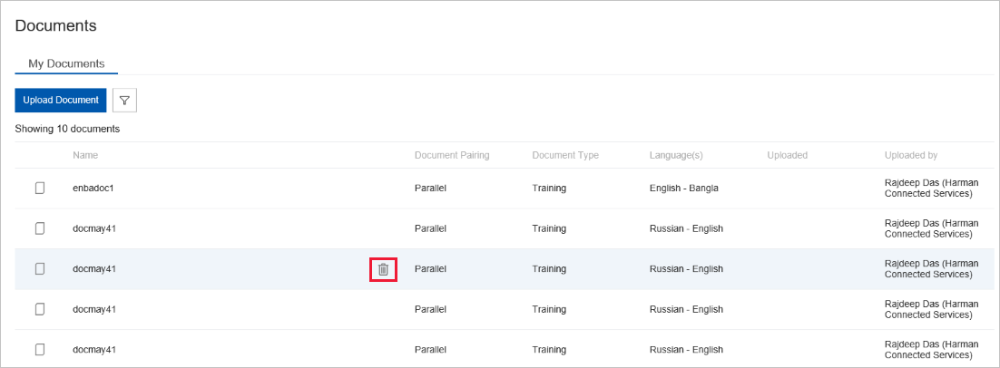
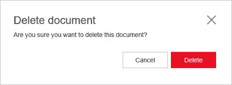

# View document details

The document list page shows the first 10 document in your workspace. For each
of the documents, it displays the name, pairing, type, language, upload time
stamp, and the email address of the user who uploaded the document.

Click on an individual document to view the document details page. The document details page displays the list of extracted sentences from the document.

- By default the “source” language is selected in the dropdown field, but you can toggle to view sentences in the target language.
- 20 sentences are displayed per page by default. You can use the pagination control to browse between pages.

## Delete a document

User must be a workspace owner to delete document to delete a document. Additionally, if a document is in use by a model, that is in any part of the training process or any part of the deployment process, the document can't be deleted.

1. Go to document page
2.  Hover on any document record and click on the trash icon.

    

3.  Confirm Delete.

    

## Next steps

- Learn [how to train a model](how-to-train-model.md).
