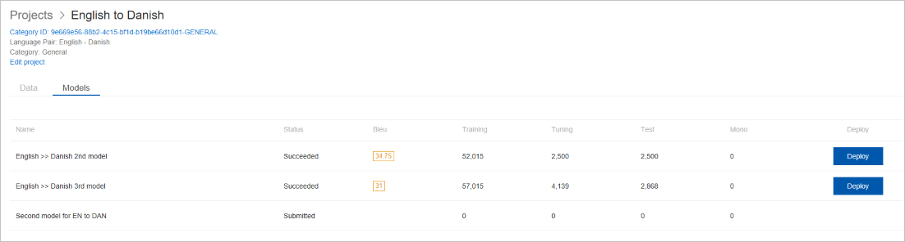
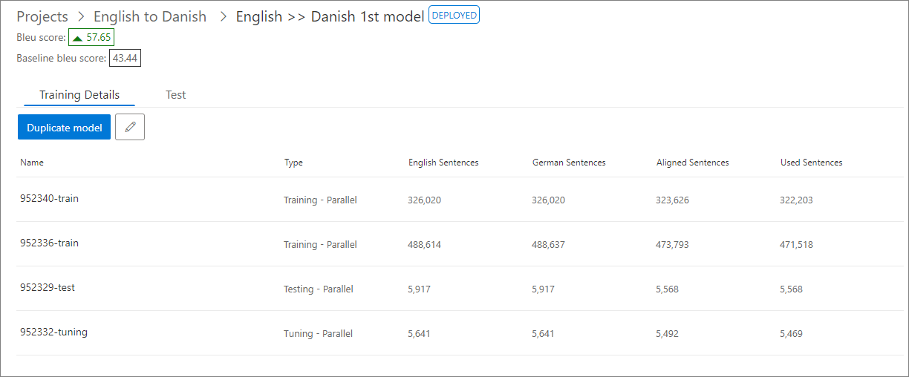

# View model details

The Models tab under project shows all models in that project. All models trained for that project is listed in this tab.

For each model in the project, these details are displayed.

1.  Model Name: Shows the model name of a given model.

2.  Status: Shows status of a given model. Your new training will have a status
    of Submitted until it is accepted. The status will change to Data processing
    while the service evaluates the content of your documents. When the
    evaluation of your documents is complete the status will change to Running
    and you will be able the see the number of sentences that are part of the
    training, including the tuning and testing sets that are created for you
    automatically. Below is a list of model status that describes state of the models.

    -  Submitted: Specifies that the backend is processing the documents for that model.

    -  TrainingQueued: Specifies that the training is being queued to MT system for that model.

    -  Running: Specifies that the training is running in MT system for that model.

    -  Succeeded: Specifies that the training succeeded in MT system and a model is available. In this status, a BLEU score is displayed for that model.

    -  Deployed: Specifies that the successful trained model is submitted to MT system for deployment.

    -  Undeploying: Specifies that the deployed model is undeploying.

    -  Undeployed: Specifies that the undeployment process of a model has been completed successfully.

    -  Training Failed: Specifies that the training failed. If a training failure occurs, retry the training job. If the error persists, contact us. Don't delete the failed model.

    - DataProcessingFailed: Specifies that data processing has failed for one or more documents belonging to the model.

    - DeploymentFailed: Specifies that the model deployment has failed.

    - MigratedDraft: Specifies that the model is in draft state after migration from Hub to Custom Translator.

4.  BLEU Score: shows BLEU (Bilingual Evaluation Understudy) score of the model,
    indicating the quality of your translation system. This score tells you how
    closely the translations done by the translation system resulting from this
    training match the reference sentences in the test data set. The BLEU score appears if training is successfully complete. If training isn't complete/ failed, you won't see any BLEU score.

5.  Training Sentence count: Shows total number of sentences used as training
    set.

6.  Tuning Sentence count: Shows total number of sentences used as tuning set.

7.  Training Sentence count: Shows total number of sentences used as testing
    set.

8.  Mono Sentence count: Shows total number of sentences used as mono set.

9.  Deploy action button: For a successfully trained model, it shows "Deploy"
    button if not deployed. If a model is deployed, a "Undeploy"
    button is shown.

10. Delete: You can use this button if you want to delete the model. Deleting a
    model won't delete any of the documents used to create that model.

    

>[!Note]
>To compare consecutive trainings for the same systems, it is important to keep the tuning set and testing set constant.

## View model training details

When your training is complete, you can review details about the training from the details page. Select a project, locate and select the models tab, and choose a model.

The model page has two tabs: Training details and Test.

1.  **Training Details:** This tab shows the list of document(s) used in the training:

    -  Documents Name: This field shows the name of the document

    -  Document Type: This field shows if this document is parallel/ mono.

    -  Sentence count in source language: This field shows number of sentences are there as part of source language.

    -  Sentence count in target language: This field shows number of sentences are there as part of target language.

    -  Aligned Sentences: This field shows number of sentences has been aligned by Custom Translator during align process.

    -  Used Sentences: This field shows number of sentences has been used by Custom Translator during this training.

    

2.  **Test:** This tab shows the test details for a successful training.

## Next steps

- Review [test results](how-to-view-system-test-results.md) and analyze training results.
