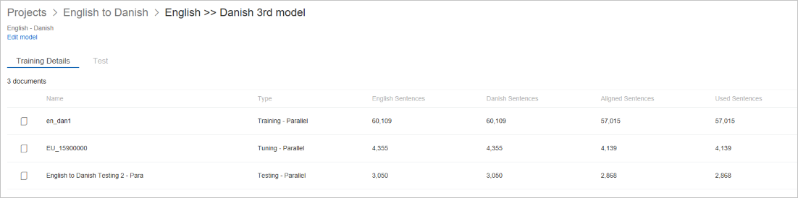

# View model training details

Select any training from model page and it will take you to Training page.

Training page has two tabs,

1.  Training Details: This field shows the list of document(s) used in the training,

    -  Documents Name: This field shows the name of the document

    -  Document Type: This field shows if this document is parallel/ mono.

    -  Sentence count in source language: This field shows number of sentences are there as part of source language.

    -  Sentence count in target language: This field shows number of sentences are there as part of target language.

    -  Aligned Sentences: This field shows number of sentences has been aligned by Custom Translator during align process.

    -  Used Sentences: This field shows number of sentences has been used by Custom Translator during this training.

    

2.  Test: This tab shows the test details for a successful training.

## Next steps

- Read about [system test results](how-to-view-system-test-results.md).
