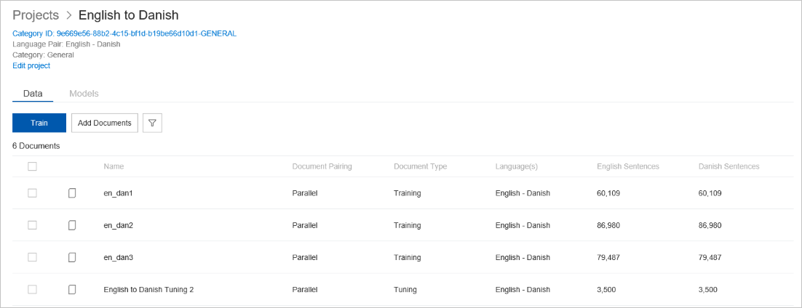

# View project details

The Custom Translator landing page shows the first 10 projects in your workspace. It displays the project name, language pair, category, status, BLEU score.

Tap on an individual project to navigate to the project details page for that
project.

-   CategoryID: A CategoryID is created by concatenating the WorkspaceId,
    project label, and category code. You use the CategoryID with the Text
    Translator API to get custom translations.

-   Train button: Use this button to start a [training a model](how-to-train-model.md).

-   Add documents button: Use this button to [upload documents](how-to-upload-document.md).

-   Filter documents button: Use this button to filter and search for specific
    document(s).

-   Model tab: This tab shows all model in this project.

    

## Next steps

- Read about [upload document](ct-how-to-upload-document.md).
- Read about [train a model](how-to-train-model.md).
