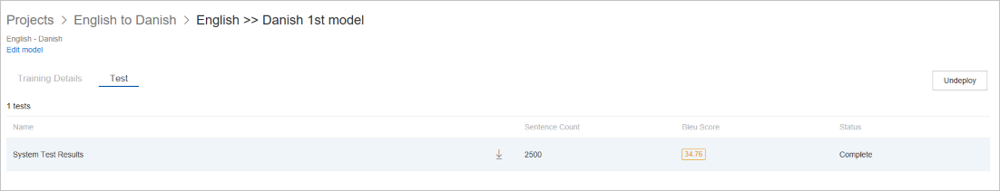
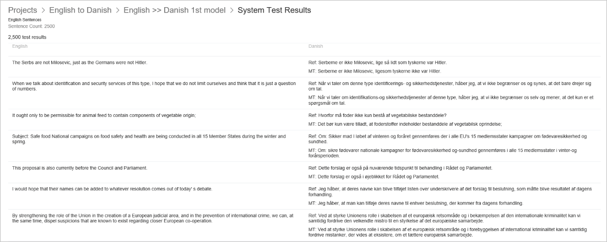
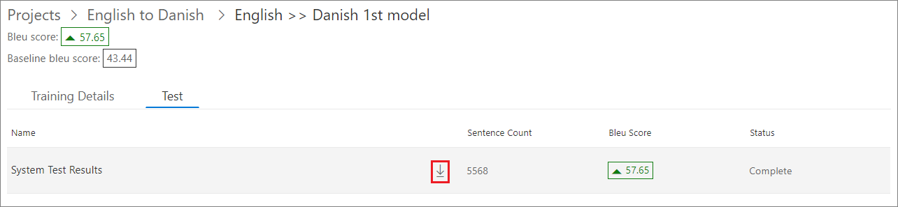
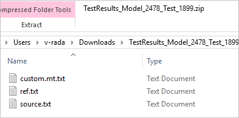
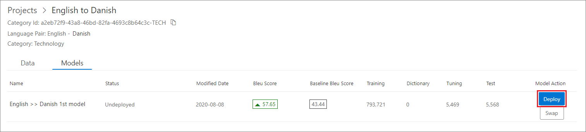
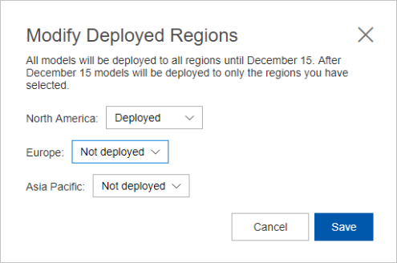
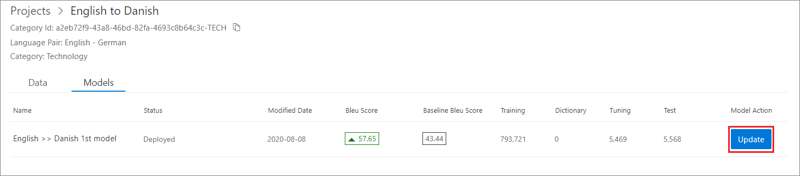
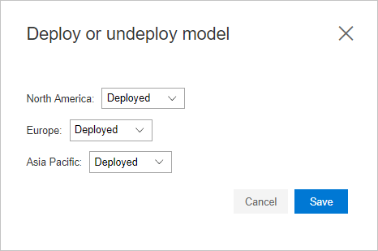

# View system test results

When your training is successful, review system tests to analyze your training results. If you're satisfied with the training results, place a deployment request for the trained model.

## System test results page

Select a project, then select the models tab of that project, locate the model you want to use and finally select the test tab.

The test tab shows you:

1.  **System Test Results:** The result of the test process in the trainings. The test process produces the BLEU score.

    **Sentence Count:** How many parallel sentences were used in the test set.

     **BLEU Score:** BLEU score generated for a model after training completion.

    **Status:** Indicates if the test process is complete or in progress.

    

2.  Click on the System test results, and that will take you to test result details page. This page shows the machine translation of sentences that were part of the test dataset.

3.  The table on the test result details page has two columns - one for each
    language in the pair. The column for the source language shows the sentence
    to be translated. The column for the target language contains two sentences
    in each row.

    **Ref:** This sentence is the reference translation of the source sentence as given in the test dataset.

    **MT:** This sentence is the automatic translation of the source sentence done by the model built after the training was conducted.

    

## Download test

Click the Download Translations link to download a zip file. The zip contains the
machine translations of source sentences in the test data set.

This downloaded zip archive contains three files.

1.  **custom.mt.txt:** This file contains machine translations of source language sentences in
    the target language done by the model trained with user’s data.

2.  **ref.txt:** This file contains user provided translations of source language sentences in
    the target language.

3.  **source.txt:** This file contains sentences in the source language.

    

## Deploy a model

To request a deployment:

1.  Select a project, go to Models tab.

2. For a successfully trained model, it shows “Deploy” button, if not deployed.

    

3.  Click on Deploy.
4.  Select **Deployed** for the region(s) where you want your model to be deployed, and click Save. You can select **Deployed** for multiple regions.

    

5.  You can view the status of your model in the “Status” column.

>[!Note]
>Custom Translator supports 10 deployed models within a workspace at any point in time.

## Update deployment settings

To update deployment settings:

1.  Select a project, and go to the **Models** tab.

2. For a successfully deployed model, it shows an **Update** button.

    

3.  Select **Update**.
4.  Select **Deployed** or **Undeployed** for the region(s) where you want your model deployed or undeployed, then click **Save**.

    

>[!Note]
>If you select **Undeployed** for all regions, the model is undeployed from all regions, and put into an undeployed state. It's now unavailable for use.

## Next steps

- Start using your deployed custom translation model via [Microsoft Translator Text API V3](https://docs.microsoft.com/azure/cognitive-services/translator/reference/v3-0-translate?tabs=curl).
- Learn [how to manage settings](how-to-manage-settings.md) to share your workspace, manage subscription key.
- Learn [how to migrate your workspace and project](how-to-migrate.md) from [Microsoft Translator Hub](https://hub.microsofttranslator.com)
