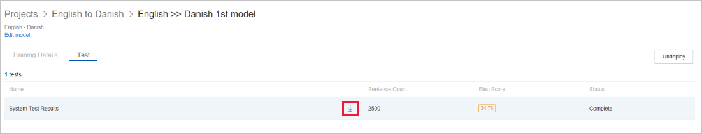

# View system test results

The test detail tab shows you,

1.  System Test Results: The result of the test process in the trainings. The test process produces the BLEU score.

    -  Sentence Count: How many parallel sentences were used in the test set

    -  BLEU Score: BLEU score generated for a model after training completion

    -  Status: If the test process is complete or in progress

        

2.  Click on the “System test results”, and that will take you to test result details page. This page shows the machine translation of sentences that were part of the test dataset.

3.  The table on the test result details page has two columns - one for each
    language in the pair. The column for the source language shows the sentence
    to be translated. The column for the target language contains two sentences
    in each row.

    -  Ref: This sentence is the reference translation of the source sentence as given in the test dataset.

    -  MT: This sentence is the automatic translation of the source sentence done by the model built after the training was conducted.

        

## Download test

Click the Download Translations link to download a zip file. The zip contains the
machine translations of source sentences in the test data set.

This zip file contains three files.

1.  custom.mt.txt: Contains machine translations of source language sentences in
    the target language done by the model trained with user’s data.

2.  ref.txt: Contains user provided translations of source language sentences in
    the target language.

3.  Src_Dataset_source.txt: Contains sentences in the source language.

    

## Next steps

- Read about [deploy model](how-to-deploy-or-undeploy-model.md).
