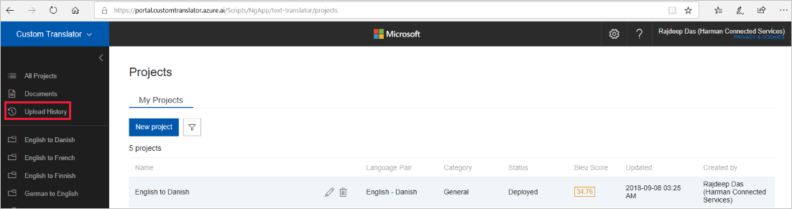

# View upload history

On the [Custom Translator](https://portal.customtranslator.azure.ai) portal,
click on the upload history tab to go to history page.

This page shows the status of all of your past uploads. It displays
uploads from most recent to least recent. For each upload, it shows the overall
status, the upload date, the number of files, the type of
file, and the language pair.

Click on any upload history record and that will take you to upload history details page. In the details page, you can view the status of each individual file and error messages.

## Next steps

- Read about [document details](how-to-view-document-details.md).
