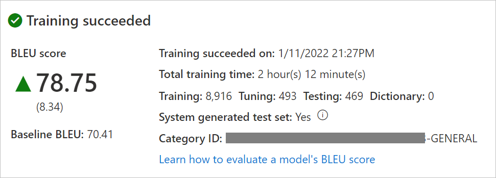

# What is a project?

A project is a container for a models, documents, and tests. Each project automatically includes all documents that are uploaded into that workspace that have the correct language pair.

Creating project is the first step toward building and publishing a model.

1. After successful model training, select **Model details** blade
2. Select the model name "en-de with sample data" to review training date/time, total training time, number of sentences used for training, tuning, testing, dictionary, and whether the system generated the test and tuning sets. You will use the "Category ID" to make translation requests.
3. Evaluate the model BLEU score. Using the test set, **BLEU score** is the custom model score and **Baseline BLEU** is the pre-trained baseline model used for customization. Higher **BLEU score** means higher translation quality using the custom model.

## Next steps

- Learn [how to test model quality](test-model-details.md).
- Learn [how to publish model](publish-model.md).
- Learn [how to translate documents with custom models](use-custom-model.md).
